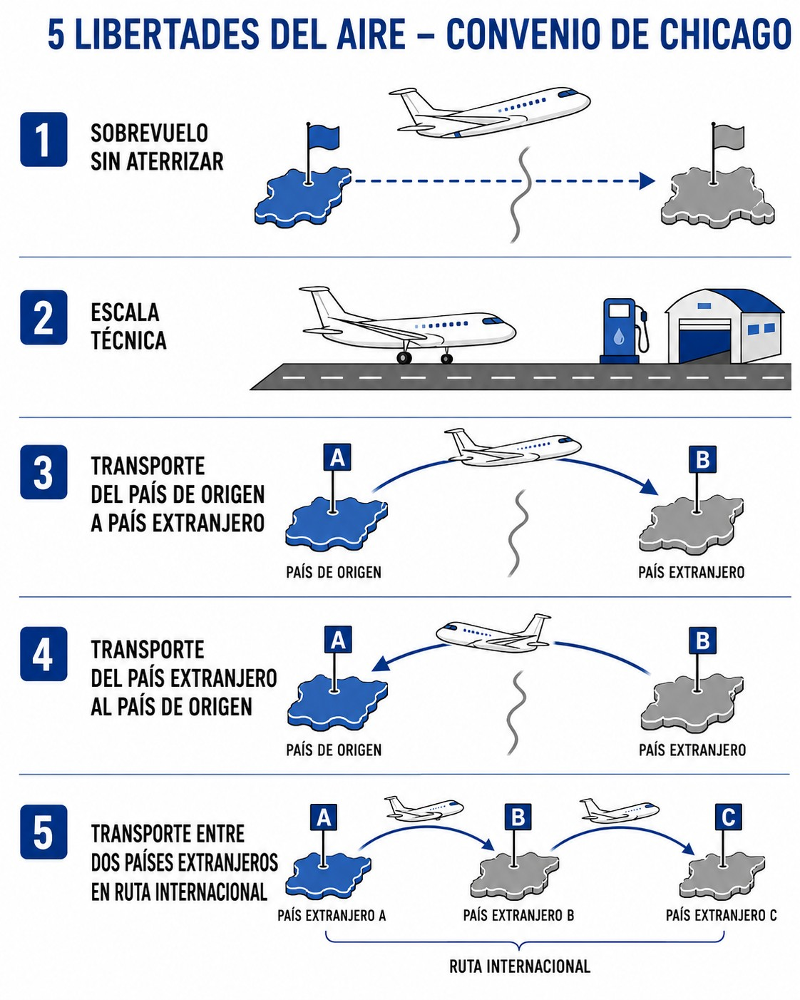
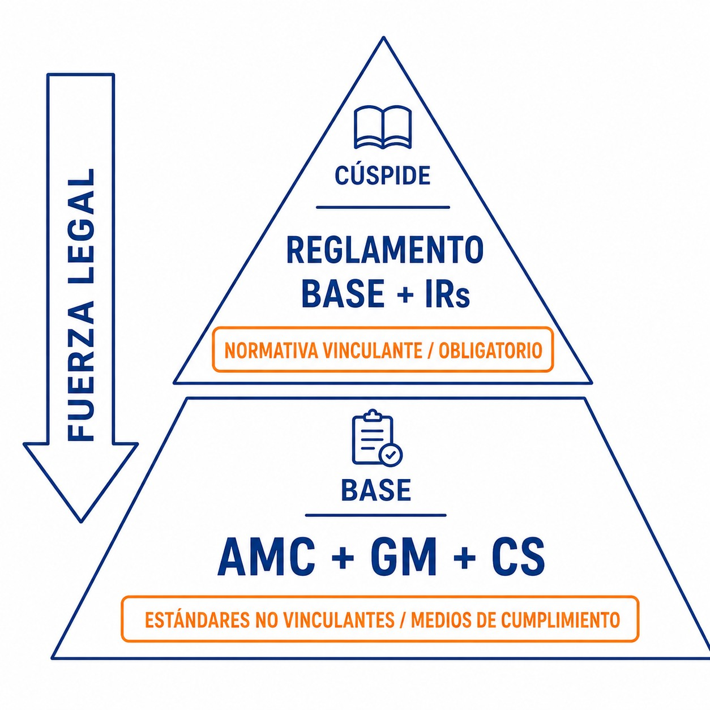

# Derecho internacional: convenios, acuerdos y organizaciones

> Entender el marco legal no es burocracia: es el cimiento de tu seguridad y de tu libertad para volar más allá de nuestras fronteras.
>
>
> En este capítulo aprenderás:
>
>
> * De dónde salen las normas: el Convenio de Chicago y la OACI.
> * Qué papel juega EASA y cómo nos afectan las leyes comunes europeas.
> * Qué es obligatorio (normativa vinculante) y qué es recomendado (estándares no vinculantes).
> * Los tres reglamentos que te acompañarán toda tu vida de piloto: Part-SFCL, Part-SAO y SERA.

## El origen de las normas: Convenio de Chicago y OACI

El acta de nacimiento del derecho aéreo moderno es el **Convenio de Chicago de 1944**. Allí las naciones acordaron unificar las normas de aviación a nivel global, y de ese acuerdo salen los principios que hoy nos permiten volar de forma segura y ordenada entre países distintos.

Del convenio nació la **OACI** (Organización de Aviación Civil Internacional, **ICAO**), una agencia especializada de la ONU. Su trabajo consiste en desarrollar los principios y técnicas de la navegación aérea internacional, fomentar el transporte aéreo entre países y velar por la seguridad operacional (**safety**) en todo el mundo.

La OACI fija los estándares mínimos que sus 193 estados miembros deben cumplir. Ahora bien, no es una "policía mundial": cada país es soberano para adoptar estas normas en su legislación, aunque el Convenio le obliga a notificar las diferencias cuando no cumple un estándar.

Para que el transporte aéreo internacional fuera posible, el Convenio de Chicago sentó las bases de las **libertades del aire** (ver @fig-01-cap01-chicago-freedoms): acuerdos que dan a las aeronaves de un Estado permiso para entrar en el espacio aéreo de otro o sobrevolarlo. La conferencia de Chicago definió las cinco primeras en acuerdos anejos al Convenio (el sobrevuelo, la escala técnica y los derechos comerciales básicos), pero el derecho aéreo ha seguido evolucionando y hoy se reconocen nueve.

{#fig-01-cap01-chicago-freedoms}

## La autoridad en Europa: EASA y el sistema común

En Europa hemos ido un paso más allá de la simple cooperación. Los estados miembros de la Unión Europea han cedido competencias a una autoridad común: **EASA** (Agencia de la Unión Europea para la Seguridad Aérea).

En la práctica, esto significa que casi todo lo que te afecta como piloto (licencias, operaciones, aeronavegabilidad) se decide a nivel europeo y es **directamente aplicable** en España, sin que el gobierno español tenga que transcribirlo a una ley nacional.

¿Y entonces, qué papel juega AESA? La **AESA** (Agencia Estatal de Seguridad Aérea) es el organismo público español, adscrito al Ministerio de Transportes y Movilidad Sostenible, que actúa como tu autoridad competente directa: emite tu licencia, inspecciona tu club y vigila el cumplimiento en territorio español. Pero lo hace aplicando e interpretando las reglas comunes europeas.

## Estructura normativa: normativa vinculante y estándares no vinculantes

La normativa de EASA se organiza en capas con distinta fuerza legal (@fig-01-cap01-hard-soft-law). Conviene tener claro desde el principio qué es obligatorio por ley y qué es una recomendación estándar.

### Normativa vinculante: lo que es ley

Es la normativa de obligado cumplimiento. Nadie queda eximido de ella salvo que la autoridad le conceda una exención por escrito. Tiene dos niveles:

* **Reglamento Base** (**Basic Regulation**): la "Constitución" de la seguridad aérea en Europa, actualmente el Reglamento (UE) 2018/1139. Establece los principios esenciales y los objetivos de alto nivel.
* **Reglamentos de Ejecución** (**Implementing Rules**, IRs): las leyes detalladas que desarrollan el reglamento base. Por ejemplo, el Reglamento (UE) 2018/1976 (actualizado por el 2020/358) regula específicamente las licencias de planeador.

::: {.callout-important title="Normativa"}
El Reglamento (UE) 2018/1139 (Reglamento Base) establece las normas comunes en el ámbito de la aviación civil y crea la Agencia de la Unión Europea para la Seguridad Aérea (EASA). Es la norma de mayor rango en el sistema europeo.
:::

### Estándares no vinculantes: cómo cumplir la ley

Son documentos que ayudan a cumplir la ley sin ser ley en sí mismos. Que no te engañe la etiqueta de "no vinculantes": en aviación se siguen casi a rajatabla.

* **AMC** (**Acceptable Means of Compliance**, Medios Aceptables de Cumplimiento): métodos y procedimientos que EASA publica como forma segura de cumplir la normativa vinculante. Si sigues los AMC, automáticamente cumples la norma. Si prefieres hacerlo de otra forma, tendrás que demostrar, con bastante papeleo, que tu método es igual de seguro.
* **GM** (**Guidance Material**, Material Guía): explicaciones, interpretaciones y ejemplos para entender los requisitos. No obliga; ayuda.
* **CS** (**Certification Specifications**): estándares técnicos para certificar aeronaves y productos. El que nos toca es el CS-22, el de planeadores.

{#fig-01-cap01-hard-soft-law}

::: {.callout-tip title="Regla de oro"}
* **Normativa vinculante (Reglamentos)** = **QUÉ** debes cumplir (obligatorio).
* **Estándares no vinculantes (AMC/GM)** = **CÓMO** cumplirlo de forma estándar (recomendado).
:::

## Las 3 normas de referencia del piloto de planeador

De toda la sopa de letras normativa, hay tres reglamentos que acabarás conociendo de memoria. Son tu marco de referencia diario.

### 1. Part-SFCL (licencias)

El **Sailplane Flight Crew Licensing** regula todo lo relativo a tu licencia: los requisitos para obtener la SPL (**Sailplane Pilot License**), la experiencia reciente que necesitas para mantenerla, las habilitaciones (TMG, acrobacia, remolque…​) y los privilegios de instructores y examinadores. Nace del Reglamento de Ejecución (UE) 2018/1976 y sus modificaciones, como el 2020/358.

### 2. Part-SAO (operaciones)

El **Sailplane Air Operations** regula cómo se opera el planeador de forma segura: las responsabilidades del piloto al mando, los documentos que debes llevar a bordo, los procedimientos de emergencia, el transporte de pasajeros y el uso de aeródromos. Sale del mismo reglamento que el Part-SFCL.

::: {.callout-note title="Airmanship"}
Según SAO.GEN.130 (Part-SAO), el piloto al mando es responsable de la seguridad de la aeronave y de todas las personas a bordo durante las operaciones. Esta responsabilidad no se delega: tú eres la autoridad final en tu cabina.
:::

### 3. SERA (Reglas del Aire)

El **Standardised European Rules of the Air** es el código de circulación del cielo: prioridades de paso, niveles de crucero, mínimos de visibilidad y distancia a nubes (VMC), señales y luces. Al ser un reglamento de ejecución de la UE, se aplica **directamente** en España, sin necesidad de norma nacional que lo transponga; el Real Decreto 552/2014 lo **complementa y desarrolla** en los aspectos que SERA deja a cada Estado.

::: {.callout-warning title="Seguridad"}
SERA.3210 establece las prioridades de paso para evitar colisiones. Un planeador siempre tiene prioridad sobre aeronaves de motor (aviones, helicópteros), pero debe ceder el paso a globos. Conoce estas reglas de memoria.
:::

::: {.postit}
**Resumen del capítulo: marco normativo**

La "ley del aire" que te permite volar se organiza así:

* **OACI y Convenio de Chicago (1944)**: el tratado fundador. Fija los estándares mundiales mínimos.
* **EASA**: nuestra autoridad común europea. Redacta normas que todos los países de la UE cumplen por igual; AESA las aplica en España.
* **Normativa vinculante** (Reglamentos): es ley, obligatoria al 100%. Ahí están Part-SFCL, Part-SAO y SERA.
* **Estándares no vinculantes** (AMC/GM): no son ley estricta, pero sí la forma estándar y segura de hacer las cosas. Síguelos y no tendrás problemas.
* Tus normas de cabecera: **Part-SFCL** (tu licencia), **SERA** (cómo volar) y **Part-SAO** (cómo operar tu planeador).
:::
