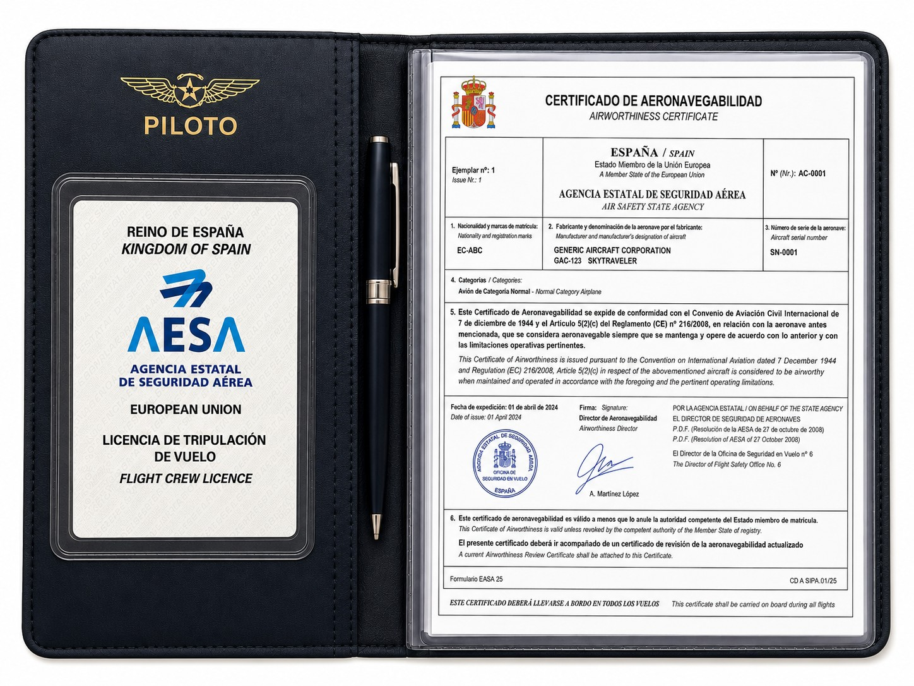
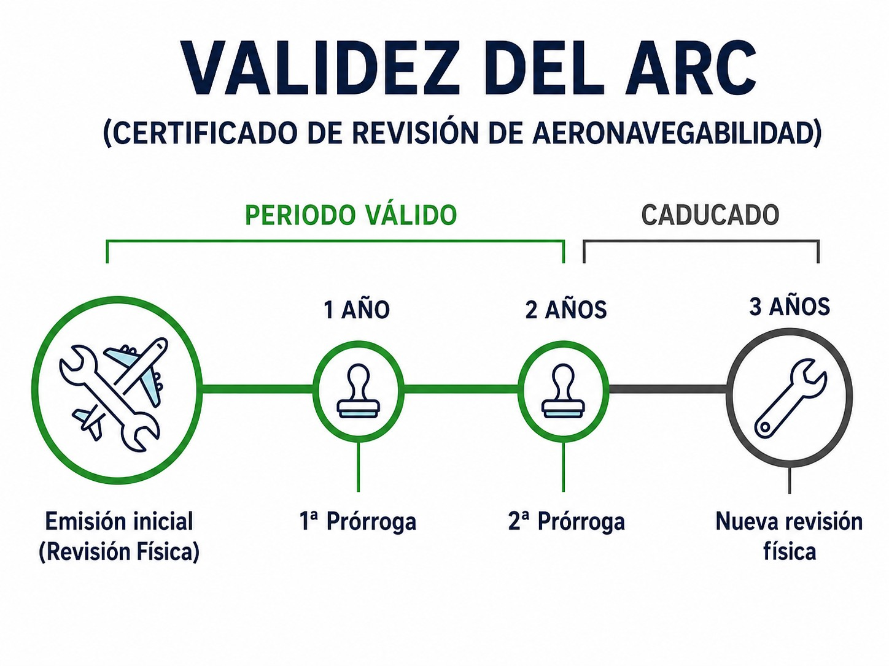

# Aeronavegabilidad

> Un planeador sano es un planeador seguro; aprende a verificar la "salud técnica" de tu aeronave antes de cada vuelo.
>
>
> En este capítulo aprenderás:
>
>
> * La diferencia entre el Certificado de Aeronavegabilidad (**Certificate of Airworthiness**, CofA) y el Certificado de Revisión de Aeronavegabilidad (ARC, **Airworthiness Review Certificate**), y qué exige la ley para volar con ellos en regla.
> * El marco de mantenimiento de la aviación ligera (Part-ML) desde su cara jurídica —el detalle técnico se ve en el Libro 8—.
> * Lo que te toca a ti: inspección pre-vuelo, verificación de documentos y reporte de defectos.

## Concepto de aeronavegabilidad

La aeronavegabilidad es, en pocas palabras, la salud técnica de tu aeronave. Un planeador es aeronavegable cuando cumple con el diseño aprobado por la autoridad (tiene sus papeles en regla) y está en condiciones de operar de manera segura, sin defectos peligrosos.

Como piloto, eres el último eslabón de la cadena de seguridad. Da igual lo bien diseñado que esté el avión: si no se mantiene correctamente, deja de ser seguro.

## Certificado de aeronavegabilidad (CofA)

El **Certificado de Aeronavegabilidad** (CofA) es el documento que emite la autoridad del estado de matrícula (AESA en España) certificando que la aeronave cumple con las normas de seguridad vigentes.

El CofA de las aeronaves EASA tiene validez **ilimitada**: no caduca, siempre que la aeronave se mantenga aeronavegable conforme a su programa de mantenimiento y nadie lo revoque (@fig-01-cap02-cofa-example). Eso sí, para ser válido debe ir siempre acompañado de un ARC en vigor. Sin ARC, el CofA es papel mojado.

{#fig-01-cap02-cofa-example}

## La "ITV" anual: Certificado de Revisión de Aeronavegabilidad (ARC)

El **ARC** (**Airworthiness Review Certificate**, Certificado de Revisión de Aeronavegabilidad) confirma que, en un momento dado, alguien revisó la documentación y el estado físico del avión y todo estaba correcto.

Su validez es de **un año**, así que toca renovarlo o prorrogarlo anualmente. En un entorno controlado (gestionado por una CAMO o, en aviación ligera, por una CAO), el ARC admite dos prórrogas consecutivas sin revisión física completa, es decir, 1 año + 1 año + 1 año. Al tercer año, revisión a fondo sin excusas (@fig-01-cap02-arc-process). El régimen técnico que sostiene el ARC —el programa de mantenimiento, el programa mínimo de inspección y las directivas de aeronavegabilidad— se desarrolla en el **Libro 8 — Conocimientos generales de la aeronave**, capítulo 9; aquí interesa su cara jurídica: sin ARC en vigor no puedes volar.

::: {.callout-warning title="Seguridad"}
Nunca vueles si el ARC está caducado. Es ilegal y, lo más importante, significa que nadie ha certificado oficialmente que el avión es seguro para volar en el último año. Además, muy probablemente tu aseguradora rechazará la cobertura si ocurre algo: la mayoría de las pólizas la condicionan a que la aeronave esté aeronavegable.
:::

{#fig-01-cap02-arc-process}

## Mantenimiento de planeadores: Part-ML

Desde el punto de vista legal basta con que retengas el marco: los planeadores se mantienen bajo la **Part-ML** (Anexo Vb del Reglamento (UE) 1321/2014), una normativa simplificada para la aviación ligera que descansa sobre un **Programa de Mantenimiento (AMP)** y que, en ciertas tareas sencillas, permite al **piloto-propietario** firmar el mantenimiento él mismo. El desarrollo de todo esto —cómo funciona el AMP, el programa mínimo de inspección, qué tareas puede firmar el piloto-propietario y con qué condiciones, las directivas de aeronavegabilidad (AD) y los boletines de servicio (SB)— corresponde a su asignatura natural, **Conocimientos generales de la aeronave**: se estudia en el **Libro 8**, capítulo 9.

## Responsabilidades del piloto

No eres mecánico, pero sí el responsable final de aceptar el avión para el vuelo. Tres tareas son tuyas y de nadie más.

### 1. Inspección pre-vuelo

Antes de cada vuelo te toca una inspección exterior e interior, siguiendo la lista de chequeo del **Manual de Vuelo del Planeador (AFM)**. Es una obligación legal, pero sobre todo es sentido común.

### 2. Verificación de documentación

Antes de despegar, comprueba que la documentación obligatoria está a bordo y en vigor.
Según la normativa de operaciones de planeadores (Part-SAO), esto incluye:

* **Documentos de la aeronave**: CofA, ARC, Certificado de Matrícula, Seguro, Licencia de Estación de Radio.
* **Documentos de la operación**: Manual de Vuelo (AFM), listas de chequeo.
* **Documentos del piloto**: tu licencia (SPL) y tu certificado médico.

### 3. Reporte de defectos

Si encuentras algo mal durante la pre-vuelo o durante el vuelo, anótalo en el **Technical Log Book (Diario de a bordo)**. El siguiente piloto te lo agradecerá.

::: {.callout-note title="Airmanship"}
¿Ves una muesca en el gelcoat? No es solo estética: si afecta al perfil, afecta al vuelo. Ante la duda, pregunta. Es mejor ser un piloto curioso que un piloto en apuros.
:::

::: {.postit}
**Resumen del Capítulo: Aeronavegabilidad**

La aeronavegabilidad es la salud de tu aeronave. Para volar legal y seguro:

* **CofA**: acredita que el diseño del avión es idóneo y seguro. Lo emite EASA/AESA y no caduca si el avión se mantiene correctamente.
* **ARC**: la "ITV" anual. Confirma que el avión está revisado y apto. Verifica su fecha de validez antes de volar.
* **Part-ML**: el marco de mantenimiento de los planeadores; permite al piloto-propietario certificar tareas sencillas. Su desarrollo técnico (AMP, programa mínimo de inspección, AD/SB) está en el **Libro 8**, capítulo 9.
* **Tu parte**: hacer la inspección pre-vuelo, verificar que la documentación (CofA, ARC, seguro…​) está a bordo y en vigor, y anotar cualquier defecto en el Diario de a bordo.
:::

