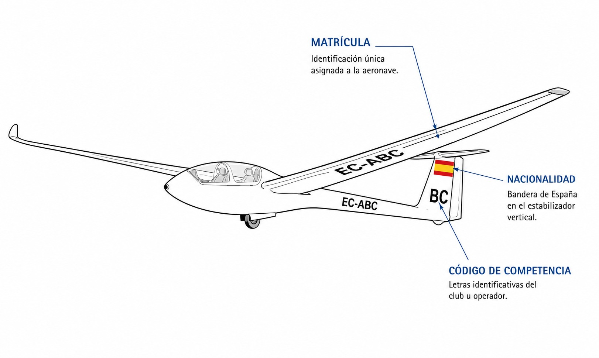
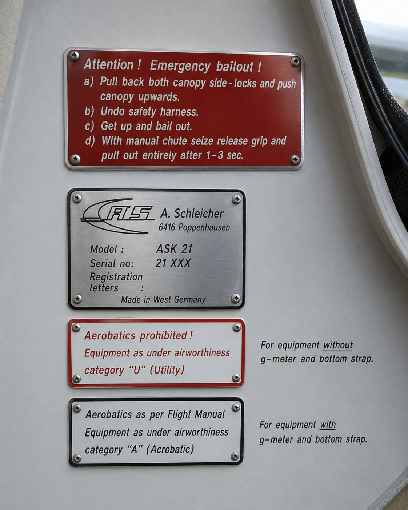

# Marcas de nacionalidad y matrícula de aeronaves

> Tu planeador tiene una identidad legal única; identificarlo correctamente es el primer paso de cualquier operación.
>
>
> En este capítulo aprenderás:
>
>
> * Cómo leer e interpretar las marcas de matrícula (EC-ABC).
> * Para qué sirve la placa de identificación ignífuga y dónde encontrarla.
> * Por qué tu planeador lleva la bandera de España.

## El DNI de tu planeador: nacionalidad y matrícula

Toda aeronave civil debe estar registrada en un país y llevar sus marcas de identidad bien visibles. Es como la matrícula de un coche, pero con rango internacional.

En España, la marca de nacionalidad es `EC`, seguida de un guion y tres letras: por ejemplo, `EC-BOH`. Estas marcas las asigna el Estado (AESA) y son únicas para cada aeronave.

::: {.callout-important title="Normativa"}
El artículo 20 del Convenio de Chicago establece que toda aeronave empleada en la navegación aérea internacional debe llevar las correspondientes marcas de nacionalidad y matrícula. En España, las matrículas comienzan por **EC-**.
:::

## Ubicación y dimensiones de las marcas

No basta con pintar las letras donde quepan: su posición y tamaño están regulados para que sean legibles desde el suelo o desde otras aeronaves.

Según la normativa española (y el Anexo 7 de OACI), en los aerodinos (aviones y planeadores):

1. **En las alas**: en la superficie inferior (intradós) del ala izquierda, o abarcando ambas alas, con una altura mínima de **50 centímetros**.
2. **En la cola o el fuselaje**: en ambos lados del fuselaje (entre las alas y la cola) o en las superficies verticales de cola, con una altura mínima de **30 centímetros**.

Si el planeador es muy estilizado y no caben marcas de este tamaño, la autoridad puede aceptar dimensiones reducidas, siempre que sigan siendo legibles (@fig-01-cap03-matricula-ubicacion).

{#fig-01-cap03-matricula-ubicacion}

## La placa de identificación (Fireproof Plate)

Además de la pintura, tu planeador necesita una identidad "indestructible": una **placa de identificación** de **material ignífugo** (acero inoxidable, titanio…​) fijada a la estructura, normalmente cerca de la entrada de la cabina, de forma que sea legible.

En ella van grabados la marca de nacionalidad, la matrícula y los datos de fabricante, modelo y número de serie (@fig-01-cap03-placa-ignifuga). Su razón de ser es sombría pero importante: si hay un accidente con fuego, la placa debe sobrevivir para que la aeronave pueda identificarse.

::: {.callout-warning title="Seguridad"}
Nunca pintes encima de la placa de identificación ni la cubras. Su función es vital en caso de investigación de accidentes. Si restauras el planeador, asegúrate de que la placa sigue ahí y es legible.
:::

{#fig-01-cap03-placa-ignifuga}

## La bandera de España

Junto a las letras, es obligatorio llevar la **bandera de España**, normalmente en la deriva o en el fuselaje, por encima de la matrícula y paralela a la línea de vuelo. Es el símbolo de la nacionalidad de la aeronave y de la soberanía del estado que la registra.

::: {.callout-tip title="Regla de oro"}
**EC** = Nemotecnia ***E**spaña **C**ivil*. La marca oficial OACI para España es "EC".
:::

**Resumen del Capítulo: Marcas y Matrícula**

Tu planeador tiene una identidad legal única que debe ser visible y resistente:

* **Nacionalidad y matrícula**: en España, **EC-** seguida de tres letras (ej: EC-BOH).
* **Marcas pintadas**: en el fuselaje o la cola (y bajo las alas en algunos casos), más la bandera de España.
* **Placa de identificación**: de material ignífugo, con la matrícula grabada, fijada a la estructura cerca de la entrada.
