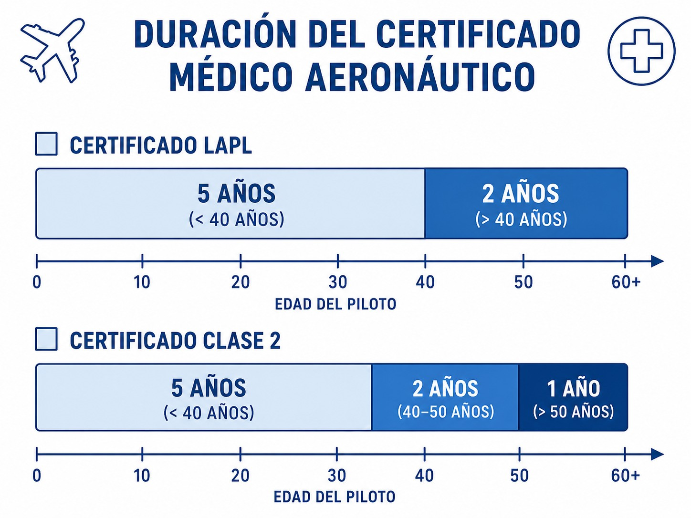
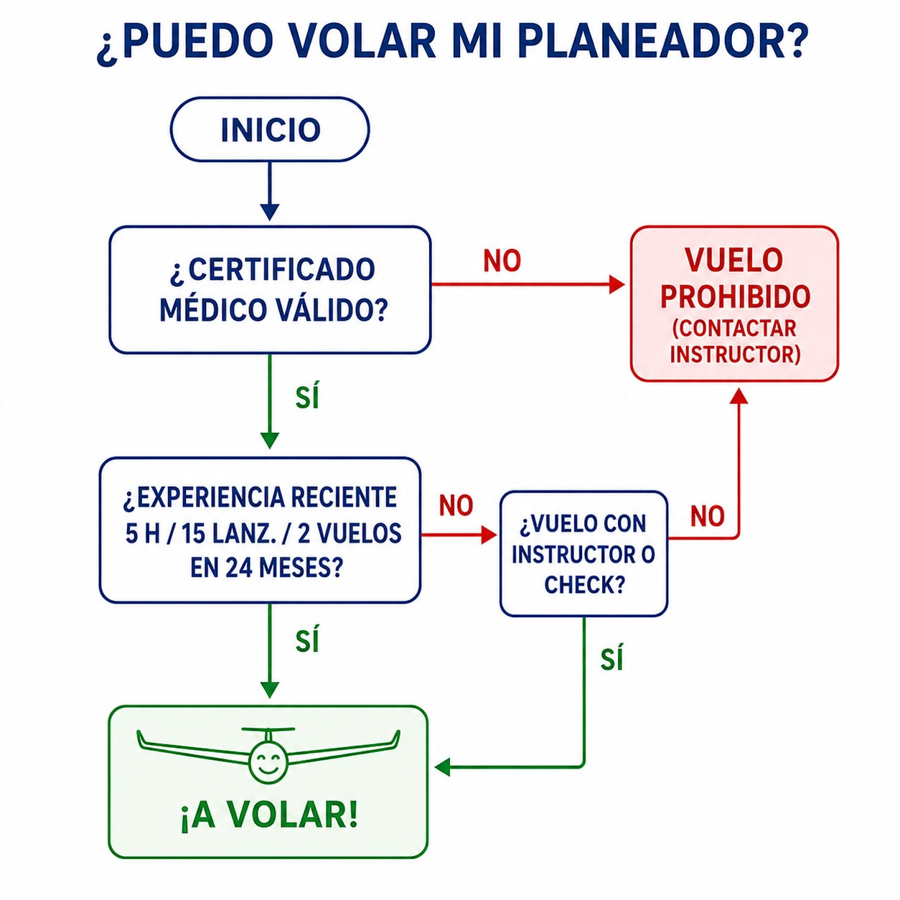

# Licencias de personal

> Tu licencia es un privilegio, no un derecho; mantenerla activa requiere experiencia continua y aptitud médica.
>
>
> En este capítulo aprenderás:
>
>
> * Qué es la licencia SPL: validez, privilegios y normativa aplicable (Part-SFCL).
> * Las diferencias entre el certificado médico LAPL y el Clase 2, y cuánto duran.
> * La regla "5 horas - 15 lanzamientos - 2 vuelos" para mantenerte legal.
> * Qué necesitas, además de la licencia, para llevar a alguien contigo.

## La licencia SPL (Sailplane Pilot Licence)

Para volar un planeador legalmente en Europa necesitas una licencia **SPL** (**Sailplane Pilot Licence**), regulada por la Part-SFCL del Reglamento (UE) 2018/1976 (actualizado por el 2020/358).

Puedes obtenerla a los 16 años, aunque ya a los 14 puedes volar solo como alumno. Te da derecho a actuar como piloto al mando (PIC) en planeadores y motoveleros, y en teoría es **vitalicia**: el papel no caduca.

Pero que el papel no caduque no significa que puedas volar siempre. Para ejercer tus privilegios debes cumplir dos condiciones **sine qua non**: tener un **certificado médico válido** y cumplir los requisitos de **experiencia reciente**.

## El certificado médico

Sin médico, no hay vuelo. Controlar la fecha de caducidad es responsabilidad tuya.

Vale tanto un certificado **Clase 2** como un **LAPL** (**Light Aircraft Pilot Licence**). Para la mayoría de pilotos deportivos, el LAPL es suficiente y menos exigente. Su validez depende de tu edad: **60 meses** (5 años) si tienes menos de 40, y **24 meses** (2 años) a partir de los 40 (@fig-01-cap04-medical-validity). Ojo con el matiz de MED.A.045: un certificado emitido **antes** de cumplir los 40 deja de ser válido cuando cumples los **42**, aunque los 60 meses no hayan vencido. Si te lo expidieron a los 39, no te vale hasta los 44: caduca a los 42.

::: {.callout-warning title="Seguridad"}
Si tu salud cambia (operación, enfermedad grave, embarazo, nuevas gafas), tu certificado médico puede quedar en suspenso. Consulta siempre con un Médico Examinador Aéreo (AME) antes de volver a volar.
:::

{#fig-01-cap04-medical-validity}

## Experiencia reciente: la regla de los 24 meses

Para volar solo o con pasajeros debes demostrar que estás al día. La normativa SFCL establece una ventana móvil de los **últimos 24 meses**, dentro de los cuales, para mantener activos tus privilegios en planeadores (excluyendo TMG), debes haber completado:

1. **5 horas** de vuelo como piloto al mando (o doble mando).
2. **15 lanzamientos**.
3. **2 vuelos de entrenamiento** con un instructor.

### ¿Qué pasa si no cumplo?

No pierdes la licencia; tus privilegios quedan "dormidos". Para despertarlos tienes dos caminos: pasar una **verificación de competencia** (**proficiency check**) con un examinador, o volar con instructor en doble mando hasta completar lo que te falte (@fig-01-cap04-recencia-flow).

::: {.callout-tip title="Regla de oro"}
* **5 , 15 , 2**
* **5** horas, **15** despegues, **2** vuelos con instructor. (En los últimos 2 años).
:::

{#fig-01-cap04-recencia-flow}

## Transporte de pasajeros

Llevar a alguien contigo es una gran responsabilidad, y la licencia recién sacada no te lo permite de inmediato. Primero debes completar **10 horas** de vuelo o **30 lanzamientos** como piloto al mando **después** de obtener la licencia y, además, un **vuelo de entrenamiento** en el que demuestres a un instructor FI(S) tu competencia para el transporte de pasajeros (salvo que ya seas titular de un certificado FI(S)).

Y una vez cumplido eso, hay un requisito de recencia: **3 lanzamientos en los últimos 90 días**. Si llevas tres meses sin volar, haz unos vuelos solo antes de invitar a nadie.

::: {.callout-important title="Normativa"}
Reglamentos (UE) 2018/1976 y 2020/358 (SFCL.115): el titular de una SPL solo transportará pasajeros si, tras obtener la licencia, ha completado 10 horas de vuelo o 30 lanzamientos como PIC **y un vuelo de entrenamiento demostrando la competencia a un FI(S)** (o posee certificado FI(S)), además de cumplir la recencia de SFCL.160(e). El incumplimiento implica sanción y pérdida de cobertura del seguro.
:::

::: {.postit}
**Resumen del Capítulo: Licencias**

Para pilotar legalmente necesitas tres cosas:

* **Licencia SPL**: tu título de piloto, regido por la Part-SFCL. Vale de por vida, pero sus atribuciones dependen del médico y de la experiencia reciente.
* **Certificado médico**: Clase 2 o LAPL. Sin médico en vigor, la licencia es papel mojado.
* **Experiencia reciente**: en los últimos 24 meses, 5 horas de vuelo (como PIC, doble mando o con FI(S)), 15 lanzamientos y 2 vuelos de entrenamiento con un FI(S). Si no llegas, vuela con instructor hasta cumplirlos o supera una verificación de competencia con un FE(S).
* **Pasajeros**: requieren experiencia extra (10 h o 30 lanzamientos tras la licencia), un vuelo de entrenamiento con un FI(S) demostrando competencia (salvo que ya seas FI(S)) y 3 lanzamientos en los últimos 90 días.
:::

