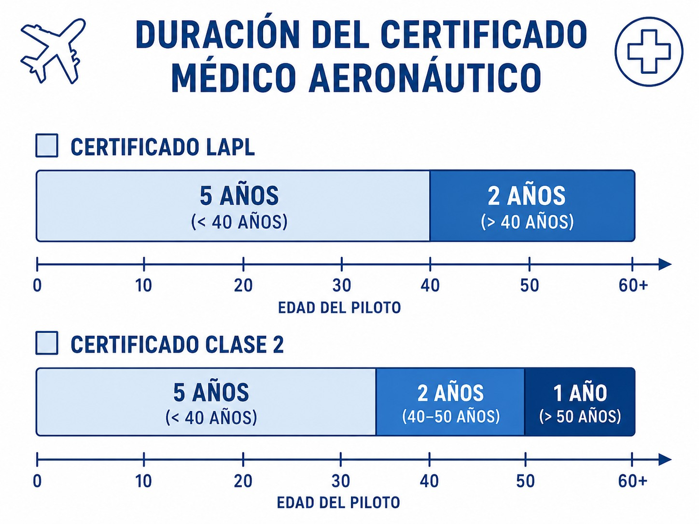

# Licencias de personal

> La licencia no caduca, pero para usarla tienes que seguir volando y tener el médico en vigor.
>
>
> En este capítulo aprenderás:
>
>
> * Qué es la licencia SPL: validez, privilegios y normativa aplicable (Part-SFCL).
> * Las diferencias entre el certificado médico LAPL y el Clase 2, y cuánto duran.
> * La regla "5 horas - 15 lanzamientos - 2 vuelos" y la recencia propia de cada método de lanzamiento.
> * Qué necesitas, además de la licencia, para llevar a alguien contigo.

## La licencia SPL (Sailplane Pilot Licence)

Para volar un planeador legalmente en Europa necesitas una licencia **SPL** (**Sailplane Pilot Licence**), regulada por la Part-SFCL del Reglamento (UE) 2018/1976 (actualizado por el 2020/358).

Puedes obtenerla a los 16 años, aunque ya a los 14 puedes volar solo como alumno. Te da derecho a actuar como piloto al mando (PIC) en planeadores, incluidos los planeadores con motor, sin remuneración y en operaciones no comerciales, y en teoría es **vitalicia**: el papel no caduca. Para volar con remuneración o en operaciones comerciales necesitas además tener 18 años y, tras obtener la licencia, 75 horas de vuelo o 200 lanzamientos como PIC (SFCL.115 a) 3)); y los instructores y examinadores pueden cobrar por instruir o examinar (SFCL.115 b)). Los **motoveleros de turismo (TMG)** son otra cosa: si hiciste la prueba de pericia en un planeador, para volarlos necesitas extender las atribuciones con formación y una prueba de pericia en TMG (SFCL.150), y su recencia es distinta: en los últimos 24 meses, 12 horas que incluyan, en TMG, 6 horas, 12 despegues y aterrizajes y un vuelo de entrenamiento de 1 hora con instructor (SFCL.160 b)).

Pero que el papel no caduque no significa que puedas volar siempre. Para ejercer tus privilegios tienes que cumplir dos condiciones: tener un **certificado médico válido** y cumplir los requisitos de **experiencia reciente**.

## El certificado médico

Sin médico no se vuela, y vigilar cuándo caduca es cosa tuya.

Vale tanto un certificado **Clase 2** como un **LAPL** (**Light Aircraft Pilot Licence**). Para la mayoría de pilotos deportivos, el LAPL es suficiente y menos exigente. Su validez depende de tu edad: **60 meses** (5 años) si tienes menos de 40, y **24 meses** (2 años) a partir de los 40 (@fig-01-cap04-medical-validity). Ojo con el matiz de MED.A.045: un certificado emitido **antes** de cumplir los 40 deja de ser válido cuando cumples los **42**, aunque los 60 meses no hayan vencido. Si te lo expidieron a los 39, no te vale hasta los 44: caduca a los 42.

La **Clase 2** sólo es obligatoria si vuelas un planeador en operaciones comerciales (MED.A.030 c) 4)). Su validez es de 60 meses hasta los 40 años (con la misma regla de los 42), 24 meses entre los 40 y los 50 (un certificado expedido antes de los 50 deja de valer a los 51) y 12 meses a partir de los 50 (MED.A.045).

::: {.callout-warning title="Seguridad"}
Si tu salud cambia (operación, enfermedad grave, embarazo, ingreso hospitalario, medicación habitual, o necesitas lentes correctoras por primera vez), tu certificado médico puede quedar en suspenso (MED.A.020). Consulta siempre con un Médico Examinador Aéreo (AME) antes de volver a volar.
:::

{#fig-01-cap04-medical-validity .corregir}

## Experiencia reciente: la regla de los 24 meses

Para volar solo o con pasajeros debes demostrar que estás al día. La normativa SFCL establece una ventana móvil de los **últimos 24 meses**, dentro de los cuales, para mantener activos tus privilegios en planeadores (excluyendo TMG), debes haber completado:

1. **5 horas** de vuelo como piloto al mando (o doble mando).
2. **15 lanzamientos**.
3. **2 vuelos de entrenamiento** con un instructor.

### ¿Qué pasa si no cumplo?

No pierdes la licencia; tus privilegios quedan "dormidos". Para despertarlos tienes dos caminos: pasar una **verificación de competencia** (**proficiency check**) con un examinador, o volar con instructor en doble mando hasta completar lo que te falte (@fig-01-cap04-recencia-flow).

::: {.callout-tip title="Regla de oro"}
* **5 , 15 , 2**
* **5** horas, **15** lanzamientos, **2** vuelos con instructor. (En los últimos 2 años).
:::

{#fig-01-cap04-recencia-flow .corregir}

### Además, por cada método de lanzamiento

El "5-15-2" no basta. Tus atribuciones se limitan a los métodos de lanzamiento en los que te has formado —torno, remolque, autolanzamiento, cable elástico (**bungee**)—, y cada uno tiene su propia recencia (SFCL.155). Para mantener un método debes haber hecho con él al menos **5 lanzamientos en los últimos 24 meses**; con cable elástico bastan **2**. Si no llegas, completa los que te falten en doble mando o solo bajo la supervisión de un instructor.

Puedes cumplir de sobra el "5-15-2" a base de remolques y, aun así, no estar al día para despegar en torno.

## Transporte de pasajeros

Con la licencia recién sacada todavía no puedes llevar a nadie. Primero debes completar **10 horas** de vuelo o **30 lanzamientos** como piloto al mando **después** de obtener la licencia y, además, un **vuelo de entrenamiento** en el que demuestres a un instructor FI(S) tu competencia para el transporte de pasajeros (salvo que ya seas titular de un certificado FI(S)).

Y una vez cumplido eso, hay un requisito de recencia: **3 lanzamientos en los últimos 90 días**. Si llevas tres meses sin volar, haz unos vuelos solo antes de invitar a nadie.

::: {.callout-important title="Normativa"}
Reglamentos (UE) 2018/1976 y 2020/358 (SFCL.115): el titular de una SPL solo transportará pasajeros si, tras obtener la licencia, ha completado 10 horas de vuelo o 30 lanzamientos como PIC **y un vuelo de entrenamiento demostrando la competencia a un FI(S)** (o posee certificado FI(S)), además de cumplir la recencia de SFCL.160(e).
:::

Volar con pasajeros sin cumplirlo es una infracción de la Ley de Seguridad Aérea y, según tu póliza, puede dejarte sin cobertura.

::: {.postit}
**Resumen del capítulo: licencias**

Para pilotar legalmente necesitas tres cosas:

* **Licencia SPL**: tu título de piloto, regido por la Part-SFCL. Vale de por vida, pero sus atribuciones dependen del médico y de la experiencia reciente.
* **Certificado médico**: Clase 2 o LAPL. Sin médico en vigor, la licencia es papel mojado.
* **Experiencia reciente**: en los últimos 24 meses, 5 horas de vuelo (como PIC, doble mando o con FI(S)), 15 lanzamientos y 2 vuelos de entrenamiento con un FI(S). Si no llegas, vuela con instructor hasta cumplirlos o supera una verificación de competencia con un FE(S).
* **Métodos de lanzamiento**: sólo puedes usar aquellos en los que te formaste, y cada uno exige al menos 5 lanzamientos en los últimos 24 meses (2 con cable elástico) (SFCL.155).
* **Pasajeros**: requieren experiencia extra (10 h o 30 lanzamientos tras la licencia), un vuelo de entrenamiento con un FI(S) demostrando competencia (salvo que ya seas FI(S)) y 3 lanzamientos en los últimos 90 días.
:::
