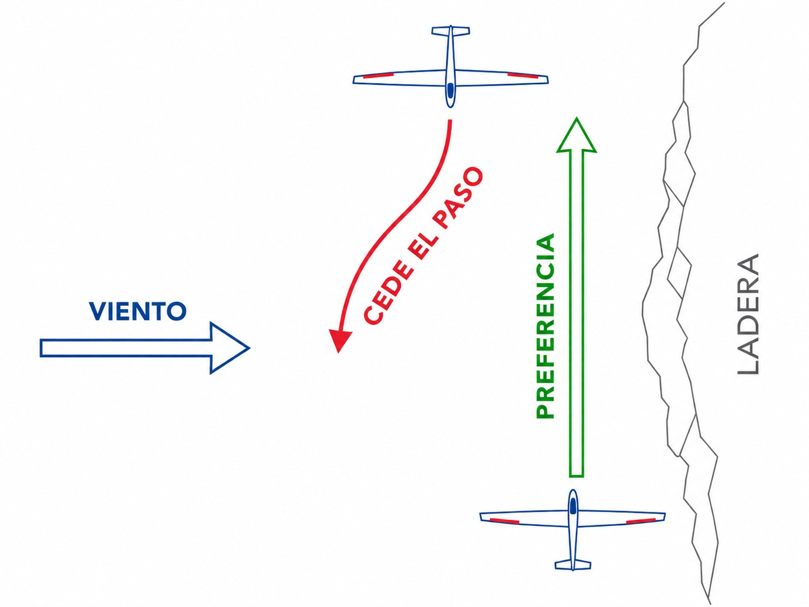
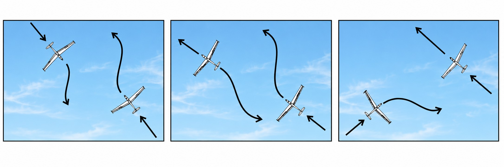
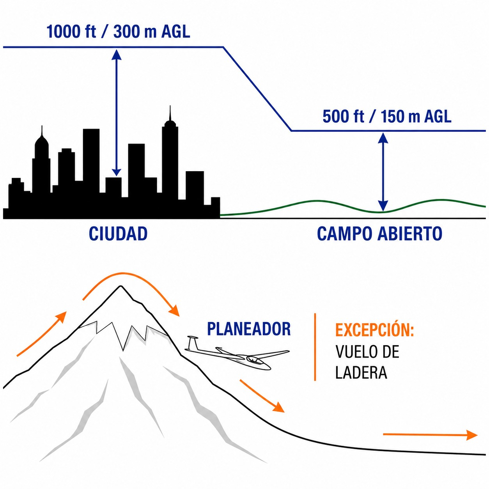

# Reglas del aire

> El cielo no tiene señales de STOP, pero tiene reglas estrictas; dominar el reglamento SERA es esencial para evitar colisiones.
>
>
> En este capítulo aprenderás:
>
>
> * El reglamento SERA, el código de circulación aéreo europeo.
> * El principio de "ver y evitar" del vuelo visual (VFR).
> * Quién cede el paso a quién (globos > planeadores > motor).
> * Cuándo puedes volar bajo (laderas, tomas fuera de campo) y cuándo no.

## El código de circulación del cielo: SERA

En Europa volamos bajo un reglamento unificado: **SERA** (**Standardised European Rules of the Air**), directamente aplicable en España como reglamento de la UE y complementado por el Real Decreto 552/2014. Da igual si vuelas en Albacete o en Alemania: las reglas básicas son las mismas.

El principio fundamental es **VFR** (**Visual Flight Rules**): volamos basándonos en referencias visuales externas.

## Principio básico: "ver y evitar"

En vuelo visual, tú eres el único responsable de no chocar. El control de tráfico (ATC) puede ayudarte, pero la responsabilidad final es tuya. Eso exige un escaneo constante del cielo (la técnica del barrido visual) y algo de gimnasia: mueve el avión o la cabeza para ver detrás de los montantes o bajo el morro, porque los puntos ciegos existen.

::: {.callout-warning title="Seguridad"}
La mayoría de colisiones ocurren en días claros y cerca de los aeródromos. Nunca asumas que el otro te ha visto. Si tienes dudas, cede el paso.
:::

## Prioridades de paso (Right of Way)

¿Quién pasa primero cuando dos aeronaves se encuentran? SERA.3210 lo deja claro.

### 1. La jerarquía de maniobrabilidad

La regla básica: quien menos capacidad de maniobra tiene, prioridad lleva.

1. **Globos**: máxima prioridad, apenas pueden maniobrar.
2. **Planeadores**: solo bajamos; no podemos mantener nivel indefinidamente.
3. **Dirigibles**.
4. **Aviones con motor y ultraligeros**: tienen motor y maniobran a voluntad.

Hay una excepción: las aeronaves de motor deben ceder el paso a las que remolcan a otra aeronave u objetos (la pancarta o el propio conjunto remolcador-planeador), porque su maniobrabilidad está muy reducida. A ti como velero libre la norma no te obliga, pero la prudencia sí: apártate de un tren de remolque en cuanto lo veas.

### 2. Situaciones de conflicto

* **De frente** (**head-on**): ambos viran a su **derecha**.

* **Convergencia**: en rutas que se cruzan al mismo nivel, tiene prioridad quien viene por la **derecha**. Ojo: si tú vienes por la derecha pero vuelas a motor y el otro es un planeador, el planeador manda por jerarquía.
* **Alcance**: si alcanzas a otro por detrás, el de delante tiene prioridad. Rebásalo por su **derecha**. Con una excepción hecha a nuestra medida: un planeador que adelanta a otro planeador puede hacerlo **por la derecha o por la izquierda** (útil en ladera, donde solo un lado es seguro).
* **En ladera**: si dos planeadores se encuentran en rumbo de colisión volando una ladera, **tiene prioridad el que lleva la montaña a su derecha**. El otro debe separarse de la ladera para dejar paso (@fig-01-cap05-prioridades-ladera).

{#fig-01-cap05-prioridades-ladera}

* **Aterrizaje**: el velero más bajo tiene prioridad para aterrizar (pero no vale picar para colarse). Además, según SERA.3210, los planeadores en final y aterrizaje siempre tienen preferencia sobre las aeronaves de motor (@fig-01-cap05-prioridades).

{#fig-01-cap05-prioridades}

## Alturas mínimas de vuelo

Para proteger a las personas y bienes en tierra, SERA.5005 establece alturas mínimas. Salvo para despegar o aterrizar, no puedes volar por debajo de:

1. **300 m** sobre el obstáculo más alto en un radio de 600 m, cuando sobrevuelas aglomeraciones (ciudades, pueblos, gente reunida).
2. **150 m** sobre tierra o agua, en campo abierto.

### Excepciones para el vuelo a vela

La norma reconoce nuestra operativa particular:

* **Vuelo de ladera**: puedes volar por debajo de 150 m si lo necesitas para sustentarte en la ladera, siempre que no pongas en peligro a nadie.
* **Entrenamiento de tomas fuera de campo**: se permite bajar hasta **50 m** para simular una toma, manteniendo 150 m de distancia horizontal con cualquier persona, vehículo o edificio (@fig-01-cap05-alturas-minimas).

{#fig-01-cap05-alturas-minimas}

::: {.callout-tip title="Regla de oro"}
**Globo > Planeador > Motor.**
Si tiene motor, te cede el paso. Si es un globo, tú cedes.
Si vais de frente, **siempre a la derecha**.
:::

::: {.postit}
**Resumen del capítulo: reglas del aire**

El reglamento **SERA** es el código de circulación del cielo:

* **VFR**: volamos viendo y siendo vistos. Ojos fuera.
* **Prioridad de paso**: globos > planeadores > motor (cede quien más maniobra tiene). En convergencia, paso para el que viene por la derecha. En ladera, prioridad para quien lleva la montaña a su derecha. En aterrizaje, el velero más bajo manda, y los planeadores tienen preferencia sobre los aviones a motor.
* **Alturas mínimas**: 150 m en general, 300 m sobre zonas pobladas. Los planeadores pueden volar más bajo en ladera (sin riesgo para personas o bienes) y bajar hasta 50 m entrenando tomas fuera de campo, a 150 m de personas y vehículos.
:::
