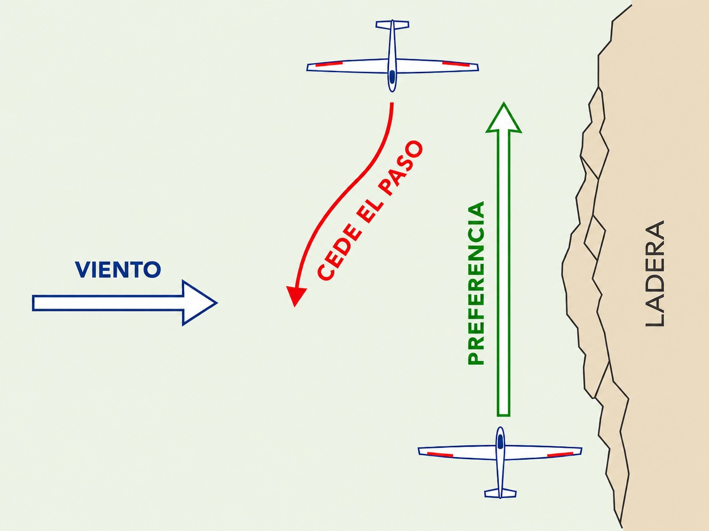
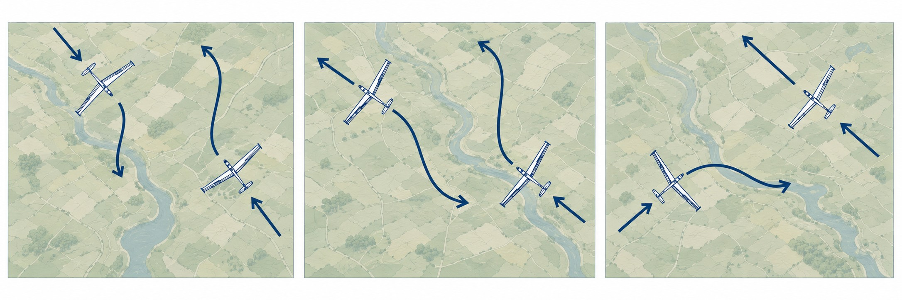
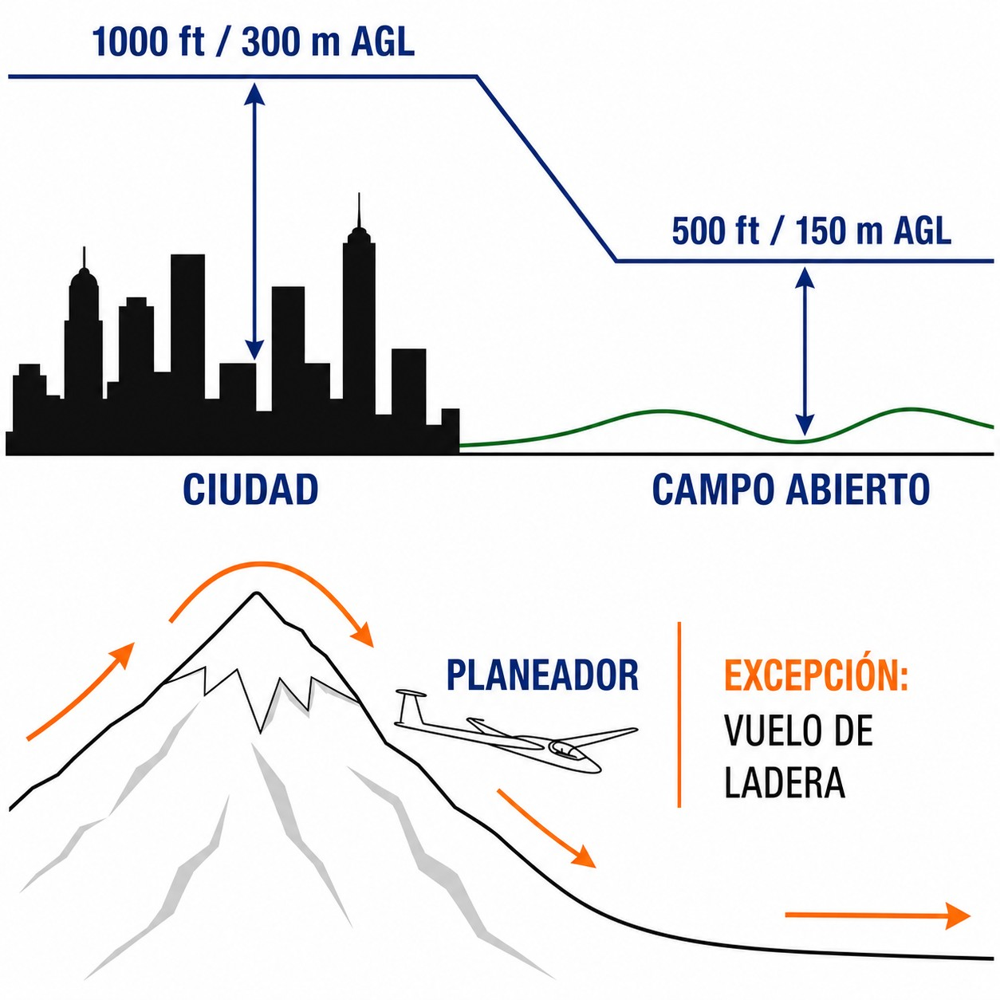

# Reglas del aire

> El cielo no tiene señales de STOP, pero tiene reglas estrictas; dominar el reglamento SERA es esencial para evitar colisiones.
>
>
> En este capítulo aprenderás:
>
>
> * El reglamento SERA, el código de circulación aéreo europeo.
> * El principio de "ver y evitar" del vuelo visual (VFR).
> * Quién cede el paso a quién (globos > planeadores > motor).
> * Cuándo puedes volar bajo (laderas, tomas fuera de campo) y cuándo no.

## El código de circulación del cielo: SERA

En Europa volamos bajo un reglamento unificado: **SERA** (**Standardised European Rules of the Air**), directamente aplicable en España como reglamento de la UE y desarrollado por el Real Decreto 1180/2018. Da igual si vuelas en Albacete o en Alemania: las reglas básicas son las mismas.

El principio fundamental es **VFR** (**Visual Flight Rules**): volamos basándonos en referencias visuales externas.

## Principio básico: "ver y evitar"

En vuelo visual, tú eres el único responsable de no chocar. El control de tráfico (ATC) puede ayudarte, pero la responsabilidad final es tuya. Eso exige un escaneo constante del cielo (la técnica del barrido visual) y algo de gimnasia: mueve el avión o la cabeza para ver detrás de los montantes o bajo el morro, porque los puntos ciegos existen.

::: {.callout-warning title="Seguridad"}
La mayoría de colisiones ocurren en días claros y cerca de los aeródromos. Nunca asumas que el otro te ha visto. Si tienes dudas, cede el paso.
:::

## Prioridades de paso (Right of Way)

¿Quién pasa primero cuando dos aeronaves se encuentran? SERA.3210 lo deja claro.

### 1. La jerarquía de maniobrabilidad

Cuando dos aeronaves **convergen** —rutas que se cruzan, más o menos al mismo nivel—, SERA da prioridad a quien menos capacidad de maniobra tiene:

1. **Globos**: máxima prioridad, apenas pueden maniobrar.
2. **Planeadores**: solo bajamos; no podemos mantener nivel indefinidamente.
3. **Dirigibles**.
4. **Aviones con motor y ultraligeros**: tienen motor y maniobran a voluntad.

Hay una excepción: las aeronaves de motor deben ceder el paso a las que remolcan a otra aeronave u objetos (la pancarta o el propio conjunto remolcador-planeador), porque su maniobrabilidad está muy reducida. A ti como velero libre la norma no te obliga, pero la prudencia sí: apártate de un tren de remolque en cuanto lo veas.

Ojo: esta jerarquía sólo decide en convergencia. De frente y en alcance no cuenta la categoría, y cualquier aeronave cede el paso a otra cuya maniobrabilidad esté alterada o que se vea obligada a aterrizar (SERA.3210 b) y c) 4)).

### 2. Situaciones de conflicto

* **De frente** (**head-on**): ambos viran a su **derecha**.

* **Convergencia**: en rutas que se cruzan al mismo nivel, tiene prioridad quien viene por la **derecha**. Ojo: si tú vienes por la derecha pero vuelas a motor y el otro es un planeador, el planeador manda por jerarquía.
* **Alcance**: si alcanzas a otro por detrás, el de delante tiene prioridad. Rebásalo por su **derecha**. Con una excepción hecha a nuestra medida: un planeador que adelanta a otro planeador puede hacerlo **por la derecha o por la izquierda** (útil en ladera, donde solo un lado es seguro).
* **En ladera**: si dos planeadores se encuentran en rumbo de colisión volando una ladera, **tiene prioridad el que lleva la montaña a su derecha**. El otro debe separarse de la ladera para dejar paso (@fig-01-cap05-prioridades-ladera). Esta regla **no está en SERA**: es una convención universal del vuelo a vela. La del reglamento para el encuentro de frente obliga a virar a la derecha a *las dos* aeronaves, cosa imposible para quien tiene la ladera justo a ese lado.

{#fig-01-cap05-prioridades-ladera}

* **Aterrizaje**: el velero más bajo tiene prioridad para aterrizar (pero no vale picar para colarse). Además, según SERA.3210, los planeadores en final y aterrizaje siempre tienen preferencia sobre las aeronaves de motor (@fig-01-cap05-prioridades).

{#fig-01-cap05-prioridades}

## Alturas mínimas de vuelo

Para proteger a las personas y bienes en tierra, SERA.5005 establece alturas mínimas. Salvo para despegar o aterrizar, no puedes volar por debajo de:

1. **300 m** sobre el obstáculo más alto en un radio de 600 m, cuando sobrevuelas aglomeraciones (ciudades, pueblos, gente reunida).
2. **150 m** sobre tierra o agua, o sobre el obstáculo más alto en un radio de 150 m, en cualquier otra parte (@fig-01-cap05-alturas-minimas).

### Excepciones para el vuelo a vela

SERA.5005 f) admite excepciones «con permiso de la autoridad competente», y su AMC1 encarga precisamente a esa autoridad fijar las alturas mínimas del vuelo de ladera y de las prácticas de aterrizaje forzoso. En España las fija el **artículo 33 del Real Decreto 1180/2018** (que derogó el Real Decreto 552/2014), que permite volar por debajo de lo establecido en SERA.5005 f) 2) —los 150 m de campo abierto, no los 300 m de zona poblada— en dos casos que nos afectan:

* **Vuelo de ladera**: los planeadores que efectúan vuelos en laderas quedan exceptuados, siempre que no entrañen ningún riesgo ni molestias a las personas o bienes en la superficie.
* **Entrenamiento de aterrizajes forzosos**: se puede bajar hasta **50 m** (la norma dice «50 m (150 ft)», aunque 50 m son unos 164 ft), siempre que no haya riesgo ni molestias para las personas o bienes en la superficie, manteniendo 150 m respecto de cualquier persona, vehículo o embarcación que se encuentre en la superficie y de todo obstáculo artificial, y cumpliendo las condiciones del estudio de seguridad del operador: el de tu escuela o club.

{#fig-01-cap05-alturas-minimas}

::: {.callout-tip title="Regla de oro"}
**En convergencia: globo > planeador > dirigible > motor.**
De frente, los dos a la derecha (en ladera, la convención). Quien alcanza, se aparta.
Quien aterriza, primero.
:::

::: {.postit}
**Resumen del capítulo: reglas del aire**

El reglamento **SERA** es el código de circulación del cielo:

* **VFR**: volamos viendo y siendo vistos. Ojos fuera.
* **Prioridad de paso**: en convergencia, globos > planeadores > motor (cede quien más maniobra tiene) y, entre iguales, paso para el que viene por la derecha. De frente, ambos a la derecha; quien alcanza se aparta, sea cual sea su categoría. En aterrizaje, el velero más bajo manda, y los planeadores tienen preferencia sobre los aviones a motor. En ladera, prioridad para quien lleva la montaña a su derecha: es convención del vuelo a vela, no regla de SERA.
* **Alturas mínimas (SERA.5005 f)**: 150 m sobre el terreno o el obstáculo más alto en un radio de 150 m; 300 m sobre zonas pobladas. En España, el Real Decreto 1180/2018 (art. 33) exceptúa de los 150 m a los planeadores en ladera, siempre que no entrañen riesgo ni molestias a personas o bienes, y permite bajar hasta 50 m entrenando aterrizajes forzosos, a 150 m de cualquier persona, vehículo o embarcación y de todo obstáculo artificial, y con el estudio de seguridad del operador.
:::
