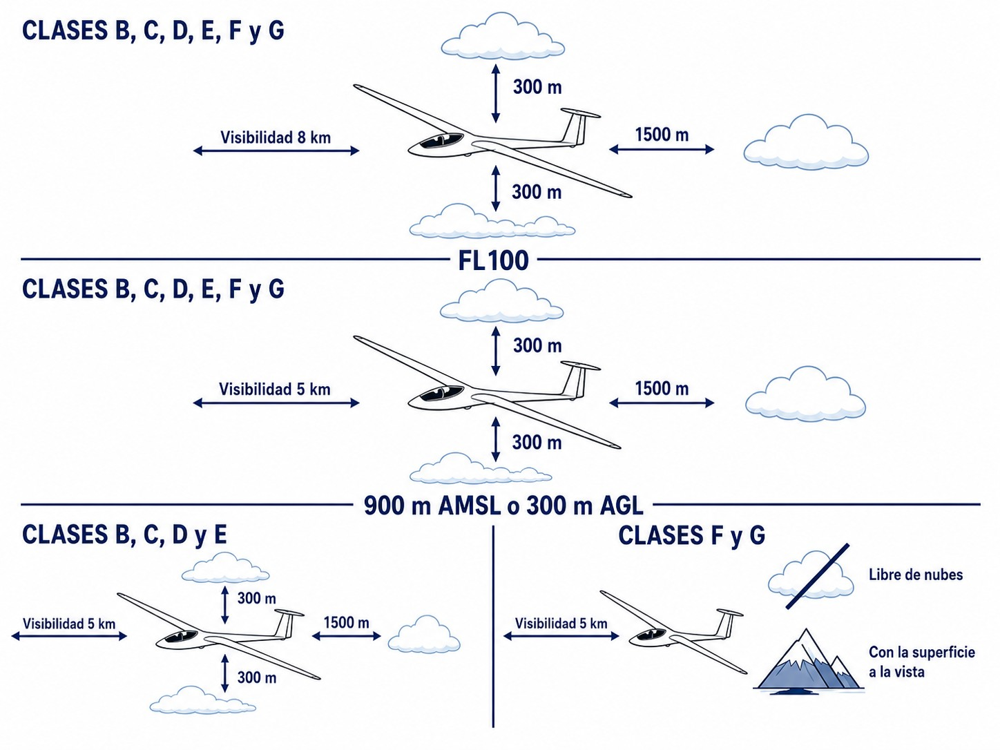
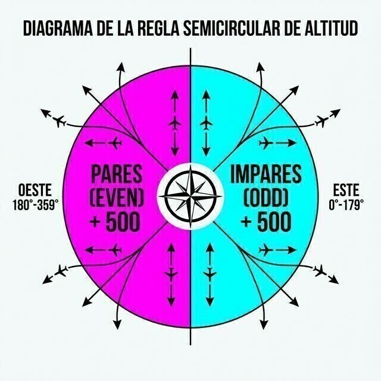

# Procedimientos para navegación aérea: operaciones de aeronaves

> Navegar seguro exige reglas precisas; domina los mínimos VMC y los niveles de crucero para compartir el cielo eficientemente.
>
>
> En este capítulo aprenderás:
>
>
> * Los mínimos meteorológicos (VMC): cuándo es legal volar visual y qué excepciones tenemos los planeadores.
> * La regla semicircular: cómo elegir tu altitud de crucero según el rumbo.
> * La diferencia crítica entre QNH (altitud), QFE (altura) y QNE (niveles de vuelo).
> * Cuándo es obligatorio el oxígeno para esquivar la hipoxia silenciosa.

## Mínimos VFR: Visibilidad y Distancia a Nubes

Para volar visual (VFR) necesitas unas condiciones meteorológicas mínimas (**VMC**). Si el tiempo baja de esos mínimos, el vuelo VFR está prohibido. La regla general se divide por altitud.

### Por debajo de 3.000 ft AMSL (o 1.000 ft AGL)

Es la zona donde solemos movernos los planeadores, y los mínimos dependen del espacio aéreo en que estés:

* **Espacio aéreo controlado (Clases B, C, D, E)**: visibilidad de 5 km y distancia a nubes de 1.500 m en horizontal y 1.000 ft en vertical.
* **Espacio aéreo no controlado (Clases F, G)**: visibilidad de 5 km, libre de nubes y a la vista de la superficie.

Hay una excepción interesante en espacio no controlado: si vuelas a menos de 140 kt (como un planeador), la normativa permite reducir la visibilidad mínima a **1.500 m**, siempre que tu velocidad te deje ver otros tráficos u obstáculos con tiempo de sobra para evitar la colisión (@fig-01-cap06-vmc-minima).

### Por encima de 3.000 ft AMSL (hasta FL 100)

Visibilidad de 5 km y distancia a nubes de 1.500 m en horizontal y 1.000 ft en vertical, estés en el espacio aéreo que estés. Y un dato para los días grandes de onda: por encima de FL 100, la visibilidad mínima sube a **8 km**.

{#fig-01-cap06-vmc-minima}

## Regla semicircular de niveles de crucero

Para evitar encuentros frontales en ruta, cada uno vuela a una altitud según su derrota magnética. En España, desde 2019, la regla semicircular para vuelos VFR por encima de **3.000 ft AGL** se orienta **Norte-Sur**:

* **Derrotas hacia el norte (270° a 089°)**: altitudes o niveles **pares** + 500 ft (4.500 ft, 6.500 ft, FL 45, FL 65…​).
* **Derrotas hacia el sur (090° a 269°)**: altitudes o niveles **impares** + 500 ft (3.500 ft, 5.500 ft, FL 35, FL 55…​).

(@fig-01-cap06-semicircular)

::: {.callout-tip title="Regla de oro"}
**Norte Par / Sur Impar**
Hacia el **N**orte → Niveles **P**ares.
Hacia el **S**ur → Niveles **I**mpares.
:::

{#fig-01-cap06-semicircular}

## Reglaje de altímetro: QNH, QFE y QNE

Tu altímetro mide presión, no altura. Según qué presión le pongas en la ventanilla de Kollsman, te contará una historia u otra:

* **QNH**: presión al nivel del mar. El altímetro marca **altitud** (sobre el mar). Es lo que usamos para navegar y respetar circuitos; en el suelo marca la elevación del campo.
* **QFE**: presión del aeródromo. El altímetro marca **altura** sobre el campo; en el suelo marca cero. Poco usado en travesía, útil en vuelo local o competición.
* **QNE**: presión estándar (1013,2 hPa). El altímetro marca **niveles de vuelo (FL)**. Se usa por encima de la altitud de transición (6.000 ft en general en España, con excepciones como Madrid a 13.000 ft o Granada a 7.000 ft) para que todos los aviones compartan la misma referencia, haga la meteo que haga. Un matiz: a diferencia del QNH y el QFE, el QNE no es una presión que te reporte nadie, sino la **lectura del altímetro con 1013,2 hPa calados**; por eso se habla de «calar estándar», no de «poner el QNE».

::: {.callout-tip title="Regla de oro"}
Como regla mnemotécnica en inglés:

* **QNH** = ***N**autical **H**eight* (Altitud sobre el nivel del mar).
* **QFE** = ***F**ield **E**levation* (Altura sobre el campo de vuelo).
:::

::: {.callout-important title="Normativa"}
Por debajo de la **Altitud de Transición** (6.000 ft en la mayor parte de España, salvo excepciones como Madrid o Granada), volamos con **QNH** (Altitud). Por encima, calamos **1013** y volamos en **Niveles de Vuelo (FL)**.
:::

## Oxígeno suplementario

A medida que subes hay menos oxígeno, y la hipoxia es un enemigo silencioso: te sientes eufórico, pierdes juicio y te desmayas sin previo aviso. Por eso la norma dice dos cosas:

1. El piloto al mando debe asegurar que todos los ocupantes usen oxígeno suplementario siempre que determine que su falta puede afectar a sus facultades.
2. Si el piloto no puede determinar ese efecto, según EASA el oxígeno **deberá** usarse siempre por encima de los **10.000 ft**.

::: {.callout-important title="Normativa"}
**AMC1 SAO.OP.150:** El piloto al mando debe asegurarse de que todos los ocupantes utilicen oxígeno suplementario siempre que la altitud de presión sea superior a los **10.000 ft**, en los casos en que no pueda determinar cómo la falta de oxígeno puede afectar a las personas a bordo.
:::

::: {.callout-warning title="Seguridad"}
La norma legal es el mínimo. Fisiológicamente, muchos pilotos sufren deterioro a partir de 8.000-9.000 ft, especialmente de noche o ante fatiga. En vuelos de onda, conecta el oxígeno y úsalo antes de alcanzar los 10.000 ft.
:::

## Instrumentos mínimos a bordo

La misma normativa de operaciones fija el equipamiento mínimo del planeador según el tipo de vuelo.

::: {.callout-important title="Normativa"}
**SAO.IDE.105 a)**: todo planeador debe llevar medios para medir y mostrar la hora (en horas y minutos), la altitud de presión y la velocidad aerodinámica indicada; los planeadores motorizados añaden el rumbo magnético. **SAO.IDE.105 b)**: para volar en condiciones de nebulosidad o de noche se añaden medios para medir y mostrar la velocidad vertical, la actitud —o el viraje y el resbale— y el rumbo magnético.
:::

En la práctica: de día y en VFR bastan un reloj de pulsera, el altímetro y el anemómetro. La brújula se suma en los motorizados (TMG). Y el vuelo en nube o nocturno exige además el variómetro, un indicador de actitud o de viraje y resbale, y el rumbo magnético.

Queda un procedimiento operativo del syllabus que esta colección desarrolla en otros volúmenes: el **plan de vuelo**. Su operativa por radio está en el **Libro 4 — Comunicaciones** (cap. 3), el formulario OACI casilla a casilla en el **Libro 7 — Planificación** (cap. 4) y su relación con los servicios ATS en el **Libro 9 — Navegación** (cap. 7).

::: {.postit}
**Resumen del Capítulo: Procedimientos para la Navegación**

* **Mínimos VMC**: regla general, 5 km de visibilidad y nubes a 1.500 m en horizontal / 1.000 ft en vertical. Por debajo de 3.000 ft AMSL (o 1.000 ft AGL) en espacio no controlado basta con 5 km, libre de nubes y suelo a la vista; y volando a menos de 140 kt, la visibilidad puede reducirse a 1.500 m. Por encima de FL 100, 8 km.
* **Regla semicircular (España, Norte-Sur)**: hacia el Norte (270°-089°), pares + 500 ft; hacia el Sur (090°-269°), impares + 500 ft. «Norte Par / Sur Impar».
* **Altímetro**: QNH = altitud (navegación y circuitos); QFE = altura sobre el campo; QNE (1013) = niveles de vuelo por encima de la altitud de transición (6.000 ft en general en España).
* **Oxígeno**: según SAO.OP.150, el comandante debe garantizar su uso cuando determine que la falta de oxígeno puede disminuir las facultades o ser dañina. Si no puede valorar ese efecto, el AMC1 SAO.OP.150 fija la regla por defecto: usar oxígeno por encima de 10.000 ft. Fisiológicamente, conéctalo antes.
* **Pre-vuelo (SAO.GEN.130)**: antes de iniciar el vuelo, el piloto al mando comprueba que el planeador es aeronavegable, está matriculado y lleva los instrumentos y equipos necesarios instalados y operativos; también verifica masa, centrado, estiba y límites del AFM.
* **Instrumentos mínimos (SAO.IDE.105)**: hora, altitud de presión y velocidad indicada; los TMG añaden rumbo magnético. En nube o de noche: velocidad vertical, actitud o viraje/resbale, y rumbo magnético.
:::

