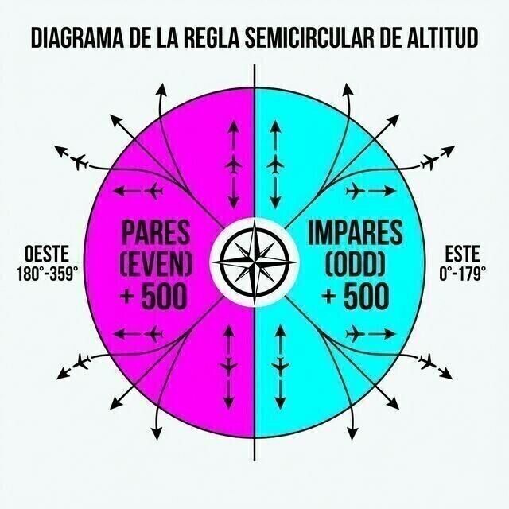

# Procedimientos para navegación aérea: operaciones de aeronaves

> Navegar seguro exige reglas precisas; domina los mínimos VMC y los niveles de crucero para compartir el cielo eficientemente.
>
>
> En este capítulo aprenderás:
>
>
> * Los mínimos meteorológicos (VMC): cuándo es legal volar visual y qué excepciones tenemos los planeadores.
> * La regla semicircular: cómo elegir tu altitud de crucero según el rumbo.
> * La diferencia crítica entre QNH (altitud), QFE (altura) y QNE (niveles de vuelo).
> * Cuándo es obligatorio el oxígeno para esquivar la hipoxia silenciosa.

## Mínimos VFR: visibilidad y distancia a nubes

Para volar visual (VFR) necesitas unas condiciones meteorológicas mínimas (**VMC**). Si el tiempo baja de esos mínimos, el vuelo VFR está prohibido. La regla general se divide por altitud.

### Por debajo de 3.000 ft AMSL (o 1.000 ft AGL)

El límite de esta franja es el **mayor** de los dos valores: 3.000 ft sobre el nivel del mar o 1.000 ft sobre el terreno. Sobre la meseta, con el suelo a unos 2.600 ft, la franja llega hasta unos 3.600 ft AMSL. Es la zona donde solemos movernos los planeadores, y los mínimos dependen del espacio aéreo en que estés:

* **Espacio aéreo controlado (Clases B, C, D, E)**: visibilidad de 5 km y distancia a nubes de 1.500 m en horizontal y 1.000 ft en vertical.
* **Espacio aéreo no controlado (Clases F, G)**: visibilidad de 5 km, libre de nubes y a la vista de la superficie.

Ojo con una excepción que verás citada a menudo: SERA permite que, en espacio no controlado y volando a 140 kt o menos, la autoridad competente autorice visibilidades de hasta **1.500 m**. En España sólo lo ha hecho para helicópteros y aviones de operaciones aéreas especializadas (Real Decreto 1180/2018, art. 30), así que **para un planeador el mínimo sigue siendo 5 km**, por despacio que vueles (@fig-01-cap06-vmc-minima).

### Por encima de 3.000 ft AMSL (hasta FL 100)

Visibilidad de 5 km y distancia a nubes de 1.500 m en horizontal y 1.000 ft en vertical, estés en el espacio aéreo que estés. Y un dato para los días grandes de onda: por encima de FL 100, la visibilidad mínima sube a **8 km**.

{#fig-01-cap06-vmc-minima .corregir}

## Regla semicircular de niveles de crucero

Para evitar encuentros frontales en ruta, cada uno vuela a una altitud según su derrota magnética. En España (Real Decreto 1180/2018, art. 6 y anexo I; AIP España, ENR 1.7), la regla semicircular para vuelos VFR por encima de **3.000 ft AGL** se orienta **Norte-Sur**:

* **Derrotas hacia el norte (270° a 089°)**: altitudes o niveles **pares** + 500 ft (4.500 ft, 6.500 ft…; por encima de la altitud de transición, FL 65, FL 85…​).
* **Derrotas hacia el sur (090° a 269°)**: altitudes o niveles **impares** + 500 ft (3.500 ft, 5.500 ft…; por encima de la altitud de transición, FL 75, FL 95…​).

::: {.callout-tip title="Regla de oro"}
**Norte Par / Sur Impar**
Hacia el **N**orte → Niveles **P**ares.
Hacia el **S**ur → Niveles **I**mpares.
:::

{#fig-01-cap06-semicircular .corregir}

## Reglaje de altímetro: QNH, QFE y QNE

Tu altímetro mide presión, no altura. Según qué presión le pongas en la ventanilla de Kollsman, te contará una historia u otra:

* **QNH**: reglaje altimétrico reducido al nivel medio del mar. El altímetro marca **altitud** y, en el suelo, aproximadamente la elevación del campo. Es lo que usamos para navegar y respetar circuitos.
* **QFE**: presión del aeródromo. El altímetro marca **altura** sobre el campo; en el suelo marca cero. Poco usado en travesía, útil en vuelo local o competición.
* **QNE**: indicación con el reglaje estándar (1013,25 hPa). El altímetro marca **niveles de vuelo (FL)**. Se usa por encima de la altitud de transición (6.000 ft en general en España, con excepciones como Madrid a 13.000 ft o Granada a 7.000 ft) para que todos los aviones compartan la misma referencia, haga la meteo que haga. Un matiz: a diferencia del QNH y el QFE, el QNE no es una presión que te reporte nadie, sino la **lectura del altímetro con 1013,25 hPa calados**; por eso se habla de «calar estándar», no de «poner el QNE».

::: {.callout-tip title="Regla de oro"}
Como truco para recordarlos (los códigos Q no son siglas: es sólo una ayuda):

* **QNH** = ***N**autical **H**eight* (Altitud sobre el nivel del mar).
* **QFE** = ***F**ield **E**levation* (Altura sobre el campo de vuelo). Ojo: con QFE el altímetro marca **0** en el campo; es con QNH cuando marca la elevación del campo.
:::

::: {.callout-important title="Normativa"}
Por debajo de la **Altitud de Transición** (6.000 ft en la mayor parte de España, salvo excepciones como Madrid o Granada), volamos con **QNH** (Altitud). Por encima, calamos **1013,25 hPa** y volamos en **Niveles de Vuelo (FL)**.
:::

## Oxígeno suplementario

A medida que subes hay menos oxígeno, y la hipoxia es un enemigo silencioso: te sientes eufórico, pierdes juicio y te desmayas sin previo aviso. Por eso la norma dice dos cosas:

1. El piloto al mando debe asegurar que todos los ocupantes usen oxígeno suplementario siempre que determine que su falta puede afectar a sus facultades.
2. Si el piloto no puede determinar ese efecto, el medio aceptable de cumplimiento de EASA (AMC) es que todos lo usen por encima de los **10.000 ft**.

::: {.callout-important title="Normativa"}
**SAO.OP.150** obliga al piloto al mando a garantizar el uso de oxígeno cuando determine que su falta puede afectar a las facultades de los ocupantes. Su **AMC1** añade el medio aceptable de cumplimiento: cuando no pueda determinarlo, **debería** asegurarse de que todos lo usen siempre que la altitud de presión supere los **10.000 ft**. Un AMC no es vinculante como el reglamento, pero apartarse de él exige demostrar que se cumple igual.
:::

::: {.callout-warning title="Seguridad"}
La norma legal es el mínimo. Fisiológicamente, muchos pilotos sufren deterioro a partir de 8.000-9.000 ft, especialmente de noche o ante fatiga. En vuelos de onda, conecta el oxígeno y úsalo antes de alcanzar los 10.000 ft.
:::

## Instrumentos mínimos a bordo

La misma normativa de operaciones fija el equipamiento mínimo del planeador según el tipo de vuelo.

::: {.callout-important title="Normativa"}
**SAO.IDE.105 a)**: todo planeador debe llevar medios para medir y mostrar la hora (en horas y minutos), la altitud de presión y la velocidad aerodinámica indicada; los planeadores motorizados añaden el rumbo magnético. **SAO.IDE.105 b)**: cuando el planeador no pueda mantenerse en la trayectoria deseada sin referirse a instrumentos, en vuelo en nube o de noche, se añaden medios para medir y mostrar la velocidad vertical, la actitud —o el viraje y el resbale— y el rumbo magnético.
:::

En la práctica: de día y en VFR bastan un reloj de pulsera, el altímetro y el anemómetro. La brújula se suma en los planeadores motorizados. Antes de cada vuelo, el piloto al mando comprueba además que el planeador es aeronavegable y está matriculado, que lleva a bordo y operativos los instrumentos y equipos necesarios, y que masa, centrado, estiba y limitaciones están dentro de lo que fija el AFM (SAO.GEN.130). Y el vuelo en nube o nocturno exige además el variómetro, un indicador de actitud o de viraje y resbale, y el rumbo magnético. Lo mismo vale, aunque estés en VMC, cuando no tengas referencia exterior para mantener la actitud: sin horizonte, sobre el mar, el desierto o la nieve (GM1 SAO.IDE.105(b)).

Queda un procedimiento operativo del syllabus que esta colección desarrolla en otros volúmenes: el **plan de vuelo**. Su operativa por radio está en el **Libro 4 — Comunicaciones** (cap. 2), el formulario OACI casilla a casilla en el **Libro 7 — Planificación y Rendimiento de Vuelo** (cap. 4) y su relación con los servicios ATS en el **Libro 9 — Navegación** (cap. 7).

::: {.postit}
**Resumen del capítulo: procedimientos para la navegación**

* **Mínimos VMC**: regla general, 5 km de visibilidad y nubes a 1.500 m en horizontal / 1.000 ft en vertical. Por debajo de 3.000 ft AMSL (o 1.000 ft AGL, si es mayor) en espacio no controlado basta con 5 km, libre de nubes y suelo a la vista; la reducción a 1.500 m que permite SERA no se aplica en España a los planeadores. Por encima de FL 100, 8 km.
* **Regla semicircular (España, Norte-Sur)**: hacia el Norte (270°-089°), pares + 500 ft; hacia el Sur (090°-269°), impares + 500 ft. «Norte Par / Sur Impar».
* **Altímetro**: QNH = altitud (navegación y circuitos); QFE = altura sobre el campo; QNE (1013,25 hPa) = niveles de vuelo por encima de la altitud de transición (6.000 ft en general en España).
* **Oxígeno**: según SAO.OP.150, el comandante debe garantizar su uso cuando determine que la falta de oxígeno puede disminuir las facultades o ser dañina. Si no puede valorar ese efecto, el AMC1 SAO.OP.150 fija la regla por defecto: usar oxígeno por encima de 10.000 ft. Fisiológicamente, conéctalo antes.
* **Pre-vuelo (SAO.GEN.130)**: antes de iniciar el vuelo, el piloto al mando comprueba que el planeador es aeronavegable, está matriculado y lleva los instrumentos y equipos necesarios instalados y operativos; también verifica masa, centrado, estiba y límites del AFM.
* **Instrumentos mínimos (SAO.IDE.105)**: hora, altitud de presión y velocidad indicada; los planeadores motorizados añaden rumbo magnético. En nube, de noche o sin referencia exterior para mantener la actitud: velocidad vertical, actitud o viraje/resbale, y rumbo magnético.
:::
