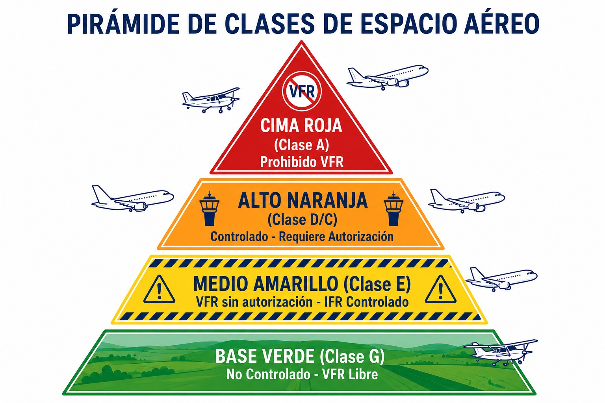

# Reglamentación de tránsito aéreo: estructura del espacio aéreo

> El cielo está dividido en "cajones" invisibles; saber en cuál estás es la clave para evitar infracciones y peligros.
>
>
> En este capítulo aprenderás:
>
>
> * Las clases de espacio aéreo: qué cambia entre el controlado (A-E) y el no controlado (G).
> * Cuándo necesitas autorización, radio y transponder para entrar.
> * Cómo operar en las zonas RMZ (radio obligatoria) y TMZ (transponder obligatorio).
> * Dónde está prohibido o es peligroso volar: las áreas P, R y D.

## El mapa de carreteras del cielo

El aire no es libre, o al menos no todo. Para ordenar el tráfico, el espacio aéreo se divide en **clases** (de la A a la G) y **zonas**. Saber dónde estás es vital para no infringir la ley ni ponerte en peligro.

## Espacio aéreo controlado vs no controlado

Esta es la gran división. En el **controlado** hay un ATC que te da autorizaciones y, según la clase, te separa de otros tráficos o sólo te informa de ellos: lo ves en la tabla de abajo. En el **no controlado** vas por tu cuenta, eso sí, con la radio a mano.

### Clases de espacio aéreo (SERA.6001)

La OACI define 7 clases, pero en España usamos principalmente las clases **A, C, D y E** (controladas) y la **G** (no controlada) (@fig-01-cap07-clases-espacio).

| Clase | Tipo | Requisitos para VFR (Planeadores) |
| --- | --- | --- |
| **A** | **Controlado** (Exclusivo IFR) | **PROHIBIDO VFR**. No puedes entrar. (Ej: Madrid TMA Area A). |
| **C** | **Controlado** | **Separación**: ATC te separa del IFR. De otros VFR solo recibes información de tráfico (y asesoramiento anticolisión si lo pides): **de los VFR te separas tú**. **Requisitos**: Autorización + Radio. |
| **D** | **Controlado** | **Separación**: ninguna para el VFR. ATC te da información de tráfico del IFR y de otros VFR, pero **ver y evitar es cosa tuya**. **Requisitos**: Autorización + Radio. |
| **E** | **Controlado** (Para IFR) | **Híbrido**: Controlado para IFR, "libre" para VFR. **VFR**: No necesitas autorización ni radio (aunque es muy recomendable). ATC no te separa de nadie, pero da información de tráfico si puede. |
| **G** | **NO Controlado** | **Libre**: Vuelas bajo tu responsabilidad. **Servicio**: Solo Información de Vuelo (FIS) si la pides. |
: Clases de espacio aéreo y requisitos VFR para planeadores

Ojo también con las autorizaciones: una autorización o una instrucción del ATC no te quita la responsabilidad de evitar una colisión (SERA.3201). Si no puedes cumplirla con seguridad, dilo de inmediato y pide otra.

El **transpondedor** no depende de la clase de espacio. En España es obligatorio, salvo las excepciones que conceda la Dirección General de Aviación Civil, en tres casos: a **FL145 o superior** (cuenta en los días de onda), dentro de los TMA de Madrid, Zaragoza, Sevilla, Barcelona, Palma, Valencia y Canarias a cualquier nivel, y en las **TMZ** (AIP España, ENR 1.6).

::: {.callout-note title="Airmanship"}
Aunque la normativa OACI define teóricamente las clases **B** y **F**, en la práctica no se utilizan para la aviación general o la formación en España. Por debajo de FL195 y fuera de TMA, CTR y aerovías, el espacio aéreo español es mayoritariamente Clase G; las clases A, C, D y E están en rutas y entornos aeroportuarios. Y por encima de FL195 todo es clase C (SERA.6001 b)).
:::

{#fig-01-cap07-clases-espacio}

## Zonas especiales: RMZ y TMZ

A veces el espacio es Clase G, libre, pero la autoridad quiere un poco de orden sin llegar a controlarlo todo. Para eso existen dos figuras:

* **RMZ** (**Radio Mandatory Zone**): zona, normalmente en espacio de clase E, F o G, donde es **obligatorio llevar radio y comunicar**. Antes de entrar debes hacer una llamada inicial: quién eres (indicativo y tipo), dónde estás (posición y nivel) y qué quieres (SERA.6005 a)).
* **TMZ** (**Transponder Mandatory Zone**): es obligatorio llevar y operar el **transponder** con las capacidades exigidas. La escucha o comunicación por radio solo es obligatoria si la zona también es RMZ o si así se publica.

::: {.callout-tip title="Regla de oro"}
Si ves una RMZ en el mapa, no entres mudo. Llama a la frecuencia indicada **antes de entrar** e informa: "Juliana Información, EC-OJE, planeador, cinco millas al norte de la RMZ, cuatro mil quinientos pies, entraré en la RMZ rumbo sur…​".
:::

## Zonas prohibidas, restringidas y peligrosas

El espacio aéreo puede tener "candados" por seguridad o defensa, marcados con códigos como LER71:

* **P** (**Prohibited**) - Prohibida: no se entra jamás. Piensa en el Palacio Real o en centrales nucleares.
* **R** (**Restricted**) - Restringida: entrada sujeta a condiciones, que son las que publica el AIP (ENR 5.1) para cada zona. Algunas se activan sólo a ratos; otras son permanentes y prohíben el sobrevuelo salvo excepciones, como **LER170**, el Parque Nacional de Monfragüe, desde el suelo hasta FL090.
* **D** (**Danger**) - Peligrosa: hay actividades peligrosas para el vuelo (pruebas, ejercicios aéreos, tiro). Lee sus observaciones en el AIP antes de entrar: algunas exigen coordinación previa, como **LED125**, que pide coordinar con la Base Aérea de Talavera. Y, en todo caso, mejor evítalas (@fig-01-cap07-zonas-prd).

{#fig-01-cap07-zonas-prd}

::: {.callout-warning title="Seguridad"}
Infringir una zona P o R activa puede llevar a sanciones graves e incluso a la interceptación por aviones militares. Planifica tu vuelo y comprueba los NOTAM para saber si las zonas R están activas. Las señales de interceptación y el procedimiento de respuesta (SERA.11015) se estudian en el Libro 4 (*Comunicaciones*), capítulo 6.
:::

::: {.postit}
**Resumen del capítulo: espacio aéreo**

El cielo está dividido en "cajones" con distintas reglas. No entres sin permiso donde no debes:

* **Clases controladas**: la clase A es solo IFR; en B, C y D el VFR necesita autorización ATC y comunicación bilateral —la B no se usa en España—; en E el VFR no necesita autorización ni radio obligatoria. La separación la garantiza ATC según la clase: IFR siempre, y puede incluir VFR en las clases más restrictivas.
* **Clase G (no controlada)**: vuelas bajo tu responsabilidad, con "ver y evitar". Puedes recibir servicio de información de vuelo (FIS) si está disponible y lo solicitas, pero nadie te separa.
* **Autorizaciones ATC**: una autorización o instrucción no elimina la responsabilidad del piloto al mando. Si no puedes cumplirla con seguridad, comunícalo de inmediato y coordina una alternativa segura.
* **Zonas especiales**: en una **RMZ** es obligatorio llevar radio y contactar; en una **TMZ**, llevar y operar el transponder según los requisitos publicados.
:::
