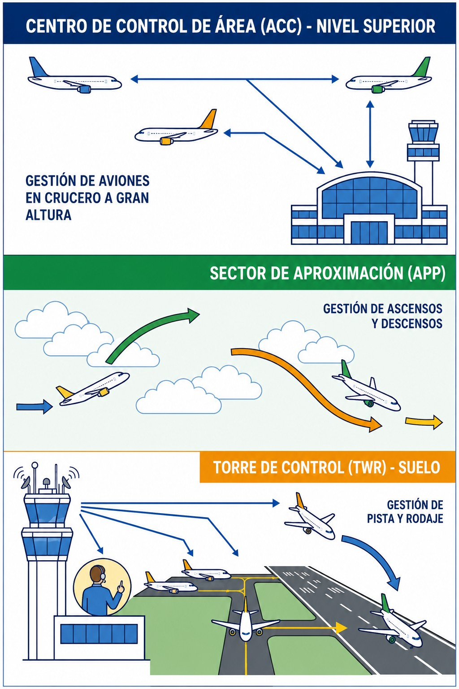
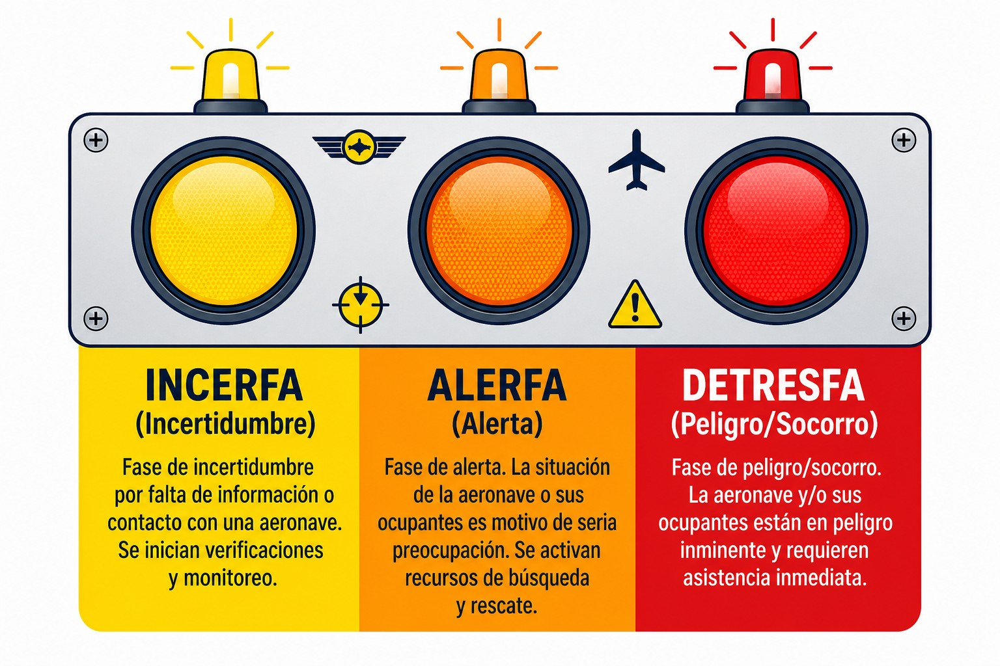

# Servicio de Tránsito Aéreo (

> Los Servicios de Tránsito Aéreo están para ayudarte, pero debes saber qué pedir: Control, Información o Alerta.
>
>
> En este capítulo aprenderás:
>
>
> * Los tres servicios ATS: Control (ATC), Información (FIS) y Alerta (ALRS).
> * Cuándo te separan ellos (ATC) y cuándo te separas tú (FIS).
> * El protocolo de búsqueda y salvamento: INCERFA, ALERFA y DETRESFA.

## ¿Para qué sirve el ATS?

El objetivo de los Servicios de Tránsito Aéreo (**ATS**, **Air Traffic Services**) va más allá de "vigilar". Según SERA.7001, sus misiones son prevenir colisiones (entre aeronaves y con obstáculos), acelerar y mantener ordenado el movimiento del tráfico, asesorar y dar información útil para la seguridad, y notificar y auxiliar en emergencias.

Para todo eso, el ATS se divide en tres servicios muy distintos entre sí. Saber cuál estás recibiendo en cada momento marca la diferencia.

## 1. Servicio de CONTROL (ATC)

El servicio de primera división. Su misión principal es **separar** aeronaves.

Lo prestan los controladores aéreos (ATCO), y de ellos recibes **autorizaciones** (instrucciones obligatorias) e información de tráfico. La responsabilidad de que no choques, bajo ciertas reglas, es del controlador.

Se organiza en tres dependencias según la fase de vuelo (@fig-01-cap08-dependencias-atc):

1. **Torre** (TWR): controla el aeródromo y el circuito (despegues, aterrizajes, rodaje).
2. **Aproximación** (APP): controla la entrada y salida de la zona del aeropuerto.
3. **Centro de Control de Área** (ACC): controla los aviones en ruta, arriba del todo.

{#fig-01-cap08-dependencias-atc}

## 2. Servicio de INFORMACIÓN DE VUELO (FIS)

Es lo que recibimos los planeadores la mayor parte del tiempo, en Clase G o E. Lo prestan controladores o técnicos de información (FISO), y lo que te dan es **asesoramiento e información**: si hay tráfico, qué tiempo hace, si hay áreas peligrosas activas…​

Aquí la responsabilidad es **tuya**. El FIS te avisa ("tráfico a las 12"), pero quien ve y evita eres tú. No te separan de nadie.

::: {.callout-note title="Airmanship"}
* **ATC**: "Vire rumbo 360 por tráfico". (Orden obligatoria, ellos te separan).
* **FIS**: "Tráfico convergiendo a su derecha". (Información, TÚ decides qué hacer para no chocar).
:::

## 3. Servicio de ALERTA (ALRS)

Tu seguro de vida. Se activa cuando hay una emergencia o se teme por la seguridad de una aeronave, y funciona en tres fases de preocupación creciente (@fig-01-cap08-fases-emergencia):

1. **INCERFA (Fase de Incertidumbre)**: el "¿dónde estará?". Se empieza a recabar información. Se declara reglamentariamente ante cualquiera de estas tres situaciones:
  
  * **Falta de comunicación**: no se ha recibido ninguna comunicación de la aeronave en los 30 minutos siguientes a la hora prevista, o desde el primer intento fallido de contactarla (lo que ocurra primero).
  * **Retraso en la llegada**: la aeronave no llega en los 30 minutos siguientes a su hora prevista de llegada (ETA).
  * **Dudas sobre la seguridad**: existen sospechas o dudas fundamentadas sobre la seguridad de la aeronave y sus ocupantes.
2. **ALERFA (Fase de Alerta)**: sigue sin haber noticias, o se sabe que hay problemas aunque no una catástrofe. Se avisa a los servicios de rescate (SAR) para que estén listos.
3. **DETRESFA (Fase de Peligro/Socorro)**: accidente confirmado, combustible agotado o situación crítica inminente. Salen los medios de rescate: helicópteros y aviones SAR.

{#fig-01-cap08-fases-emergencia}

::: {.callout-warning title="Seguridad"}
Si tienes una emergencia real y **NO** has presentado Plan de Vuelo ni estás en contacto radio, el Servicio de Alerta tardará mucho más en activarse (solo cuando tu familia avise de que no has vuelto). ¡Usa la radio y el Plan de Vuelo!
:::

Dos remisiones útiles dentro de la colección: las **señales luminosas** con las que una torre puede dirigirte sin radio se estudian en el **Libro 4 — Comunicaciones**, capítulo 7; y el **plan de vuelo**, que alimenta este servicio de alerta, en los Libros 4 (operativa), 7 (formulario) y 9 (uso de los ATS).

::: {.postit}
**Resumen del Capítulo: Servicios de Tránsito Aéreo (ATS)**

El ATS te ofrece tres tipos de ayuda:

* **Control (ATC)**: te dan órdenes (autorizaciones) para separarte de otros aviones. Son la TWR, la APP y el ACC, y solo opera en espacio aéreo controlado.
* **Información de vuelo (FIS)**: te dan información útil (meteo, peligros, tráficos cercanos), pero el responsable de evitar colisiones eres tú. "Información de tráfico" no es "separación".
* **Alerta (ALRS)**: avisa a búsqueda y salvamento (SAR) si no llegas a tiempo o tienes una emergencia.
:::

