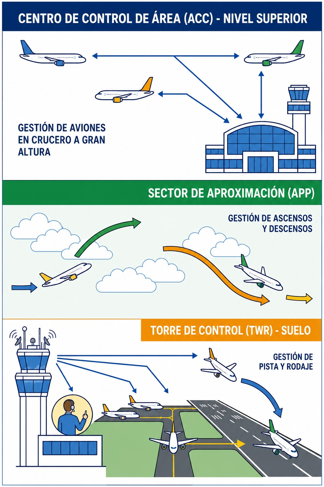
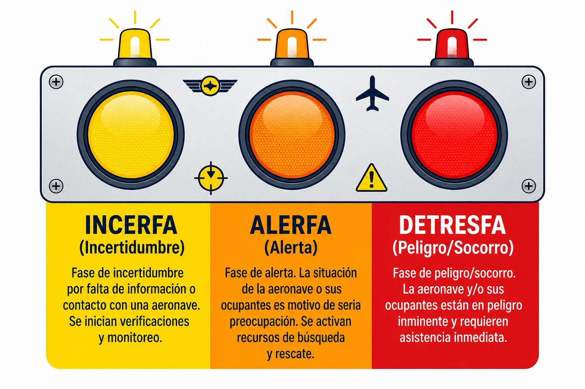

# Servicio de tránsito aéreo (ATS) y gestión del tránsito aéreo (ATM)

> Los Servicios de Tránsito Aéreo están para ayudarte, pero debes saber qué pedir: Control, Información o Alerta. Y por encima de ellos hay un sistema mayor que decide qué espacio aéreo tienes disponible cada día.
>
>
> En este capítulo aprenderás:
>
>
> * Los tres servicios ATS: Control (ATC), Información (FIS) y Alerta (ALRS).
> * Cuándo te separa el ATC, y de quién según la clase de espacio, y cuándo te separas tú.
> * El protocolo de búsqueda y salvamento: INCERFA, ALERFA y DETRESFA.
> * Qué es la gestión del tránsito aéreo (ATM) y por qué el espacio aéreo que ves en la carta no es el que tendrás mañana.

## ¿Para qué sirve el ATS?

El objetivo de los Servicios de Tránsito Aéreo (**ATS**, **Air Traffic Services**) va más allá de "vigilar". Según SERA.7001, sus misiones son prevenir colisiones (entre aeronaves y con obstáculos), acelerar y mantener ordenado el movimiento del tráfico, asesorar y dar información útil para la seguridad, y notificar y auxiliar en emergencias.

Para todo eso, el ATS se divide en tres servicios muy distintos entre sí. Saber cuál estás recibiendo en cada momento marca la diferencia.

## 1. Servicio de control (ATC)

El servicio de primera división. Su misión principal es **separar** aeronaves.

Lo prestan los controladores aéreos (ATCO), y de ellos recibes **autorizaciones** e **instrucciones**, además de información de tráfico. A quién separan depende de la clase de espacio: en clase C, al VFR sólo lo separan del IFR; en clase D no lo separan de nadie, y de los otros VFR te separas tú. Y en cualquier clase, evitar la colisión sigue siendo responsabilidad del piloto al mando (SERA.3201).

Se organiza en tres dependencias según la fase de vuelo (@fig-01-cap08-dependencias-atc):

1. **Torre** (TWR): controla el aeródromo y el circuito (despegues, aterrizajes, rodaje).
2. **Aproximación** (APP): controla la entrada y salida de la zona del aeropuerto.
3. **Centro de Control de Área** (ACC): controla los vuelos en ruta.

En España, el ACC presta además el servicio de información de vuelo en ruta (en Canarias, fuera del espacio controlado, lo hace el centro de información de vuelo, FIC). Y en algunos aeródromos no controlados hay un **AFIS** (servicio de información de vuelo de aeródromo), con su zona de información de vuelo (**FIZ**): te da información y alerta, pero ni te autoriza ni te separa (AIP España, GEN 3.3).

{#fig-01-cap08-dependencias-atc}

## 2. Servicio de información de vuelo (FIS)

Es lo que recibimos los planeadores la mayor parte del tiempo, en Clase G o E. Lo prestan controladores o técnicos de información (FISO), y lo que te dan es **asesoramiento e información**: si hay tráfico, qué tiempo hace, si hay áreas peligrosas activas…​

Aquí la responsabilidad es **tuya**. El FIS te avisa ("tráfico a las 12"), pero quien ve y evita eres tú. No te separan de nadie.

::: {.callout-note title="Airmanship"}
* **ATC**: "Vire rumbo 360 por tráfico". (Instrucción obligatoria: la cumples, pero ver y evitar sigue siendo cosa tuya).
* **FIS**: "Tráfico convergiendo a su derecha". (Información, TÚ decides qué hacer para no chocar).
:::

## 3. Servicio de alerta (ALRS)

Tu seguro de vida. Se activa cuando hay una emergencia o se teme por la seguridad de una aeronave, y funciona en tres fases de preocupación creciente (@fig-01-cap08-fases-emergencia):

1. **INCERFA (Fase de incertidumbre)**: existe incertidumbre sobre la seguridad de la aeronave y sus ocupantes, y se empieza a recabar información. Se declara en dos situaciones:
  
  * **Falta de comunicación**: no se ha recibido ninguna comunicación de la aeronave en los 30 minutos siguientes al momento en que debería haberse recibido, o desde el primer intento fallido de contactarla (lo que ocurra primero).
  * **Retraso en la llegada**: la aeronave no llega en los 30 minutos siguientes a su última hora prevista de llegada, la notificada o la estimada por los servicios de tránsito aéreo (la que sea posterior).

  No se declara si no existe ninguna duda sobre la seguridad de la aeronave.
2. **ALERFA (Fase de alerta)**: la preocupación aumenta. Se declara, por ejemplo, si tras la fase de incertidumbre sigue sin haber noticias de la aeronave; si, autorizada a aterrizar, no lo ha hecho 5 minutos después de la hora prevista y no se ha restablecido el contacto; o si se sabe que su eficiencia operativa está afectada, aunque no tanto como para que sea probable un aterrizaje forzoso.
3. **DETRESFA (Fase de peligro)**: existe certeza razonable de que la aeronave y sus ocupantes están amenazados por un peligro grave e inminente o necesitan asistencia inmediata; por ejemplo, porque se sabe que ha realizado o va a realizar un aterrizaje forzoso. Salen los medios de rescate: helicópteros y aviones SAR.

Desde la primera fase, la dependencia de tránsito aéreo informa al centro coordinador de salvamento (RCC), que no espera a la alerta para empezar a trabajar (Reglamento de Ejecución (UE) 2017/373, ATS.TR.405).

{#fig-01-cap08-fases-emergencia}

::: {.callout-warning title="Seguridad"}
Si tienes una emergencia real y **NO** has presentado Plan de Vuelo ni estás en contacto radio, el Servicio de Alerta tardará mucho más en activarse (solo cuando tu familia avise de que no has vuelto). ¡Usa la radio y el Plan de Vuelo!
:::

Dos remisiones útiles dentro de la colección: las **señales luminosas** con las que una torre puede dirigirte sin radio se estudian en el **Libro 4 — Comunicaciones**, capítulo 5; y el **plan de vuelo**, que alimenta este servicio de alerta, en los Libros 4 — Comunicaciones (operativa), 7 — Planificación y Rendimiento de Vuelo (formulario) y 9 — Navegación (uso de los ATS).

## La gestión del tránsito aéreo (ATM)

El ATS es la parte del sistema que te habla por radio. Pero por encima hay algo más grande: la **Gestión del Tránsito Aéreo** (**ATM**), que administra a la vez el tráfico y el espacio por el que vuela. Son tres patas:

* **ATS**: los tres servicios que acabas de ver. La que te atiende.
* **ASM**: la gestión del espacio aéreo. Decide qué espacio hay disponible, para quién y cuándo.
* **ATFM**: la gestión de afluencia. Ajusta el número de aviones a lo que el sistema puede tragar.

De las tres, la que te toca de cerca es la segunda.

Durante décadas, el espacio militar era militar los siete días de la semana, se usara o no. Hoy rige el **uso flexible del espacio aéreo** (**FUA**): el espacio es un recurso único que se reparte cada día según quién lo necesite de verdad. Una célula de gestión decide por la tarde qué zonas se activan mañana y cuáles se liberan, y lo publica.

De ahí salen zonas que existen sólo a ratos: las **TSA** y las **TRA**, reservadas por horas. Y rutas que sólo están abiertas cuando la zona que cruzan queda libre: las **CDR**.

::: {.callout-tip title="Regla de oro"}
La carta te dice dónde está una zona. Nunca si hoy está activa. Eso lo dicen los NOTAM y la publicación diaria del espacio aéreo, y se mira en la preparación del vuelo, no en el aire.
:::

La afluencia es otra historia y apenas te afecta. Cuando hay más aviones que capacidad, el sistema reparte la escasez con **slots**: horas de despegue asignadas que retienen al avión en tierra en vez de amontonarlo en el aire. Es cosa del tráfico IFR con plan de vuelo. Un planeador en VFR por Clase G ni los recibe ni los necesita; como mucho, explica por qué un aeródromo con tráfico comercial te hace esperar.

::: {.callout-important title="Normativa"}
El uso flexible del espacio aéreo lo establece el **Reglamento (CE) n.º 2150/2005**, que fija las normas comunes para repartirlo en la Unión Europea.
:::

::: {.callout-note title="Airmanship"}
El espacio aéreo del que dispones hoy no es el de ayer. Repetir la travesía de la semana pasada sin mirar otra vez qué zonas están activas es volar con una foto vieja.
:::

::: {.postit}
**Resumen del capítulo: servicios de tránsito aéreo (ATS) y gestión del tránsito aéreo (ATM)**

El ATS te ofrece tres tipos de ayuda:

* **Control (ATC)**: te dan autorizaciones e instrucciones obligatorias y, según la clase de espacio, te separan de otros tráficos: en clase C, al VFR sólo del IFR; en clase D, de nadie. Son la TWR, la APP y el ACC, y solo opera en espacio aéreo controlado.
* **Información de vuelo (FIS)**: te dan información útil (meteo, peligros, tráficos cercanos), pero el responsable de evitar colisiones eres tú. "Información de tráfico" no es "separación".
* **Alerta (ALRS)**: avisa a búsqueda y salvamento (SAR) si no llegas a tiempo o tienes una emergencia.

Y el ATS es sólo una de las tres patas del **ATM**:

* **ATM = ATS + ASM + ATFM**: los servicios que te atienden, la gestión del espacio aéreo y la de afluencia.
* **Uso flexible (FUA)**: el espacio se reparte cada día, no de una vez para siempre. Hay zonas que existen sólo a ratos (TSA, TRA) y rutas abiertas sólo cuando aquellas se liberan (CDR).
* **Lo que te toca a ti**: la carta dice dónde está una zona; los NOTAM dicen si hoy está activa. Los *slots* del ATFM son cosa del tráfico IFR: a un planeador en Clase G no le afectan.
:::
