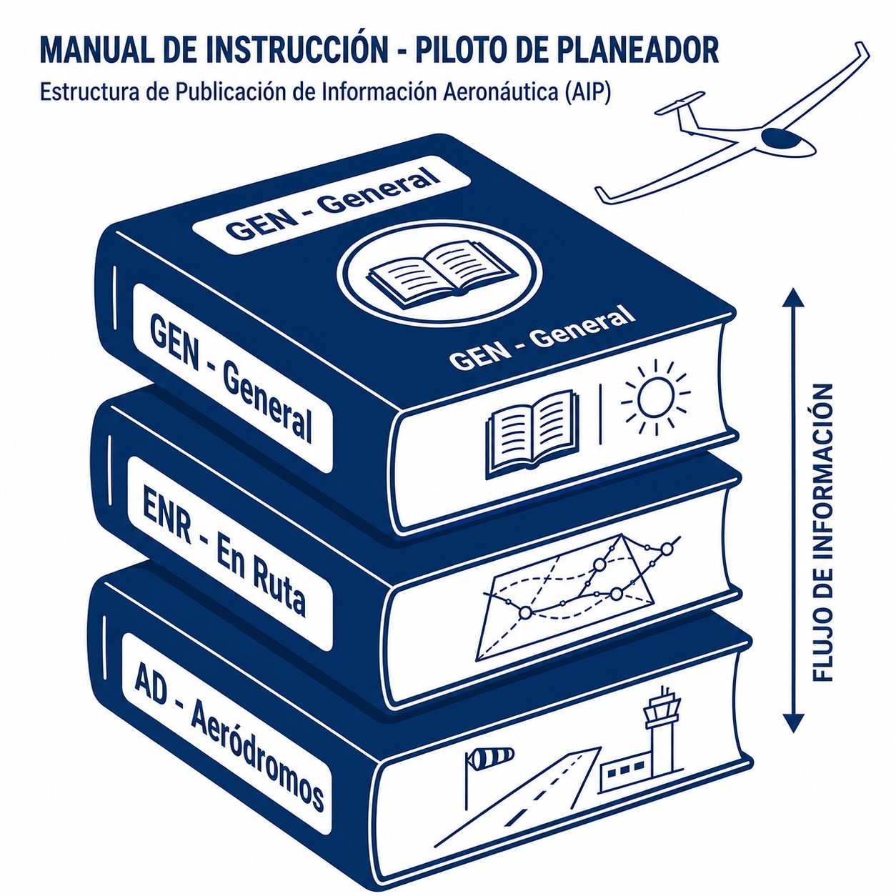

# Servicios de información aeronáutica (AIS)

> La información es seguridad; un piloto que ignora los NOTAM es un piloto que vuela a ciegas hacia el peligro.
>
>
> En este capítulo aprenderás:
>
>
> * Las fuentes de información: AIP (permanente), sus suplementos SUP (temporales y largos), NOTAM (urgente) y AIC (informativo).
> * El deber legal del piloto de consultar la información disponible antes del vuelo.
> * Dónde consultar todo esto, y cómo ver los NOTAM y las restricciones sobre el mapa.

## La información es seguridad

Antes de despegar, el piloto debe "familiarizarse con toda la información disponible". No es un consejo: es una **obligación legal** (SERA.2010). Para que puedas cumplirla, los estados prestan los Servicios de Información Aeronáutica (**AIS**).

En España, el proveedor principal es **ENAIRE**, y todo se agrupa en la "Documentación integrada de información aeronáutica" (IAIP).

## El manual AIP (Publicación de Información Aeronáutica)

El **AIP** es la "biblia" de la aviación de un país: contiene la información permanente esencial para navegar, organizada en tres partes (@fig-01-cap09-estructura-aip):

1. **GEN (Generalidades)**: reglamentos, señales de socorro, tablas de conversión, salida y puesta de sol, servicios disponibles.
2. **ENR (En Ruta)**: estructura del espacio aéreo (vías aéreas, zonas prohibidas y restringidas), radioayudas, alertas para la navegación.
3. **AD (Aeródromos)**: datos detallados de cada aeropuerto: pistas, frecuencias, horarios, mapas de aproximación y rodaje.

{#fig-01-cap09-estructura-aip}

### El ciclo AIRAC

El AIP no cambia cada día. Las actualizaciones importantes y previsibles (nuevas rutas, frecuencias) se publican siguiendo el sistema **AIRAC** (Reglamentación y Control de la Información Aeronáutica), que garantiza que los cambios llegan a todos con antelación suficiente antes de entrar en vigor: entran en vigor en fechas comunes, cada **28 días**, y ENAIRE los distribuye con 42 días de antelación para que lleguen al menos 28 días antes (AIP España, GEN 3.1).

### Suplementos al AIP (SUP)

Cuando un cambio es temporal pero largo —tres meses o más— o necesita textos extensos o gráficos, no va en un NOTAM: se publica como **suplemento al AIP** (**SUP**), en páginas amarillas, o rosas si sigue el ciclo AIRAC. En vuelo a vela son frecuentes: zonas temporales para un campeonato, cambios en un aeródromo durante unas obras. Consulta los SUP en vigor junto con el AIP.

## Noticias urgentes: NOTAM (Notice to airmen)

Hay cosas que no pueden esperar al ciclo AIRAC: una grúa en final de pista, un VOR inoperativo, un festival aéreo el sábado…​ Para eso existen los **NOTAM**: avisos temporales (generalmente de 3 meses como máximo) sobre el establecimiento, estado o modificación de cualquier instalación, servicio o procedimiento aeronáutico, o sobre un peligro para la navegación.

Cada NOTAM tiene sus campos (@fig-01-cap09-ejemplo-notam). Los que más vas a mirar son el **A**, el aeródromo o la región afectados; el **B** y el **C**, el inicio y el final de la validez, con el año, el mes, el día, la hora y los minutos en UTC (2310250800 es el 25 de octubre de 2023 a las 08:00 UTC); y el **E**, el texto del aviso.

{#fig-01-cap09-ejemplo-notam .corregir}

Consultar los NOTAM de tu aeródromo de salida, destino, alternativos y la ruta antes de **cada** vuelo es obligatorio. En la práctica no se leen sueltos: se piden agrupados en un **boletín de información previa al vuelo** (**PIB**) para tu ruta y tus aeródromos, que es lo que te entrega ICARO.

## Circulares de Información Aeronáutica (AIC)

Son avisos que no justifican un NOTAM (no afectan a la operación de forma urgente y directa) pero conviene conocer: asuntos administrativos como nuevas tasas, recomendaciones de seguridad estacionales, prevención de engelamiento o explicaciones técnicas.

::: {.callout-tip title="Regla de oro"}
En España, puedes consultar todo esto gratis en los portales **ICARO** e **Insignia** de ENAIRE. Insignia es una herramienta visual fantástica para ver los NOTAM sobre el mapa. Acostúmbrate a usarla.
:::

::: {.postit}
**Resumen del capítulo: servicio de información aeronáutica (AIS)**

La información es seguridad. Tus fuentes:

* **AIP**: el "manual gordo" y permanente. Mapas, frecuencias, zonas peligrosas, horarios de aeropuertos. Es la base.
* **SUP**: suplementos al AIP para cambios temporales largos (tres meses o más). Se consultan junto con el AIP.
* **NOTAM**: la actualidad. Avisos temporales urgentes (una pista cerrada, un festival aéreo, una restricción temporal). Consultarlos antes de cada vuelo es obligatorio.
* **AIC**: circulares informativas sobre seguridad y cambios administrativos.
:::
