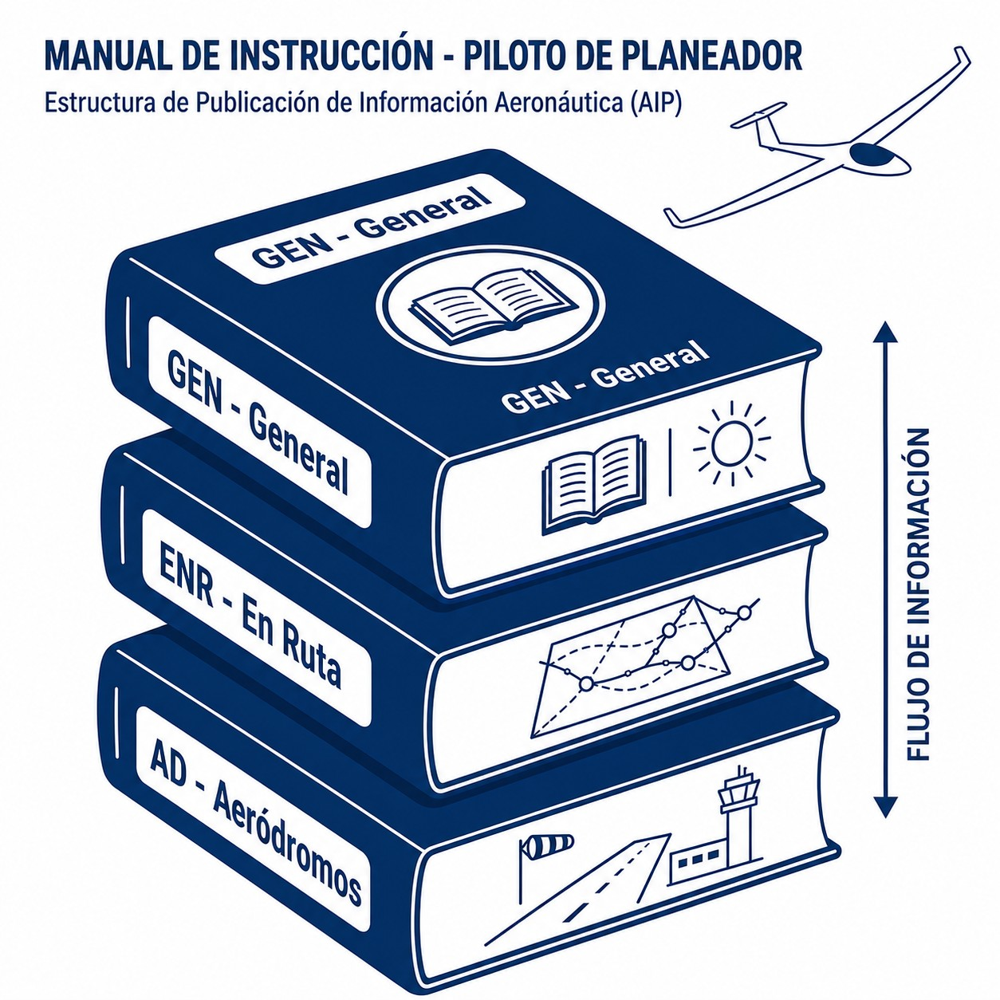
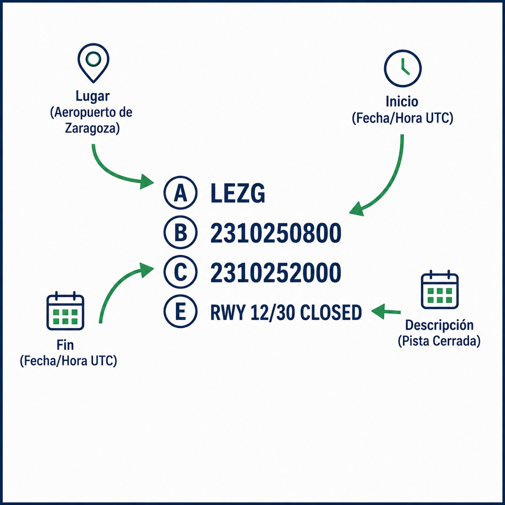

# Servicios de Información Aeronáutica (AIS)

La información es seguridad; un piloto que ignora los NOTAM es un piloto que vuela a ciegas hacia el peligro.

En este capítulo aprenderás:

* Las tres fuentes de información: AIP
  AIP (Publicación de Información Aeronáutica)
   (permanente), NOTAM (urgente) y AIC (informativo).
* El deber legal del piloto de consultar la información disponible antes del vuelo.
* Cómo usar ENAIRE Insignia para ver las restricciones sobre el mapa.

## La información es seguridad

Antes de despegar, el piloto debe "familiarizarse con toda la información disponible". No es un consejo: es una **obligación legal** (SERA.2010). Para que puedas cumplirla, los estados prestan los Servicios de Información Aeronáutica (**AIS**).

En España, el proveedor principal es **ENAIRE**, y todo se agrupa en el "Paquete de Información Aeronáutica Integrada" (IAIP).

## El manual AIP (Publicación de Información Aeronáutica)

El **AIP** es la "biblia" de la aviación de un país: contiene la información permanente esencial para navegar, organizada en tres volúmenes ():

1. **GEN (Generalidades)**: reglamentos, señales de socorro, tablas de conversión, salida y puesta de sol, servicios disponibles.
2. **ENR (En Ruta)**: estructura del espacio aéreo (vías aéreas, zonas prohibidas y restringidas), radioayudas, alertas para la navegación.
3. **AD (Aeródromos)**: datos detallados de cada aeropuerto: pistas, frecuencias, horarios, mapas de aproximación y rodaje.

{#fig-01-cap09-estructura-aip}

### El ciclo AIRAC

El AIP no cambia cada día. Las actualizaciones importantes y previsibles (nuevas rutas, frecuencias) se publican siguiendo el sistema **AIRAC** (Reglamentación y Control de Información Aeronáutica), que garantiza que los cambios llegan a todos con antelación suficiente antes de entrar en vigor.

## Noticias urgentes: NOTAM (Notice To AirMen)

{#fig-01-cap09-ejemplo-notam}

Hay cosas que no pueden esperar al ciclo AIRAC: una grúa en final de pista, un VOR inoperativo, un festival aéreo el sábado…​ Para eso existen los **NOTAM**: avisos temporales (generalmente de 3 meses como máximo) sobre el establecimiento, estado o modificación de cualquier instalación, servicio o procedimiento aeronáutico, o sobre un peligro para la navegación ().

Consultar los NOTAM de tu aeródromo de salida, destino, alternativos y la ruta antes de **cada** vuelo es obligatorio.

## Circulares de Información Aeronáutica (AIC)

Son avisos que no justifican un NOTAM (no afectan a la operación de forma urgente y directa) pero conviene conocer: asuntos administrativos como nuevas tasas, recomendaciones de seguridad estacionales, prevención de engelamiento o explicaciones técnicas.

✦ **REGLA DE ORO**

En España, puedes consultar todo esto gratis en los portales **ICARO** e **Insignia** de ENAIRE. Insignia es una herramienta visual fantástica para ver NOTAMs sobre el mapa. Acostúmbrate a usarla.

 

**Resumen del Capítulo: Servicio de Información Aeronáutica (AIS)**

La información es seguridad. Tus fuentes:

* **AIP**: el "manual gordo" y permanente. Mapas, frecuencias, zonas peligrosas, horarios de aeropuertos. Es la base.
* **NOTAM**: la actualidad. Avisos temporales urgentes (una pista cerrada, un festival aéreo, una restricción temporal). Consultarlos antes de cada vuelo es obligatorio.
* **AIC**: circulares informativas sobre seguridad y cambios administrativos.
