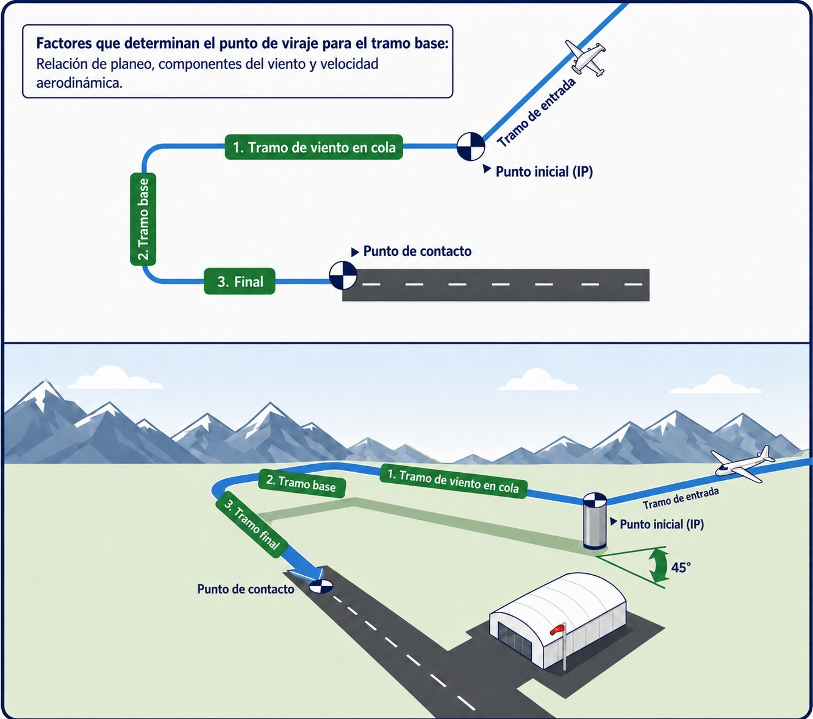
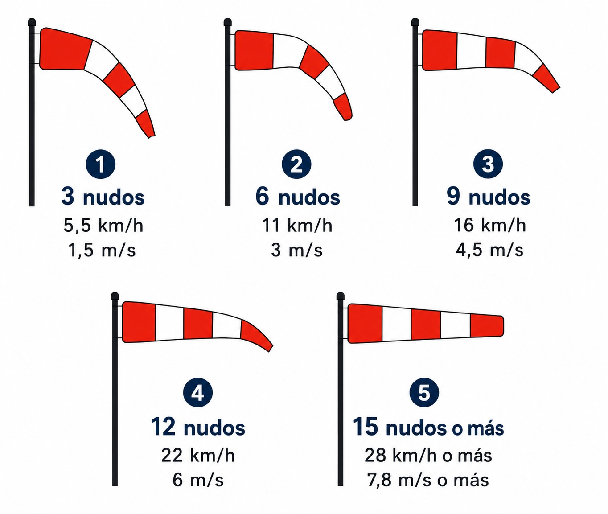
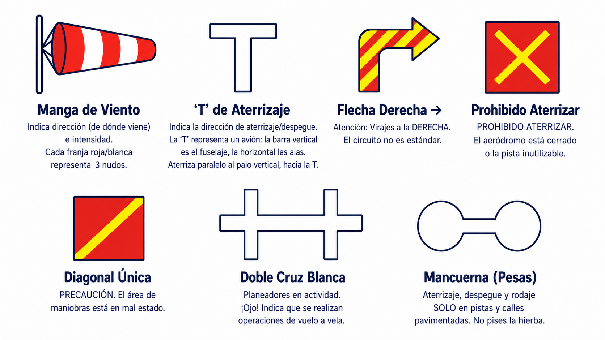

# Aeródromos y campos de despegue externos

> En el circuito de tránsito, las reglas visuales reinan supremas; aprende a leer las señales del suelo cuando la radio calla.
>
>
> En este capítulo aprenderás:
>
>
> * El circuito de tránsito: sus fases (viento en cola, base, final) y el sentido de viraje.
> * El área de señales: la "T" de aterrizaje, la manga de viento y los símbolos de prohibición en el suelo.
> * Normas básicas para moverse por el aeródromo con seguridad.

## El aeródromo: territorio de reglas visuales

Un aeródromo es mucho más que una pista. Es un sistema organizado para que aviones rápidos y planeadores lentos convivan sin chocar, y se apoya en dos pilares: el **circuito de tránsito** y las **señales visuales**.

## El circuito de tránsito (Traffic Pattern)

Para ordenar el tráfico, todos volamos un rectángulo imaginario alrededor de la pista. Los virajes se hacen a la **izquierda** salvo que se indique lo contrario (@fig-01-cap10-circuito-transito). En planeador, el tramo de viento en cola suele volarse a unos **200-300 metros AGL**, y lo ideal es incorporarse al circuito a 45º de ese tramo.

### Fases clave para el planeador

1. **Viento en cola** (**downwind**): vuelas paralelo a la pista, en sentido contrario al aterrizaje. Aquí va el chequeo pre-aterrizaje.
2. **Tramo base**: viras 90º hacia la pista y haces el último ajuste de altura y velocidad. Altura mínima de inicio: 150 m.
3. **Final**: enfilado a pista, con frenos fuera.

{#fig-01-cap10-circuito-transito}

## El área de señales

{#fig-01-cap10-manga-viento}

Si no tienes radio (o te falla), el suelo te habla. Las **señales luminosas** que la torre puede dirigirte con lámpara se estudian en el **Libro 4 — Comunicaciones**, capítulo 7 (fallo de comunicaciones); las del suelo las tienes aquí. En el **área de señales**, un cuadrado bordeado de blanco cerca de la torre o la pista, encontrarás símbolos vitales (@fig-01-cap10-area-senales):

| Señal | Significado |
| --- | --- |
| **Manga de Viento** | Indica dirección (de dónde viene) e intensidad. (Cada franja roja/blanca suele estimar unos 3 nudos, 5,5 km/h). |
| **'T' de Aterrizaje** | Indica la dirección de aterrizaje/despegue. La 'T' representa un avión: la barra vertical es el fuselaje, la horizontal las alas. **Aterriza paralelo al palo vertical, hacia la T**. |
| **Flecha Derecha** | → **Atención**: Virajes a la **DERECHA**. El circuito no es estándar. |
| **Cruz Roja con Diagonales** | (Cuadrado rojo con aspa amarilla). **PROHIBIDO ATERRIZAR**. El aeródromo está cerrado o la pista inutilizable. |
| **Diagonal Única** | (Cuadrado rojo con una diagonal amarilla). **PRECAUCIÓN**. El área de maniobras está en mal estado. |
| **Doble Cruz Blanca** | **Planeadores en actividad**. ¡Ojo! Indica que se realizan operaciones de vuelo a vela. |
| **Mancuerna (Pesas)** | (Blanca). Aterrizaje, despegue y rodaje **SOLO en pistas y calles pavimentadas**. No pises la hierba. |
: Señales visuales de aeródromo

{#fig-01-cap10-area-senales}

::: {.callout-tip title="Regla de oro"}
Antes de despegar o al llegar a un campo nuevo, **busca siempre el área de señales**. Te dará información (pista en uso y sentido de giro) de un solo vistazo, incluso sin radio.
:::

## Campos de despegue externos y tomas fuera de aeródromo

El vuelo a vela no siempre empieza ni termina en un aeródromo. El syllabus incluye los **campos de despegue externos** —terrenos no certificados desde los que se opera ocasionalmente— y, por la propia naturaleza del planeador, las **tomas fuera de campo**. Su técnica se estudia en el **Libro 6 — Procedimientos operativos**, capítulo 5; aquí interesa su cara legal:

* **Permiso del propietario del terreno**: despegar desde un campo externo exige el consentimiento previo de quien tiene la disponibilidad del terreno, además de cumplir las condiciones que fije la normativa nacional para vuelos fuera de aeródromo.
* **Responsabilidad del piloto al mando**: eres responsable de verificar que el terreno es adecuado y la operación segura (dimensiones, obstáculos, personas ajenas). Un campo externo no tiene área de señales, ni servicio de información, ni nadie que haya inspeccionado la superficie por ti.
* **Tras una toma fuera de campo**: la aeronave puede haber causado daños (cultivos, cercados) de los que respondes civilmente; el seguro obligatorio de responsabilidad civil cubre precisamente estos supuestos. Localiza al propietario, documenta el estado del terreno y acuerda la retirada del planeador — la parte operativa y de trato con el propietario se desarrolla en el Libro 6.

::: {.postit}
**Resumen del capítulo: aeródromos**

En tierra, las reglas visuales mandan:

* **Circuito de tránsito**: virajes a la **izquierda**, salvo señal en contrario.
* **Área de señales**: la manga de viento indica dirección e intensidad; la T tumbada, la dirección de aterrizaje y despegue; la flecha derecha avisa de virajes a la derecha; la cruz roja con diagonales amarillas prohíbe aterrizar; el panel rojo con una sola diagonal pide precaución por mal estado del área de maniobras; y la doble cruz blanca anuncia planeadores en actividad.
:::
