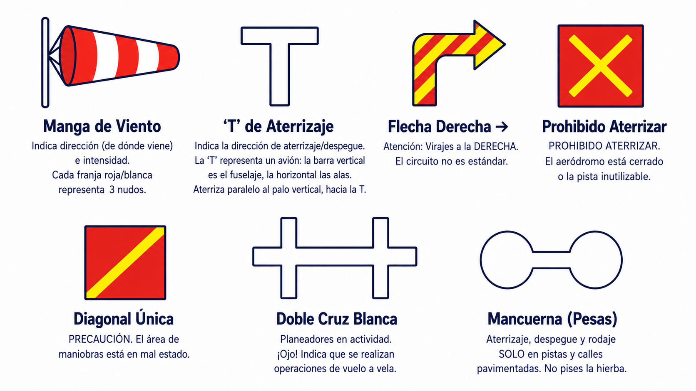

# Aeródromos y campos de despegue externos

> En el circuito de tránsito, las reglas visuales reinan supremas; aprende a leer las señales del suelo cuando la radio calla.
>
>
> En este capítulo aprenderás:
>
>
> * El circuito de tránsito: sus fases (viento en cola, base, final) y el sentido de viraje.
> * El área de señales: la "T" de aterrizaje, la manga de viento y los símbolos de prohibición en el suelo.
> * La cara legal de los campos externos y de las tomas fuera de campo.

## El aeródromo: territorio de reglas visuales

Un aeródromo es mucho más que una pista. Es un sistema organizado para que aviones rápidos y planeadores lentos convivan sin chocar, y se apoya en dos pilares: el **circuito de tránsito** y las **señales visuales**.

## El circuito de tránsito (Traffic Pattern)

Para ordenar el tráfico, todos volamos un rectángulo imaginario alrededor de la pista. Los virajes se hacen a la **izquierda** salvo que se indique lo contrario (@fig-01-cap10-circuito-transito). En planeador, el tramo de viento en cola suele volarse a unos **200-300 metros AGL**, y lo ideal es incorporarse al circuito a 45º de ese tramo.

### Fases clave para el planeador

1. **Viento en cola** (**downwind**): vuelas paralelo a la pista, en sentido contrario al aterrizaje. Aquí va el chequeo pre-aterrizaje.
2. **Tramo base**: viras 90º hacia la pista y haces el último ajuste de altura y velocidad. Referencia habitual para iniciarlo: unos 150 m (es un criterio de instrucción, no un mínimo legal; ver el Libro 6, capítulo 4).
3. **Final**: enfilado a pista, con frenos fuera.

{#fig-01-cap10-circuito-transito}

## El área de señales

{#fig-01-cap10-manga-viento}

Si no tienes radio (o te falla), el suelo te habla. Las **señales luminosas** que la torre puede dirigirte con lámpara se estudian en el **Libro 4 — Comunicaciones**, capítulo 5 (fallo de comunicaciones); las del suelo las tienes aquí. En el **área de señales**, un cuadrado bordeado de blanco cerca de la torre o la pista, encontrarás símbolos vitales (@fig-01-cap10-area-senales):

| Señal | Significado |
| --- | --- |
| **Manga de Viento** | Indica dirección (de dónde viene) e intensidad. (Cada franja roja/blanca suele estimar unos 3 nudos, 5,5 km/h). |
| **'T' de Aterrizaje** | Indica la dirección de aterrizaje/despegue. La 'T' representa un avión: la barra vertical es el fuselaje, la horizontal las alas. **Aterriza paralelo al palo vertical, hacia el travesaño** (la barra horizontal). |
| **Flecha Derecha** | → **Atención**: Virajes a la **DERECHA**. El circuito no es estándar. |
| **Cruz Roja con Diagonales** | (Cuadrado rojo con aspa amarilla). **PROHIBIDO ATERRIZAR**, y la prohibición puede prolongarse. |
| **Diagonal Única** | (Cuadrado rojo con una diagonal amarilla). **PRECAUCIÓN** en la aproximación y el aterrizaje, por el mal estado del área de maniobras o por cualquier otra razón. |
| **Doble Cruz Blanca** | **Planeadores en actividad**. ¡Ojo! Indica que se realizan operaciones de vuelo a vela. |
| **Mancuerna (Pesas)** | (Blanca). Aterrizaje, despegue y rodaje **solo en las pistas y calles de rodaje**, que pueden ser de hierba. |
| **Mancuerna con barras negras** | (Blanca, con una barra negra en cada círculo). Aterrizaje y despegue **solo en las pistas**; el resto de maniobras, libre. |
| **Cruces sobre pista o calle de rodaje** | (Blancas en las pistas, amarillas en las calles de rodaje). Esa zona **no se puede usar**. |
| **Dos cifras en la torre** | Dirección de despegue, en decenas de grados magnéticos (p. ej., 27 = 270°). |
| **Letra C** | (Negra sobre fondo amarillo). Oficina de notificación de los servicios de tránsito aéreo. |
: Señales visuales de aeródromo (SERA, apéndice 1, 3.2)

{#fig-01-cap10-area-senales}

::: {.callout-tip title="Regla de oro"}
Antes de despegar o al llegar a un campo nuevo, **busca siempre el área de señales**. Te dará información (pista en uso y sentido de giro) de un solo vistazo, incluso sin radio.
:::

## Campos de despegue externos y tomas fuera de aeródromo

El vuelo a vela no siempre empieza ni termina en un aeródromo. El syllabus incluye los **campos de despegue externos** —terrenos no certificados desde los que se opera ocasionalmente— y, por la propia naturaleza del planeador, las **tomas fuera de campo**. Su técnica se estudia en el **Libro 6 — Procedimientos operativos**, capítulo 5; aquí interesa su cara legal:

* **Un lugar adecuado**: Part-SAO llama *lugar de operación* (**operating site**) a cualquier sitio distinto de un aeródromo que el piloto al mando elige para despegar o aterrizar, y le exige que sea adecuado para el planeador y la operación (SAO.OP.100). Eres tú quien lo comprueba: dimensiones, obstáculos, personas ajenas. Un campo externo no tiene área de señales, ni servicio de información, ni nadie que haya inspeccionado la superficie por ti.
* **El uso ocasional de un terreno**: en España, un terreno que se usa como aeródromo de forma ocasional —no más de 40 operaciones al año ni 15 al mes— es un **aeródromo eventual** (Real Decreto 1189/2011). Lo autoriza la comunidad autónoma; si está en una zona controlada, restringida o peligrosa, hace falta además un informe de compatibilidad con el espacio aéreo, y si no, basta con comunicar a AESA dónde está y cuándo se usará.
* **Permiso del propietario del terreno**: despegar desde un campo externo exige el consentimiento previo de quien tiene la disponibilidad del terreno.
* **Tras una toma fuera de campo**: si habías presentado un plan de vuelo, da aviso de llegada cuanto antes a la dependencia de tránsito aéreo que corresponda, para que no se active el servicio de alerta (SERA.4020; ver el **Libro 7**, capítulo 4). La aeronave puede haber causado daños (cultivos, cercados) de los que responde quien opera el planeador, tú o tu club; el seguro obligatorio de responsabilidad civil frente a terceros cubre estos supuestos (Reglamento (CE) 785/2004). Localiza al propietario, documenta el estado del terreno y acuerda la retirada del planeador; la parte operativa y de trato con el propietario se desarrolla en el **Libro 6 — Procedimientos Operativos**.

::: {.postit}
**Resumen del capítulo: aeródromos**

En tierra, las reglas visuales mandan:

* **Circuito de tránsito**: virajes a la **izquierda**, salvo señal en contrario.
* **Área de señales**: la manga de viento indica dirección e intensidad; la T tumbada, la dirección de aterrizaje y despegue; la flecha derecha avisa de virajes a la derecha; la cruz roja con diagonales amarillas prohíbe aterrizar; el panel rojo con una sola diagonal pide precaución por mal estado del área de maniobras; y la doble cruz blanca anuncia planeadores en actividad.
* **Campos externos**: el piloto al mando elige un lugar adecuado (SAO.OP.100) y necesita el permiso del propietario; tras una toma fuera de campo con plan de vuelo, avisa de tu llegada.
:::
