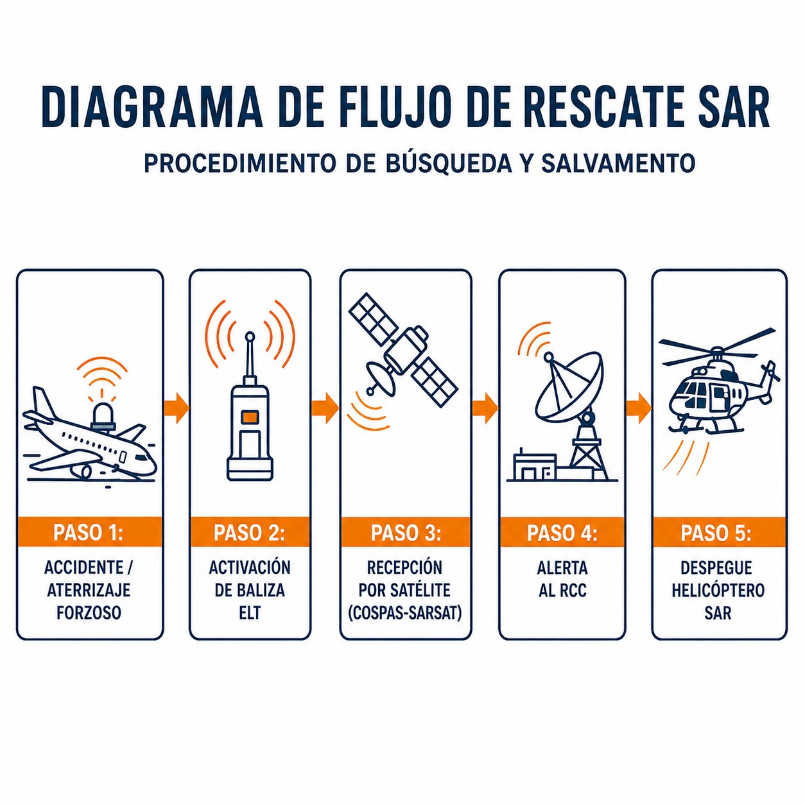

# Búsqueda y salvamento (*search and rescue*)

> Cuando todo lo demás falla, el Sistema de Búsqueda y Salvamento es tu última línea de defensa; permite que te encuentren.
>
>
> En este capítulo aprenderás:
>
>
> * Quién coordina el rescate en España (los RCC).
> * Las fases de emergencia: INCERFA (duda), ALERFA (preocupación) y DETRESFA (peligro inminente).
> * El código visual de supervivencia (V, X, N, Y) para comunicarte sin radio.

## Cuando todo falla: el sistema SAR

El Servicio de Búsqueda y Salvamento (**SAR**, **Search and Rescue**) es tu red de seguridad final. En España es responsabilidad del **Ejército del Aire y del Espacio**, en colaboración con el Ministerio de Transportes y con apoyo de otros medios, y su misión es simple: encontrarte y salvarte.

### Organización

Quien mueve los hilos es el **RCC** (Centro Coordinador de Salvamento; el AIP los llama ARCC). En España hay tres, uno por cada región de búsqueda y salvamento (AIP España, GEN 3.6):

1. **ARCC Madrid** (Torrejón): la región que coincide con la FIR Madrid, es decir, el centro, el oeste, el norte y el sur de la península.
2. **ARCC Palma**: la FIR Barcelona —el nordeste peninsular y el Levante— y Baleares, más Andorra.
3. **ARCC Canarias**: el archipiélago y una inmensa zona del Atlántico.

Si vuelas en Cataluña o en la Comunidad Valenciana, tu centro es el de Palma, no el de Madrid.

## Las fases de emergencia (repaso SAR)

El SAR no sale a buscar "porque sí". Actúa escalonadamente según la gravedad, en fases que activa el ATC o el propio RCC:

1. **INCERFA (Fase de incertidumbre)**: existe incertidumbre sobre la seguridad de la aeronave y sus ocupantes. El RCC empieza a recabar información.
2. **ALERFA (Fase de alerta)**: existe preocupación por la seguridad de la aeronave y sus ocupantes. Se preparan los equipos SAR.
3. **DETRESFA (Fase de peligro)**: existe certeza razonable de peligro grave e inminente o de que se necesita ayuda inmediata. Despegan los medios: aviones y helicópteros (@fig-01-cap11-actuacion-accidente).

{#fig-01-cap11-actuacion-accidente}

### Balizas de emergencia: ELT y PLB

La cadena de la figura empieza por la baliza. Una **ELT** (instalada en la aeronave) o una **PLB** (personal) emite en **406 MHz**, la única frecuencia que detectan los satélites del sistema Cospas-Sarsat desde 2009, y en **121,5 MHz**, que los medios SAR usan con sus radiogoniómetros para localizarte en la fase final. Regístrala: la señal de 406 MHz lleva un código que identifica la baliza y a su propietario.

Part-SAO pide llevar equipos de señalización y supervivencia cuando vueles sobre zonas en las que la búsqueda y el salvamento serían especialmente difíciles, y su medio aceptable de cumplimiento concreta al menos una ELT, una PLB u otro localizador de emergencia registrado equivalente (SAO.IDE.125 y su AMC1).

## El lenguaje de la supervivencia: señales tierra-aire

Si estás en tierra y te busca un avión, tienes que comunicarte. Sin radio, usa el **Código de Señales Visuales**: hazlas grandes (mínimo 2,5 m) y con contraste, usando telas, piedras o surcos (@fig-01-cap11-senales-tierra-aire).

| Símbolo | Significado | Mnemotecnia |
| --- | --- | --- |
| **V** | **Necesito AYUDA** (Require Assistance) | "V" de "Venid". |
| **X** | **Necesito Ayuda MÉDICA** (Require Medical Assistance) | Una cruz, como en una ambulancia o farmacia. |
| **N** | **NO** / Negativo | "N" de No. |
| **Y** | **SÍ** / Afirmativo | "Y" de Yes. |
| **→** | **Procedemos en esta dirección** | Flecha indicando rumbo. |
: Código de señales visuales tierra-aire

{#fig-01-cap11-senales-tierra-aire}

::: {.callout-warning title="Seguridad"}
Si volando interceptas una señal de socorro (visual o en 121.5 MHz):

1. **Anota la posición**.
2. **No satures la frecuencia** (escucha primero).
3. **Notifica al ATC** o a quien puedas inmediatamente.
4. Si es posible, mantente en la zona hasta ser relevado (sin ponerte en peligro).
:::

::: {.postit}
**Resumen del capítulo: búsqueda y salvamento (SAR)**

Si algo sale mal, el SAR te buscará. Conoce las fases:

* **INCERFA (Fase de incertidumbre)**: existe incertidumbre sobre la seguridad de la aeronave y sus ocupantes.
* **ALERFA (Fase de alerta)**: existe preocupación por la seguridad de la aeronave y sus ocupantes.
* **DETRESFA (Fase de peligro)**: existe certeza razonable de peligro grave e inminente o de que se necesita ayuda inmediata.
* **Balizas**: una ELT o PLB de 406 MHz, registrada, la detectan los satélites; los 121,5 MHz sirven para localizarte en la fase final.
* **Señales tierra-aire**: **V** = necesito ayuda; **X** = necesito ayuda médica; **N** = no; **Y** = sí.
:::
