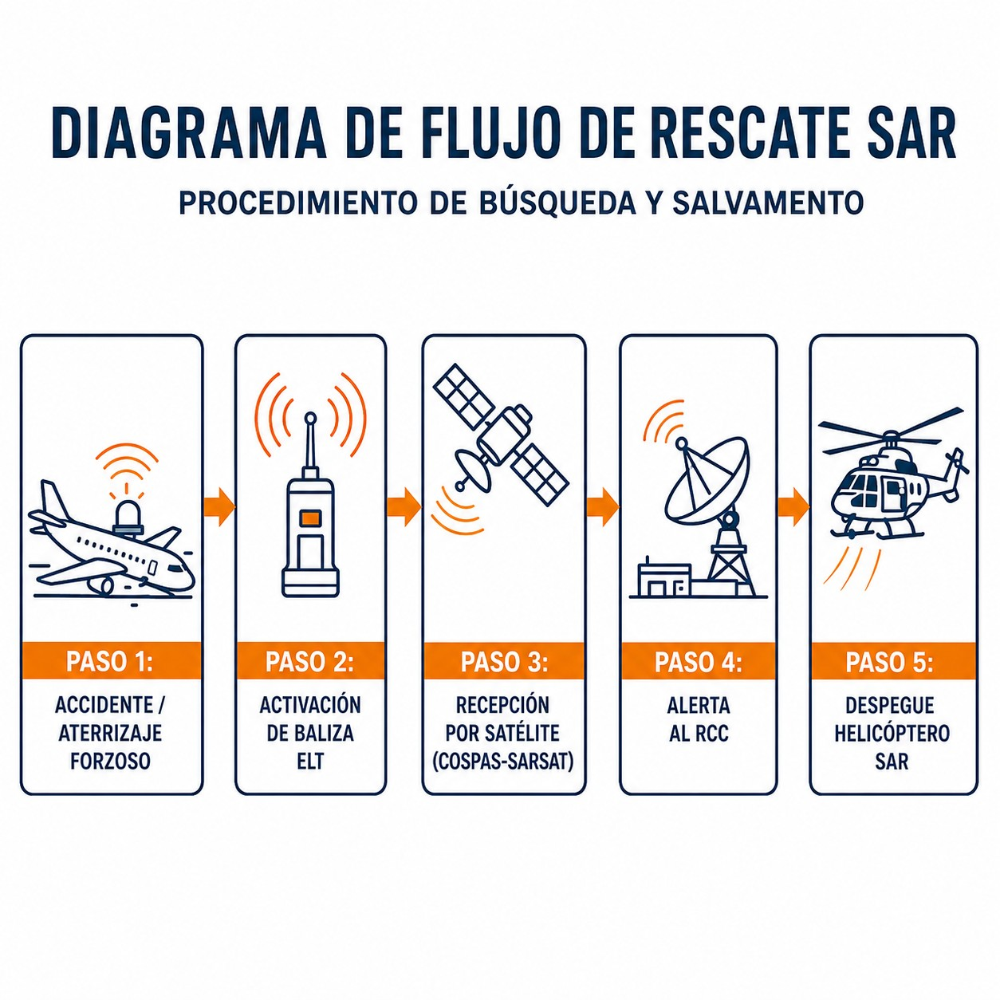
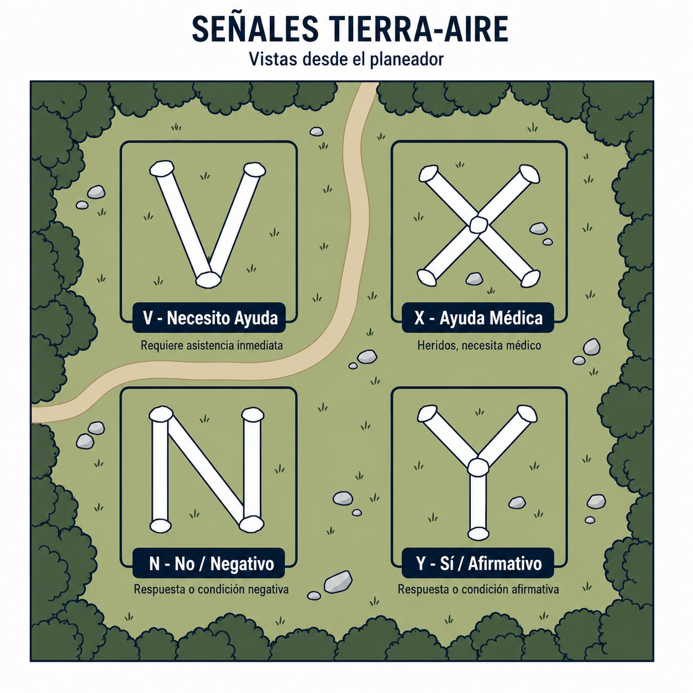

# Búsqueda y salvamento

> Cuando todo lo demás falla, el Sistema de Búsqueda y Salvamento es tu última línea de defensa; permite que te encuentren.
>
>
> En este capítulo aprenderás:
>
>
> * Quién coordina el rescate en España (los RCC).
> * Las fases de emergencia: INCERFA (duda), ALERFA (preocupación) y DETRESFA (peligro inminente).
> * El código visual de supervivencia (V, X, N, Y) para comunicarte sin radio.

## Cuando todo falla: el sistema SAR

El Servicio de Búsqueda y Salvamento (**SAR**, **Search and Rescue**) es tu red de seguridad final. En España es responsabilidad del **Ejército del Aire**, con apoyo de otros medios, y su misión es simple: encontrarte y salvarte.

### Organización

Quien mueve los hilos es el **RCC** (Centro Coordinador de Salvamento). En España hay tres principales:

1. **RCC Madrid** (Base Aérea de Torrejón): cubre la mayor parte de la península.
2. **RCC Canarias** (Base Aérea de Gando): cubre el archipiélago y una inmensa zona del Atlántico.
3. **RCC Palma** (Base Aérea de Son San Juan): cubre el Mediterráneo y Baleares.

Existen también **RSC** (subcentros) para zonas específicas.

## Las fases de emergencia (repaso SAR)

El SAR no sale a buscar "porque sí". Actúa escalonadamente según la gravedad, en fases que activa el ATC o el propio RCC:

1. **INCERFA (Incertidumbre)**: "¿alguien sabe algo?". Por ejemplo, 30 minutos sin noticias. El RCC empieza a preguntar.
2. **ALERFA (Alerta)**: "algo va mal". Por ejemplo, un fallo de comunicaciones confirmado. Se preparan los equipos SAR.
3. **DETRESFA (Socorro)**: peligro grave. Una señal de baliza ELT, un accidente avistado. Despegan los medios: aviones y helicópteros (@fig-01-cap11-actuacion-accidente).

{#fig-01-cap11-actuacion-accidente}

## El lenguaje de la supervivencia: señales tierra-aire

Si estás en tierra y te busca un avión, tienes que comunicarte. Sin radio, usa el **Código de Señales Visuales**: hazlas grandes (mínimo 2,5 m) y con contraste, usando telas, piedras o surcos (@fig-01-cap11-senales-tierra-aire).

| Símbolo | Significado | Mnemotecnia |
| --- | --- | --- |
| **V** | **Necesito AYUDA** (Require Assistance) | "V" de "Venid". |
| **X** | **Necesito Ayuda MÉDICA** (Require Medical Assistance) | Una cruz, como en una ambulancia o farmacia. |
| **N** | **NO** / Negativo | "N" de No. |
| **Y** | **SÍ** / Afirmativo | "Y" de Yes. |
| **→** | **Procedemos en esta dirección** | Flecha indicando rumbo. |

: Código de señales visuales tierra-aire

{#fig-01-cap11-senales-tierra-aire}

::: {.callout-warning title="Seguridad"}
Si volando interceptas una señal de socorro (visual o en 121.5 MHz):

1. **Anota la posición**.
2. **No satures la frecuencia** (escucha primero).
3. **Notifica al ATC** o a quien puedas inmediatamente.
4. Si es posible, mantente en la zona hasta ser relevado (sin ponerte en peligro).
:::

**Resumen del Capítulo: Búsqueda y Salvamento (SAR)**

Si algo sale mal, el SAR te buscará. Conoce las fases:

* **INCERFA (Incertidumbre)**: la aeronave no establece comunicaciones tras 30 minutos de intentos, llega 30 minutos después de su hora prevista, o hay dudas sobre su seguridad.
* **ALERFA (Alerta)**: hay temor por la seguridad de la aeronave (se sabe que tiene dificultades), no aterriza dentro de los 5 minutos tras su ETA autorizado, o se presume interferencia ilícita (secuestro).
* **DETRESFA (Socorro)**: peligro grave e inminente. Combustible agotado, posible aterrizaje forzoso o necesidad de ayuda inmediata.
* **Señales tierra-aire**: **V** = necesito ayuda; **X** = necesito ayuda médica; **N** = no; **Y** = sí.
