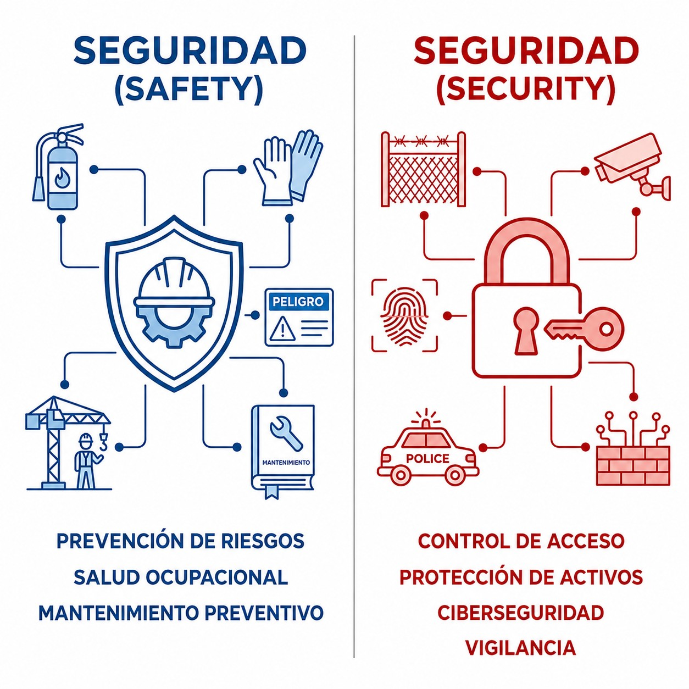
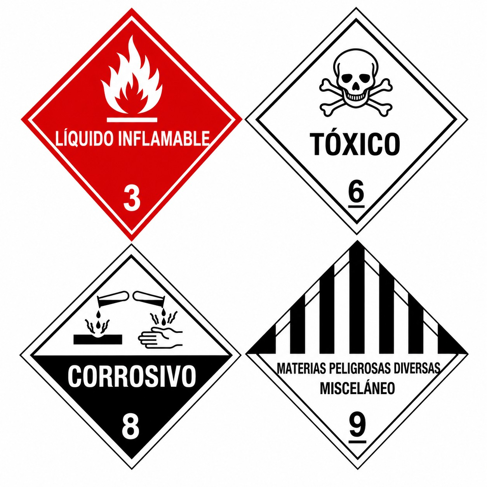

# Seguridad

La seguridad de la aviación no es solo para grandes aerolíneas; proteger tu aeronave de actos ilícitos es una responsabilidad fundamental del piloto.

En este capítulo aprenderás:

* La diferencia entre evitar accidentes (**safety**) y prevenir actos criminales (**security**).
* Cómo asegurar tu aeronave en tierra y comprobar que nadie la ha manipulado.
* Qué artículos están prohibidos a bordo por riesgo para la seguridad.

## Safety vs Security: ¿No es lo mismo?

En español usamos "seguridad" para todo, pero en aviación conviven dos conceptos muy distintos ():

1. **Seguridad operacional** (**safety**): prevenir **accidentes** no intencionados. Que no se pare el motor, que no choques, que el mantenimiento esté bien hecho. Es "volar seguro".
2. **Seguridad de la aviación** (**security**): protegerse contra **actos ilícitos** intencionados. Que no te roben el avión, que nadie ponga una bomba, evitar secuestros. Es protección física.

{#fig-01-cap12-safety-vs-security}

## Tu responsabilidad en aviación general

Aunque vueles un planeador en un campo pequeño, la **security** también va contigo:

* **Control de acceso**: no dejes tu aeronave abierta o accesible a cualquiera. Si tienes hangar, ciérralo. Si no, asegura la cabina.
* **Inspección pre-vuelo con ojos de security**: además de mirar si hay aceite, mira si alguien ha tocado algo. ¿Hay objetos extraños en la cabina? ¿Signos de forzamiento?
* **Documentación**: lleva siempre tu identificación (DNI, licencia). La Guardia Civil o la autoridad del aeropuerto pueden pedírtela en cualquier momento, en zona de aire o de tierra.

## Mercancías peligrosas (Dangerous Goods)

Son artículos o sustancias que pueden poner en riesgo la salud, la seguridad o la propiedad. La regla general es simple: **prohibido** llevarlas a bordo (). Se admiten cantidades razonables de lo necesario para el vuelo o la seguridad (oxígeno medicinal aprobado, baterías de litio de uso personal bajo ciertas condiciones), siempre con precaución extrema.

{#fig-01-cap12-mercancias-peligrosas}

::: {.callout-warning}
⚠ **SEGURIDAD**

Si ves a alguien merodeando por los hangares, manipulando aviones ajenos o comportándose de forma sospechosa en el aeródromo, **avisa inmediatamente** al responsable del campo o a las fuerzas de seguridad. La seguridad es cosa de todos.
:::

 

**Resumen del Capítulo: Seguridad (Security)**

Ojo a la diferencia en inglés:

* **SAFETY**: seguridad operacional. Que no te accidentes volando.
* **SECURITY**: seguridad física. Que no te roben el avión ni pongan una bomba.
* **Tu deber**: no dejar el avión abierto o accesible a desconocidos, no llevar mercancías peligrosas (salvo excepciones aprobadas) y respetar las zonas restringidas de los aeropuertos.
