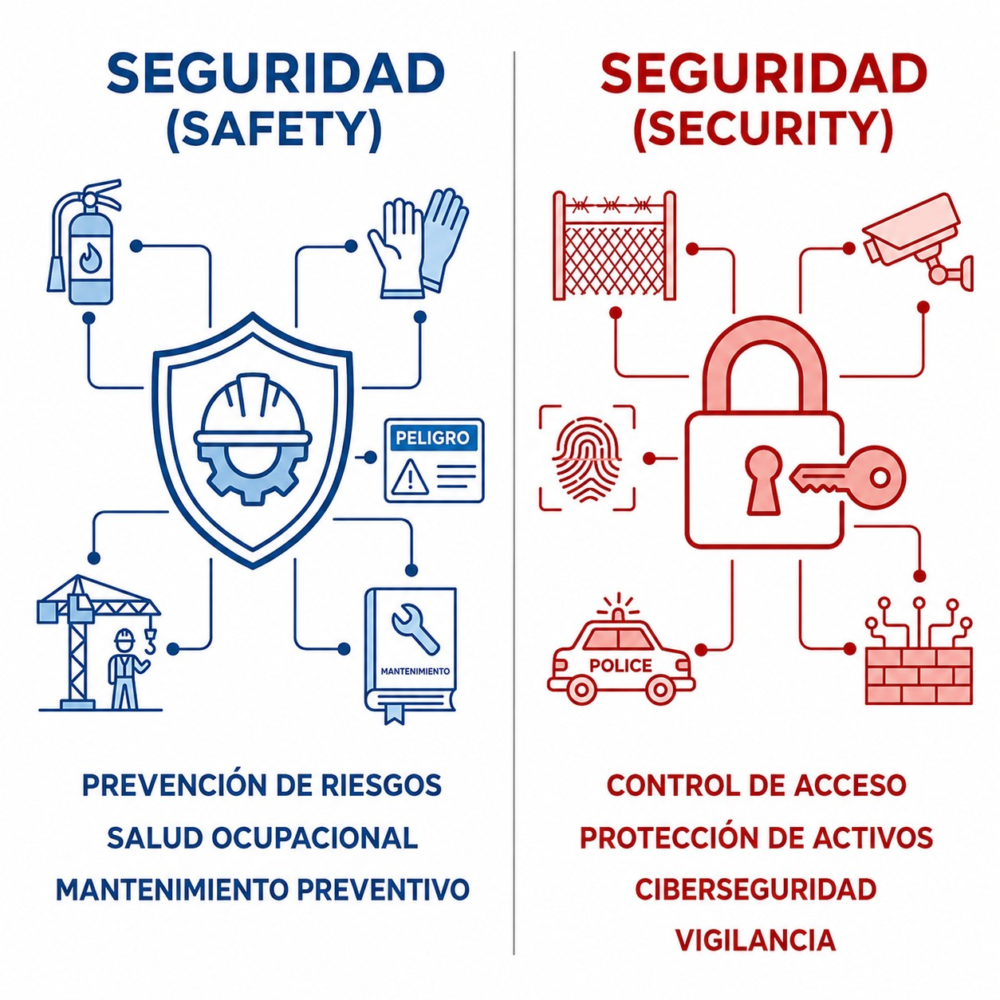
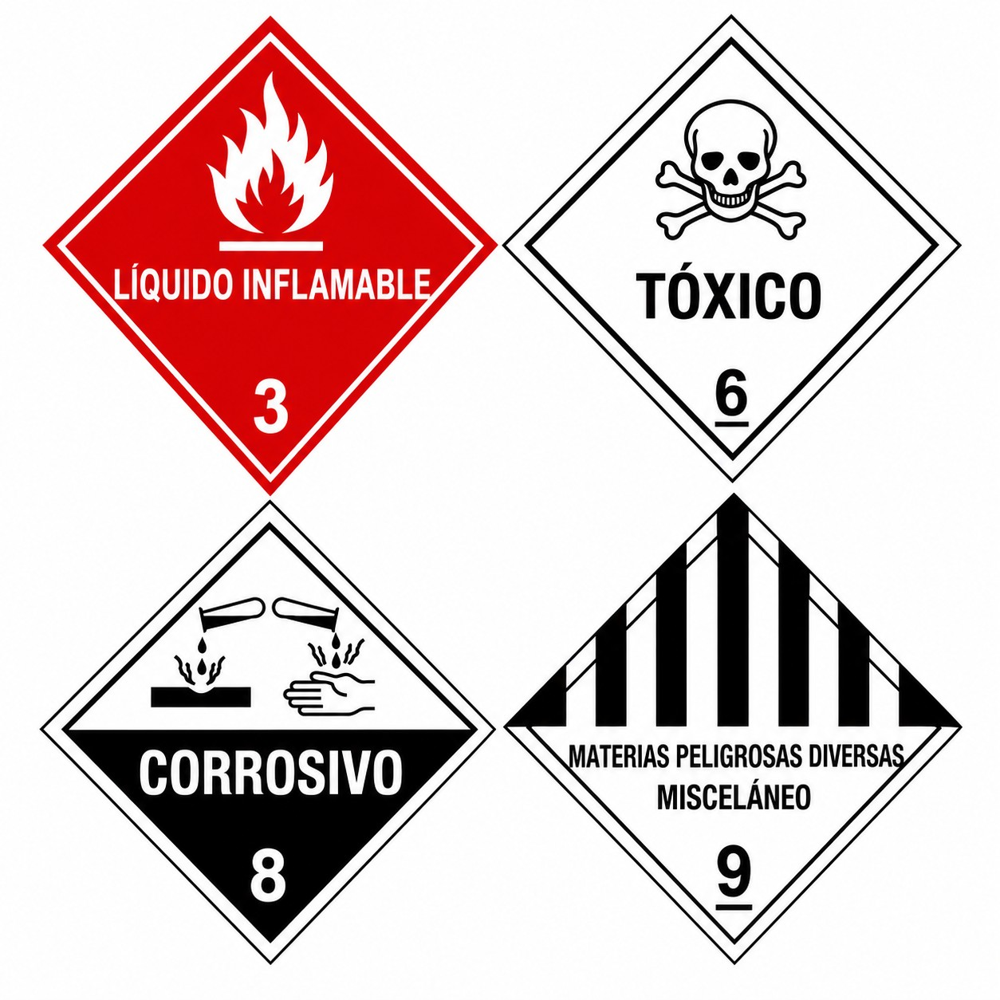

# Seguridad (*security*)

> La seguridad de la aviación no es solo para grandes aerolíneas; proteger tu aeronave de actos ilícitos es una responsabilidad fundamental del piloto.
>
>
> En este capítulo aprenderás:
>
>
> * La diferencia entre evitar accidentes (**safety**) y prevenir actos criminales (**security**).
> * Cómo asegurar tu aeronave en tierra y comprobar que nadie la ha manipulado.
> * Qué normas regulan la *security* y qué no puedes llevar a bordo: artículos prohibidos y mercancías peligrosas.

## Safety vs security: ¿no es lo mismo?

En español usamos "seguridad" para todo, pero en aviación conviven dos conceptos muy distintos (@fig-01-cap12-safety-vs-security):

1. **Seguridad operacional** (**safety**): prevenir **accidentes** no intencionados. Que no se pare el motor, que no choques, que el mantenimiento esté bien hecho. Es "volar seguro".
2. **Seguridad de la aviación** (**security**): protegerse contra **actos ilícitos** intencionados. Que no te roben el avión, que nadie ponga una bomba, evitar secuestros. Es protección física.

{#fig-01-cap12-safety-vs-security .corregir}

La *security* tiene sus propias normas. En el ámbito internacional, el **Anexo 17** de la OACI; en la Unión Europea, el **Reglamento (CE) 300/2008**, que fija las normas comunes, y el **Reglamento de Ejecución (UE) 2015/1998**, que las desarrolla; y en España, el **Programa Nacional de Seguridad para la Aviación Civil** que prevé la Ley de Seguridad Aérea (art. 3). Casi todas sus medidas se aplican en los aeropuertos con tráfico comercial: los controles de pasajeros y equipajes, los accesos y las **zonas restringidas**.

En un aeropuerto, la **zona de operaciones** es la parte de acceso restringido (plataformas, pistas y edificios anexos) y el **lado tierra**, el resto; dentro de la zona de operaciones, las **zonas restringidas de seguridad** añaden controles (Reglamento (CE) 300/2008, art. 3). Entrar sin autorización en la zona de operaciones o en las zonas restringidas de un aeropuerto de interés general es una infracción **muy grave** (Ley de Seguridad Aérea, art. 48.3).

## Tu responsabilidad en aviación general

Aunque vueles un planeador en un campo pequeño, la **security** también va contigo. Lo que sigue son buenas prácticas, no obligaciones de esas normas:

* **Control de acceso**: no dejes tu aeronave abierta o accesible a cualquiera. Si tienes hangar, ciérralo. Si no, asegura la cabina.
* **Inspección pre-vuelo con ojos de security**: además de mirar si hay aceite, mira si alguien ha tocado algo. ¿Hay objetos extraños en la cabina? ¿Signos de forzamiento?
* **Documentación**: cuando ejerzas las atribuciones de tu licencia, lleva encima la licencia, el certificado médico y un documento de identidad con foto; en vuelos a la vista del aeródromo pueden quedarse en él. Preséntalos sin demora si te los pide un representante autorizado de la autoridad competente (SFCL.045).

## Mercancías peligrosas (Dangerous Goods)

Ojo con no confundir dos cosas. Los **artículos prohibidos** son asunto de *security*: armas, explosivos y otros objetos que pueden usarse para cometer un acto ilícito (Reglamento (CE) 300/2008, art. 3). Las **mercancías peligrosas** son asunto de *safety* (Anexo 18 de la OACI): artículos o sustancias que, transportados en una aeronave, pueden poner en riesgo la salud, la seguridad, los bienes o el medio ambiente, aunque nadie quiera hacer daño con ellos (@fig-01-cap12-mercancias-peligrosas).

En planeador, la regla es tuya como piloto al mando: **no permitirás que nadie lleve mercancías peligrosas a bordo** (SAO.GEN.150 a)). La única excepción son cantidades razonables de artículos que se usan para la seguridad del vuelo y que conviene tener a mano en la cabina: esas se consideran autorizadas, sin necesidad de aprobación (SAO.GEN.150 b)). Qué entra exactamente en esa excepción depende del artículo; ante la duda, pregunta a tu escuela o al fabricante del equipo.

{#fig-01-cap12-mercancias-peligrosas}

::: {.callout-warning title="Seguridad"}
Si ves a alguien merodeando por los hangares, manipulando aviones ajenos o comportándose de forma sospechosa en el aeródromo, **avisa inmediatamente** al responsable del campo o a las fuerzas de seguridad. La seguridad es cosa de todos.
:::

::: {.postit}
**Resumen del capítulo: seguridad (Security)**

Ojo a la diferencia en inglés:

* **SAFETY**: seguridad operacional. Que no te accidentes volando.
* **SECURITY**: seguridad física. Que no te roben el avión ni pongan una bomba.
* **Tu deber**: no dejar el avión abierto o accesible a desconocidos, no permitir mercancías peligrosas a bordo (salvo las cantidades razonables de artículos para la seguridad del vuelo que la norma considera autorizadas) y respetar las zonas restringidas de los aeropuertos.
:::
