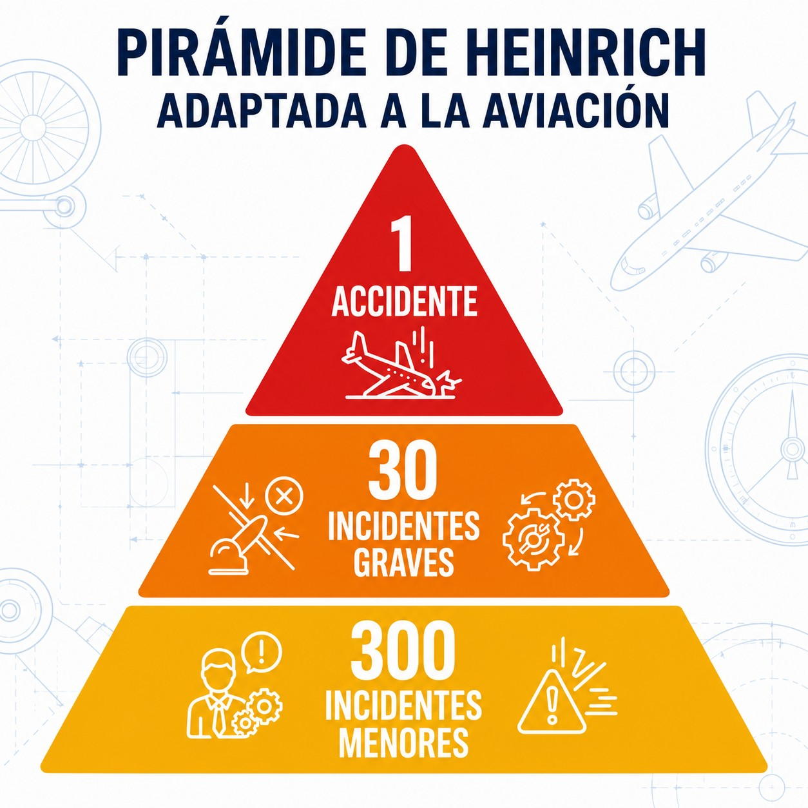
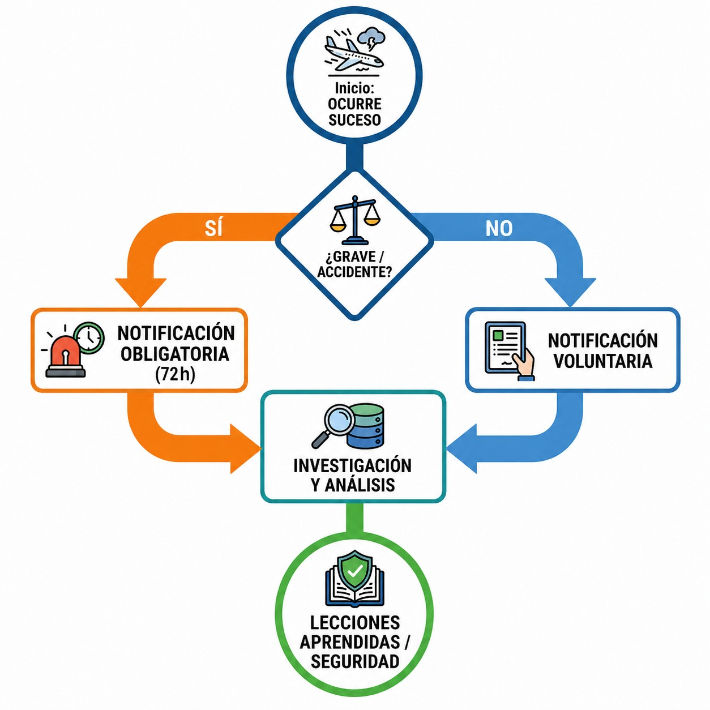

# Notificación de accidentes

Notificar sucesos no busca culpables, sino aprender de los errores para mantener los cielos seguros para todos.

En este capítulo aprenderás:

* Las diferencias legales entre accidente, incidente grave e incidente.
* Cuándo debes reportar un suceso a la CIAIAC y a AESA, y sus plazos: sin demora a la primera, 72 horas a la segunda.
* El principio de "cultura justa": reportar errores honestos sin miedo al castigo.

## Definiciones clave (Reglamento UE 996/2010 y 376/2014)

En aviación no todo es un accidente. Hay matices legales que importan (@fig-01-cap13-piramide-sucesos):

1. **ACCIDENTE**: alguien sufre lesiones mortales o graves; la aeronave sufre daños estructurales importantes o fallos que afectan a su resistencia o capacidad de vuelo; o la aeronave desaparece o queda inaccesible.
2. **INCIDENTE GRAVE**: un suceso con alta probabilidad de haber acabado en accidente. El clásico "casi pasa".
3. **INCIDENTE**: cualquier otro suceso que afecte o pueda afectar a la seguridad, sin llegar a lo anterior.

{#fig-01-cap13-piramide-sucesos}

## El deber de notificar: sistema SNS

Para mejorar la seguridad, el Estado necesita datos. No para castigar, sino para prevenir. Por eso conviven dos sistemas:

* **Notificación obligatoria**: todos los accidentes e incidentes graves deben notificarse.
* **Notificación voluntaria**: si te pasa algo que no es obligatorio reportar pero crees que otros pueden aprender de ello, repórtalo igualmente.

### ¿A quién y cuándo?

1. **CIAIAC** (Comisión de Investigación): investiga las causas técnicas, para que no vuelva a pasar.
2. **AESA** (Agencia Estatal de Seguridad Aérea): supervisa el cumplimiento normativo.

Los plazos no son iguales: a la CIAIAC, comunica el accidente o incidente grave **sin demora** (Reglamento (UE) 996/2010, art. 9); a AESA, notifica el suceso lo antes posible y, en todo caso, en un máximo de **72 horas** (Reglamento (UE) 376/2014) (@fig-01-cap13-flujo-notificacion).

::: {.callout-tip}
✦ **REGLA DE ORO**

La normativa europea promueve la "Cultura Justa". El objetivo de notificar **NO es buscar culpables** (salvo negligencia grave o dolo), sino **aprender**. No tengas miedo a reportar tus errores; es la única forma de que el sistema mejore.
:::

{#fig-01-cap13-flujo-notificacion}

::: {.callout-warning}
⚠ **SEGURIDAD**

Si sufres o presencias un accidente:

1. Prioridad: **Salvar vidas** y evitar más peligros (fuego, etc.).
2. Después: **NO TOQUES NADA**. Preservar los restos es vital para la investigación de la CIAIAC. Solo muévelos si es imprescindible para sacar a víctimas o evitar un incendio.
:::

**Resumen del Capítulo: Accidentes e Incidentes**

* **Accidente**: hay lesiones mortales o graves, daños estructurales al avión, o la aeronave desaparece o queda inaccesible.
* **Incidente grave**: las circunstancias indican que hubo alta probabilidad de accidente, o el suceso puso (o pudo poner) en peligro la seguridad de la operación.
* **Obligación**: comunicarlo **sin demora** a la **CIAIAC**; notificar el suceso a **AESA** en un plazo máximo de **72 horas**.
* **Pruebas**: no toques nada, salvo para salvar vidas o evitar otro peligro. Preservar los restos es vital para la investigación.
