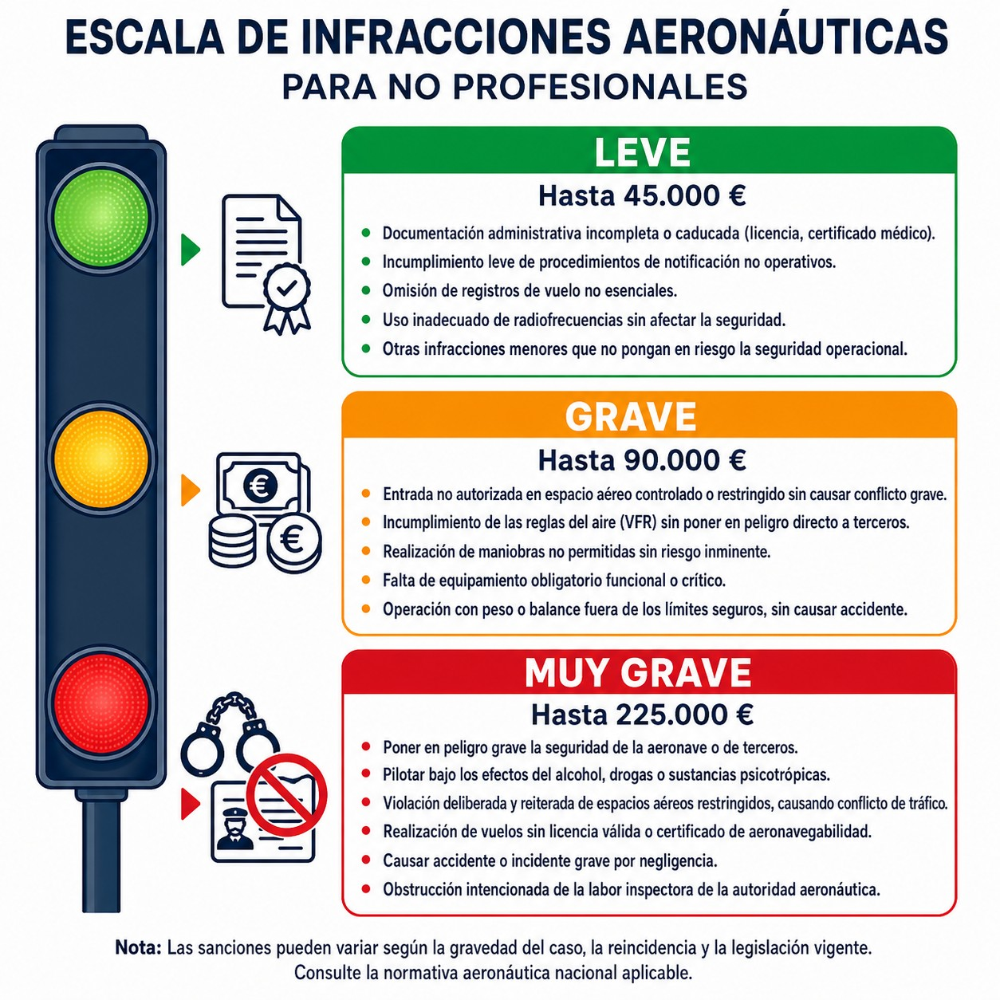

# Derecho nacional

> Más allá de las normas europeas, la legislación nacional rige nuestra actividad; conocer la Ley de Seguridad Aérea evita costosas sorpresas legales.
>
>
> En este capítulo aprenderás:
>
>
> * El papel de la Ley de Seguridad Aérea (LSA 21/2003) en España.
> * Quién es quién entre la DGAC y AESA: una define la política, la otra vigila su cumplimiento.
> * El régimen sancionador: infracciones leves, graves y muy graves, y sus consecuencias.

## La legislación española: el marco nacional

Además de la normativa europea (EASA/SERA), en España existe legislación propia que complementa y desarrolla el marco comunitario. La ley principal es la **Ley 21/2003, de 7 de julio, de Seguridad Aérea (LSA)**.

## La Dirección General de Aviación Civil (DGAC)

La **Dirección General de Aviación Civil (DGAC)** es el órgano directivo del Ministerio de Transportes y Movilidad Sostenible encargado de diseñar la estrategia y dirigir la política aeronáutica.

Mientras AESA supervisa y sanciona, la DGAC juega en el terreno político y normativo: diseña la estrategia del sector aéreo, elabora y propone la normativa nacional, representa a España en organismos como la OACI y coordina a los distintos organismos del sector.

::: {.callout-note title="Airmanship"}
Podríamos decir que la **DGAC** escribe las "reglas del juego" (política y estrategia) y **AESA** es el "árbitro" que asegura que se cumplan en el día a día (supervisión y sanción).
:::

## AESA: el policía del aire español

La **Agencia Estatal de Seguridad Aérea (AESA)**, creada por Real Decreto 184/2008, vela por el cumplimiento de la normativa de aviación civil en España. Vigila que operadores, pilotos, talleres de mantenimiento y aeródromos cumplan las normas; regula el transporte aéreo, la navegación aérea y la seguridad aeroportuaria; analiza los riesgos para la seguridad del transporte aéreo; y tiene potestad para imponer **sanciones** cuando se infringen las normas.

## Infracciones y sanciones

La LSA clasifica las infracciones por gravedad (@fig-01-cap14-infracciones):

### Infracciones leves

* Retrasos no justificados en la presentación de documentación.
* Incumplimientos menores de trámites administrativos que no afecten a la seguridad.
* Incumplimientos menores de documentación.

### Infracciones graves

* Volar sin licencia válida para el tipo de aeronave.
* Incumplir las reglas del aire sin causar riesgo grave.
* No llevar la documentación obligatoria a bordo.

### Infracciones muy graves

* Volar bajo los efectos del **alcohol o drogas**.
* **Negligencia grave** que cause un accidente o la muerte de una persona.
* Operar una aeronave sin **Certificado de Aeronavegabilidad** válido.
* **Falsificar** títulos, licencias o documentación aeronáutica.

{#fig-01-cap14-infracciones}

::: {.callout-warning title="Seguridad"}
Las sanciones económicas pueden ser **muy elevadas**, incluso para pilotos privados. Volar sin licencia, sin seguro, o bajo los efectos del alcohol puede costarte miles de euros y la inhabilitación para volar. El desconocimiento de la ley **NO** te exime de su cumplimiento.
:::

::: {.callout-tip title="Regla de oro"}
Ante cualquier duda sobre la legalidad de una operación (ej: volar cerca de un aeropuerto controlado, llevar pasajeros sin recencia), **pregunta antes a tu club, instructor o a AESA**. Es mejor preguntar que enfrentarse a un expediente sancionador.
:::

::: {.postit}
**Resumen del Capítulo: Derecho Nacional**

Además de Europa, en España manda la **Ley de Seguridad Aérea (LSA 21/2003)**.

* Establece el régimen de infracciones y sanciones: las **muy graves** (muerte o accidente) pueden acarrear la inhabilitación.
* **DGAC**: define la política aeronáutica (las "reglas del juego").
* **AESA**: vigila y sanciona (el "árbitro").
:::

