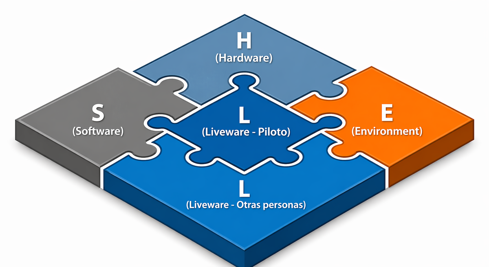
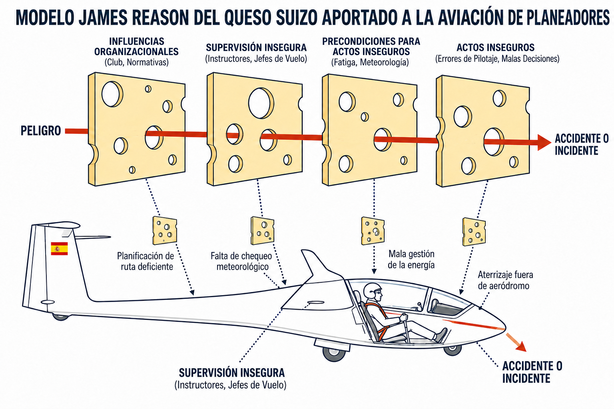
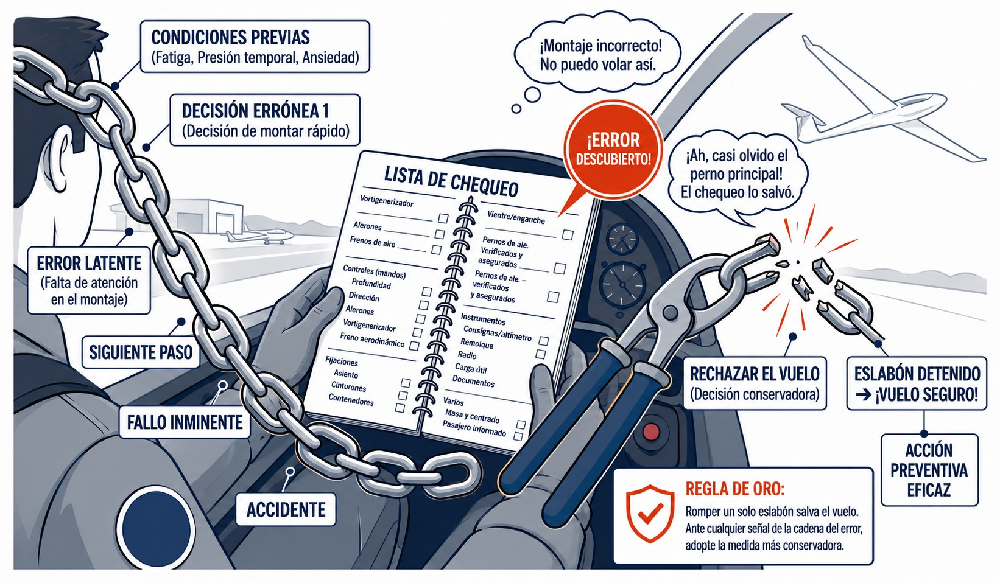
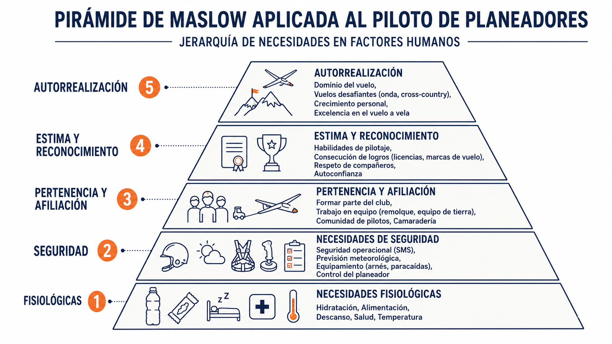

# Factores humanos: conceptos básicos

> La técnica con los mandos no basta: la mayoría de los accidentes en vuelo a vela tienen una causa humana, y casi todos son evitables. Este capítulo te da el marco para entender por qué erramos y cómo interponer barreras antes de que el error llegue a consecuencias.
>
>
> En este capítulo aprenderás:
>
>
> * **El modelo SHELL**: cómo interactúas con el software, el hardware, el entorno y las demás personas.
> * **El error humano y el queso suizo**: por qué errar es inevitable y cómo se alinean los fallos.
> * **La cadena del error**: por qué basta romper un eslabón para evitar el accidente.
> * **Las influencias en el comportamiento**: presión de grupo, cultura justa y la pirámide de Maslow.

## Introducción a los factores humanos y la seguridad en el vuelo

El vuelo a vela exige la coordinación constante entre el piloto, la aeronave y un entorno en permanente cambio. Durante décadas, la formación de pilotos se centró casi exclusivamente en las habilidades de manejo de los mandos (**stick and rudder skills**). La experiencia ha demostrado, sin embargo, que una técnica impecable no garantiza por sí sola la seguridad del vuelo. Aquí entran en juego los **factores humanos**.

La Organización de Aviación Civil Internacional (OACI (Organización de Aviación Civil Internacional)) define los factores humanos como los elementos medioambientales, organizativos, laborales y las características individuales que influyen en el comportamiento dentro del entorno aeronáutico, con efecto directo sobre la salud y la seguridad operacional. En términos prácticos, se trata de comprender cómo interactúa el piloto con la aeronave, los procedimientos, la meteorología y el resto de personas implicadas en la operación.

El piloto no es infalible. Existen limitaciones inherentes en la percepción, la memoria y la capacidad de procesar información compleja bajo presión. La disciplina de los factores humanos no pretende transformar al piloto en un agente sin errores, sino enseñarle a **reconocer sus limitaciones fisiológicas y psicológicas**, aceptarlas y aplicar estrategias contrastadas para gestionarlas en beneficio de la toma de decisiones aeronáuticas (**Aeronautical Decision-Making**, ADM).

## El factor humano en los accidentes de aviación

A medida que la tecnología aeronáutica ha avanzado, la proporción de accidentes debidos a fallos mecánicos ha disminuido de forma significativa. Las estadísticas actuales reflejan que **el factor humano es la causa principal o un elemento contribuyente en aproximadamente el 90 % de los accidentes en la aviación general y el vuelo a vela**. Este dato es, ante todo, pedagógico: la inmensa mayoría de estos accidentes son previsibles y, por tanto, **evitables**.

El desglose del componente humano en la siniestralidad del vuelo a vela muestra las siguientes proporciones habituales:

* **Toma de decisiones inadecuada (aprox. 40 %):** Factor predominante. Incluye continuar el vuelo hacia condiciones meteorológicas adversas o posponer en exceso la búsqueda de un aterrizaje fuera de campo.
* **Errores de pilotaje (aprox. 30 %):** Fallos en la técnica de vuelo o en el manejo de los mandos, con frecuencia relacionados con estados de distracción.
* **Preparación deficiente antes del vuelo (aprox. 12 %):** Omisiones críticas durante el montaje o la verificación previa al despegue, como no conectar correctamente los mandos o no asegurar la cabina.
* **Conciencia situacional insuficiente (aprox. 6 %):** Pérdida de percepción espacial o visual del tránsito, con riesgo de colisión en vuelo (**mid-air collision**).

::: {.callout-warning title="Seguridad"}
El análisis del Informe de Seguridad de EASA (European Union Aviation Safety Agency) indica que las fases más críticas del vuelo en planeador son el aterrizaje (aproximadamente el 50 % de los accidentes) y el despegue (21 %). Mantenga el máximo nivel de atención durante estos periodos, con la cabina libre de distracciones y todos los sistemas verificados.
:::

Los accidentes con consecuencias fatales (hasta un 26 % según datos de EASA (European Union Aviation Safety Agency)) tienen como causa principal la pérdida de control en vuelo, que con frecuencia deriva en pérdida aerodinámica y barrena (**stall and spin**), especialmente peligrosas a baja altura en el circuito de tráfico. Otras causas graves incluyen las colisiones contra el terreno (17 %) y las emergencias mal gestionadas en lanzamientos a torno incompletos (10 %).

Conocer estas estadísticas permite al piloto priorizar la atención en las fases y situaciones de mayor riesgo, y adoptar criterios de decisión más conservadores donde la experiencia demuestra que los márgenes son más estrechos.

## Modelos conceptuales: el modelo SHELL

El vuelo a vela no ocurre en el vacío; es una actividad donde el ser humano interactúa constantemente con su entorno. Para comprender esta interacción, la OACI utiliza el **Modelo SHELL**, un marco conceptual desarrollado originariamente por el psicólogo Elwyn Edwards en 1972 (como modelo SHEL) y refinado después por Frank Hawkins, que añadió la segunda L de las otras personas. Su nombre es un acrónimo de sus componentes, que encajan entre sí como las piezas de un rompecabezas con el factor humano siempre en el centro (@fig-02-cap01-modelo-shell):

* **Software (S):** Los elementos no materiales. Incluye la reglamentación aplicable, manuales de vuelo, procedimientos normativos, listas de chequeo (**checklists**) y la simbología aeronáutica.
* **Hardware (H):** La máquina. Abarca el propio velero, los instrumentos de a bordo y cualquier otra herramienta o equipo físico.
* **Environment (E):** El entorno donde se opera. Implica tanto las condiciones externas (meteorología, visibilidad, turbulencia) como las internas de la cabina (ruido, temperatura, ergonomía).
* **Liveware (L - otras personas):** Las personas con las que interactúas en el desarrollo del vuelo, como tu instructor, personal de pista, controladores u otros pilotos.
* **Liveware (L - yo central):** Tú, el piloto al mando (**Pilot in Command**). Se refiere a tus capacidades físicas y cognitivas, nivel de entrenamiento, experiencia, así como tu estado de fatiga o estrés.

{#fig-02-cap01-modelo-shell}

La clave de la seguridad radica en las interfaces de contacto entre tu «yo central» y el resto de los bloques. Si estas piezas no encajan de forma perfecta (por ejemplo, si la interfaz **Liveware-Environment** es deficiente debido a interferencias de radio que dificultan la comunicación), se abrirá una puerta al error humano.

## El error humano: tipos y el modelo del queso suizo

Según James Reason, el error humano es cualquier desviación de una secuencia de acciones físicas o mentales que impide lograr el resultado deseado. La filosofía de seguridad aeronáutica moderna asume que **errar es humano e inevitable**: el objetivo no es eliminar los errores por completo —algo que no es posible—, sino detectarlos temprano e interponer barreras defensivas antes de que generen consecuencias.

James Reason ilustró este proceso con el **modelo del queso suizo**: cada capa del sistema de seguridad (instrucción, procedimientos, listas de verificación, supervisión) actúa como una barrera con agujeros. Cuando los agujeros de todas las capas se alinean, el accidente se produce (@fig-02-cap01-queso-suizo).

{#fig-02-cap01-queso-suizo}

Los fallos del piloto se clasifican en dos categorías según la intención del acto:

* **Error:** Desviación involuntaria. El piloto falla sin pretenderlo, por falta de atención o por aplicar una técnica incorrecta.
* **Violación:** Incumplimiento deliberado de una norma o procedimiento. Cuando se repite sin consecuencias, genera falsa confianza y normaliza la conducta de riesgo.

Según el momento en que se manifiestan respecto al accidente, los errores se distinguen en:

* **Errores latentes:** Vulnerabilidades preexistentes en el sistema, como una instrucción inicial deficiente o un procedimiento inadecuado que favorece el fallo.
* **Errores activos:** La equivocación inmediata que precipita la cadena del accidente, como intentar un viraje a baja velocidad y baja altura.

::: {.callout-note title="Airmanship"}
Para reducir la probabilidad de error, utilice las listas de verificación aunque conozca el procedimiento de memoria, solicite la evaluación del instructor con regularidad y esté atento a factores que degradan el rendimiento, como la fatiga o la complacencia derivada de la experiencia acumulada.
:::

## Prevención y mitigación del error

Los accidentes rara vez tienen una causa única. La mayoría resultan de una sucesión de decisiones erróneas, condiciones previas y errores latentes que, alineados, forman la **cadena del error** (@fig-02-cap01-cadena-error). El modelo del queso suizo, descrito en la sección anterior, representa gráficamente este proceso.

La consecuencia práctica más importante es que **basta con interrumpir un solo eslabón de la cadena para prevenir el accidente**. Una decisión conservadora, una verificación adicional o rechazar el vuelo ante una duda razonable son suficientes para detener el proceso antes de que derive en consecuencias.

{#fig-02-cap01-cadena-error}

::: {.callout-tip title="Regla de oro"}
**Romper un solo eslabón salva el vuelo.** Ante cualquier señal de que la cadena del error ha comenzado —condiciones meteorológicas que se deterioran, una avería sin resolver, fatiga elevada— adopte la medida más conservadora disponible. Es la acción más eficaz al alcance del piloto.
:::

## Influencias en el comportamiento humano

El vuelo a vela tiene una fuerte dimensión social. El piloto opera en un entorno donde las interacciones con el club, la escuela, los instructores y los compañeros condicionan continuamente sus decisiones. Identificar estas influencias es el primer paso para neutralizar su efecto sobre la seguridad operacional.

### El entorno social y la presión de los compañeros

En un aeródromo, una de las formas de influencia más comunes es la presión de los compañeros (**peer pressure**). Cuando la mayoría de los pilotos del club decide despegar a pesar de un viento cruzado marginal o un pronóstico desfavorable, surge una presión implícita para no quedar al margen del grupo. Reconocer cuándo una decisión de vuelo se basa en la opinión ajena y no en el propio criterio técnico es fundamental. La firma en el libro del planeador es personal e intransferible: la responsabilidad de la decisión recae exclusivamente en el piloto al mando.

### Cultura organizacional y cultura justa

La forma en que un club gestiona los errores define su **cultura organizacional**. La respuesta histórica de la aviación al error fue punitiva: quien cometía un fallo era sancionado o reprendido. Lejos de mejorar la seguridad, ese enfoque incentivó el encubrimiento: los daños no se reportaban por temor al castigo y acababan produciendo accidentes en vuelos posteriores.

En la actualidad se promueve activamente la **cultura justa** (**Just Culture**): un marco que reconoce la inevitabilidad del error no intencionado y lo trata como una oportunidad de aprendizaje colectivo, sin represalias, siempre que no medie negligencia deliberada ni violación consciente de procedimientos.

::: {.callout-note title="Airmanship"}
Fomente la cultura justa en su entorno inmediato. Si durante el remolque o guardado del planeador se produce un daño accidental —por ejemplo, un golpe en el estabilizador al entrar al hangar— notifíquelo de inmediato al instructor o mecánico responsable. Encubrirlo pone en riesgo al piloto que vuele esa aeronave a continuación sin conocer el daño preexistente.
:::

### Motivación y desempeño: la pirámide de Maslow

El rendimiento del piloto está estrechamente vinculado a su motivación y equilibrio psicológico. Abraham Maslow definió una jerarquía de necesidades humanas que va desde las más básicas —salud, alimentación, seguridad física— hasta las de orden superior —reconocimiento, logro personal, autorrealización—. Esta jerarquía tiene una aplicación directa en el contexto aeronáutico.

Cuando la motivación por alcanzar un objetivo —batir una marca personal, ganar una competición— supera el nivel básico de seguridad, el piloto puede asumir riesgos injustificados: continuar hacia condiciones meteorológicas adversas, sobrevolar zonas sin alternativa de aterrizaje o ignorar señales de alarma. Del mismo modo, operar bajo un estado emocional negativo intenso —estrés, conflicto personal o preocupación económica grave— reduce la capacidad de atención y favorece la negligencia en las fases críticas del vuelo.

La conclusión práctica es clara: la seguridad ocupa la base de la pirámide y no puede subordinarse a ningún objetivo de orden superior (@fig-02-cap01-piramide-maslow).

{#fig-02-cap01-piramide-maslow}

::: {.postit}
**Resumen del capítulo: conceptos básicos de factores humanos**

* **Modelo SHELL**: Marco conceptual fundamental que analiza la interacción entre el piloto (Liveware) y otros elementos: Software (procedimientos), Hardware (la aeronave), Environment (el entorno) y otro Liveware (otras personas).
* **Gestión del error**: Se asume que el error humano es inevitable. El objetivo de la seguridad no es eliminarlo por completo, sino detectarlo a tiempo y gestionar sus consecuencias antes de que afecten a la seguridad del vuelo.
* **Cadena del error**: Los accidentes rara vez ocurren por una sola causa. Son la suma de pequeños errores y condiciones latentes. Tu trabajo es romper esa cadena en cuanto detectes el primer eslabón.
* **Influencias en el comportamiento**: El comportamiento mental bajo presión, nuestra motivación diaria aplicada al vuelo frente a una base de necesidades insatisfechas (Pirámide de Maslow), así como la presión directa de compañeros de hangar, alteran profundamente nuestra capacidad mental como comandantes. Debemos respaldar una rigurosa "cultura justa" para permitir el libre reporte de errores técnicos sin represión ajena, aprendiendo en colectivo en lugar de esconder daños fatales.
:::
