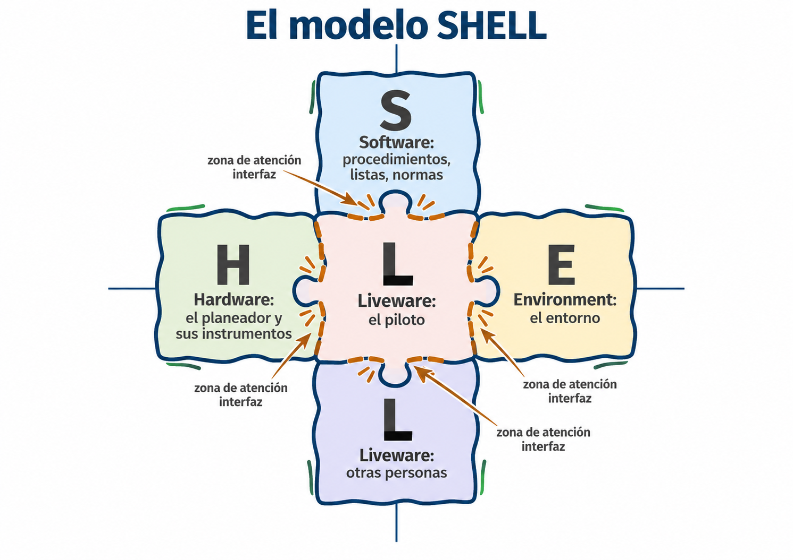
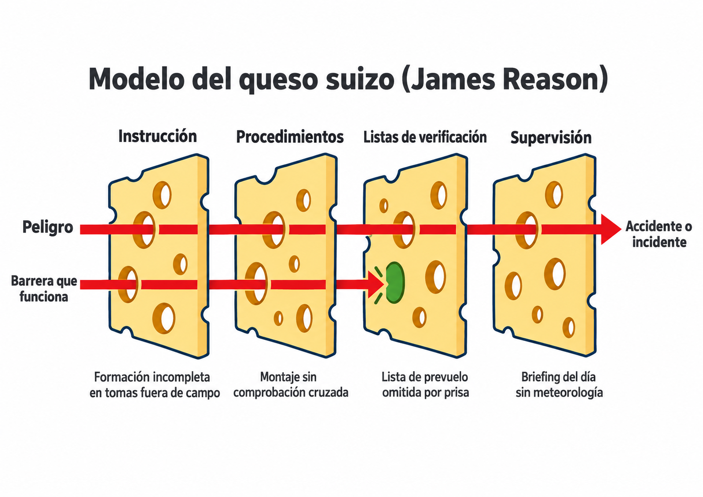
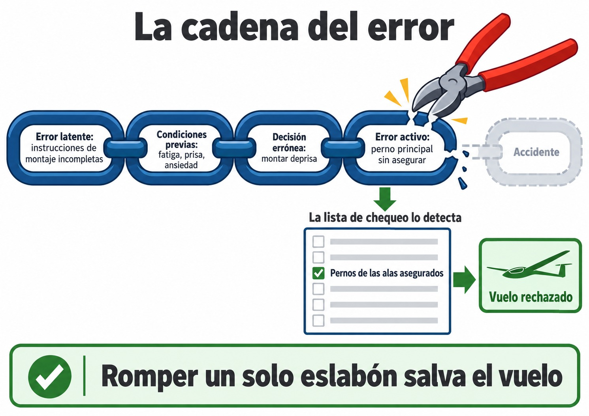
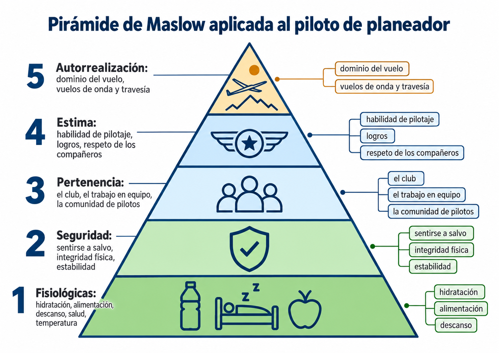

# Factores humanos: conceptos básicos

> Pilotar bien no basta. Detrás de la mayoría de los accidentes de vuelo a vela hay una causa humana, y casi todos se podían haber evitado. Aquí verás por qué nos equivocamos y cómo poner barreras para que un error no acabe en accidente.
>
>
> En este capítulo aprenderás:
>
>
> * **El modelo SHELL**: cómo interactúas con el software, el hardware, el entorno y las demás personas.
> * **El error humano y el queso suizo**: por qué errar es inevitable y cómo se alinean los fallos.
> * **La cadena del error**: por qué basta romper un eslabón para evitar el accidente.
> * **Las influencias en el comportamiento**: presión de grupo, cultura justa y la pirámide de Maslow.

## Introducción a los factores humanos y la seguridad en el vuelo

El vuelo a vela exige la coordinación constante entre el piloto, la aeronave y un entorno en permanente cambio. Durante décadas, la formación de pilotos se centró casi exclusivamente en las habilidades de manejo de los mandos (**stick and rudder skills**). Pero la experiencia enseña que una técnica impecable no basta para volar seguro. De lo que falta se ocupan los **factores humanos**.

Según el Manual de instrucción sobre factores humanos de la Organización de Aviación Civil Internacional (OACI, Doc 9683), los factores humanos tratan de las personas en su entorno de vida y de trabajo: su relación con las máquinas, con los procedimientos y con el entorno, y sus relaciones con otras personas. En términos prácticos, se trata de comprender cómo interactúa el piloto con la aeronave, los procedimientos, la meteorología y el resto de personas implicadas en la operación.

El piloto se equivoca. Percibe, recuerda y procesa la información con límites, y más aún bajo presión. Los factores humanos no pretenden convertirle en alguien que no falla, sino enseñarle a **reconocer sus limitaciones fisiológicas y psicológicas**, aceptarlas y aplicar estrategias probadas para gestionarlas cuando toma decisiones en vuelo (**Aeronautical Decision-Making**, ADM).

## El factor humano en los accidentes de aviación

A medida que la tecnología aeronáutica ha avanzado, la proporción de accidentes debidos a fallos mecánicos ha disminuido de forma significativa. Para el conjunto de la aviación, la FAA atribuye a los factores humanos alrededor del **80 % de los accidentes**. En vuelo a vela, un análisis de unos 250 informes de accidentes de planeador de Alemania, Estados Unidos y Austria (C. Ceipek, 2019) atribuye **cerca del 90 % a errores del piloto**. Son cifras de estudios concretos, no una ley; su valor es, ante todo, pedagógico: la inmensa mayoría de estos accidentes son previsibles y, por tanto, **evitables**.

Ese mismo análisis reparte así el componente humano:

* **Toma de decisiones inadecuada (aprox. 40 %):** Factor predominante. Incluye continuar el vuelo hacia condiciones meteorológicas adversas o posponer en exceso la búsqueda de un aterrizaje fuera de campo.
* **Errores de pilotaje (aprox. 30 %):** Fallos en la técnica de vuelo o en el manejo de los mandos, con frecuencia relacionados con estados de distracción.
* **Preparación deficiente antes del vuelo (aprox. 12 %):** Omisiones críticas durante el montaje o la verificación previa al despegue, como no conectar correctamente los mandos o no asegurar la cabina.
* **Conciencia situacional insuficiente (aprox. 6 %):** Pérdida de percepción espacial o visual del tránsito, con riesgo de colisión en vuelo (**mid-air collision**).

::: {.callout-warning title="Seguridad"}
La *Annual Safety Review 2019* de EASA indica que las fases más críticas del vuelo en planeador son el aterrizaje (aproximadamente el 50 % de los accidentes) y el despegue (21 %), en el promedio de 2008 a 2017 y contando sólo los accidentes con fase conocida. Mantenga el máximo nivel de atención durante estos periodos, con la cabina libre de distracciones y todos los sistemas verificados.
:::

Según la misma revisión, de los accidentes mortales de planeador entre 2014 y 2018, alrededor del 26 % se debieron a la pérdida aerodinámica y la barrena (**stall and spin**), especialmente peligrosas a baja altura en el circuito de tráfico; el 17 %, a colisiones con la ladera, y el 10 %, a lanzamientos a torno incompletos mal gestionados.

Estas cifras dicen dónde poner la atención: en las fases y situaciones de más riesgo, con criterios más conservadores allí donde los márgenes son más estrechos.

## Modelos conceptuales: el modelo SHELL

En vuelo, el piloto está siempre en relación con lo que le rodea. Para estudiar esa relación, la OACI utiliza el **Modelo SHELL**, un marco conceptual desarrollado originariamente por el psicólogo Elwyn Edwards en 1972 (como modelo SHEL) y representado después por Frank Hawkins (1975) con el diagrama de bloques que hoy usa la OACI. Su nombre es un acrónimo de sus componentes, que encajan entre sí como las piezas de un rompecabezas con el factor humano siempre en el centro (@fig-02-cap01-modelo-shell):

* **Software (S):** Los elementos no materiales. Incluye la reglamentación aplicable, manuales de vuelo, procedimientos normativos, listas de chequeo (**checklists**) y la simbología aeronáutica.
* **Hardware (H):** La máquina. Abarca el propio velero, los instrumentos de a bordo y cualquier otra herramienta o equipo físico.
* **Environment (E):** El entorno donde se opera. Implica tanto las condiciones externas (meteorología, visibilidad, turbulencia) como las internas de la cabina (ruido, temperatura, ergonomía).
* **Liveware (L - otras personas):** Las personas con las que interactúas en el desarrollo del vuelo, como tu instructor, personal de pista, controladores u otros pilotos.
* **Liveware (L - yo central):** Tú, el piloto al mando (**Pilot in Command**). Se refiere a tus capacidades físicas y cognitivas, nivel de entrenamiento, experiencia, así como tu estado de fatiga o estrés.

{#fig-02-cap01-modelo-shell}

Los problemas aparecen en las juntas, en las interfaces entre tu «yo central» y cada uno de los demás bloques. Si una pieza no encaja (por ejemplo, si la interfaz **Liveware-Environment** es deficiente debido a interferencias de radio que dificultan la comunicación), aparece la ocasión para el error humano.

## El error humano: tipos y el modelo del queso suizo

Según James Reason, hay error humano cuando una secuencia **planificada** de acciones físicas o mentales no logra el resultado deseado, sin que el fallo pueda atribuirse al azar. La filosofía de seguridad aeronáutica moderna asume que **errar es humano e inevitable**: el objetivo no es eliminar los errores por completo —algo que no es posible—, sino detectarlos temprano e interponer barreras defensivas antes de que generen consecuencias.

James Reason ilustró este proceso con el **modelo del queso suizo**: cada capa del sistema de seguridad (instrucción, procedimientos, listas de verificación, supervisión) actúa como una barrera con agujeros. Cuando los agujeros de todas las capas se alinean, el accidente se produce (@fig-02-cap01-queso-suizo).

{#fig-02-cap01-queso-suizo}

Los fallos del piloto se clasifican en dos categorías según la intención del acto:

* **Error:** Desviación involuntaria. El piloto falla sin pretenderlo, por falta de atención o por aplicar una técnica incorrecta.
* **Violación:** Incumplimiento deliberado de una norma o procedimiento. Cuando se repite sin consecuencias, genera falsa confianza y normaliza la conducta de riesgo.

Según el momento en que se manifiestan respecto al accidente, los errores se distinguen en:

* **Errores latentes:** Vulnerabilidades preexistentes en el sistema, como una instrucción inicial deficiente o un procedimiento inadecuado que favorece el fallo.
* **Errores activos:** La equivocación inmediata que precipita la cadena del accidente, como intentar un viraje a baja velocidad y baja altura.

::: {.callout-note title="Airmanship"}
Para reducir la probabilidad de error, utilice las listas de verificación aunque conozca el procedimiento de memoria, solicite la evaluación del instructor con regularidad y esté atento a factores que degradan el rendimiento, como la fatiga o la complacencia derivada de la experiencia acumulada.
:::

## Prevención y mitigación del error

Los accidentes rara vez tienen una causa única. La mayoría resultan de una sucesión de decisiones erróneas, condiciones previas y errores latentes que, alineados, forman la **cadena del error** (@fig-02-cap01-cadena-error). El modelo del queso suizo, descrito en la sección anterior, representa gráficamente este proceso.

La consecuencia práctica más importante es que **basta con interrumpir un solo eslabón de la cadena para prevenir el accidente**. Una decisión conservadora, una verificación adicional o rechazar el vuelo ante una duda razonable son suficientes para detener el proceso antes de que derive en consecuencias.

{#fig-02-cap01-cadena-error}

::: {.callout-tip title="Regla de oro"}
**Romper un solo eslabón salva el vuelo.** Ante cualquier señal de que la cadena del error ha comenzado —condiciones meteorológicas que se deterioran, una avería sin resolver, fatiga elevada— adopte la medida más conservadora disponible. Es la acción más eficaz al alcance del piloto.
:::

## Influencias en el comportamiento humano

El vuelo a vela tiene una fuerte dimensión social. El piloto opera en un entorno donde las interacciones con el club, la escuela, los instructores y los compañeros condicionan continuamente sus decisiones. Para que no pesen en la seguridad, lo primero es saber reconocerlas.

### El entorno social y la presión de los compañeros

En un aeródromo, una de las formas de influencia más comunes es la presión de los compañeros (**peer pressure**). Cuando la mayoría de los pilotos del club decide despegar a pesar de un viento cruzado marginal o un pronóstico desfavorable, surge una presión implícita para no quedar al margen del grupo. Hay que saber ver cuándo una decisión de vuelo sale de la opinión ajena y no del propio criterio técnico. La firma en el libro del planeador es personal e intransferible: la responsabilidad de la decisión recae exclusivamente en el piloto al mando.

### Cultura organizacional y cultura justa

La forma en que un club gestiona los errores define su **cultura organizacional**. La respuesta histórica de la aviación al error fue punitiva: quien cometía un fallo era sancionado o reprendido. Con ese enfoque la seguridad no mejoró, porque se escondían los errores: los daños no se reportaban por temor al castigo y acababan produciendo accidentes en vuelos posteriores.

Hoy se promueve la **cultura justa** (**Just Culture**): un marco que reconoce la inevitabilidad del error no intencionado y lo trata como una oportunidad de aprendizaje colectivo: no se castigan las acciones, omisiones o decisiones acordes con la experiencia y la formación de cada uno, pero no se toleran la negligencia grave, las infracciones intencionadas ni los actos destructivos (Reglamento (UE) 376/2014, art. 2.12).

::: {.callout-note title="Airmanship"}
Fomente la cultura justa en su entorno inmediato. Si durante el remolque o guardado del planeador se produce un daño accidental —por ejemplo, un golpe en el estabilizador al entrar al hangar— notifíquelo de inmediato al instructor o mecánico responsable. Encubrirlo pone en riesgo al piloto que vuele esa aeronave a continuación sin conocer el daño preexistente.
:::

### Motivación y desempeño: la pirámide de Maslow

El rendimiento del piloto depende mucho de su motivación y de su equilibrio psicológico. Abraham Maslow definió una jerarquía de necesidades humanas en cinco niveles: en la base, las **fisiológicas** (descanso, hidratación, alimentación); encima, las de **seguridad** (sentirse a salvo); después, las de **pertenencia** y las de **estima**, y en la cima, la **autorrealización**. Y se aplica directamente al vuelo.

Cuando la motivación por alcanzar un objetivo —batir una marca personal, ganar una competición— pasa por encima de esas necesidades básicas, el piloto puede asumir riesgos injustificados: continuar hacia condiciones meteorológicas adversas, sobrevolar zonas sin alternativa de aterrizaje o ignorar señales de alarma. Del mismo modo, operar bajo un estado emocional negativo intenso —estrés, conflicto personal o preocupación económica grave— reduce la capacidad de atención y favorece la negligencia en las fases críticas del vuelo.

La conclusión práctica: las necesidades de los niveles inferiores —las fisiológicas y las de seguridad— tienen que estar cubiertas antes de perseguir objetivos de orden superior, y ningún logro justifica sacrificarlas (@fig-02-cap01-piramide-maslow).

{#fig-02-cap01-piramide-maslow}

::: {.postit}
**Resumen del capítulo: conceptos básicos de factores humanos**

* **Modelo SHELL**: Marco conceptual fundamental que analiza la interacción entre el piloto (Liveware) y otros elementos: Software (procedimientos), Hardware (la aeronave), Environment (el entorno) y otro Liveware (otras personas).
* **Gestión del error**: Se asume que el error humano es inevitable. El objetivo de la seguridad no es eliminarlo por completo, sino detectarlo a tiempo y gestionar sus consecuencias antes de que afecten a la seguridad del vuelo.
* **Cadena del error**: Los accidentes rara vez ocurren por una sola causa. Son la suma de pequeños errores y condiciones latentes. Tu trabajo es romper esa cadena en cuanto detectes el primer eslabón.
* **Influencias en el comportamiento**: El comportamiento mental bajo presión, nuestra motivación diaria aplicada al vuelo frente a una base de necesidades insatisfechas (Pirámide de Maslow), así como la presión directa de compañeros de hangar, alteran profundamente nuestra capacidad mental como comandantes. Debemos respaldar una rigurosa "cultura justa" para que los errores se notifiquen sin miedo a represalias y se aprenda de ellos en colectivo, en lugar de ocultar daños que pueden acabar en un accidente.
:::
