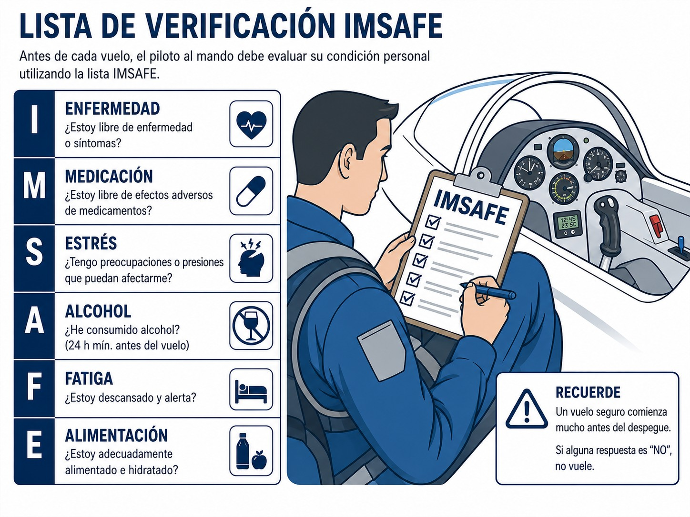
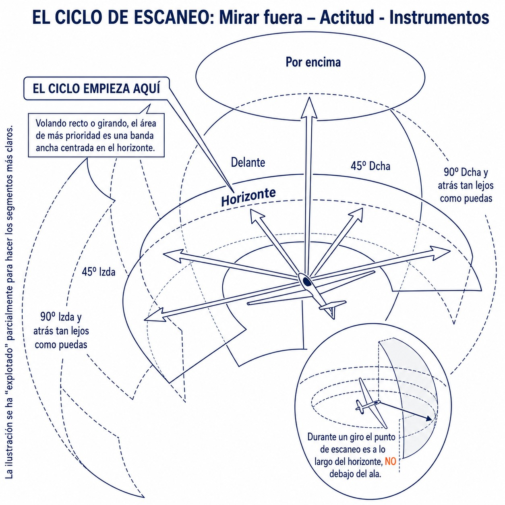
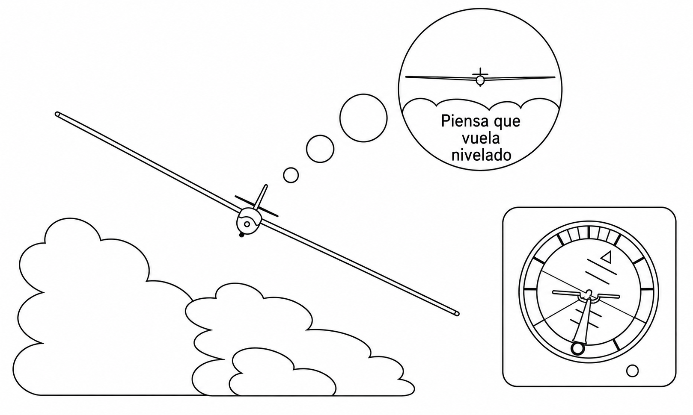
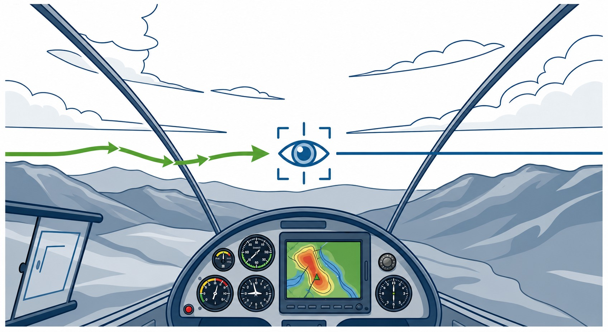
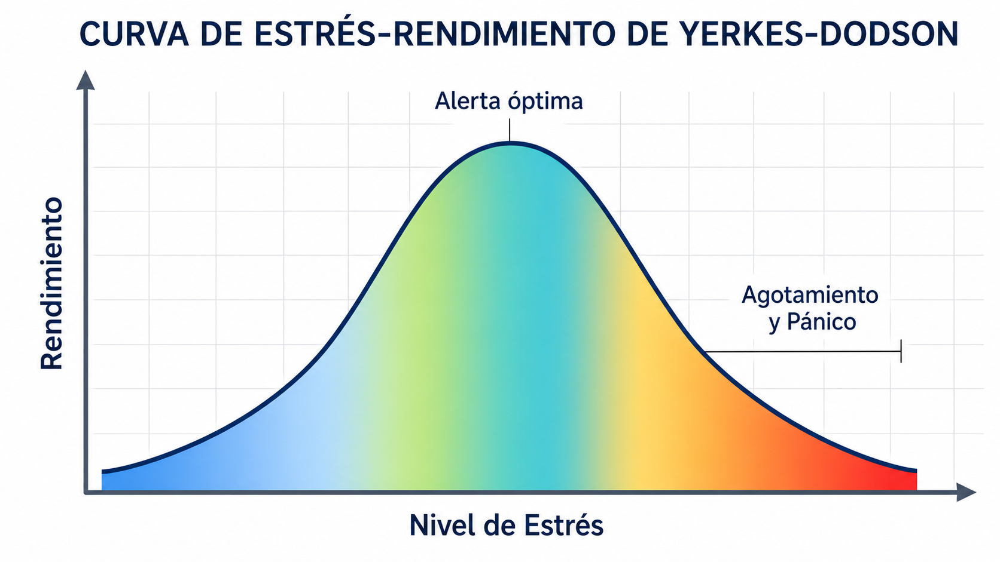

# Fisiología aeronáutica básica y mantenimiento de salud

> Este capítulo aborda cómo el entorno del vuelo afecta al organismo humano y los determinantes de la condición física del piloto de planeador. Repasaremos su impacto en los sentidos, el desgaste provocado por la altitud y las directrices normativas innegociables para preservar la seguridad operacional antes de situarse a los mandos.

## Aptitud para el vuelo y la evaluación personal (lista de chequeo IMSAFE)

Como piloto de planeador, el estado de salud física y mental es el componente más crítico para la seguridad del vuelo. La normativa europea establece claramente que un piloto debe abstenerse de volar si está incapacitado por cualquier causa, como una lesión, enfermedad, medicación, fatiga o los efectos de cualquier sustancia psicoactiva, o si simplemente se siente indispuesto.

::: {.callout-important title="Normativa"}
Es obligatorio consultar con un Médico Examinador Aéreo (AME) o médico general si se ha sufrido una lesión importante, cirugía, inicio de medicación regular, embarazo, o uso por primera vez de lentes correctoras. Estas situaciones requieren una nueva evaluación de la aptitud médica; el piloto debe abstenerse de volar al mando hasta que se resuelva la causa y recupere la condición apta (**MED.A.020 Decrease in medical fitness**).
:::

Para ayudar a evaluar sistemáticamente la condición individual antes de acceder a la cabina, la aviación ha estandarizado una lista de chequeo personal conocida por el acrónimo mnemotécnico **IMSAFE** (del inglés "I am safe" - **Estoy a salvo**). Esta revisión es tan vital como la propia inspección prevuelo del planeador (@fig-02-cap02-imsafe-checklist):

{#fig-02-cap02-imsafe-checklist}

* **I - *Illness* (Enfermedad):** ¿Tiene algún síntoma actual? Incluso un resfriado puede agravarse con los cambios de presión en vuelo (disbarismos) y mermar la capacidad de atención. No vuele si presenta fiebre o proceso vírico.
* **M - *Medication* (Medicación):** ¿Está tomando algún fármaco, con o sin receta? Muchos medicamentos de venta libre, como los antihistamínicos para la alergia, producen somnolencia y alteran el rendimiento cognitivo y motor.
* **S - *Stress* (Estrés):** ¿Existe alguna presión psicológica o emocional relevante? Problemas laborales, familiares o financieros graves reducen los recursos cognitivos disponibles, afectando la capacidad de juicio y el rendimiento en la cabina.
* **A - *Alcohol* (Alcohol):** ¿Ha consumido alcohol recientemente? Sus efectos residuales persisten mucho después de la ingesta. La norma en aviación es «de la botella al mando» (**bottle to throttle**): se requiere un margen mínimo de 8 horas desde la última copa.
* **F - *Fatigue* (Fatiga):** ¿Ha descansado y dormido lo suficiente? La fatiga reduce el estado de alerta, la capacidad de decisión y los tiempos de reacción de forma significativa.
* **E - *Eating* (Alimentación):** ¿Ha comido y bebido adecuadamente en las últimas horas? Volar en ayunas reduce los niveles de glucosa y merma la concentración. En jornadas largas, la hidratación es tan importante como la alimentación; beba agua con regularidad para prevenir la deshidratación y el golpe de calor.

::: {.callout-tip title="Regla de oro"}
Antes de cada vuelo, repase mentalmente la lista **IMSAFE**. Si alguno de sus elementos resulta desfavorable, la única decisión de seguridad es cancelar el vuelo (**NO-GO**).
:::

## El sistema sensorial y la orientación

### La visión

La visión es el sentido más importante para el piloto de planeador. Dado que nuestra evolución nos ha adaptado a movernos en dos dimensiones sobre el suelo, volar en un entorno tridimensional presenta desafíos únicos para nuestra percepción.

#### Anatomía visual básica

El interior del ojo funciona de forma similar al sensor de una cámara de fotos. La luz entra y se proyecta sobre la **retina**, que contiene dos tipos principales de células fotorreceptoras:

* **Conos:** Funcionan bien con buena iluminación. Nos permiten ver los detalles finos en el centro de nuestro campo visual y distinguir los colores (visión diurna).
* **Bastones:** Se sitúan principalmente en la zona periférica de la retina. No distinguen colores, pero son muy sensibles a la luz tenue y excelentes para detectar el movimiento lateral (visión nocturna y periférica).

Existe un "punto ciego" anatómico en el lugar donde el nervio óptico se conecta con la retina, por lo que una imagen proyectada exactamente en esa pequeña área no será visible. Además, factores como la miopía, el exceso de sol, el tabaco o la fatiga reducen significativamente la agudeza visual.

::: {.callout-important title="Normativa"}
Una percepción correcta de los colores es obligatoria. Durante el reconocimiento médico inicial deberá superar pruebas como el test de Ishihara. Si no demuestra discriminación de color segura, la licencia de piloto de planeador —regida por la normativa Part-SFCL— quedará restringida al vuelo diurno (**Day** VFR).
:::

#### Técnicas de escaneo visual

El método principal para prevenir colisiones en vuelo visual es la técnica de "Ver y Evitar" (**See and Avoid**). Un buen piloto dedica más del 95% de su tiempo a mirar fuera de la cabina, limitando la consulta de los instrumentos a vistazos rápidos de 2 a 4 segundos.

Para escanear el cielo de forma eficaz, utiliza el método del reloj (@fig-02-cap02-escaneo-visual):

1. Considere el morro del planeador como las **12 en punto**.
2. Realiza barridos visuales estructurados por sectores, desde las **9** hasta las **3**.
3. Concéntrate especialmente en la franja de cielo más cercana a la línea del horizonte, ya que las aeronaves que vuelan a la misma altitud aparecerán mayoritariamente en esa zona.

{#fig-02-cap02-escaneo-visual}

::: {.callout-note title="Airmanship"}
Antes de iniciar un viraje (por ejemplo, a la derecha), acostúmbrese a mirar brevemente hacia atrás por el lado exterior opuesto. Esto asegura que no haya tráfico acercándose por el ángulo muerto antes de inclinar las alas e iniciar el giro.
:::

::: {.callout-warning title="Seguridad"}
El riesgo más grave de colisión en vuelo libre se produce en trayectorias frontales, habituales en vuelos de ladera o calles de nubes. Al aproximarse de frente, el otro planeador carece de movimiento lateral apreciable en el campo visual y simplemente aumenta de tamaño de forma repentina. Un piloto necesita al menos 3 segundos para reaccionar y ejecutar una maniobra evasiva, que deberá realizarse preferentemente **virando hacia la derecha**.
:::

#### Visión nocturna e ilusiones ópticas aeronáuticas

La capacidad visual humana se degrada con la escasez luminosa y la disminución de oxígeno. A partir de altitudes relativamente bajas (6.000 pies), la cantidad de oxígeno en sangre se reduce lo suficiente como para afectar al funcionamiento de los bastones periféricos en vuelos con poca luz, limitando prematuramente la agudeza visual.

Por otro lado, la falta de texturas y contornos fiables en la oscuridad, en entornos nevados o sobre el agua facilita la aparición de peligrosas ilusiones en el cerebro del piloto:

* **Aproximación de agujero negro (**Black Hole Approach**):** Al realizar el tramo final hacia una pista iluminada rodeada de terreno muy oscuro y sin referencias luminosas laterales (como un lago), el cerebro pierde la percepción real de profundidad. La ilusión lleva a creer que vuelas más alto de lo real y que la senda es más empinada de lo normal. Esto genera el impulso de picar el morro para «corregirla», con riesgo de impacto antes del umbral. La medida correctiva es mantener la velocidad indicada por el anemómetro e ignorar la sensación hasta recuperar referencias visuales de textura en tierra.
* **Ilusión autocinética:** Al fijar la mirada sobre una luz aislada en la oscuridad durante varios segundos, los micromovimientos involuntarios del ojo producen la falsa percepción de que la luz se desplaza. Esto puede confundir al piloto respecto a si se trata de otra aeronave en movimiento. El remedio es mantener el escaneo visual activo, evitando fijar la vista en un foco único durante más de unos pocos segundos.

{#fig-02-cap02-ilusiones-opticas}

### El oído y el sistema vestibular

Los disbarismos son una serie de alteraciones orgánicas secundarias a la expansión y contracción de los diminutos volúmenes de gas atrapados en el interior del cuerpo humano como consecuencia del cambio externo en la presión barométrica, cumpliendo rigurosamente la **Ley de Boyle**.

Al emprender un ascenso con el planeador, la presión atmosférica decae. El aire atrapado se expande buscando salir. Esto afecta sustancialmente tres regiones de la anatomía:

1. **Oído medio:** El conducto que iguala la presión con el exterior es la trompa de Eustaquio. En subida, el aire en expansión suele escapar por ella sin gran esfuerzo, incluso con algo de congestión. El problema serio llega en el **descenso**: con la trompa inflamada por un resfriado, el aire no consigue volver a entrar, el tímpano se deforma hacia dentro y aparece un dolor intolerable, la **barotitis media**.
2. **Senos paranasales:** Al igual que en los oídos, la obstrucción temporal originará un intenso dolor neurálgico en la zona de las cejas o maxilares.
3. **Tracto gastrointestinal y caries:** La ingestión de alimentos productores de gas antes de un vuelo desembocará en molestos retortijones en altura, de igual modo que una pequeña burbuja atrapada bajo un empaste dental puede ocasionar en ascenso un dantesco dolor de muelas "barodóntico".

::: {.callout-note title="Airmanship"}
La congestión de vías altas (catarros, rinitis alérgicas fuertes) es una causa automática de auto-exclusión para volar (**No-Go**). El atroz dolor del barotrauma provocado en un descenso anulará por completo la capacidad para gobernar con seguridad el planeador.
:::

## Desorientación espacial e ilusiones sensoriales

Durante un vuelo térmico bajo las nubes, la orientación precisa requiere integrar tres fuentes de información: la visión, el sistema propioceptivo (señales de músculos y tendones) y, de forma fundamental, el **sistema vestibular** del oído interno, encargado de percibir la aceleración.

Los sentidos humanos evolucionaron para el movimiento bidimensional sobre el terreno bajo una gravedad constante. Al volar sin referencias visuales fiables del horizonte, el cerebro es susceptible de generar ilusiones que producen **desorientación espacial**: una falsa apreciación de la posición u orientación real en el espacio.

* **Ilusiones vestibulares:** Un viraje prolongado y estable en térmica puede engañar a los canales semicirculares, induciendo la percepción de que el planeador está nivelado o virando apenas (ilusión de estabilidad). En sentido contrario, la turbulencia severa puede impulsar al piloto a tirar bruscamente de la palanca cuando el avión se mantiene de hecho en actitud normal.
* **Ilusiones ópticas:** Una perspectiva de aproximación inclinada, la falta de texturas en el suelo (nieve, agua) o una pista significativamente más ancha o estrecha que la habitual pueden producir sesgos perceptivos en la estimación de la altitud sobre el umbral.

::: {.callout-warning title="Seguridad"}
Cuando se pierde la referencia del horizonte y lo que el piloto «siente» contradice lo que señalan los instrumentos, debe ignorar el instinto. **Confíe en los instrumentos** (anemómetro, hilo de lana, bola y horizonte artificial) y actúe en consecuencia.
:::

## Cinetosis (motion sickness o mareo)

La cinetosis (**motion sickness**), o mareo en vuelo, es una reacción fisiológica que se produce cuando el cerebro recibe señales contradictorias de los distintos sentidos. En la cabina de un planeador, el malestar suele aparecer cuando lo que perciben los ojos no coincide con lo que el sistema vestibular del oído interno registra en cuanto a aceleraciones y giros.

Un caso típico: el piloto vira sostenidamente en una térmica y agacha la cabeza para programar el ordenador de vuelo. Los ojos, fijos en la pantalla estática, indican que no hay movimiento; pero el laberinto del oído interno continúa detectando variaciones de fuerza G y movimiento rotatorio. Este conflicto sensorial desencadena una respuesta de malestar que puede progresar hacia fatiga repentina, palidez, sudoración fría, náuseas y vómitos.

::: {.callout-note title="Airmanship"}
El mareo puede afectar incluso a pilotos curtidos, especialmente tras períodos de inactividad o en condiciones de turbulencia severa. No es motivo de vergüenza: asúmalo con naturalidad y lleve siempre a bordo, al alcance de la mano, bolsas de mareo.
:::

{#fig-02-cap02-cinetosis-fijacion}

Para prevenir y gestionar el fantasma del mareo en vuelo, interioriza y aplica en cabina las siguientes medidas (@fig-02-cap02-cinetosis-fijacion):

* **La mirada al horizonte:** El remedio más eficaz es la referencia visual exterior. Ante los primeros síntomas de malestar, levante la barbilla, busque el horizonte natural y fije la vista en un punto lejano. Evite mirar los instrumentos o leer documentos en la rodillera.
* **Reducción del movimiento:** Limite los movimientos bruscos de cabeza. Las aceleraciones negativas prolongadas incrementan la susceptibilidad al mareo; evite transiciones de actitud extremas sin necesidad.
* **Vuelos con pasajeros:** Con pasajeros sin experiencia a bordo, sea prudente. Limite los vuelos de familiarización a unos 30 minutos y realice virajes suaves para evitar una experiencia aérea desagradable.
* **Hidratación:** La deshidratación en una cabina calentada por el sol bajo el plexiglás agrava el malestar. Lleve agua suficiente, beba con regularidad e incremente la ventilación facial para acceder a aire fresco.

::: {.callout-warning title="Seguridad"}
No ingiera fármacos antihistamínicos contra el mareo (como la **Biodramina**) antes de pilotar. Su formulación está contraindicada en aviación: producen somnolencia profunda que compromete gravemente los tiempos de reacción y el estado de alerta necesarios para la seguridad del vuelo.
:::

Si a pesar de las precauciones la cinetosis resulta limitante bajo los mandos, la prioridad es la seguridad. En bipuesto, transfiera los mandos al piloto calificado a bordo anunciando «**tienes los mandos**» o «**tuyo**». En monoplaza, estabilice el planeador en vuelo recto y nivelado para reducir el conflicto sensorial del oído interno, abra la ventilación al máximo y abrevié la misión buscando aterrizaje inmediato.

## Intoxicación por monóxido de carbono (riesgos en motoveleros o remolcadores)

Aunque el velero puro carece de motor, una parte significativa de la flota actual está compuesta por motoveleros (**Touring Motor Gliders**, TMG) o planeadores con motor retráctil. En estas aeronaves, al encender la calefacción de cabina —que suele extraer calor directamente del tubo de escape— existe riesgo de **intoxicación por monóxido de carbono (CO)**. Durante la fase de despegue en remolque, también pueden inhalarse gases de escape del avión remolcador.

El monóxido de carbono es inodoro, incoloro e insípido. Su afinidad por la hemoglobina es unas 200 veces superior a la del oxígeno: al inhalarlo, se une a la hemoglobina e impide el transporte de O₂ al cerebro, produciendo **hipoxia anémica** sin necesidad de estar a gran altitud. Como referencia habitual en la literatura aeromédica, fumar unos pocos cigarrillos antes del vuelo eleva la saturación de CO en hemoglobina hasta un nivel que degrada la visión nocturna de forma equivalente a volar ya a varios miles de pies, aun a cota baja. (Las cifras exactas varían según la fuente y el número de cigarrillos; el mensaje operativo —fumar antes de volar recorta tu visión nocturna— no cambia.)

Los síntomas iniciales son inespecíficos: dolor de cabeza o debilidad muscular leve que progresa rápidamente hacia náuseas, desorientación, visión borrosa y euforia inapropiada. Sin intervención, desemboca en pérdida de consciencia.

::: {.callout-warning title="Seguridad"}
En motoveleros, lleve instalado un detector de monóxido de carbono en el panel y verifique su fecha de caducidad. Ante cualquier síntoma (dolor de cabeza, labios de color rojo intenso) o si el parche cambia de color, actúe de inmediato: **corte la calefacción**, abra la ventilación al máximo, utilice oxígeno suplementario si dispone de él y aterrice sin dilación.
:::

## Hipotermia y frío en altitud

El vuelo a vela implica, con frecuencia, alcanzar grandes altitudes. Recuerde que el gradiente térmico de la atmósfera estándar reduce la temperatura exterior a razón de unos 2 °C por cada 1.000 ft. A 4.000 m se pueden registrar –20 °C, y en las proximidades de la tropopausa, valores de –50 °C o inferiores.

La posición de pilotaje semirreclinada y la escasa actividad muscular favorecen la aparición de **hipotermia** (temperatura corporal central inferior a 35 °C). Además, la irradiación solar directa puede crear una sensación de confort térmico en el tronco, mientras los pies y piernas, en la sombra del panel frontal, quedan expuestos a temperaturas muy bajas con riesgo de congelación.

Los síntomas hipotérmicos comienzan con temblores musculares, y progresan hacia letargo, confusión mental y alteraciones del habla. El riesgo adicional es que el frío reduce la capacidad del piloto para percibir su propio deterioro. Las bajas temperaturas también pueden inutilizar las baterías de los instrumentos electrónicos —incluido el regulador de oxígeno— complicando una situación ya de por sí delicada.

::: {.callout-note title="Airmanship"}
Para volar en onda invernal, abríguese siempre **por capas**. Evite tajantemente el calzado o calcetines que aprieten excesivamente; el pie inmovilizado sobre los pedales necesita un flujo sanguíneo sin restricciones para no congelarse. Elija botas lo suficientemente holgadas, suelas térmicas y guantes que permitan plena libertad de movimiento sobre la palanca de mandos.
:::

## Estrés fisiológico y sus efectos

El estrés en la cabina no siempre es un enemigo. En su justa medida, un nivel moderado de tensión —como el que se siente justo antes del despegue en una competición o al afrontar tu primer vuelo de ladera— resulta positivo y necesario. Activa el sistema nervioso, eleva el nivel de alerta y afina la capacidad de reacción, llevándole al punto de rendimiento máximo.

Conviene distinguir dos marcos complementarios, porque describen cosas distintas. El primero, la **curva de Yerkes-Dodson**, relaciona el nivel de activación con el rendimiento: en forma de U invertida, muy poca tensión da un piloto apático y demasiada, uno bloqueado; el máximo está en el punto medio (@fig-02-cap02-curva-estres).

{#fig-02-cap02-curva-estres}

El segundo marco, el **Síndrome General de Adaptación** de Hans Selye, describe cómo responde el organismo cuando la tensión se prolonga, atravesando tres fases consecutivas:

1. **Fase de alarma (reacción):** Ante un elemento novedoso o una amenaza abrupta, el cuerpo libera adrenalina de golpe. El ritmo cardíaco y respiratorio se disparan, las pupilas se dilatan y el cerebro entra en estado de máxima alerta preparándose para reaccionar o huir.
2. **Fase de resistencia (adaptación):** Si el factor estresante no desaparece a los pocos minutos (por ejemplo, lidiando con descendencias fuertes sistemáticas y lejos de un campo aterriceble seguro), el cuerpo intenta amoldarse y mantener la compostura mediante un esfuerzo fisiológico activo para regularse.
3. **Fase de agotamiento:** Cuando la situación supera al piloto en intensidad o duración, las reservas de energía de la fase dos se vacían. El agotamiento entra en escena, provocando un deterioro rápido y catastrófico de la capacidad analítica y merma en la pericia a los mandos.

### Hiperventilación

Una de las manifestaciones físicas del estrés agudo —no de una falta real de oxígeno— es la **hiperventilación**: una respiración excesivamente rápida y profunda desencadenada por la ansiedad.

Esta respiración acelerada elimina grandes cantidades de dióxido de carbono (CO₂) de la sangre, aumentando su pH (alcalosis respiratoria). Paradojicamente, aunque los pulmones mueven más aire, la falta de CO₂ impide que la hemoglobina libere el oxígeno en los tejidos cerebrales.

Los **síntomas** son característicos: hormigueo y entumecimiento en manos y pies, calambres alrededor de la boca, palpitaciones, náuseas, palidez y una sensación de asfixia a pesar de estar respirando. Sin intervención, puede derivar en somnolencia y pérdida de consciencia.

El tratamiento inmediato consiste en reducir conscientemente el ritmo respiratorio. Hablar o cantar en voz alta regula el ciclo ventilatorio; también puede ser útil aguantar la respiración unos segundos para restaurar los niveles de CO₂ en sangre.

### Exceso de confianza, presión y toma de decisiones

El estrés prolongado tiene efectos corrosivos sobre la seguridad: puede generar **exceso de confianza** o anular el análisis crítico. La presión —ganar una manga, seguir a un piloto más experimentado, o el simple deseo de llegar a destino— induce a asumir riesgos que, en tierra, consideraría inaceptables. Evalúe sus capacidades con rigor y honestidad. Los mejores pilotos de competición tienen un rasgo en común: son exigentes con la revisión crítica de sus propias decisiones tras el aterrizaje.

::: {.callout-note title="Airmanship"}
Para mantener el estrés dentro del rango operativo de seguridad, es vital **evitar la suma de numerosas "primeras veces"** en un mismo despegue. Volar un modelo de velero totalmente nuevo para ti, despegando en remolque desde un aeródromo que no conoces y encarando un día de un vendaval racheado cruzado es una convergencia explosiva de factores inéditos. La mente sobrepasará la fase de alarma directamente al pánico. Intente siempre que la progresión añada estas variables de una en una.
:::

## Fatiga (aguda y crónica) y su impacto en el rendimiento

Si el estrés agudo es una amenaza inmediata, la fatiga es un factor crónico que deteriora el rendimiento mental y físico antes de que aparezcan signos evidentes como el bostezo.

La fatiga degrada de forma global las capacidades del piloto: reduce la capacidad analítica, entorpece el razonamiento, ralentiza la toma de decisiones, empeora el tiempo de reacción y disminuye la atención sostenida necesaria para detectar otros tráficos.

Conviene tener presente que volar tras un día laboral agotador afecta al circuito de llegada del mismo modo que hacerlo con déficit de sueño. Un error habitual es subestimar el papel de los ritmos circadianos en el rendimiento del piloto.

::: {.callout-warning title="Seguridad"}
**La fatiga solo se cura durmiendo.** El café y las bebidas energéticas enmascaran temporalmente los síntomas, pero no restauran las capacidades cognitivas. Si la fatiga afecta a la atención o el razonamiento, la decisión es **NO-GO** (cancelación del vuelo).
:::

## Deshidratación, golpe de calor y exposición al sol

La cúpula de plexiglás actúa como un invernadero durante los meses de verano. Al volar en térmica, con ropa de vuelo y el paracaídas a la espalda, la temperatura en cabina puede elevarse considerablemente.

Bajo estas condiciones, y con una tasa respiratoria mayor por la altitud, el cuerpo se refrigera sudando de forma intensa. Es habitual perder entre 1 y 3 litros de agua por hora sin percibirse apenas.

Una deshidratación progresiva espesa la sangre y perjudica la circulación. Los primeros síntomas son dolor de cabeza y fatiga creciente. Si el proceso continúa, aparecen calambres musculares y, en casos graves, un **golpe de calor** que puede producir taquicardia y pérdida de consciencia (**black out**) sobre los mandos.

::: {.callout-tip title="Regla de oro"}
El mecanismo biológico de la **sed** tiene un imperdonable retraso biológico. Cuando siente la boca seca, la deshidratación ya ha mermado el rendimiento cognitivo. Además, el agua que se beba en la cabina tardará unos 20 minutos en hidratar el flujo sanguíneo de forma efectiva. **Adelántese bebiendo de forma regular durante todo el vuelo; nunca espere a tener sed**.
:::

## Efectos del alcohol, drogas, automedicación y dopaje

La normativa aeronáutica prohíbe volar bajo los efectos de sustancias psicoactivas. La seguridad en la cabina exige que el juicio y los reflejos del piloto operen sin ninguna merma.

### La regla «de la botella al mando»

El alcohol es el depresor del sistema nervioso central más extendido. Sus efectos sobre el tiempo de reacción se agravan en altitud por la menor oxigenación en sangre (hipoxia hipobárica).

::: {.callout-important title="Normativa"}
**AMC1 SAO.GEN.130(f)** (ED Decision 2019/001/R) concreta la regla «de la botella al mando» (**bottle to throttle**) para las tripulaciones de planeador: nada de alcohol en las **8 horas previas** al vuelo, y una alcoholemia al inicio del vuelo que no supere **0,2 g/l** —o el límite nacional, si es más estricto.
:::

Circula la idea de que en España se exige «cero alcohol» para volar. No es así: **España no ha fijado un límite nacional más estricto** —así lo indica el propio material de AESA sobre las pruebas de alcoholemia en rampa, cuyo formulario recoge «Límite Nacional Reglamentario (no definido en España)»—, de modo que se aplica el umbral de 0,2 g/l de la norma EASA. No lo confundas con el tráfico rodado. Dicho esto, ese 0,2 g/l es un límite legal, no un objetivo: la única práctica segura es subirte al planeador sin nada de alcohol en el cuerpo.

### Automedicación, antihistamínicos y analgésicos

Dejando a un lado las drogas ilegales, que invalidan automáticamente el certificado médico EASA, el mayor peligro oculto en la aviación general es la **automedicación**.

Medicamentos de venta libre —como los **antihistamínicos** para la alergia estacional o las pastillas contra el mareo— resultan incompatibles con el vuelo. Estas sustancias enlentecen los reflejos y producen somnolencia que el piloto a menudo no percibe como tal.

**La regla básica es sencilla: si el prospecto del medicamento desaconseja conducir vehículos o manejar maquinaria pesada, está totalmente prohibido volar bajo sus efectos**.

### Dopaje y autorización terapéutica (AUT)

El vuelo a vela de competición está regulado internacionalmente y se somete a controles estrictos regidos por la **Agencia Mundial Antidopaje (WADA)** al igual que cualquier otro deporte de alto rendimiento.

::: {.callout-note title="Airmanship"}
Para volar en campeonatos bajo un tratamiento médico sin arriesgarte a una descalificación (hay controles al aterrizar), debes justificar la medicación tramitando previamente una **Autorización de Uso Terapéutico (AUT / TUE)**. Este documento oficial eximirá al competidor de sanciones en controles antidopaje deportivos.
:::

**Resumen del capítulo: Fisiología aeronáutica**

* **Aptitud IMSAFE:** Revise el estado con la lista **Illness**, **Medication**, **Stress**, **Alcohol**, **Fatigue**, **Eating** antes del despegue. Ante dudas, cancele el vuelo (**NO-GO**). Si concurren problemas médicos importantes, consulte a un médico examinador aéreo (AME).
* **Disbarismos:** Los gases corporales se expanden al ascender. No vuele nunca con resfriados o congestión nasal; el dolor en los tímpanos y senos paranasales por el cambio de presión le incapacitará para pilotar.
* **Ilusiones sensoriales:** El oído interno engañará cuando se pierdan las referencias visuales exteriores. Si existe desorientación sin un horizonte claro, ignore las sensaciones y confíe ciegamente en los instrumentos.
* **Monóxido de carbono (CO):** Gas letal, inodoro, incoloro e insípido que solo puede detectarse con un detector específico. Es un peligro real en motoveleros (TMG) por los gases del motor y el sistema de calefacción de cabina. Ante el menor síntoma o aviso del detector, corte la calefacción, abra la ventilación y aterrice inmediatamente.
* **Hipotermia:** La inactividad en la cabina y el frío en altitud robarán el calor rápidamente, minando los reflejos y lucidez. Vuele siempre con ropa de abrigo puesta por capas y evita el calzado apretado para no limitar la circulación.
* **Estrés e hiperventilación:** El pánico puede hacer jadear al implicado sin control, alterando el nivel de dióxido de carbono en la sangre, provocando entumecimiento y ceguera. Para frenarlo, ralentice conscientemente la respiración prolongando la exhalación, hable en voz alta o cante para regularse.
* **Deshidratación:** La cabina cerrada es un invernadero y se pierden líquidos rápidamente. Cuando siente sed, ya tiene un déficit que merma las capacidades cognitivas. Beba agua regularmente desde el despegue para anticiparse a los dolores de cabeza o a un mortal golpe de calor.
* **Fatiga:** El cansancio bloquea el tiempo de reacción y nubla la toma de decisiones. El café o una bebida no previenen sus efectos ocultos sobre la atención. La fatiga solo se cura de una manera: durmiendo para dar pie al necesario descanso reparador.
* **Normativa EASA, medicación y alcohol:** La regla no tiene excepciones: **«de la botella al mando»**, 8 horas sin alcohol y alcoholemia inferior a 0,2 g/l (AMC1 SAO.GEN.130(f)). No se automedique; hasta las inocentes pastillas de la alergia o del mareo adormecen de forma incapacitante para volar.
