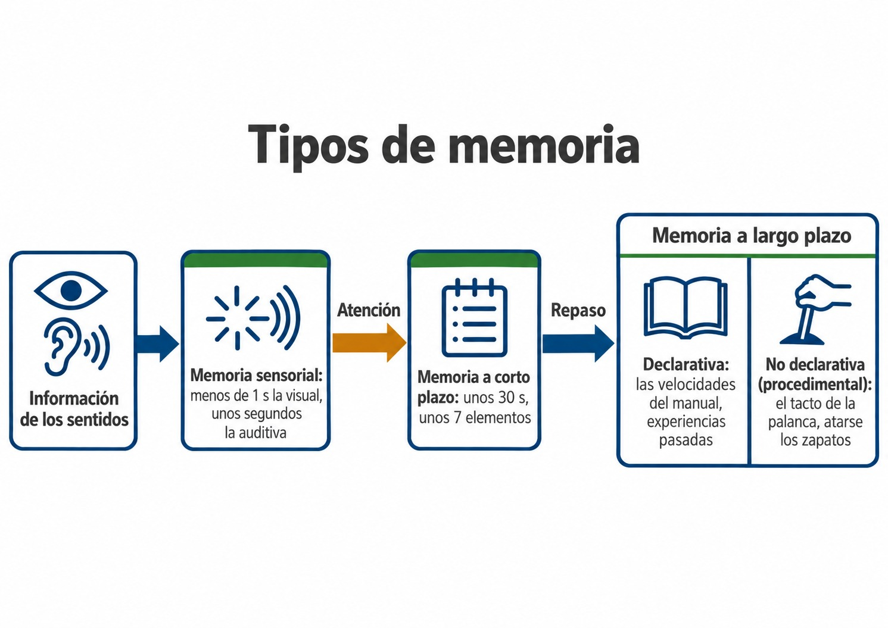
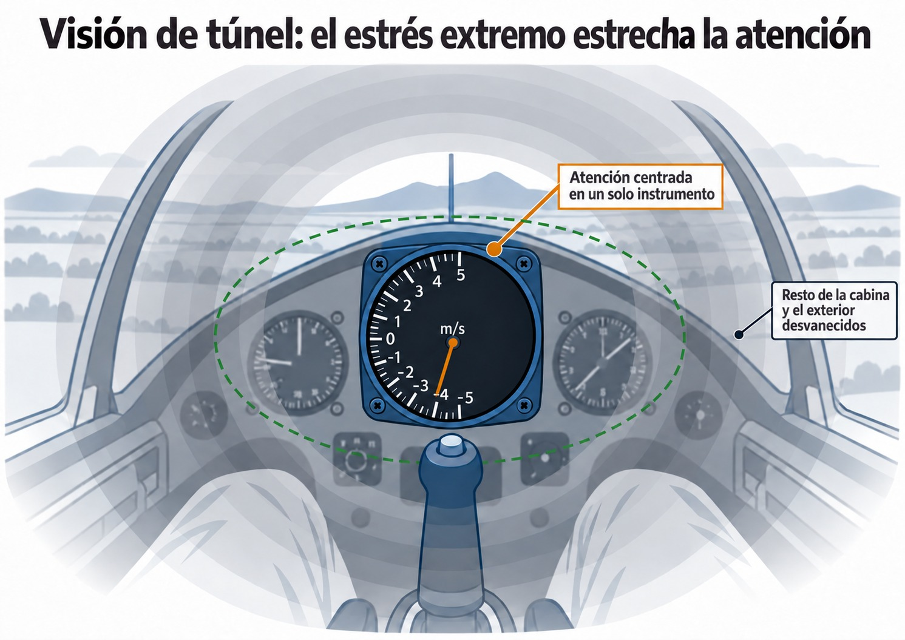

# Psicología aeronáutica básica

> Volar bien es, sobre todo, decidir bien. Este capítulo trata de la mente del piloto: cómo procesa la información, cómo decide bajo presión y qué actitudes y trampas psicológicas conviene reconocer en uno mismo.
>
>
> En este capítulo aprenderás:
>
>
> * **El procesamiento de la información**: percepción, atención y los tipos de memoria.
> * **La conciencia situacional**: qué es y qué la degrada.
> * **La toma de decisiones (ADM)**: el modelo DECIDE y la gestión de riesgos con PAVE.
> * **Las cinco actitudes peligrosas** y sus antídotos.
> * **La carga de trabajo y el SRM**: visión de túnel, sobrecarga y gestión de recursos del piloto solo.

## Procesamiento de la información: atención, memoria y percepción

Mientras vuelas, el cerebro procesa información sin parar con tres mecanismos que trabajan juntos: percepción, atención y memoria.

**La percepción** es la capacidad de interpretar los elementos ambientales y los cambios en las variables de vuelo (variación del viento, proximidad del terreno). A diferencia del entorno en tierra, el entorno aéreo carece de las referencias habituales de profundidad y tamaño. Esto hace que interpretar las distancias sea más exigente, y un exceso de información, sin las señales habituales, puede provocar una sobrecarga de trabajo.

**La atención** es el filtro que permite centrarse en la información relevante de la cabina y el entorno exterior. Y se agota: factores biológicos o psicológicos la reducen deprisa y te impiden ver la situación completa.

**La memoria**, en la que el hipocampo desempeña un papel clave, permite codificar, almacenar y recuperar información. En la cabina se utilizan distintos sistemas (@fig-02-cap03-memoria-tipos):

* **Memoria sensorial:** Retiene la información apenas un instante tras percibirla por los sentidos: menos de un segundo la visual y unos segundos la auditiva.
* **Memoria a corto plazo:** Dura unos 30 segundos y admite unos 7 elementos; es la «memoria RAM» del piloto, la que usa para lo que está pasando ahora mismo.
* **Memoria a largo plazo:** Guarda lo aprendido. Se divide en no declarativa (procedimental o inconsciente, como el tacto mecánico de la palanca) y declarativa (explícita, combinando la memoria episódica con la memoria semántica, como las velocidades del manual o experiencias pasadas).

{#fig-02-cap03-memoria-tipos}

## Conciencia situacional (**Situational Awareness**) y factores que la reducen

La conciencia situacional (**Situational Awareness**) es la percepción y asimilación adecuada de los elementos del entorno en un volumen de tiempo y espacio, la comprensión analítica de su significado y, fundamentalmente, la proyección de su estado o ubicación en el futuro más próximo.

En la cabina del planeador, esto implica construir y mantener durante el vuelo una imagen mental precisa de lo que ocurre: la variación y tendencia del viento, la posición real frente al campo de aterrizaje, la ocupación del circuito de tráfico, las condiciones del resto de las aeronaves y las variables propias de altitud y energía.

::: {.callout-warning title="Seguridad"}
La pérdida de la conciencia situacional aparece con frecuencia en las cadenas de accidentes del vuelo a vela. Una sobrecarga de la atención, el pánico derivado de un fenómeno no comprendido, la fatiga o la incomodidad en un asiento mal ajustado reducen mucho la capacidad de hacerse una idea completa de la situación.
:::

## Toma de decisiones aeronáuticas (**Aeronautical Decision-Making** — ADM)

La Toma de Decisiones Aeronáuticas (ADM, por las siglas de **Aeronautical Decision Making**) es el proceso mental, sistemático y repetible, empleado por el piloto para decantarse por el mejor camino de acción posible como respuesta a unas circunstancias dadas en la cabina del planeador.

En térmica o en la final, el piloto evalúa la situación y sus peligros, hace un plan, gestiona el riesgo y actúa. Uno de los esquemas más usados en la aviación civil para entrenar la ADM es el **modelo DECIDE** (@fig-02-cap03-decide):

* **D**etect (detectar) que se ha producido un cambio o un error que requiere atención.
* **E**stimate (estimar) si hace falta reaccionar, reuniendo activamente toda la información sobre lo que ocurre.
* **C**hoose (elegir) el resultado que se busca, después de considerar todas las vías posibles para resolver el peligro.
* **I**dentify (identificar) las acciones que permiten conseguirlo.
* **D**o (hacer): ejecutar la acción elegida, de manera metódica, rápida o pausada según lo pida la situación.
* **E**valuate (evaluar) el resultado: comprobar si el curso tomado corrige el desvío, aprender de ello y comunicar las conclusiones.

{#fig-02-cap03-decide .corregir}

## Gestión de riesgos y modelos de evaluación (modelo PAVE)

Todo vuelo tiene peligros. No puedes evitarlos todos; lo que sí puedes es identificarlos, evaluarlos y reducirlos con método. De eso trata la gestión de riesgos.

El **modelo PAVE** divide los riesgos del vuelo en cuatro elementos fáciles de evaluar:

* **P (Piloto):** Estado fisiológico y psicológico. ¿Está el piloto descansado? ¿Sufre fatiga o estrés? ¿Cumple los requisitos de experiencia reciente?
* **A (Aeronave):** Estado del planeador. ¿Es el equipo adecuado para el vuelo previsto? ¿Están los instrumentos operativos y las revisiones vigentes?
* **V (enVironment — Entorno):** Meteorología, aeródromos de alternativa, orografía, densidad de tráfico y espacio aéreo.
* **E (*External pressures*, presiones externas):** Factores como la necesidad de finalizar un curso, la presión de no decepcionar a un pasajero o la urgencia ante una ventana meteorológica en cierre.

PAVE se aplica dentro del **modelo de las «3 P»** de gestión de riesgos: **percibir** los peligros del vuelo (con PAVE), **procesar** su efecto sobre la seguridad y **actuar** (*Perform*) aplicando la mejor medida. El ciclo se repite durante todo el vuelo.

::: {.callout-tip title="Regla de oro"}
Repasa tu vuelo con PAVE antes de despegar: así puedes cortar la cadena del error antes incluso de sentarte en la cabina.
:::

## Reconocimiento y mitigación de actitudes peligrosas

Tus actitudes marcan cómo reaccionas ante el riesgo. La instrucción aeronáutica distingue cinco actitudes peligrosas que tienes que saber reconocer en ti mismo y neutralizar.

### Antiautoridad (**anti-authority**)

"No me digan lo que tengo que hacer" o simple indisciplina. Un piloto con antiautoridad rechaza los estándares establecidos, las normas o los consejos de instructores veteranos por considerarlos innecesarios o excesivos.

**Antídoto:** Sigue las reglas: casi siempre tienen razón, y muchas nacieron de un accidente.

### Impulsividad (**impulsivity**)

"Tengo que hacer algo, y tiene que ser ya mismo". Ante un problema, el piloto siente la necesidad de actuar ya, sin pararse a pensar en las consecuencias.

**Antídoto:** Salvo contadas emergencias extremas, tómate un segundo para aplicar el modelo DECIDE. "No tan deprisa, piensa primero".

### Invulnerabilidad (**invulnerability**)

"A mí no me va a pasar". El piloto es consciente de la existencia de riesgos, pero cree que a él no le va a tocar.

**Antídoto:** Los accidentes le ocurren a cualquiera que exponga su aeronave a una situación donde no existe margen de seguridad. "Podría pasarme a mí".

### Arrogancia o exceso de confianza (*Macho*)

"Yo sí que puedo hacerlo". El piloto quiere impresionar y demostrar lo bueno que es: se arriesga sin necesidad, se salta indicaciones y confía demasiado en su pilotaje.

**Antídoto:** Aceptar tus límites es la mejor muestra de **airmanship**, de buen aviador. Correr riesgos innecesarios es de inmaduros.

### Resignación (**resignation**)

"¿De qué sirve? Todo está perdido". Ante la adversidad o la complejidad de una pérdida en ruta, el piloto cree que no tiene control sobre la situación y deja de pilotar y se convierte en un pasajero más. A veces va unida a la complacencia ante problemas menores.

**Antídoto:** Nunca dejes de volar la aeronave. Siempre hay alguna acción que puede mejorar la situación, confía en tu entrenamiento. "Yo no tengo por qué rendirme, puedo cambiar esto".

## Gestión de la carga de trabajo y el estrés psicológico en vuelo

El estrés es la respuesta biológica no específica con la que el cuerpo humano reacciona ante cualquier demanda física, ambiental o psicológica que se le impone. Funciona como un sistema de alarma muy antiguo que avisa de un posible peligro.

Al contrario de lo que se suele pensar, no todo el estrés es malo. Un nivel moderado (como el de tu primer vuelo solo) ayuda: te pone alerta, agudiza los sentidos y acelera la reacción. Ahí es donde más rindes.

Sin embargo, si la presión psicológica continúa aumentando (por ejemplo, te metes inadvertidamente en condiciones instrumentales severas ignorando tus límites), este estrés tolerable se transforma rápidamente en pánico. El rendimiento cae en picado y los sentidos se saturan. El cerebro no puede procesar todo lo que le llega de la cabina, se bloquea y pone toda la atención que le queda en un solo detalle del vuelo, a menudo el menos importante, y deja de atender a todo lo demás. Es lo que se llama, de manera informal, **visión de túnel** (@fig-02-cap03-vision-tunel).

::: {.callout-warning title="Seguridad"}
Bajo condiciones de estrés extremo y pánico, instintos básicos de supervivencia como intentar "alejarse del suelo tirando fuertemente de la palanca" pueden superar tu raciocinio. A baja altura, ese tirón brusco gasta la energía del planeador y acaba en una pérdida de control o en una barrena sin altura para recuperarla. Conoce tus límites y no te metas en situaciones para las que no estás bien preparado.
:::

{#fig-02-cap03-vision-tunel .corregir}

Cada segundo en vuelo, el piloto percibe información del entorno, la procesa y actúa en consecuencia. La mente sólo puede procesar a la vez una cantidad limitada: es como un vaso de agua, que admite cierto volumen y no más. En un remolque turbulento, de espaldas al sol, buscando a otro velero que notifica en base, el vaso se desborda. A esto se le conoce como **sobrecarga de trabajo**: llegan más tareas e información de las que caben en el tiempo disponible. Cuando además la tarea es demasiado difícil para el entrenamiento del piloto en ese momento, el margen de seguridad desaparece.

::: {.callout-tip title="Regla de oro"}
Si notas que el vaso se desborda, para un segundo, respira y simplifica tus prioridades con la vieja regla de la aviación: **Aviate, Navigate, Communicate** (primero vuela el planeador con seguridad, después decide hacia dónde y, en tercer lugar, comunica lo que sea necesario: pedir ayuda o avisar a quien deba saberlo).
:::

## Gestión de recursos para pilotos solos (**Single-Pilot Resource Management** — SRM)

El SRM consiste en aprovechar bien todos los recursos, a bordo y fuera del planeador (información, equipos y ayuda de otras personas), antes y durante el vuelo, cuando vuelas solo.

En una tripulación de varios pilotos las tareas se reparten; en un planeador, decides tú solo durante todo el vuelo. Por eso tienes que usar todo lo que tengas a mano para no pasar de tu capacidad. Los recursos del SRM incluyen tu propio equipo (instrumentación, compensador de a bordo), las comunicaciones de radio (consultas al ATC o información meteorológica), y herramientas en tierra (un buen prevuelo o un instructor en radio).

::: {.callout-note title="Airmanship"}
Es preferible anticiparse en tierra que reaccionar en el aire. No juntes muchas situaciones nuevas a la vez (un velero nuevo, en un aeródromo desconocido y con mal tiempo): saber evitarlo es la mejor prueba de que gestionas bien tus recursos.
:::

## Complacencia y falta de disciplina operativa

Muy cerca de las actitudes peligrosas están la complacencia y la indisciplina operativa.

**La complacencia** nace de una falsa sensación de seguridad generada por la excesiva rutina y la familiaridad del entorno. Pensamientos como "he aterrizado aquí miles de veces" llevan a obviar la lista de comprobación prevuelo o a desatender la vigilancia del tráfico. Aunque tu nivel de destreza sea excelente, no bajes nunca la guardia.

**La indisciplina**, ligada íntimamente a la actitud de antiautoridad, implica apartarse deliberadamente de los estándares y procedimientos que te enseñaron. Y se contagia: una mala práctica que se ve a menudo en un campo acaba pareciendo normal a todos sus pilotos, pasa a los alumnos y deteriora la cultura de seguridad de todo el club.

::: {.postit}
**Resumen del capítulo: psicología aeronáutica**

* **Conciencia situacional**: Es la capacidad precisa de percibir lo que ocurre, comprender su significado y proyectar su estado futuro. Perderla aparece con frecuencia en las cadenas de accidentes.
* **Toma de decisiones (ADM)**: Proceso mental sistemático (como el modelo DECIDE) utilizado por los pilotos para elegir consistentemente la mejor opción de acción en respuesta a un conjunto de circunstancias.
* **Estrés**: Es la respuesta del cuerpo ante una demanda física o psicológica. Un nivel moderado mejora el rendimiento (alerta), pero el estrés excesivo o crónico bloquea la capacidad de tomar decisiones y fija la atención en detalles irrelevantes (visión de túnel).
* **Carga de trabajo y Rendimiento**: Tu capacidad de procesamiento es limitada (como un vaso de agua). Si la complejidad del vuelo (mal tiempo, tráfico, avería) llena el vaso, te desbordas. Simplifica la tarea (aviate, navigate, communicate) para recuperar margen de seguridad.
* **Procesamiento de Información**: Comprende la percepción (interpretación del medio ambiente), atención (foco) y las memorias sensorial, a corto plazo y a largo plazo. Un exceso de información externa sin asimilar puede generar sobrecarga de trabajo.
* **Gestión de Riesgos (PAVE)**: Evaluar sistemáticamente factores críticos divididos en Piloto, Aeronave, Medio Ambiente (**Environment**) y Presiones externas (**External pressures**).
* **Actitudes Peligrosas**: Las cinco actitudes a evitar son la antiautoridad, la impulsividad, la invulnerabilidad, la arrogancia (exceso de confianza) y la resignación.
* **Gestión de Recursos (SRM)**: La habilidad del piloto solitario para usar integralmente el equipo a bordo, la información, las comunicaciones y la ayuda externa para no exceder su capacidad límite.
* **Complacencia e Indisciplina**: La complacencia surge por el exceso de rutina generando una falsa sensación de seguridad, mientras que la indisciplina contagia una mala cultura de seguridad en el aeródromo al ignorar las normas.
:::
