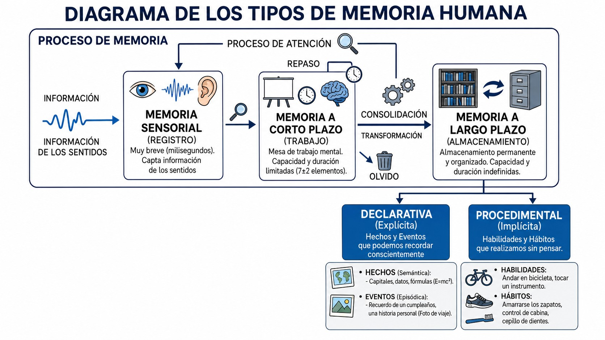
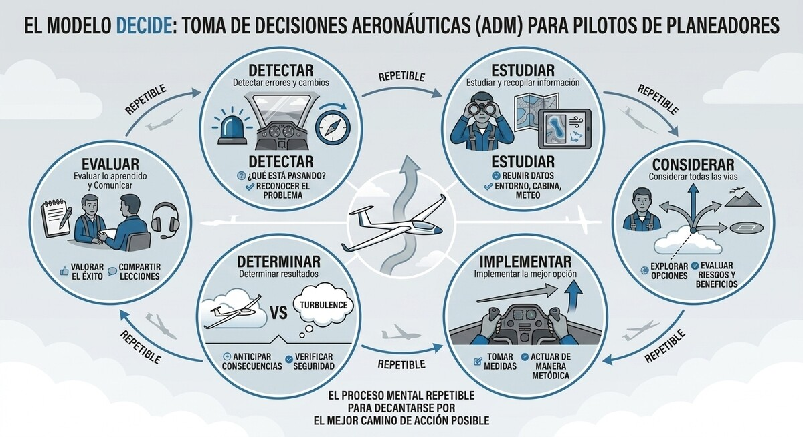
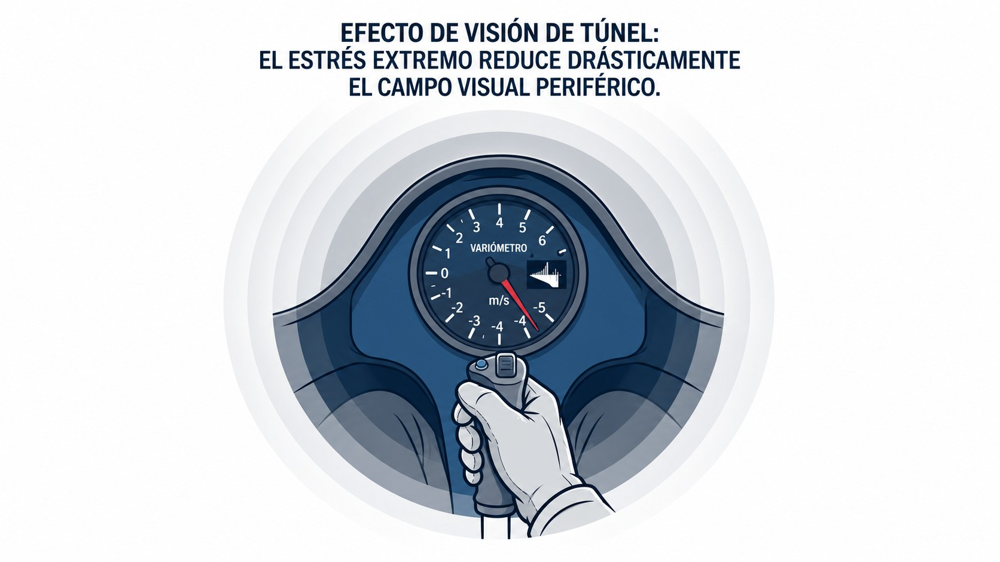

# Psicología aeronáutica básica

> Volar bien es, sobre todo, decidir bien. Este capítulo trata el instrumento que de verdad pilota el planeador —tu mente—: cómo procesa la información, cómo decide bajo presión y qué actitudes y trampas psicológicas conviene reconocer en uno mismo.
>
>
> En este capítulo aprenderás:
>
>
> * **El procesamiento de la información**: percepción, atención y los tipos de memoria.
> * **La conciencia situacional**: qué es y qué la degrada.
> * **La toma de decisiones (ADM)**: el modelo DECIDE y la gestión de riesgos con PAVE.
> * **Las cinco actitudes peligrosas** y sus antídotos.
> * **La carga de trabajo y el SRM**: visión de túnel, sobrecarga y gestión de recursos del piloto solo.

## Procesamiento de la información: atención, memoria y percepción

Para operar un planeador de forma segura, el cerebro del piloto procesa información continuamente mediante tres mecanismos entrelazados: percepción, atención y memoria.

**La percepción** es la capacidad de interpretar los elementos ambientales y los cambios en las variables de vuelo (variación del viento, proximidad del terreno). A diferencia del entorno en tierra, el entorno aéreo carece de las referencias habituales de profundidad y tamaño. Esto hace que interpretar las distancias sea más exigente, y un exceso de información, sin las señales habituales, puede provocar una sobrecarga cualitativa.

**La atención** es el filtro que permite centrarse en la información relevante de la cabina y el entorno exterior. La atención no es inagotable; puede verse erosionada rápidamente por factores biológicos o psicológicos, impidiendo percibir el cuadro completo de la situación.

**La memoria**, localizada de forma clave en el hipocampo, permite codificar, almacenar y recuperar información vital. En la cabina se utilizan distintos sistemas (@fig-02-cap03-memoria-tipos):

* **Memoria sensorial:** Retiene información por apenas 200 milisegundos tras percibirla por los sentidos.
* **Memoria a corto plazo:** Dura unos 30 segundos; es la «memoria RAM» del piloto, esencial para interactuar con el entorno táctico inmediato.
* **Memoria a largo plazo:** Es el almacén de conocimiento a largo plazo. Se divide en no declarativa (procedimental o inconsciente, como el tacto mecánico de la palanca) y declarativa (explícita, combinando la memoria episódica con la memoria semántica, como las velocidades del manual o experiencias pasadas).

{#fig-02-cap03-memoria-tipos}

## Conciencia situacional (**Situational Awareness**) y factores que la reducen

La conciencia situacional (**Situational Awareness**) es la percepción y asimilación adecuada de los elementos del entorno en un volumen de tiempo y espacio, la comprensión analítica de su significado y, fundamentalmente, la proyección de su estado o ubicación en el futuro más próximo.

En la cabina del planeador, esto implica construir y mantener durante el vuelo una imagen mental precisa de lo que ocurre: la variación y tendencia del viento, la posición real frente al campo de aterrizaje, la ocupación del circuito de tráfico, las condiciones del resto de las aeronaves y las variables propias de altitud y energía.

::: {.callout-warning title="Seguridad"}
La pérdida de la conciencia situacional suele ser el eslabón inicial en la mayoría de las cadenas de accidentes en el vuelo a vela. Una sobrecarga cualitativa de la atención, el pánico derivado de un fenómeno no comprendido, la fatiga o la incomodidad en un asiento mal ajustado erosionan drásticamente la capacidad de asimilar el cuadro informativo completo que define una situación de vuelo segura.
:::

## Toma de decisiones aeronáuticas (**Aeronautical Decision-Making** — ADM)

La Toma de Decisiones Aeronáuticas (ADM, por las siglas de **Aeronautical Decision Making**) es el proceso mental, sistemático y repetible, empleado por el piloto para decantarse por el mejor camino de acción posible como respuesta a unas circunstancias dadas en la cabina del planeador.

Durante un vuelo en térmica o en el trayecto final del aterrizaje, el piloto interactúa con el entorno evaluando escenarios y peligros, definiendo planes, gestionando el nivel de riesgo y obrando en consecuencia. Uno de los esquemas estructurales más aceptados en la aviación civil para entrenar y modelar la ADM de manera natural es el **modelo DECIDE** (@fig-02-cap03-decide):

* **D**etectar errores que requieren solución o un cambio que solicita atención.
* **E**studiar y recopilar activamente toda la información del evento suscitado.
* **C**onsiderar la mejor opción o todas las vías posibles para resolver el potencial peligro.
* **I**mplementar de manera metódica, rápida o pausada, la mejor opción.
* **D**eterminar objetivamente cuáles serían los resultados del proceso o de la decisión tomada.
* **E**valuar lo aprendido, valorando si el curso forjado corrige el desvío, y comunicar las conclusiones.

{#fig-02-cap03-decide}

## Gestión de riesgos y modelos de evaluación (modelo PAVE)

La gestión de riesgos es el escudo que protege tu proceso de toma de decisiones. Todo vuelo entraña ciertos peligros; tu misión no es evitarlos todos (algo imposible), sino identificarlos, evaluarlos y mitigarlos de manera sistemática.

El **modelo PAVE** divide los riesgos del vuelo en cuatro elementos fundamentales y fácilmente evaluables:

* **P (Piloto):** Estado fisiológico y psicológico. ¿Está el piloto descansado? ¿Sufre fatiga o estrés? ¿Cumple los requisitos de experiencia reciente?
* **A (Aeronave):** Estado del planeador. ¿Es el equipo adecuado para el vuelo previsto? ¿Están los instrumentos operativos y las revisiones vigentes?
* **V (**enVironment** — Entorno):** Meteorología, aeródromos de alternativa, orografía, densidad de tráfico y espacio aéreo.
* **E (Presiones externas u Operación):** Factores como la necesidad de finalizar un curso, la presión de no decepcionar a un pasajero o la urgencia ante una ventana meteorológica en cierre.

::: {.callout-tip title="Regla de oro"}
Desglosar mentalmente tu vuelo usando PAVE antes del despegue te permite detectar y cortar la cadena de errores antes de sentarte en la cabina.
:::

## Reconocimiento y mitigación de actitudes peligrosas

Tus actitudes (la predisposición motivacional hacia tu entorno) marcan cómo reaccionas ante los riesgos. En la instrucción aeronáutica se identifican clásicamente cinco actitudes peligrosas que debes saber reconocer y neutralizar en ti mismo.

### Antiautoridad (**anti-authority**)

"No me digan lo que tengo que hacer" o simple indisciplina. Un piloto con antiautoridad rechaza los estándares establecidos, las normas o los consejos de instructores veteranos por considerarlos innecesarios o excesivos.

**Antídoto:** Sigue las reglas imperativas; generalmente tienen detrás un rastro de sangre. Cumplir la norma es el factor de seguridad más básico.

### Impulsividad (**impulsivity**)

"Tengo que hacer algo, y tiene que ser ya mismo". Ante un problema, el piloto siente una presión acuciante por actuar inmediatamente sin pararse a pensar en las consecuencias.

**Antídoto:** Salvo contadas emergencias extremas, tómate un segundo para aplicar el modelo DECIDE. "No tan deprisa, piensa primero".

### Invulnerabilidad (**invulnerability**)

"A mí no me va a pasar". El piloto es consciente de la existencia de riesgos, pero se siente mágicamente protegido o ajeno a que un accidente pueda ocurrirle a él.

**Antídoto:** Los accidentes le ocurren a cualquiera que exponga su aeronave a una situación donde no existe margen de seguridad. "Podría pasarme a mí".

### Arrogancia o exceso de confianza (*Macho*)

"Yo sí que puedo hacerlo". El piloto trata de impresionar para demostrar su supuesto mayor nivel de pericia buscando rizos o saltándose directrices, en un exceso de confianza sobre su pilotaje. Bravuconería.

**Antídoto:** Aceptar tus limitaciones operativas es la mayor muestra de **airmanship**, de buen aviador. Correr riesgos innecesarios es un rasgo de inmadurez.

### Resignación (**resignation**)

"¿De qué sirve? Todo está perdido". Ante la adversidad o la complejidad de una pérdida en ruta, el piloto cree que no tiene control sobre la situación y abandona el pilotaje para convertirse en un mero pasajero de la tragedia. A veces se entrelaza con una complacencia ciega frente a problemas menores.

**Antídoto:** Nunca dejes de volar la aeronave. Siempre hay alguna acción que puede mejorar la situación, confía en tu entrenamiento. "Yo no tengo por qué rendirme, puedo cambiar esto".

## Gestión de la carga de trabajo y el estrés psicológico en vuelo

El estrés es la respuesta biológica no específica con la que el cuerpo humano reacciona ante cualquier demanda física, ambiental o psicológica que se le impone. En la aviación, actúa como un sistema arcaico de alarma que nos advierte de un posible peligro.

A diferencia del imaginario popular, no todo el estrés es perjudicial. Un nivel de estrés moderado (como el que sufres la primera vez que sales en monomando) es altamente positivo: aumenta tu nivel de alerta, agudiza tus sentidos y optimiza tu velocidad de reacción, llevándote a tu punto máximo de rendimiento.

Sin embargo, si la presión psicológica continúa aumentando (por ejemplo, te metes inadvertidamente en condiciones instrumentales severas ignorando tus límites), este estrés tolerable se transforma rápidamente en pánico. El rendimiento cae en picado y el piloto sufre una intensa saturación sensorial. El cerebro, incapaz de procesar el abrumador cuadro informativo de la cabina, se bloquea y focaliza absolutamente toda su atención residual en un solo detalle del vuelo (a menudo el más insignificante), anulando cualquier otra entrada visual o cognitiva sensata. A este fenómeno letal se le denomina informalmente **visión de túnel** (@fig-02-cap03-vision-tunel).

::: {.callout-warning title="Seguridad"}
Bajo condiciones de estrés extremo y pánico, instintos básicos de supervivencia como intentar "alejarse del suelo tirando fuertemente de la palanca" pueden superar tu raciocinio. Esta maniobra instintiva y abrupta a baja altura gastará toda la energía de tu planeador, precipitándote irremediablemente a una pérdida de control o barrena irrecuperable. Conoce tus límites y no te metas en escenarios para los que no estás sobradamente preparado.
:::

{#fig-02-cap03-vision-tunel}

Todo lo que se hace en el aire queda regido por un ciclo continuo conocido como el modelo de las «3 P»: **Percibir, Procesar y Actuar** (**Perform**). Cada segundo en vuelo, el piloto percibe información del entorno, la procesa cognitivamente y actúa en consecuencia.

La capacidad de la mente humana para procesar simultáneamente esta incesante catarata de eventos es esencialmente finita; es como un vaso de agua que solo puede admitir cierto volumen. Durante un remolque turbulento, de espaldas al sol, tratando de ubicar a otro velero que notifica en base, el vaso cognitivo puede desbordarse estrepitosamente. A esto se le conoce como **sobrecarga cualitativa**. Cuando la complejidad de la tarea de vuelo escala superando el rendimiento y el entrenamiento del piloto en ese lapso preciso, el margen de seguridad desaparece y el accidente latente ocupa su lugar.

::: {.callout-tip title="Regla de oro"}
Cuando notes que tu vaso se está desbordando, detente un segundo, respira, y reduce la carga mental simplificando radicalmente tus prioridades según el antiguo adagio de la aviación: **Aviate, Navigate, Communicate** (Primero vuela el avión con seguridad, luego preocúpate de hacia dónde, y, por último y de ser estrictamente necesario, coge la radio para contarlo).
:::

## Gestión de recursos para pilotos solos (**Single-Pilot Resource Management** — SRM)

El SRM es el arte de gestionar hábilmente todos los recursos a bordo y fuera del planeador (información, equipos, y ayudas humanas) antes y durante el vuelo, garantizando una operación segura del piloto en solitario.

A diferencia del vuelo con tripulación múltiple donde las tareas se delegan, el piloto de planeador gestiona integralmente el vuelo operando como único nodo de decisión. Tu trabajo exige emplear todos los elementos disponibles para no exceder tu capacidad de procesamiento. Los recursos del SRM incluyen tu propio equipo (instrumentación, compensador de abordo), las comunicaciones de radio (consultas al ATC o información meteorológica), y herramientas en tierra (un buen prevuelo o un instructor en radio).

::: {.callout-note title="Airmanship"}
Es preferible anticiparse en tierra que reaccionar en el aire. Evitar enfrentarse a muchas situaciones nuevas simultáneamente (un velero nuevo en un aeródromo desconocido y con mal tiempo) es la mayor muestra de que sabes gestionar tus recursos usando como base el sentido común.
:::

## Complacencia y falta de disciplina operativa

Dos de los peores y más insidiosos enemigos relacionados con las actitudes peligrosas son la complacencia y la indisciplina operativa.

**La complacencia** nace de una falsa sensación de seguridad generada por la excesiva rutina y la familiaridad del entorno. Pensamientos como "he aterrizado aquí miles de veces" llevan a obviar la lista de comprobación prevuelo o a desatender la vigilancia del tráfico. Aunque tu nivel de destreza sea excelente, no bajes nunca la guardia.

**La indisciplina**, ligada íntimamente a la actitud de antiautoridad, implica apartarse deliberadamente de los estándares y procedimientos que te enseñaron. Este factor se vuelve epidémico: una mala práctica vista repetidas veces en un campo de vuelo termina normalizándose en la mentalidad de todos sus pilotos, propagando conductas letales entre los alumnos y mermando gravemente la cultura de seguridad de todo el aeroclub.

**Resumen del Capítulo: Psicología Aeronáutica**

* **Conciencia situacional**: Es la capacidad precisa de percibir lo que ocurre, comprender su significado y proyectar su estado futuro. Perderla es el primer eslabón de la mayoría de las cadenas de accidentes.
* **Toma de decisiones (ADM)**: Proceso mental sistemático (como el modelo DECIDE) utilizado por los pilotos para elegir consistentemente la mejor opción de acción en respuesta a un conjunto de circunstancias.
* **Estrés**: Es la respuesta del cuerpo ante una demanda física o psicológica. Un nivel moderado mejora el rendimiento (alerta), pero el estrés excesivo o crónico bloquea la capacidad de tomar decisiones y fija la atención en detalles irrelevantes (visión de túnel).
* **Carga de trabajo y Rendimiento**: Tu capacidad de procesamiento es limitada (como un vaso de agua). Si la complejidad del vuelo (mal tiempo, tráfico, avería) llena el vaso, te desbordas. Simplifica la tarea (aviate, navigate, communicate) para recuperar margen de seguridad.
* **Procesamiento de Información**: Comprende la percepción (interpretación del medio ambiente), atención (foco) y las memorias sensorial, a corto plazo y a largo plazo. Un exceso de información externa sin asimilar puede generar sobrecarga cualitativa.
* **Gestión de Riesgos (PAVE)**: Evaluar sistemáticamente factores críticos divididos en Piloto, Aeronave, Medio Ambiente (**Environment**) y Operación o Presiones Externas.
* **Actitudes Peligrosas**: Las cinco actitudes a evitar son la antiautoridad, la impulsividad, la invulnerabilidad, la arrogancia (exceso de confianza) y la resignación.
* **Gestión de Recursos (SRM)**: La habilidad del piloto solitario para usar integralmente el equipo a bordo, la información, las comunicaciones y la ayuda externa para no exceder su capacidad límite.
* **Complacencia e Indisciplina**: La complacencia surge por el exceso de rutina generando una falsa sensación de seguridad, mientras que la indisciplina contagia una mala cultura de seguridad en el aeródromo al ignorar las normas.
