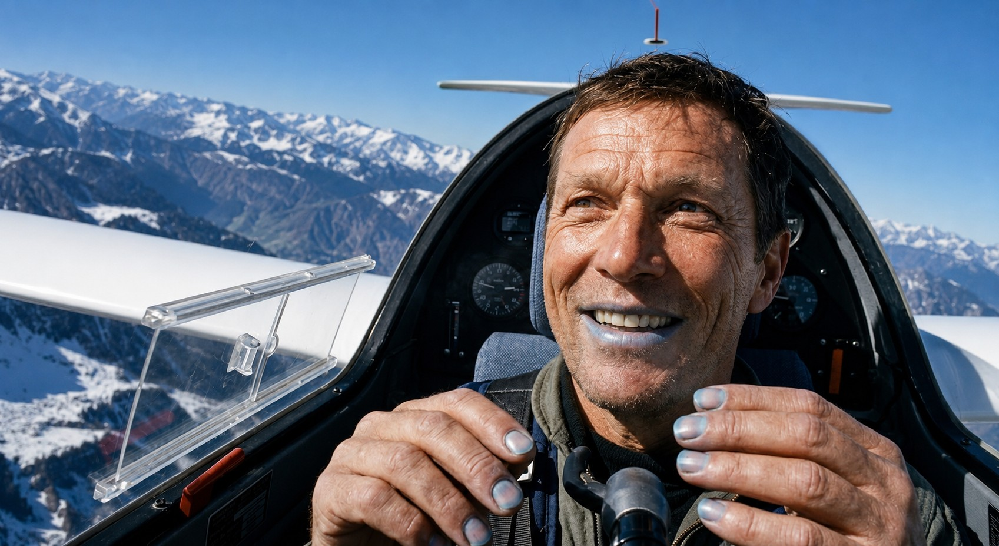
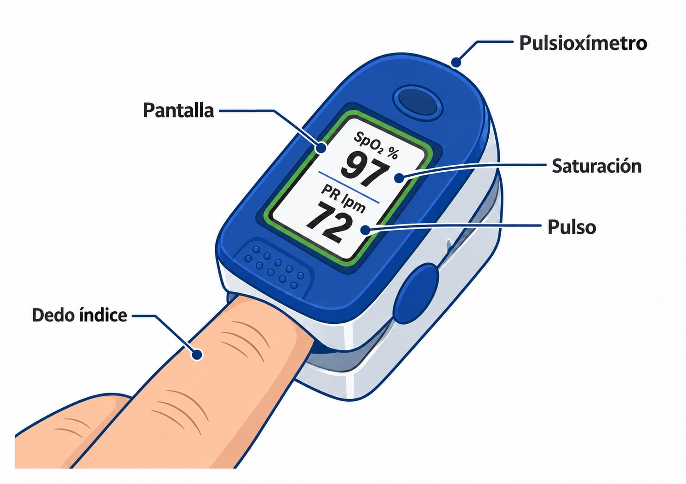

# Uso de oxígeno

> A medida que el planeador gana altitud, la presión atmosférica desciende y el oxígeno disponible para el organismo disminuye. Este capítulo explica los mecanismos que provocan la hipoxia y la hiperventilación, describe sus síntomas y tratamientos, y detalla los requisitos reglamentarios y los equipos de oxígeno que el piloto debe conocer para operar con seguridad en altitud.

## La atmósfera y las leyes de los gases

Para entender cómo afecta la altitud en la cabina de un planeador —que no está presurizada—, es necesario comprender dos principios básicos de física.

La atmósfera está compuesta por un 78% de nitrógeno y un 21% de oxígeno. Ese porcentaje se mantiene constante conforme se gana altura, pero lo que cambia de forma significativa es la **presión atmosférica**.

La **ley de Dalton** establece que la presión total de una mezcla de gases es la suma de las presiones parciales de cada componente. Al ascender, la columna de aire sobre nosotros es menor, por lo que la presión total disminuye; y como el oxígeno es siempre el 21 % de la mezcla, su **presión parcial** baja en la misma proporción. Esa presión parcial es la que «empuja» las moléculas de oxígeno a través de los alvéolos pulmonares hacia la sangre. Cuanto más alto, menos empuje y menos oxígeno pasa a la sangre: el piloto sigue respirando un 21 % de oxígeno, pero su sangre se carga cada vez menos. No hay un umbral a partir del cual el oxígeno deje de pasar, sino una degradación progresiva.

La **ley de Boyle** indica que el volumen de un gas confinado aumenta si la presión exterior disminuye. Al ascender, cualquier bolsa de aire atrapada en el organismo —estómago, intestinos, senos paranasales u oídos— se expande para igualar la presión exterior.

La **ley de Henry** completa el cuadro: la cantidad de gas disuelto en un líquido depende de la presión de ese gas sobre él. Al bajar la presión, el nitrógeno disuelto en la sangre y los tejidos tiende a salir de solución y puede formar burbujas: la **enfermedad descompresiva** (*bends*). Según la OACI, empieza a ser una amenaza por encima de unos 25.000 ft, y bucear antes de volar la hace mucho más probable, porque el cuerpo lleva entonces nitrógeno de más (capítulo 2).

::: {.callout-note title="Airmanship"}
No vuele con un resfriado severo o congestión nasal, especialmente si prevé techos térmicos elevados o vuelos de onda. El aire atrapado en los senos paranasales o en el oído medio no puede igualar la presión, sobre todo al descender, y puede causar un dolor intenso y agudo (barotrauma) que incapacita para pilotar con seguridad.
:::

## El sistema respiratorio

Los pulmones contienen millones de alvéolos recubiertos de capilares. Al inspirar, el oxígeno llega a esos alvéolos y, impulsado por la presión barométrica, cruza hacia la sangre. En la sangre, la **hemoglobina** de los glóbulos rojos transporta el oxígeno hasta el cerebro, la retina y los músculos, y recoge el dióxido de carbono (CO~2~) de desecho, que se exhala en la siguiente respiración.

En altitud, los pulmones y el corazón funcionan con normalidad, pero la menor presión parcial reduce la carga de oxígeno en la hemoglobina. La saturación de la sangre cae de forma progresiva —en torno al 89 % a 10.000 ft y al 65 % a 20.000 ft, según la OACI— y el cerebro recibe menos oxígeno del que necesita. Ese déficit de oxígeno es la **hipoxia**.

## Hipoxia

### Clases de hipoxia

Aunque el vuelo a gran altitud es la causa más común, la hipoxia puede originarse en cuatro mecanismos distintos:

1. **Hipoxia hipóxica:** La presión atmosférica es insuficiente para transferir oxígeno a la sangre. Es la forma más frecuente en pilotos de planeador. Se corrige iniciando el descenso o activando el suministro de oxígeno suplementario.
2. **Hipoxia hipémica (o anémica):** La sangre pierde capacidad de transporte de oxígeno. Ocurre principalmente por inhalación de **monóxido de carbono (CO)** procedente del escape del remolcador o por tabaquismo intenso, ya que el CO desplaza al oxígeno en la hemoglobina.
3. **Hipoxia estancada (o isquémica):** La circulación sanguínea se detiene o reduce en el cerebro. En planeador puede producirse durante virajes cerrados con elevadas fuerzas G positivas, que desplazan la sangre hacia las extremidades inferiores y vacían de riego la cabeza, provocando visión en túnel o pérdida temporal de visión (**grey-out**).
4. **Hipoxia histotóxica:** Las células cerebrales son incapaces de asimilar el oxígeno que reciben, por estar intoxicadas. El consumo de **alcohol, drogas o ciertos medicamentos** (relajantes musculares o antihistamínicos, entre otros) produce este efecto.

### Fases y síntomas

Los síntomas de la hipoxia varían entre individuos y dependen de factores como el nivel de fatiga, el tabaquismo, la ingesta de alcohol o la aclimatación a la altitud. El piloto a menudo no percibe sus propios síntomas.

Uno de los primeros síntomas, y el más peligroso, suele ser la **euforia**: el piloto se siente excepcionalmente bien y no detecta el peligro. El orden de los síntomas varía de una persona a otra, pero en cada piloto tiende a repetirse: conocer los propios es la mejor alarma. A continuación aparecen irritabilidad, dificultad para hablar, pérdida de memoria a corto plazo, disminución de la capacidad de cálculo y somnolencia. En fases avanzadas se produce **cianosis**: coloración azulada en labios y uñas, y finalmente pérdida de conciencia (@fig-02-cap04-cianosis).

::: {.callout-warning title="Seguridad"}
La euforia es el síntoma más traicionero de la hipoxia: el piloto no sospecha que está en peligro. Si percibe visión borrosa, hormigueo en las extremidades, euforia injustificada o dolor de cabeza tras un ascenso rápido a gran altitud, asuma hipoxia. Aumente al máximo el aporte de oxígeno de su equipo e inicie el descenso de inmediato.
:::

{#fig-02-cap04-cianosis}

### Tiempo útil de conciencia (*Time of Useful Consciousness*, TUC)

El TUC es el intervalo que transcurre desde que se interrumpe el suministro de oxígeno hasta que el piloto pierde la capacidad de tomar medidas protectoras. A mayor altitud, menor tiempo disponible para reaccionar.

Los valores de referencia de la FAA son: a 22.000 ft, de 5 a 10 minutos; a 25.000 ft, de 3 a 5 minutos; a 30.000 ft, de 1 a 2 minutos, y a 35.000 ft, de 30 a 60 segundos (@fig-02-cap04-hipoxia-tiempo-conciencia). Son valores medios: varían mucho de una persona a otra y se acortan con el esfuerzo físico, y otras tablas, como la de la OACI, dan cifras algo menores.

{#fig-02-cap04-hipoxia-tiempo-conciencia .corregir}

Un descenso desde 7.000 m hasta 3.000 m a 5 m/s de tasa de descenso tarda más de 13 minutos, tiempo con frecuencia superior al TUC disponible a esa altitud. Iniciar el descenso sin oxígeno puede ser demasiado tarde.

::: {.callout-tip title="Regla de oro"}
Ante cualquier fallo en el suministro de oxígeno o sospecha de hipoxia, aplique la regla: **«Oxígeno y desciende»**. Lleve el equipo al máximo aporte —el ajuste de 100 % en un regulador con mascarilla, el de máximo flujo en un EDS o el caudal de la altitud superior en un flujo continuo— y baje por debajo de los 10.000 ft sin dudarlo. A partir de cierta altitud, el TUC no permite pensar ni actuar correctamente.
:::

### Prevención y tratamiento

La mejor prevención es anticipar las situaciones de riesgo y operar el equipo de oxígeno de forma rutinaria y automatizada.

Antes del vuelo, compruebe el equipo:

* Compruebe en el manómetro que la presión de la botella, según su capacidad y la temperatura, basta para el vuelo previsto con reserva (consulte la tabla de autonomía del fabricante). La presión de llenado depende de la botella, y baja con el frío.
* Compruebe que la cánula o mascarilla está bien conectada, sin pliegues ni obstrucciones.
* Confirme que el regulador de flujo funciona correctamente.

Si aparecen síntomas de hipoxia durante el vuelo:

1. Lleve el equipo al **máximo aporte de oxígeno** de forma inmediata.
2. Compruebe que la cánula o mascarilla sella correctamente y no tiene fugas.
3. Si los síntomas no remiten en pocos segundos, inicie el descenso por debajo de los 10.000 ft.

::: {.callout-note title="Airmanship"}
Disponga de un *checklist* de emergencia para hipoxia, ya que el razonamiento puede estar deteriorado en el momento en que más lo necesita. Si lleva pulsioxímetro a bordo, compruebe la saturación (SpO~2~) ante cualquier duda.
:::

## Hiperventilación

### Causas y mecanismo

La hiperventilación es una respiración anormalmente rápida o profunda. Suele estar causada por el estrés o la ansiedad, pero también puede ser una reacción del cuerpo a la propia hipoxia. En el planeador puede desencadenarse por turbulencias intensas, situaciones fuera de campo complicadas o decisiones difíciles en vuelo.

Al hiperventilar, el piloto expulsa CO~2~ en exceso. El organismo regula el flujo sanguíneo cerebral en función del nivel de CO~2~ disuelto en sangre: cuando ese nivel cae (hipocapnia), los vasos sanguíneos cerebrales se contraen, reduciendo el aporte de oxígeno al cerebro a pesar de que los pulmones están cargados de él. El resultado paradójico es que el piloto se asfixia con los pulmones llenos.

### Síntomas

Los síntomas de la hiperventilación son similares a los de la hipoxia, lo que dificulta el diagnóstico diferencial:

* Hormigueo y entumecimiento en manos, pies y alrededor de la boca.
* Calambres o espasmos musculares.
* Sensación de no poder tomar aire y palpitaciones.
* Mareo, náuseas y somnolencia.
* En casos graves, pérdida de conciencia.

::: {.callout-tip title="Regla de oro"}
No intente un diagnóstico fino en vuelo: el hormigueo, la sudoración o el mareo pueden ser de las dos, y la hipoxia también aparece por debajo de 10.000 ft (monóxido de carbono, vuelo nocturno, tabaco). Actúe por orden:

1. **Primero, la hipoxia:** lleve el oxígeno al máximo aporte, compruebe el equipo y, si está alto, descienda.
2. **Si los síntomas no mejoran,** trate la hiperventilación: reduzca el ritmo respiratorio.
:::

### Tratamiento

El objetivo es restablecer el nivel de CO~2~ en sangre. Para ello:

1. **Reduzca el ritmo respiratorio:** Respire más despacio, alargando la exhalación.
2. **Hable en voz alta:** Recite el *checklist* o cuente en voz alta. Hablar obliga a controlar la exhalación y dificulta el jadeo.
3. **En casos graves:** Cubra la nariz y la boca con una bolsa de mareo para reinhalar parte del CO~2~ exhalado y restablecer el equilibrio.
4. Si la hiperventilación persiste, dé por concluido el vuelo y regrese al campo.

::: {.callout-warning title="Seguridad"}
Ante la duda entre hipoxia e hiperventilación, trate primero la hipoxia: active o aumente el oxígeno y compruebe el equipo; después, controle el ritmo respiratorio. Los primeros síntomas de las dos se parecen y pueden darse a la vez, porque la hipoxia también hace respirar más deprisa. Respirar oxígeno no empeora una hiperventilación: el CO~2~ se pierde por el ritmo de la respiración, no por el oxígeno que se respira.
:::

## Requisitos normativos para el uso de oxígeno

::: {.callout-important title="Normativa"}
**SAO.OP.150:** «El piloto al mando deberá garantizar que todas las personas a bordo utilicen oxígeno suplementario cuando determine que, a la altitud de vuelo prevista, la falta de oxígeno podría ocasionar la disminución de sus facultades o resultarles dañina.»

**AMC1 SAO.OP.150** (medio aceptable de cumplimiento, no vinculante como el reglamento): cuando el piloto no pueda determinar ese efecto, debería asegurarse de que todos usen oxígeno siempre que la altitud de presión supere los **10.000 ft**.
:::

El umbral de los 10.000 ft no es, por tanto, un límite legal incondicional: es la regla por defecto cuando no puedes valorar cómo afecta la falta de oxígeno a los ocupantes. La obligación de fondo es la primera: evaluar y garantizar.

::: {.callout-note title="Airmanship"}
Para vuelos **nocturnos o al atardecer** se recomienda —no lo exige la norma— iniciar el uso de oxígeno desde los **5.000 ft**: la visión nocturna es especialmente sensible a la falta de oxígeno, porque los bastones de la retina periférica son las primeras células en verse afectadas.
:::

## Equipos y sistemas de oxígeno en planeadores

### Tipos de sistemas

En los planeadores se utilizan principalmente dos tipos de sistemas:

* **Sistema de flujo continuo:** Suministra un caudal constante de oxígeno regulado por el piloto (habitualmente 2 a 2,5 L/min). Es sencillo, fiable y económico, pero consume oxígeno también durante la exhalación, lo que limita la autonomía y reseca las mucosas nasales. Con **cánula**, la interfaz habitual en planeador, sólo es adecuado hasta unos **18.000 ft (FL180)**: por encima hace falta mascarilla, porque al hablar o al respirar por la boca la cánula deja de aportar oxígeno suficiente. Con mascarilla, la FAA lo considera adecuado hasta unos 25.000 ft. En vuelos de onda altos conviene llevar además un oxígeno de respaldo.
* **Sistema a demanda pulsada (*Electronic Demand System*, EDS):** Detecta el inicio de cada inspiración mediante sensores barométricos y libera únicamente el volumen necesario, interrumpiendo el flujo durante la exhalación. Puede multiplicar por tres o cuatro la autonomía de la botella respecto al flujo continuo. El principal inconveniente es su dependencia de pilas de 9 V, que pueden fallar a temperaturas muy bajas; se recomienda conectarlo a la batería principal del planeador y usar la pila como respaldo.

### Inspección, uso, mantenimiento y seguridad

Antes de cada vuelo en altitud, compruebe visualmente la botella, las conexiones y los tubos. Verifique la presión con el manómetro y asegúrese de que la cánula o mascarilla no presenta pliegues.

::: {.callout-warning title="Seguridad"}
**Oxígeno de aviación, no medicinal.** El oxígeno medicinal contiene mayor concentración de humedad, que puede congelarse en el regulador a temperaturas de altitud elevadas y bloquear el flujo. Utilice exclusivamente oxígeno etiquetado como «para uso aeronáutico» (oxígeno seco, pureza superior al 98,5%).

**Prohibido el contacto con grasas.** No aplique cremas hidratantes, protectores solares ni lubricantes cerca de las conexiones, reguladores o boquillas. El oxígeno a presión en contacto con sustancias grasas puede provocar una combustión explosiva sin necesidad de llama o chispa.
:::

## Pulsioxímetro

El pulsioxímetro es un dispositivo no invasivo que mide la saturación de oxígeno en sangre (SpO~2~) y la frecuencia cardíaca en tiempo real (@fig-02-cap04-pulsioximetro). Es una ayuda muy útil para detectar la hipoxia antes de que los síntomas sean evidentes para el propio piloto, pero no un sustituto de la atención a los síntomas. Tiene límites importantes: con **monóxido de carbono** marca valores normales aunque haya hipoxia, porque confunde la hemoglobina ocupada por el CO con la saturada de oxígeno; y con los dedos fríos, el movimiento o el sol directo da lecturas bajas o inestables. Ante síntomas, actúe aunque la lectura sea buena.

{#fig-02-cap04-pulsioximetro}

Coloque el pulsioxímetro en el dedo índice antes del despegue y mantenga la lectura visible durante el vuelo. Para vuelos de onda, fíjelo con velcro en la cabina o utilice un guante adaptado que permita leerlo sin quitarse el equipo de frío.

Un valor de SpO~2~ por debajo del **90%** es una señal para actuar: activar el oxígeno suplementario e iniciar el descenso. Como referencia, a 10.000 ft una persona sana sin oxígeno marca en torno al 89 %.

::: {.callout-note title="Airmanship"}
Registre sus valores de SpO~2~ a distintas altitudes durante los vuelos habituales, con su sistema de oxígeno funcionando, para conocer su respuesta individual y tener referencias personales. No todos los pilotos responden igual a la altitud.
:::

::: {.postit}
**Resumen del capítulo: uso de oxígeno**

* **Leyes de los gases:** La presión atmosférica disminuye con la altitud y, con ella, la presión parcial del oxígeno, que es siempre el 21 % de la total (ley de Dalton): cuanto más alto, menos oxígeno pasa a la sangre. Los gases corporales se expanden al ascender y se contraen al descender (ley de Boyle); no vuele con congestión nasal intensa: en el descenso la presión no se iguala y causa barotraumas dolorosos.
* **Sistema respiratorio e hipoxia:** La hemoglobina transporta el oxígeno desde los alvéolos al cerebro. Con la altitud, la sangre se carga cada vez menos de oxígeno y se produce hipoxia, de forma progresiva.
* **Clases de hipoxia:** Existen cuatro tipos: **hipóxica** (baja presión atmosférica, la más frecuente en planeador), **hipémica** (monóxido de carbono o tabaquismo), **estancada** (fuerzas G elevadas en virajes cerrados) e **histotóxica** (alcohol, drogas o medicamentos).
* **Síntomas y diagnóstico:** Uno de los primeros síntomas, y el más traicionero, suele ser la euforia; el piloto no percibe el peligro por sí mismo. El orden varía de una persona a otra. Después aparecen somnolencia, dificultad para calcular, cianosis y pérdida de conciencia. El pulsioxímetro ayuda a detectar la hipoxia antes de que los síntomas sean evidentes, pero el monóxido de carbono y el frío falsean su lectura.
* **Tiempo útil de conciencia (TUC):** A 25.000 ft, el TUC es de 3 a 5 minutos; a 30.000 ft, de 1 a 2 minutos. Un descenso largo puede superar el TUC disponible: actúe siempre antes de necesitarlo.
* **Normativa (SAO.OP.150 y su AMC):** El oxígeno suplementario es obligatorio cuando el piloto determine que su falta puede disminuir las facultades de los ocupantes; cuando no pueda determinarlo, la regla por defecto del AMC es usarlo siempre por encima de **10.000 ft**. En vuelo nocturno o al atardecer se **recomienda** (no es norma) desde los **5.000 ft**.
* **Sistemas de oxígeno:** El flujo continuo es sencillo pero consume más oxígeno y reseca las mucosas. La cánula sólo sirve hasta unos 18.000 ft; por encima, mascarilla. El sistema a demanda pulsada (EDS) multiplica la autonomía de la botella, pero depende de pilas que pueden fallar con el frío. Use siempre oxígeno de aviación seco; no medicinal.
* **Seguridad del equipo:** No use grasas ni cremas cerca de conexiones de oxígeno: riesgo de combustión explosiva. Antes de cada vuelo, compruebe que la presión de la botella basta para el vuelo previsto con reserva.
* **Hiperventilación:** Causada sobre todo por el estrés o la ansiedad, aunque también puede acompañar a la hipoxia. Al exhalar CO~2~ en exceso, los vasos cerebrales se contraen, produciendo síntomas similares a la hipoxia (hormigueo, calambres, mareo). Tratamiento: reducir el ritmo respiratorio, hablar en voz alta o reinhalar CO~2~ con una bolsa sobre la nariz y la boca. Ante la duda con la hipoxia, oxígeno primero.
* **Pulsioxímetro:** Mantenga la saturación (SpO~2~) por encima del **90%**; por debajo de ese umbral, active el oxígeno y descienda de inmediato. Es una ayuda, no un sustituto: ante síntomas, actúe aunque la lectura sea buena.
:::
