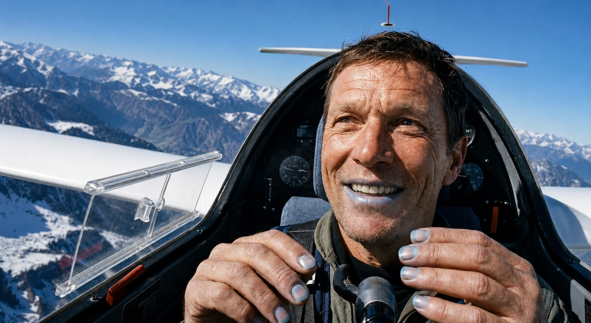
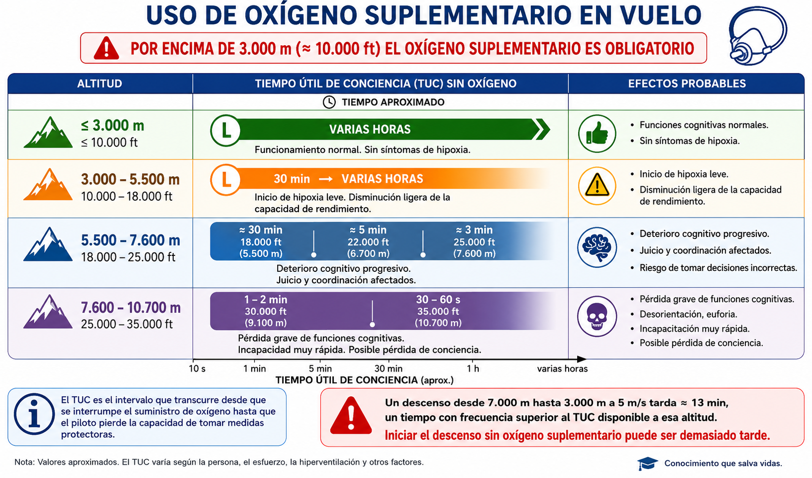
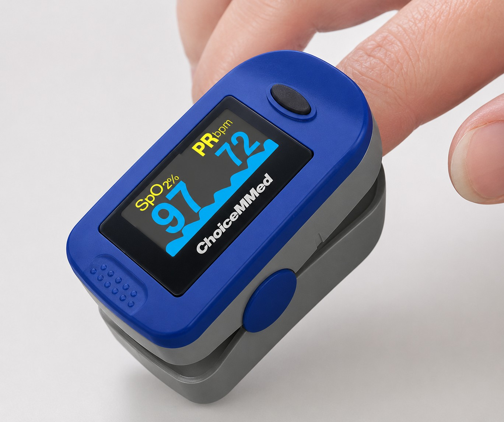

# Uso de oxígeno

A medida que el planeador gana altitud, la presión atmosférica desciende y el oxígeno disponible para el organismo disminuye. Este capítulo explica los mecanismos que provocan la hipoxia y la hiperventilación, describe sus síntomas y tratamientos, y detalla los requisitos reglamentarios y los equipos de oxígeno que el piloto debe conocer para operar con seguridad en altitud.

## La atmósfera y las leyes de los gases

Para entender cómo afecta la altitud en la cabina de un planeador —que no está presurizada—, es necesario comprender dos principios básicos de física.

La atmósfera está compuesta por un 78% de nitrógeno y un 21% de oxígeno. Ese porcentaje se mantiene constante conforme se gana altura, pero lo que cambia de forma significativa es la **presión atmosférica**.

La **ley de Dalton** establece que la presión total de una mezcla de gases es la suma de las presiones parciales de cada componente. Al ascender, la columna de aire sobre nosotros es menor, por lo que la presión general disminuye. A nivel del mar, esa presión «empuja» las moléculas de oxígeno a través de los alvéolos pulmonares hacia la sangre con eficacia. A gran altitud, la presión es tan baja que el oxígeno no tiene fuerza suficiente para atravesar la membrana alveolar: el piloto respira un 21% de oxígeno pero sufre privación de oxígeno a nivel celular.

La **ley de Boyle** indica que el volumen de un gas confinado aumenta si la presión exterior disminuye. Al ascender, cualquier bolsa de aire atrapada en el organismo —estómago, intestinos, senos paranasales u oídos— se expande para igualar la presión exterior.

::: {.callout-note}
⚓ **AIRMANSHIP / BUENAS PRÁCTICAS**

No vuele con un resfriado severo o congestión nasal, especialmente si prevé techos térmicos elevados o vuelos de onda. El aire atrapado en los senos paranasales o en el oído medio se expande al ascender y puede causar un dolor intenso y agudo (barotrauma) que incapacita para pilotar con seguridad.
:::

## El sistema respiratorio

Los pulmones contienen millones de alvéolos recubiertos de capilares. Al inspirar, el oxígeno llega a esos alvéolos y, impulsado por la presión barométrica, cruza hacia la sangre. En la sangre, la **hemoglobina** de los glóbulos rojos transporta el oxígeno hasta el cerebro, la retina y los músculos, y recoge el dióxido de carbono (CO~2~) de desecho, que se exhala en la siguiente respiración.

En altitud, los pulmones y el corazón funcionan con normalidad, pero la presión insuficiente impide cargar oxígeno en los alvéolos. Los glóbulos rojos llegan al cerebro prácticamente vacíos. Ese déficit de oxígeno cerebral es la **hipoxia**.

## Hipoxia

### Clases de hipoxia

Aunque el vuelo a gran altitud es la causa más común, la hipoxia puede originarse en cuatro mecanismos distintos:

1. **Hipoxia hipóxica:** La presión atmosférica es insuficiente para transferir oxígeno a la sangre. Es la forma más frecuente en pilotos de planeador. Se corrige iniciando el descenso o activando el suministro de oxígeno suplementario.
2. **Hipoxia hipémica (o anémica):** La sangre pierde capacidad de transporte de oxígeno. Ocurre principalmente por inhalación de **monóxido de carbono (CO)** procedente del escape del remolcador o por tabaquismo intenso, ya que el CO desplaza al oxígeno en la hemoglobina.
3. **Hipoxia estancada (o isquémica):** La circulación sanguínea se detiene o reduce en el cerebro. En planeador puede producirse durante virajes cerrados con elevadas fuerzas G positivas, que desplazan la sangre hacia las extremidades inferiores y vacían de riego la cabeza, provocando visión en túnel o pérdida temporal de visión (**grey-out**).
4. **Hipoxia histotóxica:** Las células cerebrales son incapaces de asimilar el oxígeno que reciben, por estar intoxicadas. El consumo de **alcohol, drogas o ciertos medicamentos** (relajantes musculares o antihistamínicos, entre otros) produce este efecto.

### Fases y síntomas

Los síntomas de la hipoxia varían entre individuos y dependen de factores como el nivel de fatiga, el tabaquismo, la ingesta de alcohol o la aclimatación a la altitud. El piloto a menudo no percibe sus propios síntomas.

El síntoma más peligroso —y el primero en aparecer según el programa AESA— es la **euforia**: el piloto se siente excepcionalmente bien y no detecta el peligro. A continuación aparecen irritabilidad, dificultad para hablar, pérdida de memoria a corto plazo, disminución de la capacidad de cálculo y somnolencia. En fases avanzadas se produce **cianosis**: coloración azulada en labios y uñas, y finalmente pérdida de conciencia (@fig-02-cap04-cianosis).

::: {.callout-warning}
⚠ **SEGURIDAD**

La euforia es el síntoma más traicionero de la hipoxia: el piloto no sospecha que está en peligro. Si percibe visión borrosa, hormigueo en las extremidades, euforia injustificada o dolor de cabeza tras un ascenso rápido a gran altitud, asuma hipoxia. Active el suministro de oxígeno al 100% e inicie el descenso de inmediato.
:::

{#fig-02-cap04-cianosis}

### Tiempo útil de conciencia (*Time of Useful Consciousness*, TUC)

El TUC es el intervalo que transcurre desde que se interrumpe el suministro de oxígeno hasta que el piloto pierde la capacidad de tomar medidas protectoras. A mayor altitud, menor tiempo disponible para reaccionar.

La siguiente tabla muestra los valores de referencia (@fig-02-cap04-hipoxia-tiempo-conciencia):

{#fig-02-cap04-hipoxia-tiempo-conciencia}

Un descenso desde 7.000 m hasta 3.000 m a 5 m/s de tasa de descenso tarda más de 13 minutos, tiempo con frecuencia superior al TUC disponible a esa altitud. Iniciar el descenso sin oxígeno puede ser demasiado tarde.

::: {.callout-tip}
✦ **REGLA DE ORO**

Ante cualquier fallo en el suministro de oxígeno o sospecha de hipoxia, aplique la regla: **«Oxígeno al 100% y desciende»**. Active el flujo completo y baje por debajo de los 10.000 ft sin dudarlo. A partir de cierta altitud, el TUC no permite pensar ni actuar correctamente.
:::

### Prevención y tratamiento

La mejor prevención es anticipar las situaciones de riesgo y operar el equipo de oxígeno de forma rutinaria y automatizada.

Antes del vuelo, compruebe el equipo:

* Verifique que el manómetro de la botella marca entre 150 y 200 bar.
* Compruebe que la cánula o mascarilla está bien conectada, sin pliegues ni obstrucciones.
* Confirme que el regulador de flujo funciona correctamente.

Si aparecen síntomas de hipoxia durante el vuelo:

1. Active el suministro de oxígeno al **100% de flujo** de forma inmediata.
2. Compruebe que la cánula o mascarilla sella correctamente y no tiene fugas.
3. Si los síntomas no remiten en pocos segundos, inicie el descenso por debajo de los 10.000 ft.

::: {.callout-note}
⚓ **AIRMANSHIP / BUENAS PRÁCTICAS**

Disponga de un *checklist* de emergencia para hipoxia, ya que el razonamiento puede estar deteriorado en el momento en que más lo necesita. Si lleva pulsioxímetro a bordo, compruebe la saturación (SpO~2~) ante cualquier duda.
:::

## Hiperventilación

### Causas y mecanismo

La hiperventilación es una respiración anormalmente rápida o profunda que no está causada por falta de oxígeno, sino por situaciones de estrés o ansiedad. En el planeador puede desencadenarse por turbulencias intensas, situaciones fuera de campo complicadas o decisiones difíciles en vuelo.

Al hiperventilar, el piloto expulsa CO~2~ en exceso. El organismo regula el flujo sanguíneo cerebral en función del nivel de CO~2~ disuelto en sangre: cuando ese nivel cae (hipocapnia), los vasos sanguíneos cerebrales se contraen, reduciendo el aporte de oxígeno al cerebro a pesar de que los pulmones están cargados de él. El resultado paradójico es que el piloto se asfixia con los pulmones llenos.

### Síntomas

Los síntomas de la hiperventilación son similares a los de la hipoxia, lo que dificulta el diagnóstico diferencial:

* Hormigueo y entumecimiento en manos, pies y alrededor de la boca.
* Calambres o espasmos musculares.
* Sensación de no poder tomar aire y palpitaciones.
* Mareo, náuseas y somnolencia.
* En casos graves, pérdida de conciencia.

::: {.callout-tip}
✦ **REGLA DE ORO**

Para distinguir hipoxia de hiperventilación, evalúe dos factores: **altitud** y **estado emocional**.

* Si está por encima de 10.000 ft y se siente eufórico o aletargado: probable **hipoxia**. Aplique oxígeno al 100% y descienda.
* Si está por debajo de 10.000 ft y experimenta hormigueo con sudoración y ansiedad: probable **hiperventilación**. Reduzca el ritmo respiratorio.

En caso de duda a gran altitud, priorice el tratamiento de la hipoxia.
:::

### Tratamiento

El objetivo es restablecer el nivel de CO~2~ en sangre. Para ello:

1. **Reduzca el ritmo respiratorio:** Haga inspiraciones lentas y profundas, reteniendo el aire unos segundos antes de exhalar.
2. **Hable en voz alta:** Recite el *checklist* o cuente en voz alta. Hablar obliga a controlar la exhalación y dificulta el jadeo.
3. **En casos graves:** Cubra la nariz y la boca con una bolsa de mareo para reinhalar parte del CO~2~ exhalado y restablecer el equilibrio.
4. Si la hiperventilación persiste, dé por concluido el vuelo y regrese al campo.

::: {.callout-warning}
⚠ **SEGURIDAD**

No aporte oxígeno suplementario si diagnostica hiperventilación y no está a gran altitud: añadir más oxígeno agravaría el desequilibrio de CO~2~ y empeoraría los síntomas. Si no puede confirmar que está por debajo de 10.000 ft, priorice el tratamiento de la hipoxia.
:::

## Requisitos normativos para el uso de oxígeno

::: {.callout-important}
⚖ **NORMATIVA**

**SAO.OP.150:** «El piloto al mando deberá garantizar que todas las personas a bordo utilicen oxígeno suplementario cuando determine que, a la altitud de vuelo prevista, la falta de oxígeno podría ocasionar la disminución de sus facultades o resultarles dañina.»

**AMC1 SAO.OP.150:** cuando el piloto no pueda determinar ese efecto, el oxígeno deberá usarse siempre que la altitud de presión supere los **10.000 ft**.
:::

El umbral de los 10.000 ft no es, por tanto, un límite legal incondicional: es la regla por defecto cuando no puedes valorar cómo afecta la falta de oxígeno a los ocupantes. La obligación de fondo es la primera: evaluar y garantizar.

::: {.callout-note}
⚓ **AIRMANSHIP / BUENAS PRÁCTICAS**

Para vuelos **nocturnos o al atardecer** se recomienda —no lo exige la norma— iniciar el uso de oxígeno desde los **5.000 ft**: la visión nocturna es especialmente sensible a la falta de oxígeno, porque los bastones de la retina periférica son las primeras células en verse afectadas.
:::

## Equipos y sistemas de oxígeno en planeadores

### Tipos de sistemas

En los planeadores se utilizan principalmente dos tipos de sistemas:

* **Sistema de flujo continuo:** Suministra un caudal constante de oxígeno regulado por el piloto (habitualmente 2 a 2,5 L/min). Es sencillo, fiable y económico, pero consume oxígeno también durante la exhalación, lo que limita la autonomía y reseca las mucosas nasales. Según la doctrina FAA, no se recomienda por encima de **25.000 ft (FL250)**; más arriba se requieren sistemas de demanda con máscara.
* **Sistema a demanda pulsada (*Electronic Demand System*, EDS):** Detecta el inicio de cada inspiración mediante sensores barométricos y libera únicamente el volumen necesario, interrumpiendo el flujo durante la exhalación. Puede multiplicar por tres o cuatro la autonomía de la botella respecto al flujo continuo. El principal inconveniente es su dependencia de pilas de 9 V, que pueden fallar a temperaturas muy bajas; se recomienda conectarlo a la batería principal del planeador y usar la pila como respaldo.

### Inspección, uso, mantenimiento y seguridad

Antes de cada vuelo en altitud, compruebe visualmente la botella, las conexiones y los tubos. Verifique la presión con el manómetro y asegúrese de que la cánula o mascarilla no presenta pliegues.

::: {.callout-warning}
⚠ **SEGURIDAD**

**Oxígeno de aviación, no medicinal.** El oxígeno medicinal contiene mayor concentración de humedad, que puede congelarse en el regulador a temperaturas de altitud elevadas y bloquear el flujo. Utilice exclusivamente oxígeno etiquetado como «para uso aeronáutico» (oxígeno seco, pureza superior al 98,5%).

**Prohibido el contacto con grasas.** No aplique cremas hidratantes, protectores solares ni lubricantes cerca de las conexiones, reguladores o boquillas. El oxígeno a presión en contacto con sustancias grasas puede provocar una combustión explosiva sin necesidad de llama o chispa.
:::

## Pulsioxímetro

El pulsioxímetro es un dispositivo no invasivo que mide la saturación de oxígeno en sangre (SpO~2~) y la frecuencia cardíaca en tiempo real (@fig-02-cap04-pulsioximetro). Es el instrumento más útil para detectar hipoxia antes de que los síntomas sean evidentes para el propio piloto.

{#fig-02-cap04-pulsioximetro}

Coloque el pulsioxímetro en el dedo índice antes del despegue y mantenga la lectura visible durante el vuelo. Para vuelos de onda, fíjelo con velcro en la cabina o utilice un guante adaptado que permita leerlo sin quitarse el equipo de frío.

Un valor de SpO~2~ por debajo del **90%** indica hipoxia franca y requiere acción inmediata: activar el oxígeno suplementario e iniciar el descenso.

::: {.callout-note}
⚓ **AIRMANSHIP / BUENAS PRÁCTICAS**

Registre sus valores de SpO~2~ a distintas altitudes durante los vuelos habituales (a 3.000 m, a 5.000 m) para conocer su respuesta individual y tener referencias personales. No todos los pilotos responden igual a la altitud.
:::

**Resumen del capítulo: Uso de oxígeno**

* **Leyes de los gases:** La presión atmosférica disminuye con la altitud (ley de Dalton), reduciendo la capacidad del oxígeno para transferirse a la sangre. Los gases corporales se expanden al ascender (ley de Boyle); no vuele con congestión nasal intensa para evitar barotraumas dolorosos.
* **Sistema respiratorio e hipoxia:** La hemoglobina transporta el oxígeno desde los alvéolos al cerebro. Cuando la presión es insuficiente, los glóbulos rojos llegan vacíos al cerebro y se produce hipoxia.
* **Clases de hipoxia:** Existen cuatro tipos: **hipóxica** (baja presión atmosférica, la más frecuente en planeador), **hipémica** (monóxido de carbono o tabaquismo), **estancada** (fuerzas G elevadas en virajes cerrados) e **histotóxica** (alcohol, drogas o medicamentos).
* **Síntomas y diagnóstico:** El primer síntoma es la euforia; el piloto no percibe el peligro por sí mismo. Posteriormente aparecen somnolencia, dificultad para calcular, cianosis y pérdida de conciencia. El pulsioxímetro detecta la hipoxia antes de que los síntomas sean evidentes.
* **Tiempo útil de conciencia (TUC):** A 25.000 ft, el TUC es de 3 a 5 minutos; a 30.000 ft, de 1 a 2 minutos. Un descenso largo puede superar el TUC disponible: actúe siempre antes de necesitarlo.
* **Normativa (SAO.OP.150 y su AMC):** El oxígeno suplementario es obligatorio cuando el piloto determine que su falta puede disminuir las facultades de los ocupantes; cuando no pueda determinarlo, la regla por defecto del AMC es usarlo siempre por encima de **10.000 ft**. En vuelo nocturno o al atardecer se **recomienda** (no es norma) desde los **5.000 ft**.
* **Sistemas de oxígeno:** El flujo continuo es sencillo pero consume más oxígeno y reseca las mucosas. El sistema a demanda pulsada (EDS) multiplica la autonomía de la botella, pero depende de pilas que pueden fallar con el frío. Use siempre oxígeno de aviación seco; no medicinal.
* **Seguridad del equipo:** No use grasas ni cremas cerca de conexiones de oxígeno: riesgo de combustión explosiva. Verifique la presión de la botella antes de cada vuelo (entre 150 y 200 bar).
* **Hiperventilación:** Causada por estrés o ansiedad, no por falta de oxígeno. Al exhalar CO~2~ en exceso, los vasos cerebrales se contraen, produciendo síntomas similares a la hipoxia (hormigueo, calambres, mareo). Tratamiento: reducir el ritmo respiratorio, hablar en voz alta o reinhalar CO~2~ cubriendo parcialmente la boca.
* **Pulsioxímetro:** Mantenga la saturación (SpO~2~) por encima del **90%**; por debajo de ese umbral, active el oxígeno y descienda de inmediato.
