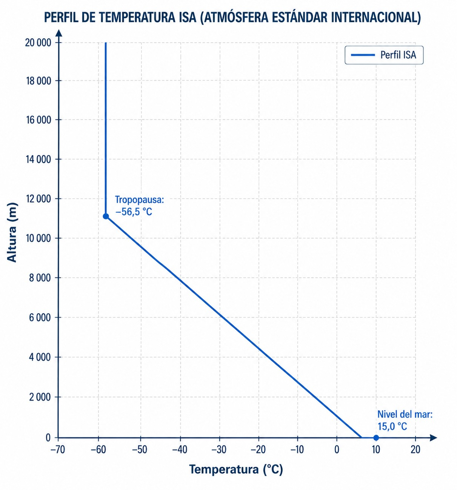

# La atmósfera

> Sin entender la atmósfera, ningún mapa de previsión tiene sentido.
> En este capítulo aprenderás qué es la Atmósfera Estándar Internacional (ISA), por qué la
> presión, la temperatura y la densidad del aire cambian con la altitud, y cómo esos cambios
> afectan directamente al rendimiento de tu planeador y a tu propia fisiología en vuelo.

## La atmósfera estándar internacional (ISA)

Para estandarizar el diseño de aeronaves y la calibración de instrumentos en todo el mundo, la Organización de Aviación Civil Internacional (OACI) definió la Atmósfera Estándar Internacional (ISA, por sus siglas en inglés: **International Standard Atmosphere**). Es un modelo atmosférico ideal que asume **aire seco** (0 % de humedad) y establece valores medios teóricos, ya que raramente encontrarás un día ISA "puro" en la realidad.

A nivel del mar (MSL), la atmósfera ISA establece las siguientes condiciones de referencia (@fig-03-cap01-atmosfera-isa):

* Temperatura: 15 °C
* Presión atmosférica: 1013,25 hPa (equivalente a 29,92 inHg o 760 mm Hg)
* Densidad del aire: 1,225 kg/m^3^

El modelo ISA asume 0 % de humedad, lo que en la práctica significa que tampoco define un **punto de rocío** (**dew point**). En la realidad, el punto de rocío es la temperatura a la que hay que enfriar una masa de aire para que el vapor de agua que contiene comience a condensarse. Cuando la temperatura del aire y el punto de rocío se aproximan o igualan, la humedad relativa alcanza el 100 % y el aire se satura: se forman nubes o niebla. Para el piloto de planeador, la diferencia entre temperatura y punto de rocío es el dato clave para estimar la base de los cúmulos y la probabilidad de niebla matinal (ver Capítulo 3: Termodinámica).

{#fig-03-cap01-atmosfera-isa}

## Gradientes Estándar en Aviación

A medida que ganamos altura, las condiciones atmosféricas cambian según unos patrones establecidos en el modelo ISA, conocidos como gradientes estándar. Estas reglas te permiten hacer cálculos mentales rápidos durante el vuelo.

* **Gradiente térmico estándar**: La temperatura en la troposfera disminuye a razón de 2 °C por cada 1.000 pies de ascenso (o 6,5 °C por cada 1.000 metros).
* **Gradiente de presión estándar**: La presión atmosférica disminuye aproximadamente 1 hPa por cada 30 pies de ascenso en las capas bajas de la atmósfera.

::: {.callout-tip}
✦ **REGLA DE ORO**

Memoriza estas tres equivalencias del gradiente estándar ISA: **2 °C / 1.000 pies** para la temperatura, y **1 hPa / 30 pies** para la presión. En sistema métrico, si subes 90 metros, la presión cae 10 hPa; en pies, si subes 3.000 pies, cae 100 hPa. Si despegas de un aeródromo a 2.000 pies con QNH 1013 hPa y 20 °C, puedes estimar que a 5.000 pies la temperatura será unos 6 °C más fría (14 °C) y la presión habrá bajado unos 100 hPa.
:::

## Densidad del aire y rendimiento del planeador

El planeador vuela gracias a las moléculas de aire que inciden sobre sus alas. La sustentación (**lift**) depende directamente de la densidad del aire.

Una menor densidad del aire (lo que equivale a una mayor "altitud de densidad") significa que hay menos moléculas interactuando con las alas, reduciendo el rendimiento general del planeador. Ciertas condiciones meteorológicas reducen peligrosamente la densidad del aire:

* Altas temperaturas (el aire se expande y se hace menos denso).
* Baja presión atmosférica.
* Alta humedad (el vapor de agua es menos denso que el aire seco).

::: {.callout-warning}
⚠ **SEGURIDAD**

Un día caluroso en un aeródromo elevado (alta altitud de densidad) empeora drásticamente el rendimiento: el avión remolcador trepará mucho más despacio, el planeador necesitará más pista para despegar y en vuelo tendrás menor sustentación para el mismo ángulo de ataque.
:::

## Presión parcial de oxígeno e hipoxia

Aunque la proporción de oxígeno en el aire se mantiene constante en un 21 % a lo largo de la troposfera, la reducción de la presión atmosférica al ganar altura hace que la presión a la que ese oxígeno entra en nuestros pulmones disminuya. A 18.000 pies, la presión atmosférica es la mitad que a nivel del mar.

::: {.callout-note}
⚓ **AIRMANSHIP / BUENAS PRÁCTICAS**

La falta prolongada de oxígeno en los tejidos se conoce como **hipoxia**. Dado su impacto crítico en la seguridad del vuelo (pérdida del conocimiento, degradación visual), los síntomas detallados, el cálculo del Tiempo de Conciencia Útil (TUC) y el uso de equipos de oxígeno se estudian en profundidad en el **Libro 2 — Factores humanos**, capítulo 4.
:::

**Resumen del Capítulo: La Atmósfera**

* **Atmósfera ISA**: Modelo ideal para estandarizar instrumentos y rendimiento (15°C, 1013,25 hPa, 0% humedad a MSL). Raramente encontrarás un día ISA "puro", pero es la referencia universal.
* **Gradientes Estándar**: La temperatura cae 2°C por cada 1.000 ft. La presión cae 1 hPa por cada 30 ft **o por cada 9 metros**. Ambas equivalencias son útiles: la primera en entornos anglosajones (altímetros en pies), la segunda cuando trabajas con altitudes en metros.
* **Densidad y Rendimiento**: El planeador vuela gracias a las moléculas de aire. Menor densidad (alta elevación o día caluroso) significa menos sustentación y peor rendimiento: necesitas más pista para despegar y corres más con el mismo ángulo de ataque.
* **Presión parcial de O~2~**: Aunque la proporción de oxígeno se mantiene (21 %), la presión a la que entra en tus pulmones cae drásticamente con la altura, provocando hipoxia (cuyos efectos fisiológicos se detallan en el **Libro 2 — Factores humanos**, capítulo 4).
