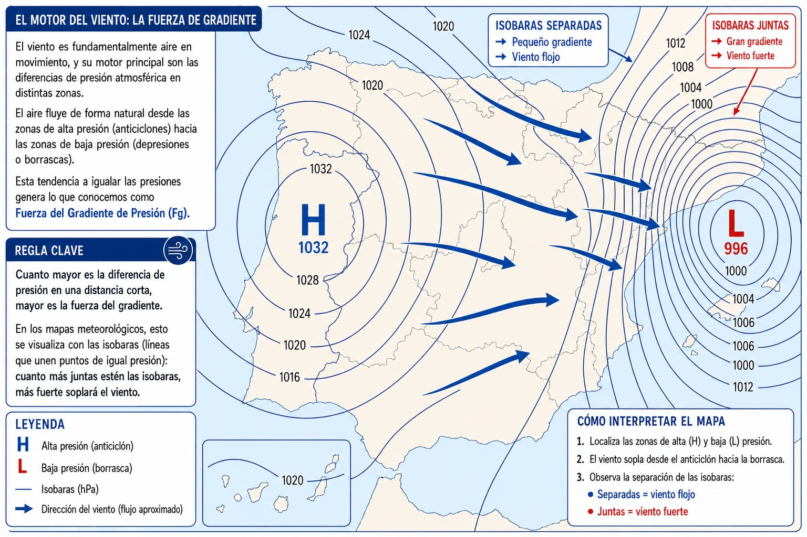
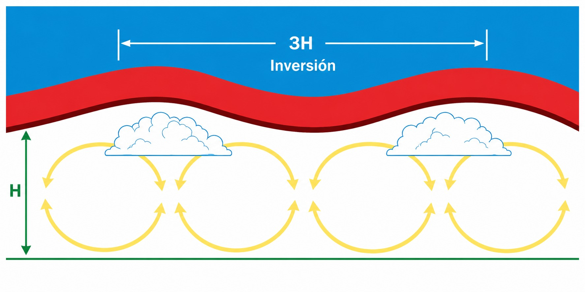
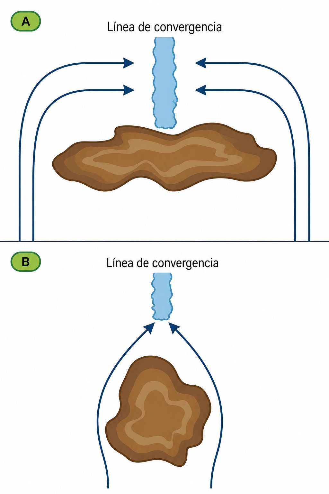
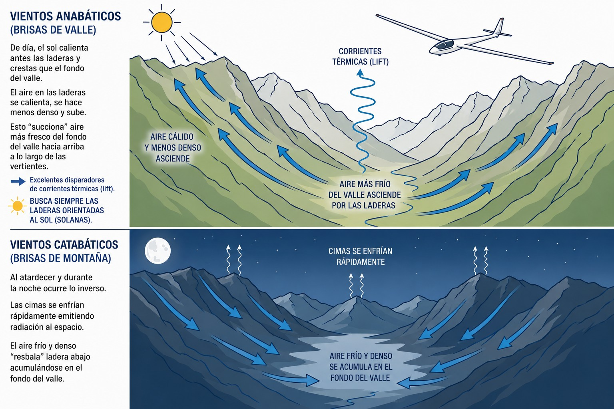
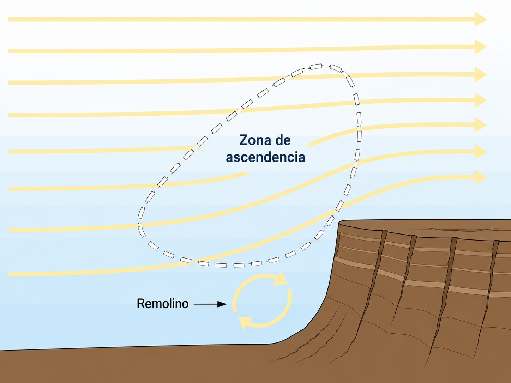
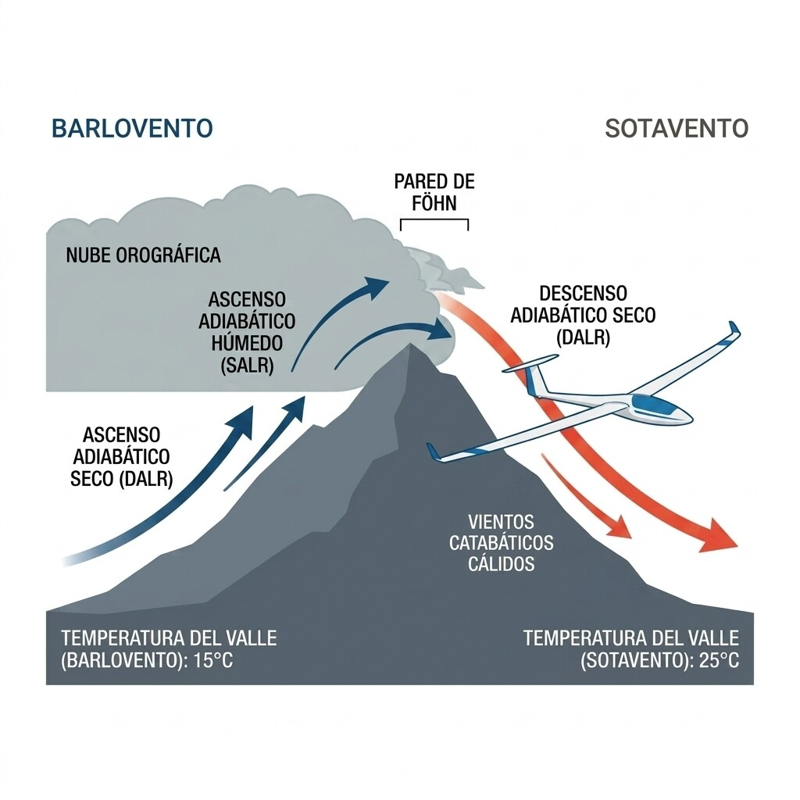
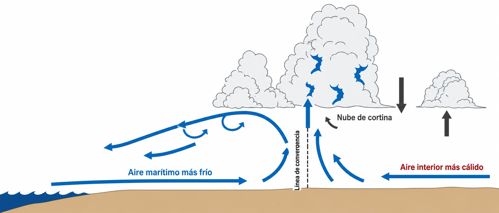

# Viento

El viento es la materia prima del vuelo a vela: a veces tu aliado, siempre un factor de
seguridad que debes conocer y respetar. En este capítulo aprenderás por qué sopla el viento,
cómo la rotación terrestre y el terreno lo transforman, y cuáles son los vientos locales
—anabáticos, catabáticos, Foehn, brisa marina— que definen la meteorología de cada aeródromo.

## El Motor del Viento: La Fuerza de Gradiente

El viento es fundamentalmente aire en movimiento, y su motor principal son las diferencias de presión atmosférica en distintas zonas.

El aire fluye de forma natural desde las zonas de alta presión (anticiclones) hacia las zonas de baja presión (depresiones o borrascas). Esta tendencia a igualar las presiones genera lo que conocemos como **Fuerza del Gradiente de Presión** (Fg). La regla es sencilla: cuanto mayor es la diferencia de presión en una distancia corta, mayor es la fuerza del gradiente. En los mapas meteorológicos, esto se visualiza con las isobaras (líneas que unen puntos de igual presión): cuanto más juntas estén las isobaras, más fuerte soplará el viento ().

{#fig-03-cap02-gradiente-isobaras}

## La Fuerza de Coriolis y el Viento Geostrófico

Si la Tierra no rotase, el viento fluiría directamente de las altas a las bajas presiones cruzando las isobaras perpendicularmente. Sin embargo, debido a la rotación terrestre, aparece una fuerza aparente llamada **Fuerza de Coriolis** (Fc).

En el hemisferio norte, la fuerza de Coriolis desvía cualquier masa de aire en movimiento hacia la **derecha**. A medida que el viento acelera impulsado por el gradiente de presión, Coriolis tira de él hacia la derecha. Por encima de unos 1.000 metros sobre el terreno (nivel de fricción), ambas fuerzas (gradiente y Coriolis) se equilibran. El resultado es que el viento deja de cruzar las isobaras y acaba soplando **paralelo** a ellas. A este viento libre en altura se le denomina **viento geostrófico**.

::: {.callout-tip}
✦ **REGLA DE ORO**

La Ley de Buys Ballot es una regla clásica que resume este efecto: en el hemisferio norte, si te pones de espaldas al viento, el centro de baja presión siempre estará a tu lado izquierdo.
:::

## El Efecto de la Fricción en Superficie

Cerca del suelo (por debajo de esos 1.000 metros), entra en juego un tercer actor: el rozamiento con el terreno o fricción superficial. Los árboles, edificios, montañas y la propia textura del suelo "frenan" el flujo del aire.

Al reducirse la velocidad del viento por esta fricción, el efecto de Coriolis (que depende de la velocidad) también disminuye. Sin embargo, la fuerza del gradiente de presión se mantiene intacta. Como Coriolis ya no puede contrarrestar del todo al gradiente, el viento en superficie se desvía y **cruza las isobaras hacia la baja presión** (típicamente con un ángulo de unos 30 grados respecto a las isobaras).

::: {.callout-warning}
⚠ **SEGURIDAD**

Debido a la fricción, cuando te acercas al suelo para aterrizar experimentarás el "gradiente de viento" ( en capa límite). En los últimos metros, el viento no solo será más flojo que en el circuito, sino que su dirección cruzará más hacia la baja presión. Debes mantener tu velocidad de aproximación con un margen de seguridad adecuado para evitar la pérdida de sustentación en la recogida (**flare**).
:::

{#fig-03-cap02-calles-nubes}

{#fig-03-cap02-convergencia-topografica}

## Brisas Locales: El Motor en la Montaña

  El calentamiento desigual del terreno por el sol genera vientos locales fundamentales para el piloto de planeador, especialmente en áreas montañosas:

* **Vientos Anabáticos (Brisas de Valle)**: De día, el sol calienta antes las laderas y crestas de las montañas que el fondo del valle. El aire en contacto con las cimas se calienta, se hace menos denso y sube, "succionando" aire más fresco del fondo del valle hacia arriba a lo largo de las vertientes. Estas brisas anabáticas son excelentes disparadores de corrientes térmicas (**lift**). Busca siempre las laderas orientadas al sol (solanas) ().
* **Vientos Catabáticos (Brisas de Montaña)**: Al atardecer y durante la noche ocurre lo inverso. Las cimas se enfrían rápidamente emitiendo radiación al espacio. El aire frío y denso "resbala" ladera abajo acumulándose en el fondo del valle ().

{#fig-03-cap02-ciclo-anabatico-catabatico}

{#fig-03-cap02-vuelo-ladera}

::: {.callout-note}
⚓ **AIRMANSHIP / BUENAS PRÁCTICAS**

A última hora de la tarde, cuando los fríos vientos catabáticos bajan por ambas laderas de un valle, "estrujan" el aire residual cálido que queda en el centro, forzándolo a subir. Este fenómeno se conoce como **restitución**. Crea zonas muy amplias y suaves de ascendencia en el centro del valle, permitiendo prolongar vuelos al atardecer en aire completamente calmado.
:::

## Efecto Foehn y Stau: Cuando la Montaña Calienta el Aire

  Cuando el viento húmedo del Atlántico choca con una cordillera, ocurre algo que parece casi magia: el mismo aire que llega frío y cargado de nubes por barlovento puede aterrizar en el valle de sotavento seco, transparente y diez grados más caliente. Esto es el **efecto Foehn** (**Foehn effect**), y su gemelo el **Stau** (**Stau effect**), y tienen consecuencias directas para el piloto.

El mecanismo es asimétrico: en la ladera de **barlovento** (la que recibe el viento), el aire asciende enfriándose primero al ritmo DALR (3 °C/1.000 ft) hasta que alcanza el punto de rocío, condensa y precipita. A partir de ese nivel, sube ya saturado a solo 1,5 °C/1.000 ft (SALR), cediendo calor latente a la atmósfera. En sotavento, el aire ya ha perdido su humedad al barlovento y desciende **seco** durante todo el recorrido, calentándose al DALR completo (3 °C/1.000 ft). El resultado: llega al valle de sotavento más caliente que cuando partió (). Con desniveles de 1.500–2.000 m, la diferencia puede superar los 10–15 °C entre los dos valles.

La **pared de Foehn** (**Foehn wall**) es la acumulación de nubes que permanece estacionaria sobre la cresta del lado de barlovento, marcando visualmente la zona de precipitación. En sotavento: ventana despejada, temperatura alta y humedad baja. El **Stau** es el nombre del mismo proceso visto desde el barlovento: acumulación de nubes y precipitación intensa mientras el otro valle disfruta del sol.

{#fig-03-cap02-fohn-stau}

Un ejemplo cercano: los naranjos y limoneros del **Valle del Tiétar** (al pie sur de la Sierra de Gredos, en Ávila y Cáceres) deben su microclima mediterráneo al Foehn que baja por la vertiente de sotavento cuando el viento viene del norte. Mientras en el páramo castellano hace frío, en el Tiétar recogen naranjas.

::: {.callout-warning}
⚠ **SEGURIDAD**

El sotavento de una cordillera bajo un Foehn activo puede esconder rotores de turbulencia severa en los niveles inferiores. No te confíes por ver cielos despejados y temperatura cálida en sotavento: mantén altitud al cruzar cordilleras en estas condiciones y evita las laderas de sotavento a baja altura.
:::

::: {.callout-tip}
✦ **REGLA DE ORO**

Si a pie de pista el termómetro marca varios grados por encima de lo habitual para el mes, la humedad relativa es inusualmente baja y ves una masa de nubes estacionaria sobre la sierra al norte: estás bajo un Foehn. Las bases de nube serán muy altas y las térmicas explosivas. Aprovéchalo, pero vigila los rotores cerca del terreno en el sotavento.
:::

## Brisas Marinas y Líneas de Convergencia: El Frente que No Aparece en el Mapa

  Las **brisas marinas** (**sea breeze**) son el resultado del mismo principio que las brisas de montaña: calentamiento desigual. La tierra se calienta mucho más rápido que el mar durante el día. El aire cálido sobre el continente asciende, y el aire fresco marino avanza tierra adentro para rellenar ese hueco, formando un flujo que puede penetrar decenas de kilómetros al interior ().

Lo más valioso para el volovelista no es el viento en sí, sino la **línea de convergencia** que genera (). Cuando ese aire frío y húmedo marino topa con la masa cálida y seca continental, se crea un límite nítido —un minifrente— donde el aire se ve forzado a ascender. Esa línea avanza lentamente tierra adentro durante la tarde y puede ofrecer ascendencias suaves y continuas durante kilómetros, perfectas para el vuelo de distancia.

{#fig-03-cap02-brisa-marina}

Identificar la línea de convergencia es cuestión de observación:

* Los cúmulos del lado marino tienen la **base más baja** (aire húmedo, punto de rocío alto) que los del interior (aire seco, bases altas).
* La convergencia a veces genera una franja alargada de cúmulos algo más activos, o incluso una cortina de nubes (**curtain cloud**) a lo largo del límite ().
* A ras de suelo puede notarse como un cambio repentino de viento y frescor al cruzarla.

::: {.callout-note}
⚓ **AIRMANSHIP / BUENAS PRÁCTICAS**

En verano, los pilotos que operan desde Fuentemilanos (Segovia) trabajan frecuentemente la convergencia de brisa del SW que penetra desde el Atlántico a través del Sistema Central. La Baja Térmica Peninsular (ver capítulo de Climatología) actúa como un gran aspirador que succiona la brisa marina tierra adentro, creando líneas de convergencia NW–SE que funcionan como autopistas de ascendencias para el cross-country. Revisa modelos RASP o Skysight —o su equivalente en Topmeteo o Meteo Parapente— la tarde anterior para anticipar su posición.
:::

**Resumen del Capítulo: Viento**

* **El motor del viento**: El aire fluye naturalmente de las Altas (H) a las Bajas (L) presiones debido a la fuerza de gradiente. Cuanto más juntas estén las isobaras, más fuerte soplará.
* **Fuerza de Coriolis**: En el hemisferio norte, la rotación terrestre desvía el viento hacia la derecha. Por eso, en altura, el viento acaba soplando paralelo a las isobaras (viento geostrófico).
* **Efecto de la Fricción**: Cerca del suelo, el rozamiento frena el viento y debilita el efecto Coriolis, haciendo que el viento cruce las isobaras hacia la baja presión. Al aterrizar, espera que el viento cambie de dirección e intensidad en los últimos metros.
* **Brisas Locales**: El sol calienta las laderas antes que el valle, generando brisas ascendentes (anabáticas) de día. De noche, el aire frío baja (catabático). Conocer este ciclo es vital para encontrar ascendencias o evitar descendencias peligrosas en montaña.
* **Efecto Foehn y Stau**: El aire que sube en barlovento precipita y cede calor latente (SALR). Al descender en sotavento —ya seco— se calienta al DALR completo, llegando hasta 15 °C más caliente. La "pared de Foehn" marca visualmente la cresta. Cuidado con los rotores en el sotavento.
* **Brisas Marinas y Convergencias**: La brisa marina penetra tierra adentro creando una línea de convergencia (minifrente) con ascendencias excelentes para el cross-country. Identifícala por las diferentes alturas de base de los cúmulos a cada lado y por la franja de nubosidad activa sobre el límite.
