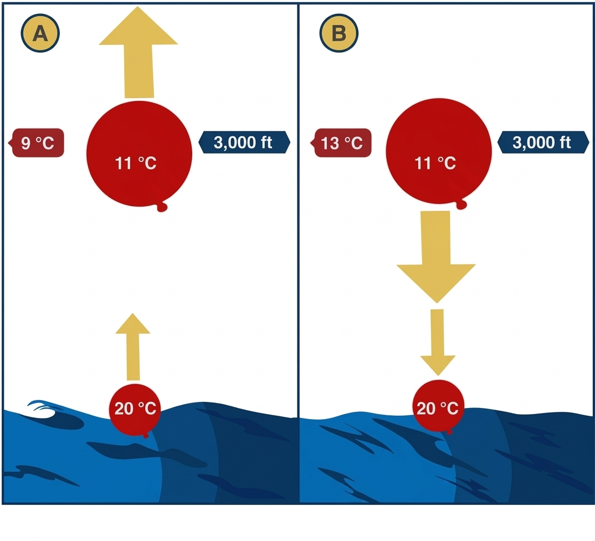
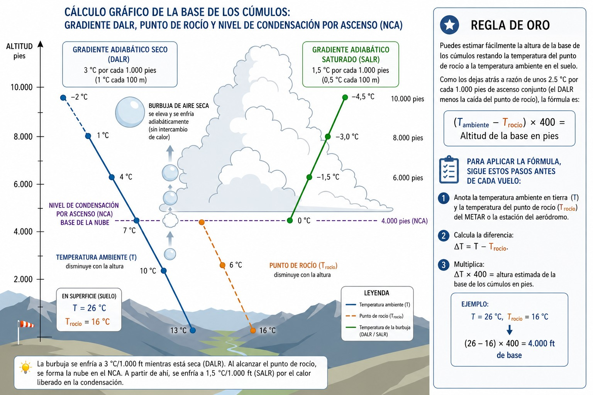
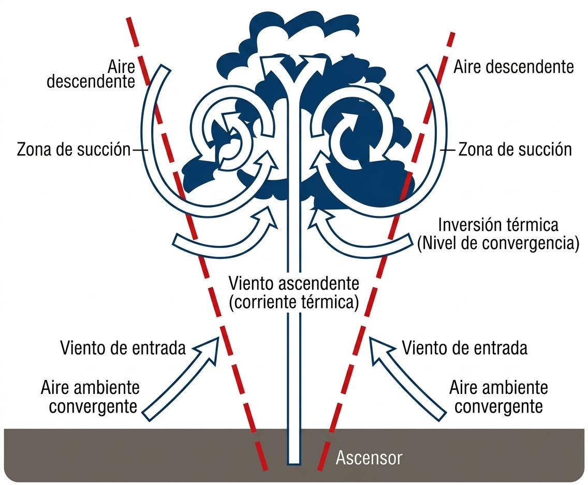
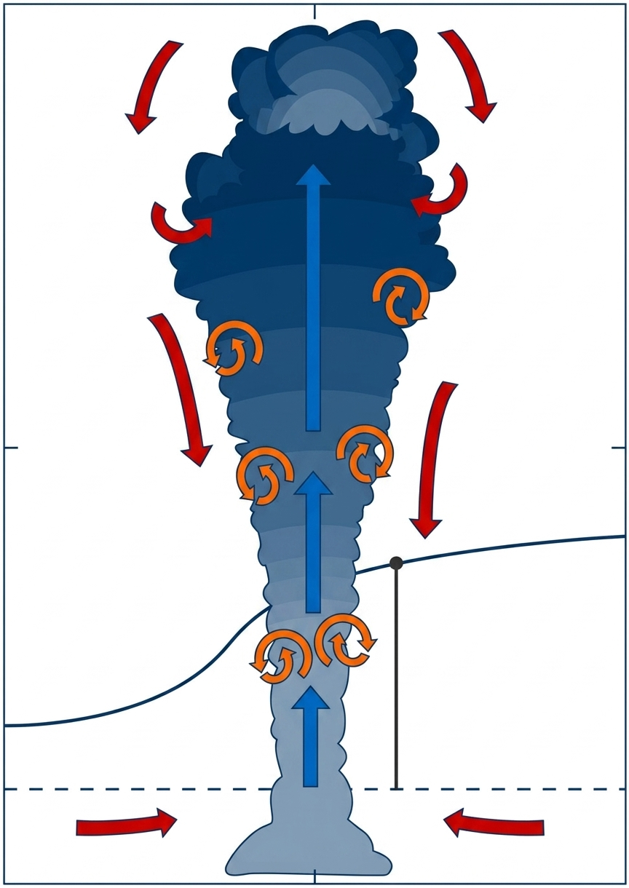
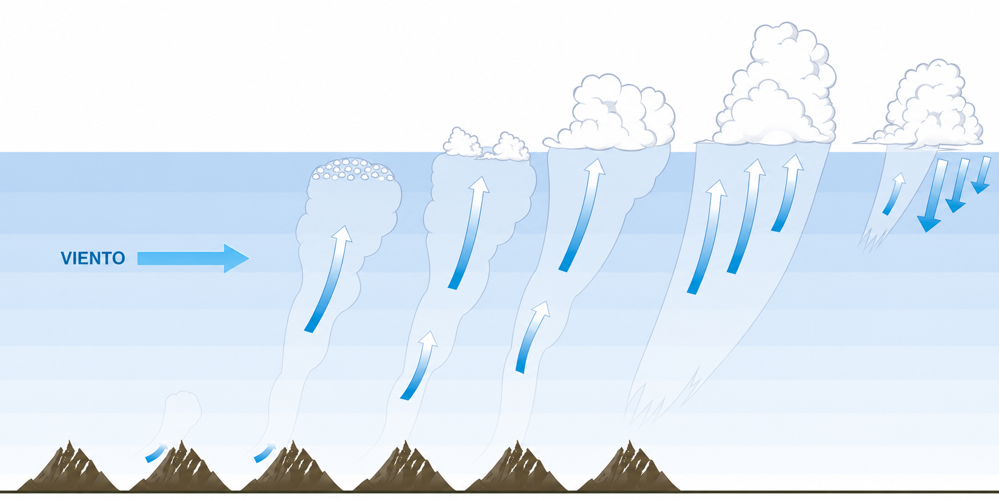

# Termodinámica

> La termodinámica es el motor invisible del vuelo sin motor: sin estabilidad inestable no hay
> térmicas, y sin térmicas no hay vuelo de distancia. En este capítulo aprenderás a interpretar
> la estabilidad atmosférica, a calcular la base de los cúmulos con una operación mental sencilla,
> a reconocer una inversión térmica y a leer los índices de sondeo que predicen si el día será
> excelente o decepcionante para volar.

## Estabilidad atmosférica: el combustible del vuelo a vela

  La estabilidad de la atmósfera define cómo se comporta una masa de aire (una "burbuja" o parcela) cuando es empujada hacia arriba. El vuelo sin motor vive fundamentalmente de la inestabilidad (@fig-03-cap03-estabilidad).

Podemos entenderlo imaginando una pelota en diferentes relieves:

* **Atmósfera Estable**: Si empujas la pelota desde el fondo de un valle subiéndola por la ladera, volverá a caer al centro. En el aire, si el ambiente se enfría lentamente con la altura (gradiente térmico ambiental menor de 1 °C/100m), una burbuja que ascienda se enfriará más rápido que su entorno. Pronto estará más fría (y pesada) que el aire que la rodea, deteniendo su ascenso y hundiéndose de nuevo.
* **Atmósfera Inestable**: Imagina la pelota en equilibrio precario en la cima de un monte; un pequeño empujón hará que caiga rodando sin parar. Si el aire ambiental se enfría muy rápido con la altura (mayor de 1 °C/100m), una burbuja que empiece a subir siempre se mantendrá más caliente (y ligera) que el aire a su alrededor, acelerando su ascenso. Esta es la condición ideal para la formación de fuertes térmicas.
* **Estabilidad Condicional**: Depende de la humedad. Si el aire está seco, es estable; pero si está saturado de humedad, el calor liberado por la condensación (al formar nubes) hace que la burbuja se mantenga caliente y siga subiendo (inestable).

{#fig-03-cap03-estabilidad}

## Gradientes adiabáticos y la base de las nubes

   Cuando una burbuja de aire asciende impulsada por la convección, se expande a medida que encuentra menor presión atmosférica en altura. Esta expansión provoca que se enfríe de forma interna (proceso adiabático), sin intercambiar calor con el aire exterior. El ritmo al que se enfría depende de si el aire está seco o saturado de humedad.

* **Gradiente Adiabático Seco (DALR - **Dry Adiabatic Lapse Rate**)**: Mientras la burbuja no alcance el 100% de humedad, se enfría a un ritmo constante de **3 °C por cada 1.000 pies** (1 °C cada 100 metros).
* **Gradiente Adiabático Saturado (SALR - **Saturated Adiabatic Lapse Rate**)**: Cuando la burbuja se enfría lo suficiente como para alcanzar su punto de rocío, el vapor de agua comienza a condensarse, formando la base de una nube (Nivel de Condensación por Ascenso o NCA). La condensación libera calor latente dentro de la burbuja. Por tanto, a partir de la base de la nube, la burbuja sigue subiendo, pero se enfría mucho más despacio, típicamente a **1,5 °C por cada 1.000 pies** (0,5 °C cada 100 metros en niveles bajos).

::: {.callout-tip title="Regla de oro"}
Puedes estimar fácilmente la altura de la base de los cúmulos restando la temperatura del punto de rocío a la temperatura ambiente en el suelo. Como los dejas atrás a razón de unos 2.5 °C por cada 1.000 pies de ascenso conjunto (el DALR menos la caída del punto de rocío), la fórmula es: **(T~ambiente~ - T~rocío~) x 400 = Altitud de la base en pies.**
:::

Para aplicar la fórmula, sigue estos pasos antes de cada vuelo:

1. Anota la temperatura ambiente en tierra (T) y la temperatura del punto de rocío (T~rocío~) del METAR o la estación del aeródromo.
2. Calcula la diferencia: ΔT = T − T~rocío~.
3. Multiplica: ΔT × 400 = altura estimada de la base de los cúmulos en pies.

*Ejemplo: T = 26 °C, T~rocío~ = 16 °C → (26 − 16) × 400 = **4.000 ft** de base.* (véase @fig-03-cap03-base-cumulos-dalr-nca)

{#fig-03-cap03-base-cumulos-dalr-nca}

## Inversiones térmicas: la tapadera invisible

Normalmente la temperatura disminuye con la altitud, pero en ocasiones ocurre lo contrario: encontramos capas donde **la temperatura del aire aumenta a medida que subimos**. A esto se le llama una inversión térmica.

Una inversión térmica actúa como una tapadera o techo de cristal. Debido a que el aire por encima de la inversión está sorprendentemente caliente, cuando una térmica sube y choca contra esa capa, de repente se encuentra rodeada de aire más caliente (y por tanto más ligero) que ella misma. La térmica pierde su flotabilidad (**buoyancy**) instantáneamente, deteniendo en seco el ascenso.

::: {.callout-warning title="Seguridad"}
Las inversiones no solo limitan la altura máxima a la que puedes trepar en un planeador, frenando la convección por completo, sino que también atrapan humo, bruma y humedad industrial cerca de la superficie, reduciendo drásticamente la visibilidad en vuelo por debajo de la capa de inversión.
:::

## Convección: el transporte vertical de calor

La convección es el proceso por el cual el calor se transporta verticalmente en la atmósfera, y es el mecanismo exacto que forma las térmicas.

El sol no calienta el aire directamente, sino que calienta la superficie de la tierra. Este calentamiento es muy desigual: un campo arado oscuro, una zona rocosa o un pueblo de tejados secos se calentará mucho más rápido que un bosque denso o un lago. El suelo caliente calienta por contacto la capa de aire inmediatamente superior.

Ese aire caliente, ahora menos denso y más ligero, tiende a subir por flotabilidad, formando una corriente convectiva o "térmica".Inicialmente, la burbuja se agarra al terreno por la fricción, aumentando su empuje ascensional hasta que finalmente se desprende y comienza a subir.

::: {.callout-note title="Airmanship"}
Para encontrar las mejores térmicas, busca "fuentes" que se calienten rápido (suelos secos, campos cosechados, zonas rocosas al sol) y "disparadores" o puntos de ruptura que ayuden a la burbuja a desprenderse del suelo, como una cresta de una colina orientada al viento, o una línea de árboles al borde del campo soleado.
:::

Los meteorólogos distinguen dos modelos conceptuales de cómo se organiza internamente ese flujo vertical:

* **Modelo burbuja** (**bubble model**): El calor se acumula sobre la fuente hasta que la burbuja se desprende, como si tirases de un globo. El ascenso es intermitente: el núcleo central sube más rápido que los bordes, que presentan subsidencia. El planeador debe buscar y mantenerse en el núcleo para aprovechar el ascenso máximo (@fig-03-cap03-modelo-burbuja).

{#fig-03-cap03-modelo-burbuja}

* **Modelo columna o pluma** (**column/plume model**): En fuentes intensas y persistentes (una cantera, un pueblo grande, una ladera orientada al sol toda la mañana), el flujo convectivo es continuo, como el humo de una chimenea. El ascenso es más regular y predecible, ideal para el vuelo de distancia (@fig-03-cap03-modelo-columna).

{#fig-03-cap03-modelo-columna}

En los días reales coexisten ambas estructuras. Las primeras horas de la mañana tienden a producir burbujas aisladas; a medida que el calentamiento se consolida, pueden aparecer columnas duraderas. Reconocer cuál predomina ese día mejora el centrado de térmicas y reduce el tiempo perdido fuera de círculo (@fig-03-cap03-ciclo-vida-termica).

{#fig-03-cap03-ciclo-vida-termica}

::: {.mas-alla}
## Índices de estabilidad: el termómetro del día

[**↗ MÁS ALLÁ DEL EXAMEN.**]{.mas-alla-tag} Los índices de sondeo (TT, K, CAPE, LI) y los Skew-T no deberían ser materia de examen: son formación de vuelo de distancia. Estúdialos cuando domines el resto del temario; aquí están porque forman al piloto, no solo al aprobado.

Describir cualitativamente la atmósfera ("parece inestable", "hace buena cara") es útil, pero los pilotos de cross-country van un paso más allá: cuantifican la inestabilidad mediante índices derivados de los sondeos termodinámicos.

El instructor de vuelo experimentado maneja habitualmente dos parejas de índices:

* **TT + K** como herramientas del día a día para decidir si vuelas y qué puedes esperar.
* **CAPE + LI** como herramientas de análisis profundo cuando el día "tiene trampa".

La distinción clave que aporta la experiencia de campo: **el TT (Total Totals) es especialmente fiable en el llano, mientras que el K es más representativo en montaña**. Cuando planifiques un vuelo en zona llana (Castilla, Aragón, La Mancha), mira el TT. Si volarás en entornos de cordillera (Pirineo, Sistema Central, Sistema Ibérico), dale más peso al K.

### Total Totals (TT): el índice del llano

El índice Total Totals (TT) combina el gradiente vertical de temperatura con la humedad en capas bajas. Su fórmula:

::: {.callout-note title="Airmanship"}
El gráfico TT + K que el instructor cuelga cada mañana en el hangar te da la fotografía rápida del día. El TT te dice cuánto "combustible" tiene la atmósfera para armar un Cb en el llano; el K te lo dice para la montaña. No confíes en uno solo: úsalos juntos antes de cada preflight.
:::

Umbrales del TT y su interpretación para el vuelo a vela:

| TT | Condición para el vuelo a vela |
| --- | --- |
| < 44 | Atmósfera estable; térmicas débiles o inexistentes |
| 44–48 | Inestabilidad moderada; convección posible sin tormenta |
| > 48 | Bastante inestable; desarrollo de Cb probable en el llano |
| > 52 | Tormenta muy probable: tormentas aisladas |
| 55 | Tormentas dispersas, algunas moderadas y alguna aislada severa |
| 58 | Tormentas moderadas dispersas, algunas severas y algún tornado aislado |
| 61 | Tormentas frecuentes moderadas; alguna severa o algún tornado |
| 64 | Tormentas frecuentes moderadas con tormentas severas y tornados |
: Umbrales del Total Totals (TT) y su interpretación

Los umbrales clásicos de tormenta del TT proceden del trabajo de Robert C. Miller para el centro de alertas militares de EE. UU. (*Notes on Analysis and Severe-Storm Forecasting Procedures of the Air Force Global Weather Central*, 1972); los tramos «para el vuelo a vela» de las dos primeras filas son una adaptación operativa de esta colección, no de Miller.

::: {.callout-warning title="Seguridad"}
El TT presenta limitaciones: sobrestima la inestabilidad si la temperatura a 500 hPa es muy baja sin soporte convectivo en capas bajas, y no detecta bien la estabilidad fuerte o la humedad elevada por debajo de 850 hPa. En esas situaciones, refuerza el análisis con el K-Index y el CAPE.
:::

### K-Index: el índice de la montaña

El K-Index combina el gradiente de temperatura entre 850 hPa y 500 hPa con la humedad en niveles medios y bajos. Es la métrica habitual para el pronóstico de actividad convectiva en entornos de montaña:

| K | Condición para el vuelo a vela |
| --- | --- |
| < -10 | Térmicas inexistentes o muy débiles (atmósfera muy estable) |
| -10 a 5 | Térmicas secas sin cúmulos; convección escasa |
| 5–15 | Buenas condiciones de vuelo a vela, cúmulos presentes |
| 15–20 | Excelente: bases altas, térmicas potentes, chubascos ocasionales |
| 20–30 | Excelente convección, pero riesgo creciente de chubascos y tormentas |
| > 30 | Alta probabilidad de tormentas (> 60 %): no planifiques vuelos largos |
: Umbrales del K-Index y su interpretación

::: {.callout-note title="Airmanship"}
El K-Index fue diseñado para predecir tormentas, no la calidad del vuelo a vela. Sus umbrales varían según la región y la estación: en zonas áridas como la Meseta Central, la baja humedad puede dar K bajos incluso con térmicas potentes. En montaña, si el nivel de 850 hPa queda cerca del suelo, el índice pierde representatividad. Úsalo siempre junto al TT y, si el día tiene pinta de complicarse, añade el CAPE.
:::

### CAPE y LI: profundizando cuando el día tiene trampa

* **CAPE** (**Convective Available Potential Energy**, Energía Potencial Convectiva Disponible): Cuantifica la energía disponible para la convección. Es el área entre la curva de la parcela y la curva de estado en el diagrama termodinámico. Valores de referencia: 0 J/kg = estabilidad absoluta; 1.000–2.500 J/kg = excelente día de térmicas; > 3.500 J/kg = convección severa probable.

::: {.callout-note title="Airmanship"}
Los valores de CAPE que ves en manuales de meteorología general suelen clasificar 1.000–2.500 J/kg como "moderadamente inestable", reservando "muy inestable" para valores superiores. Para el volovelista, ese rango es perfectamente excelente: proporciona térmicas potentes y bases altas sin el riesgo de tormenta severa. Cuando consultes herramientas externas como Skysight o la Universidad de Wyoming, interpreta el CAPE en contexto aeronáutico, no según las escalas de meteorología convectiva para tormentas.
:::

* **LI (Índice de Levantamiento o **Lifted Index**)**: Diferencia entre la temperatura de la parcela y la del ambiente a 500 hPa, tras elevarla adiabáticamente desde el suelo. Valores negativos indican inestabilidad: cuanto más negativo, mayor el potencial convectivo.

::: {.callout-tip title="Regla de oro"}
Día de convección excepcional — conocido coloquialmente como «día termonuclear» en el argot de competición —: TT entre 48 y 55, K entre 15 y 20, CAPE entre 1.000 y 2.500 J/kg, LI negativo y vientos flojos de componente variable. Son los días de récords de distancia. Puedes encontrar todos estos índices en cualquier sondeo online: gratuitamente en la Universidad de Wyoming, AEMET (AMA), Windy o Meteoblue; con previsiones orientadas al planeador en Skysight, Topmeteo o Meteo Parapente.
:::

Las tablas de umbrales de los apartados anteriores tienen ocho tramos cada una porque describen todo el espectro, de la calma a la tormenta severa. Para el examen basta con quedarse con la banda útil de cada índice; las tablas completas son material de campo para cuando vueles de verdad:

| Índice | Banda de buen día térmico | Señal de alarma (tormenta) |
| --- | --- | --- |
| **TT** (Total Totals) | 44–52 | > 55 |
| **K** (K-Index) | 15–25 (matizado en montaña) | > 25 |
| **CAPE** | 1.000–2.500 J/kg | > 2.500–3.500 J/kg |
| **LI** (Lifted Index) | ligeramente negativo | muy negativo |
: Los cuatro índices de sondeo, versión «nivel examen»

La regla de oro para el examen y para la cabina: un índice aislado no decide nada. TT y K dicen si el día vuela; CAPE y LI, cuánta energía tiene y si esa energía puede volverse contra ti en forma de tormenta.

::: {.callout-warning title="Seguridad"}
TT > 55 o K > 25 combinado con CAPE > 2.500 J/kg señala alto riesgo de tormenta de evolución diurna. En estas condiciones, planifica el aterrizaje antes de las 16:00 h y ten siempre identificado un campo de aterrizaje alternativo en tierra antes de que se levante la convección.
:::
:::

::: {.postit}
**Resumen del capítulo: termodinámica**

* **Estabilidad Atmosférica**: Concepto clave. El aire es "estable" si una burbuja empujada hacia arriba tiende a volver a bajar, e "inestable" si sigue subiendo sola. El vuelo a vela vive de la inestabilidad.
* **Gradientes Adiabáticos**: El aire seco se enfría 3°C por cada 1.000 ft al subir (DALR). El aire saturado (nube) se enfría solo la mitad, 1,5°C (SALR). Memoriza esto para predecir la base de las nubes y su desarrollo.
* **Inversiones**: Son capas donde la temperatura **sube** con la altura en lugar de bajar. Actúan como una tapadera invisible que frena las térmicas y atrapa la contaminación/bruma.
* **Convección**: El sol calienta el suelo, el suelo calienta el aire, y este sube como una burbuja (modelo burbuja) o como una pluma continua (modelo columna). Cuanto más frío esté el aire arriba en comparación con el suelo, más fuerte será la térmica.
:::
