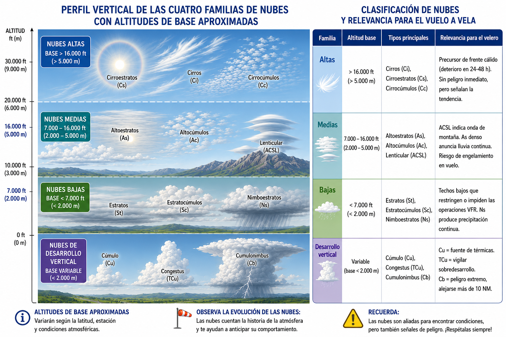
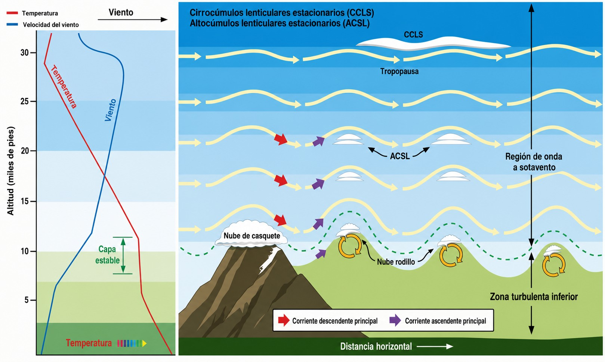

# Nubes y niebla

Las nubes son el lenguaje visual de la atmósfera: si sabes leerlas, te dicen dónde están
las ascendencias, dónde está el peligro y cómo va a evolucionar el tiempo. En este capítulo
aprenderás a identificar los tipos de nubes relevantes para el vuelo a vela, qué peligros
asocia cada familia y cómo interpretar la niebla y la neblina para decidir si despegar o no.

## Interpretación de la nubosidad

Para la tripulación de un planeador, las nubes son el mapa visual de la atmósfera. La tabla siguiente resume las cuatro familias principales y su relevancia operativa para el vuelo a vela ():

{#fig-03-cap04-familias-nubes-perfil}

La OMM clasifica la nubosidad en **diez géneros**, repartidos en esas cuatro familias por la altura de su base:

Nubes altas (base > 6.000 m)

Cirros (Ci), Cirrocúmulos (Cc), Cirroestratos (Cs)

Nubes medias (base 2.000–6.000 m)

Altocúmulos (Ac), Altoestratos (As), Nimboestratos (Ns)

Nubes bajas (base < 2.000 m)

Estratos (St), Estratocúmulos (Sc)

Desarrollo vertical

Cúmulos (Cu), Cumulonimbos (Cb)

Para el vuelo a vela no todos pesan igual: los cúmulos marcan las térmicas, el cumulonimbo es el peligro máximo, los cirros anuncian la llegada de un frente y los nimboestratos traen precipitación persistente. Aun así conviene reconocer los diez, porque el examen los pregunta y porque cada uno cuenta algo del estado de la atmósfera.

 

 

## Peligros asociados al desarrollo vertical

   En condiciones de alta inestabilidad atmosférica y humedad, un cúmulo
Cúmulo (Cu)
 puede continuar su desarrollo y evolucionar a 
Cúmulo congestus (Cu con)
 y, finalmente, transformarse en un ****.

El Cumulonimbus abarca una notable extensión vertical, culminando a menudo, al alcanzar la tropopausa
Tropopausa
, con un tope en forma de yunque. Esta configuración contiene energía masiva capaz de comprometer gravemente la seguridad del vuelo. Los riesgos asociados incluyen:

* **Turbulencia severa:** Las corrientes ascendentes y descendentes que coexisten dentro y alrededor del Cb superan con facilidad los límites estructurales del planeador. El frente de ráfagas puede extenderse a kilómetros del núcleo y golpear sin previo aviso.
* **Granizo:** Las corrientes ascendentes arrastran agua hasta las capas de congelación repetidas veces, formando granizo que alcanza tamaños considerables. Un impacto de granizo puede dañar seriamente la cúpula y las estructuras de fibra de la aeronave.
* **Actividad eléctrica:** Un rayo que impacte en el planeador compromete la integridad de la aeronave y pone en riesgo directo a los ocupantes.
* **Engelamiento masivo:** Al penetrar en las zonas superenfriadas del Cb, el borde de ataque acumula hielo claro en segundos, destruyendo el perfil laminar y disparando la velocidad de pérdida.

::: {.callout-warning}
⚠ **SEGURIDAD**

El piloto debe evitar en todo momento volar en las inmediaciones de un Cumulonimbus. Se recomienda mantener una separación lateral de seguridad entre 10 y 20 millas náuticas. Si un sistema convectivo amenaza el aeródromo, inicie de inmediato el procedimiento de aterrizaje.
:::

 

## Reducciones de visibilidad: Niebla y Neblina

   Una degradación significativa en la visibilidad penaliza las Reglas de Vuelo Visual (VFR).

* **Neblina y bruma:** Reducen la visibilidad horizontal a valores entre 1.000 m y 3.000 m.
* **** Fenómeno de suspensión de agua al nivel del terreno que restringe la visibilidad inferior a los 1.000 m. En estas condiciones, está inhabilitada la operación VFR.

Resulta de particular interés la ****. Se forma en madrugadas invernales tras noches despejadas bajo condiciones anticiclónicas. El rápido enfriamiento del terreno arrastra térmicamente la capa inferior de aire, saturándola y originando espesos bancos de niebla localizados.

Otro tipo relevante para los operadores de aeródromos costeros y de valle es la **** (**advection fog**). A diferencia de la de radiación, no depende del enfriamiento nocturno del suelo: se forma cuando una masa de aire cálido y húmedo se desplaza horizontalmente sobre una superficie más fría (el mar frío, un valle nevado o una costa). El contraste de temperatura basta para saturar la base de esa masa y producir un banco de niebla denso que puede persistir día y noche mientras dure el flujo. Es característica del litoral galaico-cantábrico en invierno y de las costas mediterráneas en otoño con viento de levante.

✦ **REGLA DE ORO**

Presta especial atención a la tarde en los días que hayan empezado con niebla de radiación persistente. Al caer el sol, el enfriamiento nocturno puede reinstaurar la niebla en minutos y cerrarte el campo antes de que aterrices. En costas y valles con viento de componente mar, añade también el riesgo de niebla de advección: puede llegar sin previo aviso y a cualquier hora del día.

 

## Altocúmulos Lenticulares y vuelo de onda

  Las **** (**Altocumulus lenticularis**) exhiben formas alisadas y características convexas, similares a una lente. A pesar de formarse bajo vientos de intensidad notable en altura, su estructura permanece totalmente estacionaria respecto al relieve.

Estas formaciones son la prueba visible de un flujo laminar constante interactuando transversalmente y rebotando a sotavento de un obstáculo orográfico. En la práctica, señalan el sistema de ****, donde es posible remontar sin turbulencia sostenidamente ganando gran altitud en un plano de aire terso ().

{#fig-03-cap04-nubes-onda-montana}

::: {.callout-warning}
⚠ **SEGURIDAD**

Bajo la zona de onda, a baja altura, se esconde el ****: un cilindro de turbulencia giratoria muy violento que se delata visualmente por fractocúmulos deshilachados e inestables. Si haces un remolque en zona de onda, el avión remolcador zarandeará con fuerza al atravesar el rotor. Mantén siempre altura suficiente para evitarlo y sigue las indicaciones del piloto remolcador en todo momento.
:::

**Resumen del Capítulo: Nubes y Niebla**

* **Significado de las nubes**: Para el piloto de planeador, las nubes son el mapa del cielo. Los **Cúmulos (Cu)** pequeños y algodónosos son nuestros mejores amigos (marcan térmicas). Los **Cirros** altos suelen anunciar un frente (mal tiempo en 24-48h).
* **Peligro de Desarrollo Vertical**: Si un cúmulo crece mucho verticalmente (**Cu congestus**), vigílalo de cerca. Si pasa a **Cumulonimbus (Cb)**, aléjate millas: hay turbulencia severa, granizo y rayos que pueden destruir el planeador.
* **Niebla vs Neblina**: Ambas reducen la visibilidad. La niebla (< 1 km) es crítica para el aterrizaje y despegue. Hay dos tipos frecuentes: la **de radiación** (noches frías y despejadas, suele disiparse con el sol por la mañana) y la **de advección** (aire cálido sobre superficie fría, puede presentarse a cualquier hora y no depende de la noche).
* **Nubes Lenticulares**: Tienen forma de lenteja o platillo y se quedan "quietas" aunque sople mucho viento. Indican **Onda de Montaña**, un fenómeno que permite subir muy alto pero advierte de turbulencia (rotores) muy peligrosa a baja altura.
