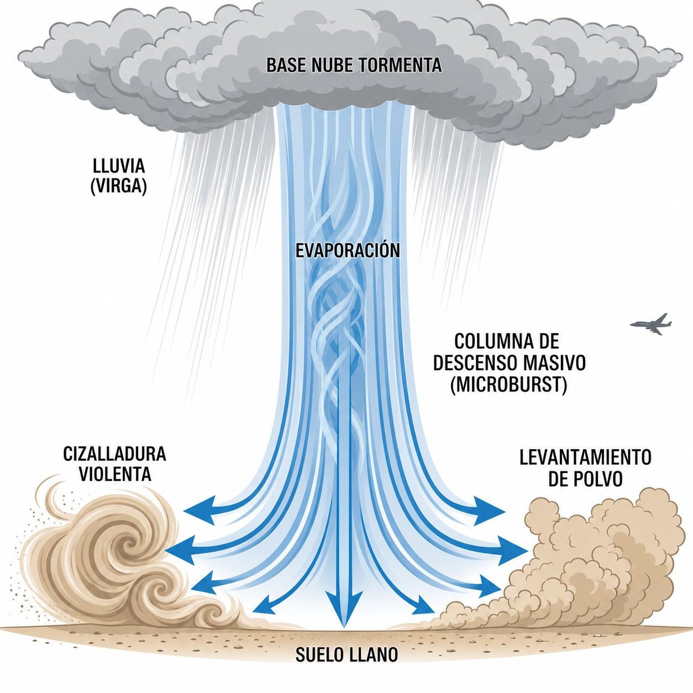

# Precipitación

La precipitación —lluvia, granizo, lluvia engelante o virga— no es solo un inconveniente:
puede convertirse en una emergencia en pocos minutos. En este capítulo aprenderás cómo
cada tipo de precipitación afecta al planeador aerodinámicamente, cuáles son los más
peligrosos y qué decisiones debes tomar ante los primeros síntomas para mantenerte seguro.

## La lluvia y la degradación aerodinámica

Los planeadores están diseñados con perfiles laminares calibrados para una alta eficiencia. El impacto de la lluvia altera severamente el perfil aerodinámico al provocar que el flujo de aire se desprenda prematuramente y se vuelva turbulento a lo largo de las alas mojadas.

En vuelo con lluvia, las consecuencias son directas:

* **Aumento de la velocidad de pérdida (**stall speed**):** El ala perderá su sustentación a una velocidad significativamente mayor que en configuración seca.
* **Reducción del coeficiente de planeo:** El ratio de planeo (**glide ratio**) se penaliza, lo que obliga a recalcular el cono de planeo y buscar alternativas de aterrizaje con menor alcance.
* **Mayor tasa de descenso:** Se aprecia un incremento notorio en la tasa de caída o hundimiento (**sink rate**) para lograr mantener una misma velocidad de vuelo.

::: {.callout-warning}
⚠ **SEGURIDAD**

Con alas mojadas, añade siempre un margen mínimo de 5-10 kt sobre tu velocidad de aproximación estándar. Evita giros pronunciados: el riesgo de entrada en pérdida es significativamente mayor que en configuración seca y puede producirse sin advertencia previa.
:::

## El granizo (GR) y nubes convectivas

El granizo nace dentro del Cumulonimbus (Cb). Las potentes corrientes ascendentes lanzan las gotas de agua hasta por encima del nivel de congelación, donde se congelan. Luego caen, son atrapadas de nuevo por la corriente y suben otra vez, ganando una capa de hielo en cada ciclo —como una cebolla— hasta que pesan demasiado para que la corriente las sostenga. El resultado son piedras que pueden superar los 2–3 cm de diámetro.

Para las aeronaves compuestas con perfiles ligeros de fibra, la aceleración cinética del granizo (sumada a la propia velocidad de la aeronave) presenta gran riesgo estructural. Resulta habitual constatar roturas y perforaciones en la cúpula (**canopy**), daños en los recubrimientos protectores superficiales de **gelcoat**, o posibles delaminaciones de la matriz celular sintética en impactos directos severos.

::: {.callout-note}
⚓ **AIRMANSHIP / BUENAS PRÁCTICAS**

No asumas que el granizo cae solo bajo la vertical del Cb: el viento en altura puede expulsarlo decenas de kilómetros bajo el yunque extendido. Mantén siempre la distancia de seguridad del yunque, aunque el cielo por debajo parezca completamente despejado.
:::

## Lluvia engelante (FZRA) y formación rápida de hielo

  La **lluvia engelante** (**FZRA**) es lluvia que cae ya superenfriada: gotas líquidas por debajo de 0°C que aún no se han congelado, las **gotículas superenfriadas**. El escenario clásico es un frente cálido en invierno, cuando la lluvia atraviesa una capa de aire bajo cero cerca del suelo. No hace falta estar dentro de una nube: al impactar contra cualquier superficie sólida del planeador —borde de ataque, cúpula, morro— las gotas se congelan en décimas de segundo formando hielo opaco o escarcha. Dentro de nube, entre 0°C y -15°C, esas mismas gotículas producen el engelamiento que se detalla en el capítulo 9.

El resultado es el **engelamiento** (**icing**), uno de los peligros más rápidos y graves del vuelo a vela:

* La cúpula de la cabina se opaca en segundos, eliminando toda referencia visual VFR.
* El hielo deforma el borde de ataque, destruye la sustentación laminar y eleva drásticamente la velocidad de pérdida.
* El peso añadido, distribuido asimétricamente en las puntas alares, incrementa el arrastre e introduce desequilibrios laterales difíciles de compensar.

Al primer síntoma de engelamiento —escarcha en el borde del ala o en la cúpula— gira 180° y desciende inmediatamente a niveles con temperatura positiva. No esperes: el engelamiento se acelera a medida que más superficie queda cubierta.

## Virga: La cortina descendente e invisibilidad

  La **Virga** es una cortina de precipitación que cae desde la base de una nube pero se evapora antes de llegar al suelo. Visualmente aparece como franjas grises o azuladas que se difuminan en el aire a media altura, sin tocar el terreno.

El peligro no está en la lluvia en sí, sino en lo que ocurre cuando esas gotas se evaporan: la evaporación enfría el aire circundante, que se vuelve más denso y cae en masa hacia el suelo formando una violenta corriente descendente —el **downburst** o **microrráfaga** ().

{#fig-03-cap05-virga-microrrafaga}

Estas corrientes descendentes localizadas (**microburst** / **downdraft**) pueden alcanzar velocidades de descenso que superan la capacidad de ascenso del planeador. Volar bajo una virga, especialmente durante la aproximación final, puede causar un hundimiento irrecuperable antes del umbral. Ante cualquier cortina de virga visible, mantén siempre distancia de seguridad lateral y vertical.

**Resumen del Capítulo: Precipitación**

* **Lluvia y Performance**: Para un planeador, la lluvia es kryptonita. El agua en las alas arruina el perfil laminar, aumentando drásticamente la velocidad de pérdida y la tasa de descenso. Si llueve, añade velocidad de seguridad al aterrizar.
* **Granizo (GR)**: Asociado a los Cumulonimbus (Cb). Puede encontrarse incluso fuera de la nube, bajo el yunque. Es destructivo para la estructura de fibra. NUNCA vueles debajo de un yunque de tormenta.
* **Lluvia Engelante (FZRA)**: Gotas superenfriadas que se congelan al impactar. Es una emergencia grave: el hielo se acumula en segundos, pesando y deformando el perfil. Sal inmediatamente de esa zona (generalmente cambiando de altitud).
* **Virga**: Cortina de lluvia que se evapora antes de tocar el suelo. Es un aviso visual de fuertes corrientes descendentes y posible turbulencia severa debajo de ella.
