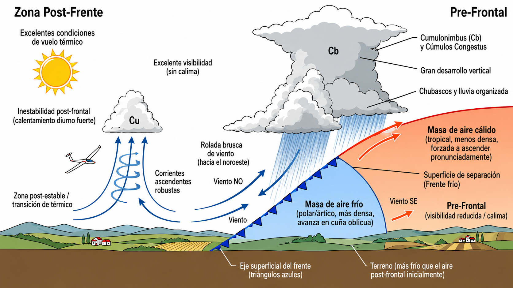
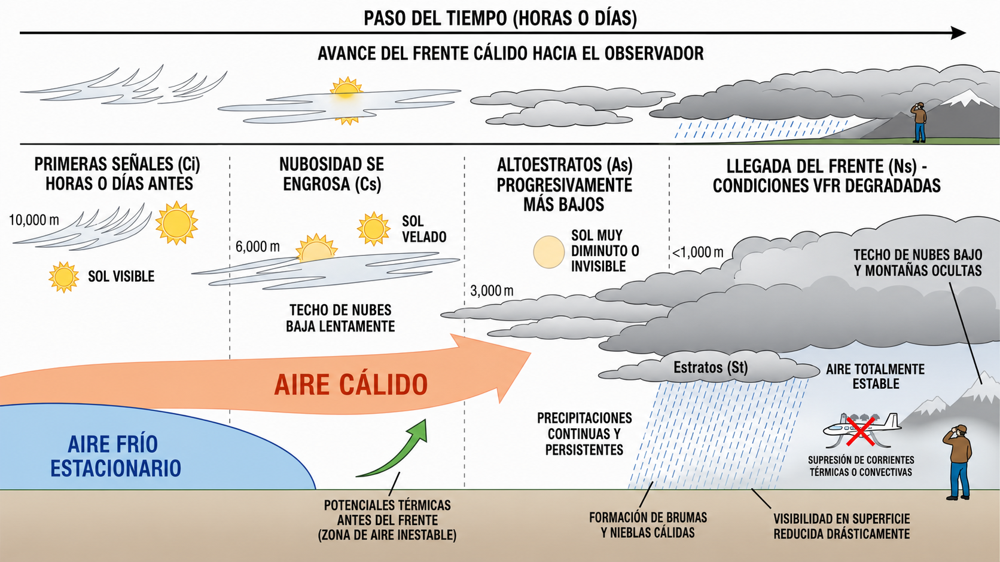
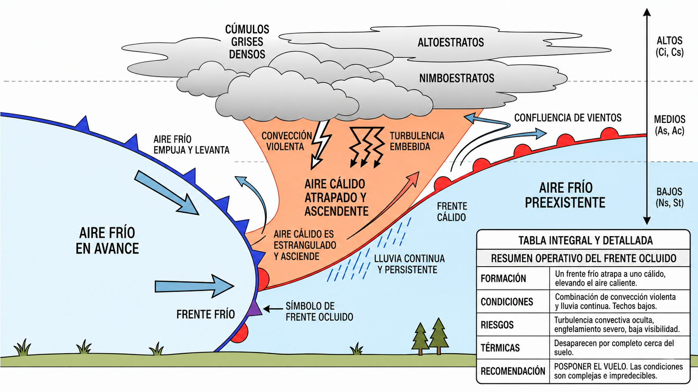

# Masas de aire y frentes

Un frente es la frontera entre dos masas de aire con propiedades distintas, y cruzarlo sin
planificación puede convertir un buen vuelo en una emergencia. En este capítulo aprenderás
a reconocer frentes fríos, cálidos y ocluidos antes de que lleguen a tu zona, y entenderás
por qué la temperatura relativa de la masa de aire determina si tendrás térmicas o niebla
bajo tus ruedas.

## Frentes fríos e inestabilidad

Un **frente frío** corresponde a la superficie de separación en la cual una masa de aire frío, al ser más densa, avanza en forma de cuña introduciéndose por debajo de una masa de aire cálido preexistente. Este proceso obliga al aire cálido a ascender de manera pronunciada.

El paso de un frente frío se caracteriza por un descenso abrupto de las temperaturas, una rolada brusca de viento (generalmente hacia el noroeste o norte), visibilidad reducida y precipitaciones organizadas, frecuentemente en forma de chubascos y nubes de gran desarrollo vertical como los Cumulonimbus (Cb) ().

Para el vuelo a vela, el interés meteorológico óptimo radica en la situación posterior al frente. Una vez despejada la barrera frontal, la región queda dominada por una masa de aire transicional netamente más fría que el terreno. Al calentarse su base por contacto con el suelo, se establece una marcada **inestabilidad post-frontal**.

::: {.callout-tip}
✦ **REGLA DE ORO**

Las jornadas inmediatas tras el cruce de un frente frío intercontinental suelen ofrecer las mejores condiciones de vuelo térmico. Se caracterizan por una excelente visibilidad por ausencia de calima, presión atmosférica en aumento y un fuerte calentamiento diurno que detona corrientes ascendentes robustas marcadas por nubes Cúmulos (Cu) de contornos definidos.
:::

{#fig-03-cap06-frente-frio-estructura}

## Frentes cálidos y subsidencia pre-frontal

Un **frente cálido** se produce cuando una masa de aire cálido avanza y asciende suavemente sobre una masa de aire frío más densa y estacionaria que ocupa la cuenca inferior. Al presentar una pendiente mucho menor que la del frente frío, su evolución y desplazamiento resultan lentos y prolongados.

La proximidad de un frente cálido se anticipa visualmente horas o días antes mediante la aparición escalonada de nubes tipo **Cirros (Ci)** (). Conforme el sistema avanza, la nubosidad se engrosa y desciende de altitud progresivamente, transitando a Cirroestratos, Altoestratos y concluyendo en una capa de Nimbostratos (Ns) y Estratos (St).

Un frente cálido degrada las condiciones VFR de forma progresiva:

* Genera precipitaciones continuas y lloviznas persistentes de amplia cobertura.
* Los techos nubosos descienden paulatinamente, ocultando elevaciones y relieves montañosos.
* La humedad constante propicia la formación de brumas y nieblas cálidas que deterioran de manera drástica la visibilidad en superficie.
* A nivel termodinámico, estabiliza completamente la masa de aire suprimiendo físicamente el desarrollo de corrientes convectivas o térmicas aprovechables.

{#fig-03-cap06-frente-calido-nubes}

## La oclusión y el frente estacionario

Cuando un frente frío avanza más rápido que el cálido que tiene delante, termina alcanzándolo. Entonces el frente frío empuja desde atrás y pilla al aire cálido intermedio: lo pinza, lo levanta del suelo y lo obliga a ascender por completo. A este proceso se le llama **frente ocluido** u oclusión ().

Operativamente, una oclusión es lo peor de los dos frentes combinado: la convección violenta del frente frío más la lluvia continua y los techos bajos del frente cálido. El aire cálido ya no toca el suelo, así que las térmicas desaparecen y la turbulencia convectiva puede aparecer embebida en capas densas sin aviso visual claro. Ante un frente ocluido, pospón el vuelo: las condiciones son complejas e impredecibles.

{#fig-03-cap06-tipos-frentes}

Existe un cuarto tipo de frente, menos frecuente pero que aparece en los mapas sinópticos: el **frente estacionario**. Se forma cuando dos masas de aire de temperatura y densidad similar se encuentran y ninguna de las dos tiene fuerza suficiente para avanzar sobre la otra. El resultado es una frontera casi inmóvil entre ambas masas, que puede persistir durante días produciendo lluvias y nieblas persistentes a lo largo de su eje. En los mapas sinópticos se dibuja con el patrón alternado de triángulos azules y semicírculos rojos en lados opuestos de la línea frontal.

::: {.callout-important}
⚖ **NORMATIVA**

**SERA.5001** (Reglamento de Ejecución (UE) 923/2012) establece los mínimos meteorológicos para el vuelo VFR. En espacio aéreo de clase G, por debajo de 3.000 ft AMSL o 1.000 ft sobre el terreno, la visibilidad mínima general es de **5 km**, volando libre de nubes y con la superficie a la vista. Puede reducirse hasta **1.500 m** para vuelos a 140 kt o menos, siempre que la velocidad permita ver el tráfico y los obstáculos con tiempo para evitar la colisión. La penetración inadvertida en IMC por un piloto VFR sin habilitación de vuelo instrumental constituye una infracción grave.
:::

## Masas de aire y la temperatura relativa

A nivel de formación convectiva, la temperatura absoluta de la masa de aire resulta secundaria, lo predominante es dictaminar la **temperatura relativa de la masa de aire con respecto a la temperatura del suelo sobre el que transita**.

* **Aire frío deslizándose sobre suelo caliente = INESTABILIDAD.** Ocurre cuando aire marítimo fresco llega sobre mesetas continentales calentadas por el sol. La base de esa masa de aire se calienta por contacto con el suelo, se hace más ligera y asciende: se activan térmicas fuertes y aprovechables para el vuelo de distancia.
* **Aire cálido deslizándose sobre suelo frío = ESTABILIDAD.** Sucede cuando una masa cálida avanza sobre el océano frío o sobre continentes nevados. La base de ese aire se enfría y se hace más densa al contacto con el suelo, formando una inversión estable que suprime cualquier térmica y propicia nieblas persistentes.

## Clasificación de las masas de aire

Antes de hablar de temperatura relativa, es útil conocer de dónde viene el aire que tienes encima. Las masas de aire se clasifican por dos criterios: su **latitud de origen** (determina su temperatura) y su **trayectoria** (determina su humedad).

| Sigla | Tipo | Temperatura | Humedad y características para el vuelo a vela |
| --- | --- | --- | --- |
| **Tc / Tm** | Tropical (continental o marítimo) | Cálido | Tm: húmedo, bruma frecuente, térmicas débiles. Tc: caluroso y seco, inestabilidad fuerte en verano, excelentes térmicas en la Meseta. |
| **Pc / Pm** | Polar (continental o marítimo) | Frío | Pm: húmedo, post-frontal clásico, bases de cúmulos bajas pero térmicas presentes. Pc: muy frío y seco, visibilidad excepcional. |
| **A** | Ártico / Antártico | Muy frío | Irrupciones invernales desde el norte. Termómetros negativos en pista, engelamiento severo, vientos fuertes. No volar. |

: Clasificación de masas de aire por origen y trayectoria

La situación más frecuente en la Península Ibérica durante la temporada de vuelo (primavera-verano) es la llegada de **masa polar marítima (Pm)** tras el paso de un frente frío. Al cruzar el Atlántico y calentarse por contacto con el suelo peninsular caliente, esta masa genera la combinación perfecta para el vuelo de cross-country: cielo azul, buena visibilidad, bases a 5.000-7.000 ft y térmicas de 3-4 m/s.

::: {.callout-warning}
⚠ **SEGURIDAD**

No despegues con visibilidad marginal bajo una inversión: ante una rotura de cable o un desenganche de emergencia, el aterrizaje de vuelta a tierra se realizaría sin referencias visuales, con riesgo de impacto irremediable. Si tienes alguna duda sobre la visibilidad, pospón el vuelo.
:::

**Resumen del Capítulo: Masas de Aire y Frentes**

* **Frente Frío**: El mejor amigo del volovelista (después de que pasa). Trae inestabilidad, cielo limpio y térmicas potentes (cielo de "post-frente"). Al cruzarlo, espera chubascos, rolada de viento y bajada de temperatura.
* **Frente Cálido**: Malas noticias. Anunciado por cirros que bajan a estratos, trae lluvia continua, techos bajos y mala visibilidad. El aire es estable, así que olvídate de las térmicas.
* **Oclusiones**: Cuando el frente frío alcanza al cálido. Generalmente significa tiempo revuelto, mezcla de nubes y precipitaciones. Poco aprovechable para el vuelo.
* **Masas de Aire**: Lo que importa es la temperatura relativa. Aire frío sobre suelo caliente = inestabilidad (¡térmicas!). Aire cálido sobre suelo frío = estabilidad (capas, niebla, inversión).
