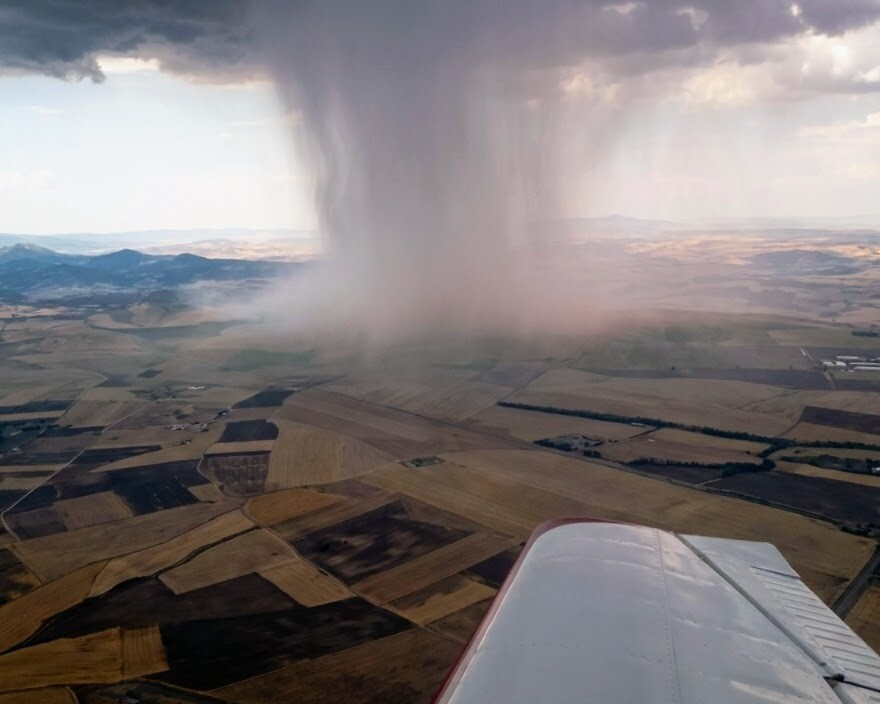
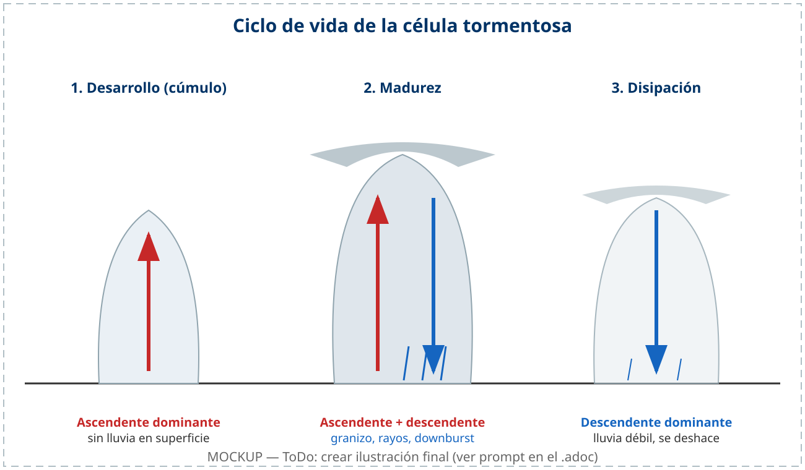
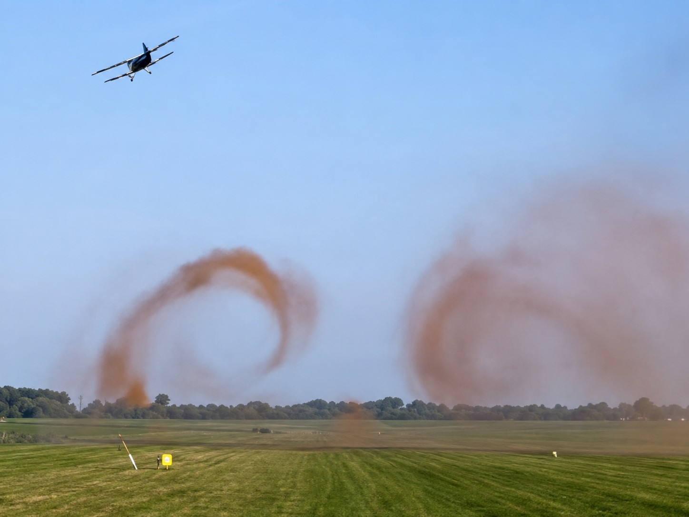
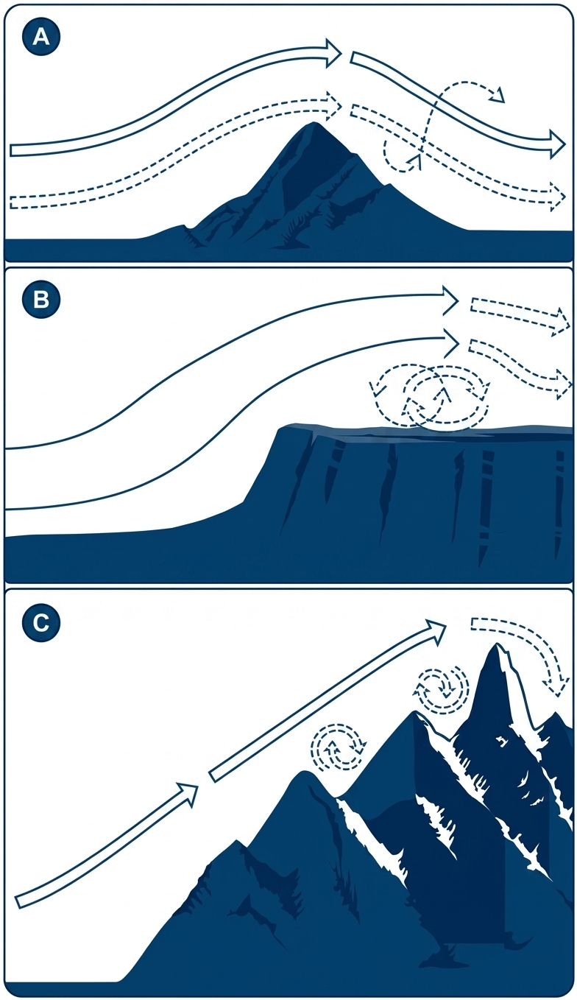
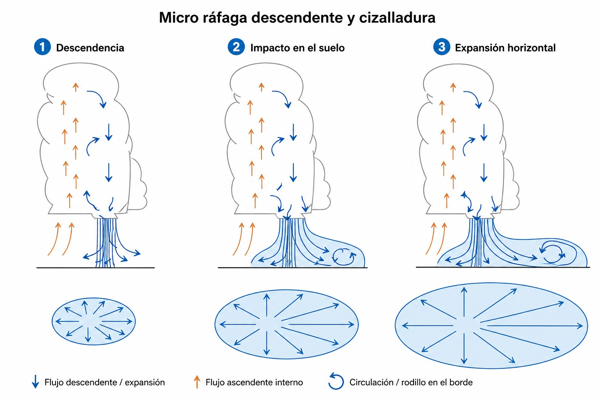

# Peligros para el vuelo

La meteorología peligrosa no siempre avisa con tiempo: un Cb puede crecer mientras haces
el preflight, el hielo puede formarse en minutos y la cizalladura puede tirarte al suelo
en los últimos metros de final. En este capítulo aprenderás a identificar y evitar los
peligros meteorológicos más críticos para el vuelo a vela, y qué decisiones tomar cuando
aparecen.

## Tormentas y nubes de desarrollo extremo (Cb)

El Cumulonimbus (Cb) representa la manifestación más severa de la inestabilidad atmosférica. Alberga en su volumen los meteoros más hostiles condensados en una misma depresión celular. Para cualquier aeronave, y en especial para un velero ligero, la doctrina de vuelo exige que **jamás** se debe operar bajo un Cb, en su interior, ni en sus proximidades (con un margen de evitación recomendado de entre 10 y 20 NM) (@fig-03-cap09-cumulonimbus).

* **Peligros estructurales:** Estas inmensas formaciones convectivas desatan corrientes ascendentes y descendentes contiguas de virulencia extrema. La turbulencia cizallante generada (**updrafts** y **downdrafts**) puede exceder holgadamente los factores de carga límite de diseño de cualquier aeronave ligera, provocando fallos estructurales en vuelo.
* **Fenómenos asociados:** Los Cb están perimetralmente flanqueados por turbonadas con fortísimos vientos racheados direccionales, alta densidad de descargas eléctricas (rayos), precipitación abundante y, con alta probabilidad, granizo. El impacto de granizo severo (diámetros > 2 cm) destruye el perfil laminar y puede comprometer la integridad de la estructura del planeador.
* **Identificación preventiva:** La acción fundamental es la anticipación. La detección visual del característico "yunque" expansivo en la tropopausa, o el profundo oscurecimiento de avance abovedado en la base (**roll cloud**), exigen maniobra evasiva inmediata y la toma de decisión para aterrizar en campo o en el aeródromo alternativo despejado más cercano.

{#fig-03-cap09-cumulonimbus}

::: {.callout-warning}
⚠ **SEGURIDAD**

Las células de tormenta en desarrollo o incrustadas ("embedded Cb") dentro de capas nubosas densas (como frentes cálidos u ocluidos) pueden enmascarar su presencia. Ante pronósticos de sistemas tormentosos severos, alertas meteorológicas marcando núcleos intensos, o indicios de fuerte inestabilidad, debe priorizarse el retorno rápido y seguro a tierra.
:::

### El ciclo de vida de la célula tormentosa

Una tormenta no es un objeto estático, sino un proceso con principio y fin. Entender sus tres fases ayuda a leer el cielo y a anticipar cuándo una célula es más peligrosa (@fig-03-cap09-ciclo-tormenta):

1. **Fase de desarrollo o cúmulo (**cumulus stage**)**: domina la corriente ascendente. Un cúmulo congestus crece rápidamente en vertical, alimentado por aire cálido y húmedo. Todavía no hay precipitación que llegue al suelo, pero la ascendencia ya es fuerte y desorganizada. Para el velero, la ascendencia es tentadora y engañosa: la nube aún está «cargándose».
2. **Fase de madurez (**mature stage**)**: la más peligrosa. Coexisten la corriente ascendente y la descendente; comienza la precipitación, que arrastra aire frío hacia abajo y genera el frente de racha en superficie. Es la etapa del granizo, los rayos, la turbulencia extrema y el **downburst**. La nube alcanza su máximo desarrollo vertical y aparece el yunque.
3. **Fase de disipación (**dissipating stage**)**: domina la corriente descendente. El aire frío de la precipitación corta el suministro de aire cálido que alimentaba la célula, la ascendencia se apaga y la tormenta se deshace, dejando restos de yunque y precipitación débil. Sigue habiendo turbulencia residual.

{#fig-03-cap09-ciclo-tormenta}

## Engelamiento en planeadores

El engelamiento (**icing**) es uno de los peligros más rápidos y silenciosos del vuelo a vela. Ocurre cuando el planeador entra en nubosidad o zonas de humedad visible con temperatura negativa —el intervalo de mayor riesgo está entre 0 °C y -15 °C, con el máximo en torno a -10 °C, aunque puede aparecer a temperaturas más bajas. Las gotículas de agua superenfriadas se congelan en décimas de segundo al tocar el borde de ataque, la cúpula o cualquier superficie frontal de la aeronave.

No todo el hielo es igual. La escarcha aparte —que no es engelamiento por gotícula superenfriada, sino depósito directo del vapor—, según la temperatura y el tamaño de las gotículas el engelamiento propiamente dicho adopta tres formas con efectos distintos:

* **Escarcha (**hoar frost**)**: Cristales finos y blancos que se forman por congelación directa del vapor de agua (sublimación inversa) sobre superficies frías, sin gotícula superenfriada de por medio. Por eso, en rigor, no es engelamiento; es la forma más leve: degrada el perfil alar y puede opacar la cúpula, pero el proceso es más lento.
* **Hielo opaco (**rime ice**)**: Se forma con gotículas pequeñas y temperaturas bajas, típicamente por debajo de -15 °C. Aspecto blanco y rugoso, se adhiere principalmente en el borde de ataque y aumenta el arrastre de forma notable.
* **Hielo mixto**: Entre -10 °C y -15 °C conviven gotículas grandes y pequeñas, y el depósito combina lo peor de los otros dos: capas duras y transparentes con incrustaciones blancas y rugosas.
* **Hielo claro (**clear ice**)**: El más peligroso. Se forma con gotículas grandes entre 0 °C y -10 °C. Se extiende en una capa transparente y dura por toda la superficie alar, añade peso, altera el equilibrio de la aeronave y destruye la sustentación laminar. Es difícil de detectar visualmente hasta que ya es grave.

En cualquiera de sus formas, las consecuencias son las mismas: la velocidad de pérdida (**stall speed**) sube, la relación de planeo cae y la cúpula se opaca. El planeador no dispone de ningún sistema anti-hielo.

::: {.callout-warning}
⚠ **SEGURIDAD**

Al primer síntoma de engelamiento —escarcha en el borde del ala o cristales en la cúpula— actúa de inmediato:

1. Gira 180° y sal de la zona de nubosidad.
2. Inicia el descenso hacia niveles con temperatura positiva.
3. No esperes: el engelamiento se acelera a medida que más superficie queda cubierta.

Un planeador con hielo estructural puede entrar en pérdida a velocidades muy superiores a las habituales, sin ningún síntoma previo de buffet.
:::

## Turbulencias de estela y orográficas

  No todas las turbulencias nacen de la meteorología: algunas las generan las propias aeronaves, y otras se esconden al abrigo de las montañas.

* **Estela turbulenta (**wake turbulence**):** Las aeronaves grandes —reactores pesados o turbohélices de gran tonelaje— desprenden de las puntas de sus alas dos vórtices poderosos que giran como tornillos. Estos vórtices descienden lentamente por debajo de la senda de vuelo y pueden persistir varios minutos en zonas con poco viento. Si un planeador cruza esa estela, el vuelco puede ser instantáneo y superar la capacidad de los mandos para corregirlo. En un aeródromo con tráfico mixto, espera siempre al menos 3 minutos tras el despegue o aterrizaje de una aeronave pesada antes de usar la misma pista (@fig-03-cap09-estela-turbulenta).
* **Estela de helicópteros:** Los helicópteros generan flujos de aire extremadamente peligrosos debido a la enorme cantidad de energía concentrada por sus palas de rotor. Su peligro se divide en dos escenarios:
  
  * **En vuelo estacionario o rodaje lento (**hover**):** El rotor proyecta un flujo descendente de alta velocidad (**downwash** o **rotor wash**) que impacta contra el suelo y se expande en forma de vórtices turbulentos hasta una distancia de al menos tres diámetros de rotor.
  * **En vuelo de avance:** El rotor genera un par de vórtices de estela similares a los de un avión de ala fija, pero notablemente más concentrados e intensos a baja velocidad. Cruzar esta estela puede provocar una guiñada o un alabeo instantáneo e incontrolable para un planeador.

{#fig-03-cap09-estela-turbulenta}

* **Rotores (**rotor turbulence**):** A sotavento de una cordillera con viento fuerte, a baja altura se forma el **rotor**: un cilindro de aire en rotación caótica e invisible desde fuera. Es la contrapartida peligrosa de la onda de montaña: mientras en la onda se sube con suavidad, a baja cota bajo esa misma onda el rotor puede arrebatarte el control del planeador con una única ráfaga. Si haces un remolque en zona de onda, sigue al avión remolcador con precisión, aprieta el arnés y no te acerques a la zona de rotor si puedes evitarlo (@fig-03-cap09-flujo-crestas).

{#fig-03-cap09-flujo-crestas}

## Cizalladura (Windshear) en el circuito final

  La **cizalladura** (**windshear**) es un cambio brusco de velocidad o dirección del viento que afecta al planeador en un espacio muy corto. Para el velero en aproximación es uno de los peligros más traicioneros: actúa en segundos, sin advertencia visual previa. Aparece asociada a frentes activos, zonas de convergencia, **downbursts** e inversiones térmicas en capas bajas.

* **Riesgo en final:** El planeador estima su energía de planeo sobre el viento de cara reinante. Si ese viento desaparece o gira a cola de forma súbita —lo que ocurre al cruzar una cizalladura— la velocidad aerodinámica (IAS) cae bruscamente, la sustentación se reduce y el planeador desciende de golpe. A escasa altura sobre el umbral no hay margen de recuperación: una pérdida de 10 kt de viento de cara en final puede llevar al aporrizaje (**crash landing**) en pocos segundos.
* **Reventones (Microbursts/Downbursts):** Íntimamente ligados a la base de cumulonimbos desarrollados que descargan lluvia intensa. Estas masas de aire frío se desploman verticalmente hacia el suelo, donde se expanden horizontalmente provocando ráfagas radiales opuestas. Entrar en una micro ráfaga durante la aproximación es extremadamente peligroso: primero el planeador experimenta una ganancia de sustentación engañosa por el viento de cara, para segundos después sufrir un hundimiento masivo por el aire descendente y el repentino viento de cola, que puede llevar a un aterrizaje forzado o accidente si no se tiene suficiente altitud y velocidad (@fig-03-cap09-cizalladura).

{#fig-03-cap09-cizalladura}

**Resumen del Capítulo: Peligros para el Vuelo**

* **Tormentas (Cb)**: La madre de todos los peligros. Jamás vueles bajo un Cb ni cerca de él (< 10-20 NM). Turbulencia extrema, granizo y rayos. Si ves un yunque, da media vuelta.
* **Ciclo de la tormenta**: tres fases. Desarrollo (cúmulo): ascendente dominante, sin lluvia. Madurez: ascendente y descendente juntas, granizo, rayos y **downburst** — la más peligrosa. Disipación: descendente dominante, la célula se deshace.
* **Engelamiento**: El hielo destruye la aerodinámica y eleva la velocidad de pérdida sin aviso. Cuatro depósitos —escarcha (en rigor no es engelamiento: es sublimación), hielo opaco, mixto y claro—; el **clear ice** es el más peligroso por invisible e irregular. Mayor riesgo entre 0 y −15 °C. Ante hielo, sal de la nube y baja a aire cálido.
* **Turbulencia**: La de estela de aviones pesados desciende lentamente y causa vuelco instantáneo (espera 3 minutos antes de usar la pista). El rotor de onda se forma a sotavento a baja cota con rotación caótica e invisible.
* **Cizalladura (Windshear)**: Cambio brusco de viento en tramo final. Puede tirarte al suelo (caída de velocidad de cara). Los **downbursts** (reventones) provocan primero viento de cara y luego un brusco hundimiento y viento de cola.
