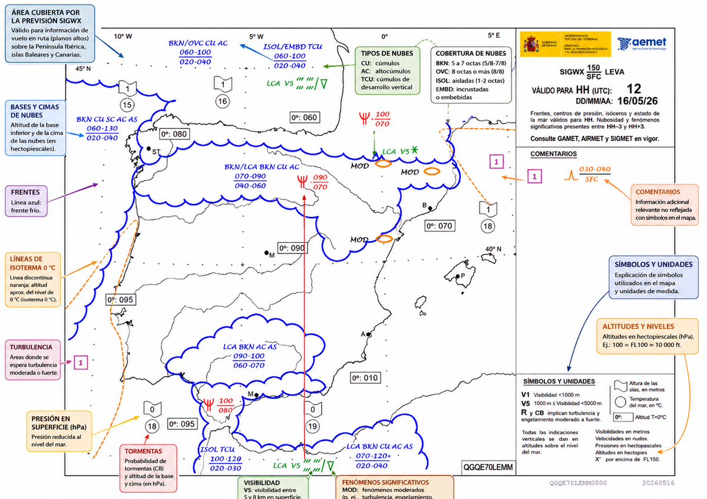
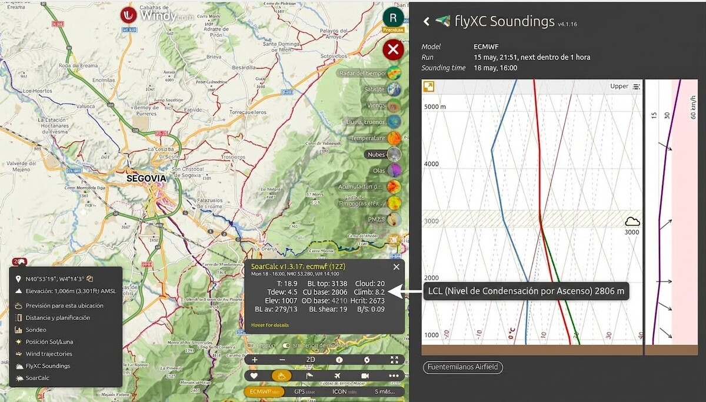

# Información meteorológica

> Saber volar es necesario; saber leer el tiempo antes de despegar es imprescindible.
> En este capítulo aprenderás a interpretar METARs, TAFs, mapas SIGWX y sondeos
> termodinámicos aplicados al vuelo sin motor: desde descifrar un código de cuatro letras
> hasta decidir con criterio si el día merece o no sacar el planeador del hangar.

## Informes METAR y TAF

Para la operativa del vuelo a vela, dada su intrínseca dependencia de los fenómenos atmosféricos, la capacidad de discernir e interpretar con precisión la información meteorológica aeronáutica es un requisito fundamental antes de iniciar cualquier vuelo. Los boletines estandarizados principales son el METAR y el TAF:

* **METAR (Meteorological Aerodrome Report):** Consiste en un reporte observacional de las condiciones meteorológicas reales y presentes en el aeródromo. Se emite habitualmente en intervalos de 30 minutos (o 60 minutos según el aeródromo). Proporciona datos concisos sobre la dirección e intensidad del viento en superficie, visibilidad horizontal, nubosidad (cobertura y altitud de la base), temperatura ambiental, temperatura del punto de rocío y reglaje altimétrico (QNH). Frecuentemente, el mensaje concluye con un segmento de pronóstico a corto plazo tipo `TREND` válido para las 2 horas posteriores (o la indicación `NOSIG` si no se prevén cambios significativos).
* **TAF (Terminal Aerodrome Forecast):** Es el pronóstico oficial del aeródromo. Elaborado por oficinas meteorológicas, anticipa la evolución temporal de la meteorología en la terminal para periodos de validez estandarizados que abarcan habitualmente 9, 24 o 30 horas. Emplea sintaxis de códigos de evolución y probabilidad, fundamentales para la planificación, tales como `TEMPO` (fluctuaciones temporales moderadas), `BECMG` (cambio gradual permanente) o `PROB` (probabilidad porcentual del suceso).

Resulta imperativo para la tripulación asimilar esta codificación con fluidez. Es de especial relevancia operativa interpretar indicadores como:

* CAVOK (Ceiling And Visibility OK): Indica condiciones VFR óptimas: visibilidad horizontal igual o superior a 10 km, ausencia de nubes operativas por debajo de 5.000 ft (o por debajo de la altitud mínima en sector más alta, la que sea mayor), y ausencia de Cb o TCU (cúmulos de gran desarrollo) y de fenómenos meteorológicos significativos.
* NSC (No Significant Clouds): Ausencia de nubes por debajo de 5.000 ft y sin presencia de Cb ni TCU, aunque los criterios de visibilidad de CAVOK no se cumplan.
* Reducciones de visibilidad: Abreviaturas como `FG` (Niebla / **Fog**) o `BR` (Neblina / **Mist**) denotan condiciones de operatividad VFR marginal o restrictiva, condicionando temporalmente los despegues.

### Ejemplo práctico de decodificación METAR

Veamos un ejemplo típico en un día de vuelo, paso a paso:

* **METAR**: Tipo de informe (observación regular).
* **LEMD**: Aeródromo (en este caso, Madrid-Barajas).
* **241100Z**: Día 24 del mes, a las 11:00 UTC (hora Zulú).
* **18002KT**: Viento proveniente de los 180° (sur) a 2 nudos.
* **9999**: Visibilidad horizontal de 10 km o superior (excelente).
* **FEW028**: Escasas nubes (**Few**, 1 a 2 octas) con base a 2.800 pies sobre el terreno.
* **OVC040**: Cielo cubierto (**Overcast**, 8 octas) a 4.000 pies.
* **16/09**: Temperatura ambiente 16 °C y temperatura del punto de rocío 9 °C. (Si aplicamos nuestra Regla de Oro termodinámica: (16 - 9) × 400 = 2.800 pies. Vemos que cuadra perfectamente con las nubes reportadas a 2.800 pies).
* **Q1019**: Reglaje de altímetro (QNH) de 1019 hPa.
* **NOSIG**: Pronóstico tipo TREND indicando que **no** se esperan cambios **sig**nificativos en las próximas 2 horas. El `=` marca el fin del mensaje.

| Aspecto | METAR | TAF |
| --- | --- | --- |
| Tipo | Observación real (estado actual del aeródromo) | Pronóstico oficial (evolución esperada) |
| Frecuencia de emisión | Cada 30 min (o 60 min en aeródromos menores) | 1–2 veces al día (según aeródromo) |
| Período de validez | Instante puntual + TREND de 2 horas | 9, 24 ó 30 horas |
| Quién lo emite | Observador o estación automática del aeródromo | Oficina meteorológica (AEMET) |
| Uso principal | Verificar las condiciones al despegar o al llegar | Planificar el vuelo con antelación |
| Indicadores clave | `CAVOK`, `NSC`, `FG`, `BR`, `NOSIG` | `TEMPO`, `BECMG`, `PROB30`, `PROB40` |
: METAR vs TAF: diferencias clave para la planificación del vuelo

## Mapas de tiempo significativo (SIGWX)

Mientras que METAR y TAF cubren aeropuertos concretos, los **Mapas de Tiempo Significativo (SIGWX)** muestran la meteorología esperada en grandes áreas de ruta. Son la vista de satélite de la planificación: te dicen dónde están los frentes, qué áreas de inestabilidad debes rodear y cuál es la posición de los niveles de congelación (@fig-03-cap10-sigwx).

* Los SIGWX grafican la distribución de frentes (fríos, cálidos, estacionarios, ocluidos) y sistemas de presión, con sus desplazamientos previstos.
* Identifican ejes de inestabilidad como **vaguadas** (**troughs**), que preceden al desarrollo de cúmulos y chubascos.
* Los servicios asociados —**SIGMET**, **AIRMET** y **GAMET**— emiten alertas específicas: engelamiento severo (`SEV ICE`), turbulencia severa (`SEV TURB`), o peligros en ruta a baja altura (por debajo de FL100 ó FL150, que es donde volamos nosotros). Antes de un vuelo de distancia, revisar los SIGMET activos es obligatorio.

{#fig-03-cap10-sigwx}

## Sondeos termodinámicos y curvas de temperatura

**↗ MÁS ALLÁ DEL EXAMEN.** Los sondeos Skew-T y los índices que se calculan sobre ellos (K, CAPE, LI) son formación de vuelo de distancia y no deberían ser materia de examen. Léelos como iniciación al cross-country.

El sondeo termodinámico es la radiografía del día: muestra cómo cambia la temperatura y la humedad con la altura en un punto geográfico dado. Se presenta en diagramas **Skew-T log-P** o **Stüve**, accesibles gratuitamente a través de la Universidad de Wyoming, AEMET (AMA), Windy o Meteoblue, y también integrados en plataformas de pago especializadas como Skysight, Topmeteo o Meteo Parapente. Aprender a leer un sondeo te ahorrará remolques innecesarios y te avisa de las tormentas antes de que sean visibles desde el suelo (@fig-03-cap10-indices-estabilidad).

{#fig-03-cap10-indices-estabilidad}

* La línea azul muestra el punto de rocío
* la línea roja muestra la temperatura del aire
* la línea verde muestra la temperatura de una parcela ascendente
* el área rayada a lo largo del gráfico muestra la capa convectiva (nubes cúmulos)
* el gráfico del viento muestra el viento de 0-30 km/h en la parte izquierda (fondo blanco) y de 30 a la velocidad máxima en la parte derecha (fondo rojo)

Las tres lecturas clave son:

1. **Base de los cúmulos (LCL):** La curva de estado y la curva del punto de rocío se cruzan a una altura: esa es la base de los cúmulos del día. Si el cruce está muy alto (> 3.000 m), los cúmulos serán escasos o no llegarán a formarse: térmica seca, sin calle de nubes.
2. **Techo térmico:** Traza la adiabática seca desde la temperatura máxima prevista. Donde esa línea vuelva a cruzar la curva de estado es el techo de las térmicas. Si ese techo sube hasta la **curva de estado** muy por encima de la base, el día tendrá térmicas potentes; si el cruce es bajo, el vuelo térmico será débil.
3. **Riesgo de sobredesarrollo (Cb):** Si la curva de estado se vuelve muy inestable por encima del nivel de condensación (LFC, **Level of Free Convection**), los cúmulos del mediodía pueden convertirse en cumulonimbos por la tarde. Un CAPE por encima de 2.500 J/kg combinado con un K-Index por encima de 25 es la firma del día que puede acabar mal.

::: {.callout-tip title="Regla de oro"}
El día de convección excepcional — conocido coloquialmente como «día termonuclear» en el argot de competición — tiene firma numérica precisa: K-Index entre 15 y 20, CAPE entre 1.000 y 2.500 J/kg, LI negativo, temperatura a 850 hPa varios grados por encima de la media en superficie, y vientos flojos. Busca estos índices directamente en el sondeo del día: gratuitamente en la Universidad de Wyoming, AEMET (AMA) o Windy; con más detalle soaring en Skysight, Topmeteo o Meteo Parapente.
:::

## Análisis de datos y toma de decisiones

Antes de salir a pista, cruza varias fuentes: es obligatorio y prudente. No te fies de un único modelo ni de un único parámetro.

* **Contrasta lo que ves con lo que pronostica el modelo:** Si llegas al campo y la nubosidad está ya tapando la solana cuando el sondeo predecía actividad térmica hasta las 3 de la tarde, algo ha fallado. La realidad manda: cancela o espera.
* **Criterio del comandante:** La última palabra siempre la tienes tú, no el modelo. Contrasta al menos dos fuentes independientes —AEMET (AMA), Windy o Meteoblue para el pronóstico general; Skysight, Topmeteo o Meteo Parapente si quieres lectura orientada al vuelo a vela—, revisa el TAF del aeródromo base y de los alternos cercanos, y anota los índices K y CAPE del sondeo del día. Pero recuerda: ningún pronóstico favorable en el papel tiene más peso que lo que ves a pie de pista.

::: {.callout-note title="Airmanship"}
AEMET —y su plataforma aeronáutica AMA (**Autoservicio Meteorológico Aeronáutico**)— es siempre la fuente pública, oficial y legalmente vinculante para tu planificación pre-vuelo (METAR, TAF, alertas, NOTAMs meteorológicos). Las plataformas generalistas como Windy o Meteoblue y las especializadas en vuelo a vela como Skysight, Topmeteo, los modelos RASP o Meteo Parapente se mencionan en este manual porque forman parte de la realidad operativa diaria, pero nunca deben sustituir al briefing meteorológico oficial de seguridad.
:::

::: {.callout-warning title="Seguridad"}
Si a pie de pista la meteorología real difiere del pronóstico favorable —nubosidad baja inesperada, viento variable fuerte, bruma densa— prevalece siempre lo que ves. Un vuelo cancelado nunca fue un accidente. La cultura **No-Go** no es cobardía: es el criterio que define a un piloto maduro.
:::

::: {.postit}
**Resumen del Capítulo: Información Meteorológica**

* **METAR y TAF**: Tus boletines de cabecera. METAR = foto actual (cada 30 min). TAF = pronóstico (para 9, 24 o 30h). Aprende a descodificarlos fluidamente (CAVOK indica visibilidad ≥10 km y sin nubes por debajo de 5000 ft; FG indica niebla; BR neblina).
* **Mapas Significativos (SIGWX)**: Muestran frentes, zonas de turbulencia y engelamiento. Cruciales para planificar rutas largas.
* **Toma de decisiones**: No te fíes de una sola fuente. Cruza datos: mapa de superficie + satélite + previsión local. Si la meteo pinta dudosa, el mejor vuelo es el que se queda en tierra (no-go).
:::

