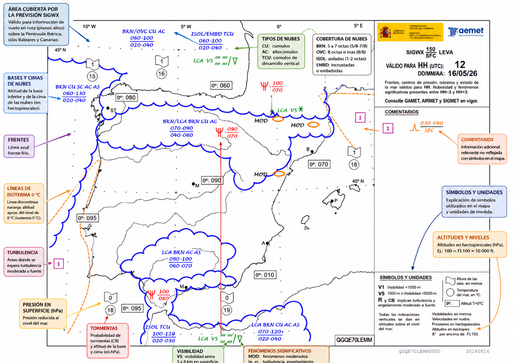
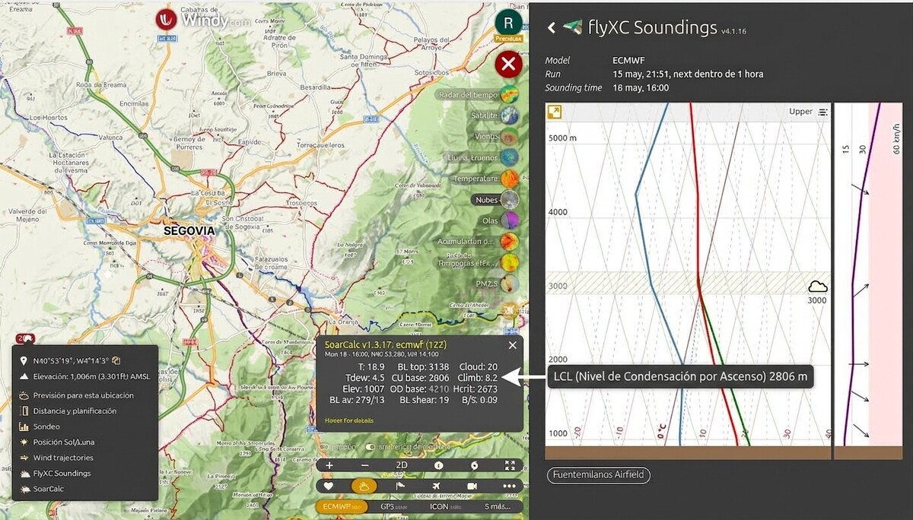

# Información meteorológica

> Saber volar es necesario; saber leer el tiempo antes de despegar es imprescindible.
> En este capítulo aprenderás a interpretar METARs, TAFs, mapas SIGWX y sondeos
> termodinámicos aplicados al vuelo sin motor: desde descifrar un código de cuatro letras
> hasta decidir con criterio si el día merece o no sacar el planeador del hangar.

## Informes METAR y TAF

Para la operativa del vuelo a vela, dada su intrínseca dependencia de los fenómenos atmosféricos, la capacidad de discernir e interpretar con precisión la información meteorológica aeronáutica es un requisito fundamental antes de iniciar cualquier vuelo. Los boletines estandarizados principales son el METAR y el TAF:

* **METAR (Meteorological Aerodrome Report):** Consiste en un reporte observacional de las condiciones meteorológicas reales y presentes en el aeródromo. Se emite habitualmente en intervalos de 30 minutos (o 60 minutos según el aeródromo). Proporciona datos concisos sobre la dirección e intensidad del viento en superficie, visibilidad horizontal, nubosidad (cobertura y altitud de la base), temperatura ambiental, temperatura del punto de rocío y reglaje altimétrico (QNH). Frecuentemente, el mensaje concluye con un segmento de pronóstico a corto plazo tipo `TREND` válido para las 2 horas posteriores (o la indicación `NOSIG` si no se prevén cambios significativos).
* **SPECI (Special Aerodrome Report):** Es el hermano urgente del METAR. Se emite fuera del ciclo regular, en cuanto las condiciones cambian de forma significativa: el viento vira o arrecia, la visibilidad o la base de las nubes cruzan un umbral operativo, aparece una tormenta. Su formato es idéntico al del METAR, sólo cambia la palabra inicial. Si al consultar un aeródromo aparece un SPECI, léelo antes que el METAR: es más reciente y se ha emitido precisamente porque algo ha empeorado.
* **TAF (Terminal Aerodrome Forecast):** Es el pronóstico oficial del aeródromo. Elaborado por oficinas meteorológicas, anticipa la evolución temporal de la meteorología en la terminal para periodos de validez estandarizados que abarcan habitualmente 9, 24 o 30 horas. Emplea una sintaxis de códigos de evolución y probabilidad, fundamentales para la planificación:
  * `FM` (**from**): cambio rápido y permanente a partir de la hora indicada. Todo lo anterior deja de valer.
  * `BECMG` (**becoming**): cambio gradual y permanente dentro del intervalo indicado.
  * `TEMPO`: fluctuaciones temporales, cada una de menos de una hora y en conjunto menos de la mitad del intervalo.
  * `PROB30` y `PROB40`: probabilidad del 30 % o del 40 % de que ocurra lo que sigue. **Son los dos únicos que existen**: si la probabilidad llega al 50 % el fenómeno se codifica como cambio (`BECMG` o `FM`), y por debajo del 30 % no se codifica en absoluto.

Resulta imperativo para la tripulación asimilar esta codificación con fluidez. Es de especial relevancia operativa interpretar indicadores como:

* CAVOK: Indica condiciones VFR óptimas, y exige cuatro cosas **a la vez**: visibilidad horizontal igual o superior a 10 km; ninguna nube por debajo de 5.000 ft o de la altitud mínima de sector más alta, la que sea mayor; **ningún Cb ni TCU a cualquier nivel**; y ningún fenómeno meteorológico significativo. Ese «a cualquier nivel» es un error clásico de examen: un cumulonimbo con la base a 7.000 ft impide el CAVOK aunque quede muy por encima del umbral de los 5.000. El rótulo es el de OACI; en el club se oye el retroacrónimo *Ceiling And Visibility OK*, que no es la denominación oficial.
* NSC (No Significant Cloud): Ausencia de nubes por debajo de 5.000 ft (o de la altitud mínima de sector más alta, la que sea mayor) y ausencia de Cb y TCU, cuando los criterios de CAVOK no se cumplen —típicamente porque la visibilidad no llega a los 10 km—.
* NCD (**No Cloud Detected**) y SKC (**Sky Clear**): se confunden a menudo con NSC y no dicen lo mismo. `NCD` lo emite una estación **automática** que no ha detectado nubes con sus sensores; `SKC` lo escribe un **observador humano** que ve el cielo despejado. `NSC`, en cambio, no afirma que no haya nubes: afirma que ninguna es operativamente significativa.
* Reducciones de visibilidad: Abreviaturas como `FG` (Niebla / **Fog**) o `BR` (Neblina / **Mist**) denotan condiciones de operatividad VFR marginal o restrictiva, condicionando temporalmente los despegues.

La cobertura nubosa se codifica en **octavos de cielo cubierto**, u octas, y son cuatro escalones, no dos:

| Código | Octas | Significado |
| --- | --- | --- |
| `FEW` (**Few**) | 1–2 | Escasa |
| `SCT` (**Scattered**) | 3–4 | Dispersa |
| `BKN` (**Broken**) | 5–7 | Fragmentada |
| `OVC` (**Overcast**) | 8 | Cubierto |
: Cobertura nubosa en octas, tal como se codifica en METAR y TAF {#tbl-03-cap10-octas}

Fíjate en el salto de @tbl-03-cap10-octas entre `SCT` y `BKN`. Ahí, en un solo octavo de cielo, está la diferencia entre un día de cúmulos aprovechables y un cielo que se cierra y apaga las térmicas.

::: {.callout-important title="Normativa"}
En el METAR y el TAF escritos, la dirección del viento va referida al **norte verdadero**. El viento que te da la Torre o el ATIS por radio va referido al **norte magnético**, igual que la numeración de las pistas, para que puedas compararlo directamente con el rumbo de la pista sin corregir nada. Es la misma cifra medida contra dos nortes distintos, y cae en el examen con frecuencia. El libro de Comunicaciones lo trata en detalle.
:::

### Ejemplo práctico de decodificación METAR

El mensaje llega de una pieza y lo primero es **partirlo en grupos**; a partir de ahí cada uno se lee por separado. Éste es el que vamos a descifrar:

```
METAR LEMD 241100Z 18002KT 9999 FEW028 OVC040 16/09 Q1019 NOSIG=
```

Grupo a grupo:

* **METAR**: Tipo de informe (observación regular).
* **LEMD**: Aeródromo (en este caso, Madrid-Barajas).
* **241100Z**: Día 24 del mes, a las 11:00 UTC (hora Zulú).
* **18002KT**: Viento proveniente de los 180° (sur), referidos al norte verdadero, a 2 nudos.
* **9999**: Visibilidad horizontal de 10 km o superior (excelente).
* **FEW028**: Escasas nubes (**Few**, 1 a 2 octas) con base a 2.800 pies sobre la elevación del aeródromo.
* **OVC040**: Cielo cubierto (**Overcast**, 8 octas) a 4.000 pies.
* **16/09**: Temperatura ambiente 16 °C y temperatura del punto de rocío 9 °C. (Si aplicamos nuestra Regla de oro termodinámica: (16 - 9) × 400 = 2.800 pies. Vemos que cuadra perfectamente con las nubes reportadas a 2.800 pies).
* **Q1019**: Reglaje de altímetro (QNH) de 1019 hPa.
* **NOSIG**: Pronóstico tipo TREND indicando que **no** se esperan cambios **sig**nificativos en las próximas 2 horas. El `=` marca el fin del mensaje.

Traducido el mensaje, queda lo que de verdad cuesta: decidir. Este METAR es un **no-go** para vuelo a vela, y lo dice una sola palabra: `OVC040`. Con el cielo cubierto a 4.000 pies no llega sol al suelo, y sin sol no hay calentamiento diferencial, no hay térmicas y no hay vuelo. Da igual que la visibilidad sea excelente, el viento esté en calma y el QNH cómodo. Y fíjate en lo cerca que se quedaron las dos cosas: el `FEW028` cuadraba con la Regla de oro y prometía cúmulos a 2.800 pies, y la capa que los tapa está sólo 1.200 pies más arriba. Acostúmbrate a preguntarte, grupo a grupo, qué le hace cada uno al día.

Otros grupos que aparecen a diario y no están en este ejemplo:

* **Viento**: `G` señala la racha (`18012G25KT`, 12 nudos con rachas de 25); `VRB` indica dirección variable; y dos rumbos unidos por `V` (`180V240`) acotan la oscilación de la dirección.
* **Visibilidad y nubes**: `VV///` es visibilidad vertical —el cielo no se ve, hay que medir hacia arriba a través de la niebla—; `NSW` (**No Significant Weather**) anuncia que un fenómeno significativo ha cesado.
* **Tiempo**: `RE` prefija el tiempo reciente (`RETS`, tormenta reciente); `WS` avisa de cizalladura (`WS RWY18`).
* **Temperatura negativa**: se marca con `M` (`M02/M05` son −2 °C y −5 °C).
* **Presión**: `Q1019` son hectopascales; `A2992` son pulgadas de mercurio, el formato de Estados Unidos.
* **Origen y correcciones**: `AUTO` indica que el informe procede de una estación automática sin supervisión humana; `COR` es un informe corregido y `AMD`, un TAF enmendado.

| Aspecto | METAR | TAF |
| --- | --- | --- |
| Tipo | Observación real (estado actual del aeródromo) | Pronóstico oficial (evolución esperada) |
| Frecuencia de emisión | Cada 30 min (o 60 min en aeródromos menores) | Cada 3 h los de 9 h de validez; cada 6 h los de 24 y 30 h |
| Período de validez | Instante puntual + TREND de 2 horas | 9, 24 o 30 horas |
| Quién lo emite | Observador o estación automática del aeródromo | Oficina meteorológica (AEMET) |
| Uso principal | Verificar las condiciones al despegar o al llegar | Planificar el vuelo con antelación |
| Indicadores clave | `CAVOK`, `NSC`, `FG`, `BR`, `NOSIG` | `FM`, `BECMG`, `TEMPO`, `PROB30`, `PROB40` |
: METAR vs TAF: diferencias clave para la planificación del vuelo {#tbl-03-cap10-metar-taf}

En @tbl-03-cap10-metar-taf, la frecuencia de emisión depende de la validez: el TAF corto se refresca a menudo y el largo, pocas veces. Un TAF de 24 horas emitido hace cinco puede estar muy desfasado y seguir siendo el vigente.

## Mapas de tiempo significativo (SIGWX)

Mientras que METAR y TAF cubren aeropuertos concretos, los **Mapas de Tiempo Significativo (SIGWX)** muestran la meteorología esperada en grandes áreas de ruta. Son la vista a ojo de pájaro de la planificación: te dicen dónde están los frentes, qué áreas de inestabilidad debes rodear y cuál es la posición de los niveles de congelación (@fig-03-cap10-sigwx).

* Los SIGWX grafican la distribución de frentes (fríos, cálidos, estacionarios, ocluidos) y sistemas de presión, con sus desplazamientos previstos.
* Identifican ejes de inestabilidad como **vaguadas** (**troughs**), que preceden al desarrollo de cúmulos y chubascos.

Los servicios asociados emiten además alertas específicas. Se confunden con facilidad, y lo que los separa es el nivel:

* **SIGMET** (**Significant Meteorological Information**): fenómenos peligrosos para cualquier aeronave, **a cualquier nivel** y en toda la FIR: engelamiento severo (`SEV ICE`), turbulencia severa (`SEV TURB`), cumulonimbos embebidos, cenizas volcánicas. Aunque la mayoría de esos fenómenos viva por encima del FL100, el aviso también va contigo: el Cb cuya cima justifica el SIGMET tiene la base a tu altura.
* **AIRMET** (**Airmen’s Meteorological Information**): fenómenos de menor severidad que los del SIGMET, **por debajo del FL100** (FL150 en zonas montañosas). Es el que está hecho a nuestra medida.
* **GAMET** (**General Area Meteorological Forecast**): pronóstico de área en lenguaje abreviado para niveles bajos, no una alerta puntual.

Antes de un vuelo de distancia, revisar los SIGMET y AIRMET activos es obligatorio.

{#fig-03-cap10-sigwx}

::: {.mas-alla}
## Sondeos termodinámicos y curvas de temperatura

[**↗ MÁS ALLÁ DEL EXAMEN.**]{.mas-alla-tag} Los sondeos Skew-T y los índices que se calculan sobre ellos (K, CAPE, LI) son formación de vuelo de distancia y no deberían ser materia de examen. Léelos como iniciación al cross-country.

El sondeo termodinámico es la radiografía del día: muestra cómo cambia la temperatura y la humedad con la altura en un punto geográfico dado. Se presenta en diagramas **Skew-T log-P** o **Stüve**, y las herramientas que lo publican —gratuitas y de pago, generalistas y orientadas al vuelo a vela— están reunidas con sus direcciones en el apéndice «Fuentes de meteorología» de este mismo libro. Aprender a leer un sondeo te ahorrará remolques innecesarios y te avisa de las tormentas antes de que sean visibles desde el suelo (@fig-03-cap10-indices-estabilidad).

{#fig-03-cap10-indices-estabilidad}

* La línea azul muestra el punto de rocío
* la línea roja muestra la temperatura del aire
* la línea verde muestra la temperatura de una parcela ascendente
* el área rayada a lo largo del gráfico muestra la capa convectiva (nubes cúmulos)
* el gráfico del viento muestra el viento de 0-30 km/h en la parte izquierda (fondo blanco) y de 30 a la velocidad máxima en la parte derecha (fondo rojo)

Las tres lecturas clave son:

1. **Base de los cúmulos (LCL):** Cuidado con el error habitual. Donde la temperatura y el punto de rocío se tocan **no** está el LCL, sino una capa ya saturada: niebla, estratos o una nube que existe en ese momento. El LCL sale de cruzar dos líneas distintas: desde la temperatura en superficie asciendes por la **adiabática seca**, desde el punto de rocío en superficie asciendes por la **línea de relación de mezcla saturante**, y donde se cortan está la altura a la que la parcela condensa. Es el mismo cálculo que la Regla de oro del capítulo de termodinámica —(T − T~rocío~) × 400 es su aproximación aritmética—, así que el sondeo y la regla del pulgar tienen que darte lo mismo; si no, has leído mal uno de los dos. Para el día que vas a volar, haz la construcción con la **temperatura máxima prevista** en lugar de con la actual: lo que obtienes entonces es el nivel de condensación convectivo (CCL), que es la base real de los cúmulos de la tarde y el mismo criterio con el que se traza el techo térmico.
2. **Techo térmico:** Traza la adiabática seca desde la temperatura máxima prevista. Donde esa línea vuelva a cruzar la curva de estado está el techo de las térmicas. La calidad del día está en **cuánto se separa de la base**: si el techo queda muy por encima del LCL, la capa convectiva es profunda y las térmicas serán potentes; si los dos casi coinciden, el vuelo térmico será débil y corto.
3. **Riesgo de sobredesarrollo (Cb):** Si la curva de estado se vuelve muy inestable por encima del **nivel de convección libre** (LFC, **Level of Free Convection**) —la altura a partir de la cual la parcela sube sola, sin que nada tenga que empujarla—, los cúmulos del mediodía pueden convertirse en cumulonimbos por la tarde. El CAPE cuantifica esa energía disponible: por encima de 2.500 J/kg la convección es vigorosa y toca vigilar el cielo, y por encima de 3.500 J/kg la convección severa es probable. Combinado con un K-Index por encima de 25, es la firma del día que puede acabar mal.

Esos dos números van siempre **en pareja**. Hay cúmulos cuando el LCL queda por debajo del techo térmico, porque la parcela llega a condensar antes de frenarse; y hay térmica azul, sin una sola nube que te marque dónde sube el aire, cuando queda por encima. Un LCL a 3.000 m con el techo a 4.000 da calles de cúmulos y un día magnífico; un LCL a 1.200 m con el techo a 1.100 da azul. La altura del LCL por sí sola no dice nada.

::: {.callout-tip title="Regla de oro"}
El día de convección excepcional — conocido coloquialmente como «día termonuclear» en el argot de competición — tiene firma numérica precisa: K-Index entre 15 y 20, CAPE entre 1.000 y 2.500 J/kg, LI negativo, temperatura a 850 hPa varios grados por encima de **su media climatológica para esa fecha**, y vientos flojos. Ojo con ese último dato, que se memoriza mal: se compara con la climatología, no con la superficie. A 850 hPa —unos 1.500 m— el aire está en un día normal entre 10 y 15 °C **por debajo** del suelo, y que estuviera por encima significaría una inversión brutal, es decir, el día en que no hay una sola térmica. Busca estos índices directamente en el sondeo del día, en cualquiera de las fuentes del apéndice.
:::
:::


## Análisis de datos y toma de decisiones

Antes de salir a pista, cruza varias fuentes: es obligatorio y prudente. No te fíes de un único modelo ni de un único parámetro.

* **Contrasta lo que ves con lo que pronostica el modelo:** Si llegas al campo y la nubosidad está ya tapando la solana cuando el sondeo predecía actividad térmica hasta las 3 de la tarde, algo ha fallado. La realidad manda: cancela o espera.
* **Criterio del comandante:** La última palabra siempre la tienes tú, no el modelo. Contrasta al menos dos fuentes independientes de las que recoge el apéndice —una generalista y otra orientada al vuelo a vela—, revisa el METAR y el TAF del aeródromo base y de los alternos cercanos, comprueba si hay algún SPECI reciente, y anota los índices K y CAPE del sondeo del día. Pero recuerda: ningún pronóstico favorable en el papel tiene más peso que lo que ves a pie de pista.

::: {.callout-note title="Airmanship"}
AEMET —y su plataforma aeronáutica AMA (**Autoservicio Meteorológico Aeronáutico**)— es siempre la fuente pública, oficial y legalmente vinculante para tu planificación pre-vuelo: METAR, SPECI, TAF, SIGMET y AIRMET. Los NOTAM no salen de ahí: los publica el servicio de información aeronáutica (AIS, en España ENAIRE), y los que difunden información meteorológica —el SNOWTAM del estado de la pista, el ASHTAM de cenizas volcánicas— se nutren de datos de AEMET pero se emiten por AIS. Las plataformas generalistas y las especializadas en vuelo a vela que recoge el apéndice se mencionan en este manual porque forman parte de la realidad operativa diaria, pero nunca deben sustituir al briefing meteorológico oficial de seguridad.
:::

::: {.callout-warning title="Seguridad"}
Si a pie de pista la meteorología real difiere del pronóstico favorable —nubosidad baja inesperada, viento variable fuerte, bruma densa— prevalece siempre lo que ves. Un vuelo cancelado nunca fue un accidente. La cultura **No-Go** no es cobardía: es el criterio que define a un piloto maduro.
:::

::: {.postit}
**Resumen del capítulo: información meteorológica**

* **METAR, SPECI y TAF**: Tus boletines de cabecera. METAR = foto actual (cada 30 min); SPECI = foto urgente, fuera de ciclo, porque algo ha cambiado; TAF = pronóstico (para 9, 24 o 30 h). Aprende a descodificarlos fluidamente (CAVOK indica visibilidad ≥ 10 km, sin nubes por debajo de 5.000 ft y sin Cb ni TCU **a cualquier nivel**; FG indica niebla; BR neblina; las octas van FEW 1–2, SCT 3–4, BKN 5–7, OVC 8).
* **Mapas Significativos (SIGWX)**: Muestran frentes, zonas de turbulencia y engelamiento. Cruciales para planificar rutas largas. Los avisos se distinguen por nivel: SIGMET a cualquiera, AIRMET por debajo del FL100 (FL150 en montaña).
* **Toma de decisiones**: No te fíes de una sola fuente. Cruza datos: METAR y TAF del campo y de los alternos + SIGWX + sondeo del día + lo que ves a pie de pista. Si la meteo pinta dudosa, el mejor vuelo es el que se queda en tierra (no-go).
:::
