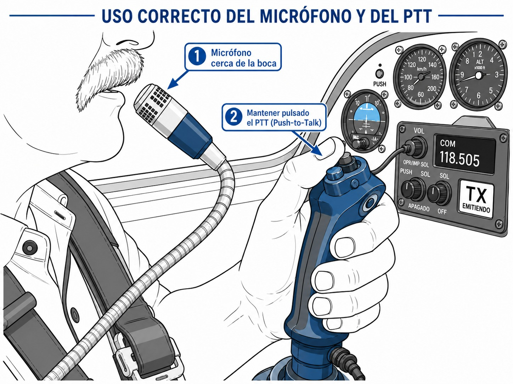

# Definiciones y técnica de comunicación

> En este capítulo aprenderás el lenguaje que se usa en la radio aeronáutica: qué es la colación y por qué no es opcional, cómo funciona la fraseología estándar, las reglas para decir números, horas y frecuencias, cómo manejar bien la disciplina de radio y cómo identificarte correctamente ante los servicios de tránsito aéreo.

## Introducción a las comunicaciones aeronáuticas

La radio es el canal principal entre tú y los servicios de tránsito aéreo. Todo lo que ocurre en el espacio aéreo controlado pasa por ahí, en tiempo real. La regulación no es cosa de cada país: el **Anexo 10 al Convenio sobre Aviación Civil Internacional** de la OACI (*International Civil Aviation Organization*) fija los estándares técnicos y procedimentales que todos los Estados miembro aplican.

Las comunicaciones de voz van en la banda de VHF (*Very High Frequency*), entre **118 MHz y 136,975 MHz**, con modulación de amplitud (AM). Las ondas VHF no doblan el horizonte: su alcance depende de la línea de visión (*line of sight*), así que cuanto más alto vueles, más lejos llegas. En zonas montañosas o a baja altura puede que necesites un **relay**, otra estación que retransmita tu mensaje. El espaciado de canales en Europa es **8,33 kHz** (la parte técnica y la normativa están en el capítulo 9).

En el vocabulario OACI, la estación en tierra es la **estación aeronáutica** (**aeronautical station**), identificada por el sufijo «Radio» en las llamadas. Tú, desde el planeador, operas como **estación de aeronave** (**aircraft station**).

::: {.callout-important}
⚖ **NORMATIVA**

El **Anexo 10 de la OACI** (Volumen II, Comunicaciones) es la norma de referencia internacional para las telecomunicaciones aeronáuticas. El equipo de radio debe estar homologado y calibrado según sus especificaciones antes de cualquier vuelo en espacio aéreo controlado.
:::

## La colación (*readback*)

Hablar por radio con el ATC no es una conversación. Es un procedimiento, y tiene sus reglas. La más importante es la **colación** (**readback**): repetir al controlador sus propias palabras, exactamente como las dijo.

¿Por qué? Porque es la única forma que tiene el Controlador de Tráfico Aéreo (*Air Traffic Controller*, ATC) de saber que recibiste la instrucción correctamente. Si no escucha tu colación, no sabe si llegaste, si entendiste, o si captaste algo diferente.

Por normativa de la OACI (Anexo 10) y del SERA (*Standardised European Rules of the Air*), es **obligatorio** colacionar:

* Todas las autorizaciones y permisos (despegues, aterrizajes, cruces de pista).
* Instrucciones de rumbo, velocidad, altitud o nivel de vuelo.
* La pista en servicio (**runway in use**).
* El ajuste del altímetro (**QNH** o QFE). A un QNH nunca se responde con «Recibido»: repites el valor numérico, sin excepción.
* El código del transpondedor (**squawk code**), cuando el ATC te asigne uno.
* Las instrucciones de cambio de frecuencia.
* Las transferencias a otras dependencias ATC.

::: {.callout-important}
⚖ **NORMATIVA**

La obligación de colacionar autorizaciones e instrucciones críticas está establecida en el Anexo 10 al Convenio sobre Aviación Civil Internacional de la OACI. Las comunicaciones grabadas se conservan un mínimo de 30 días, y pueden retenerse indefinidamente si son relevantes para una investigación o reclamación. Una colación incorrecta o ausente constituye una desviación de los procedimientos estándar y puede dar lugar a incidente o accidente.
:::

::: {.callout-warning}
⚠ **SEGURIDAD**

La omisión de la colación de una autorización de despegue o aterrizaje es una de las causas más frecuentes de incursiones en pista (**runway incursions**). Si el controlador no escucha la colación correcta, puede autorizar simultáneamente a otra aeronave a operar en la misma pista. Ante cualquier duda sobre una instrucción recibida, solicite confirmación inmediata antes de ejecutarla.
:::

## Fraseología estándar

En la radio no hay sitio para el lenguaje coloquial. Cada palabra tiene un significado exacto, y usarla mal crea ambigüedad donde no puede haberla. La **fraseología estándar** existe precisamente para eso: transmitir información sin margen de error y sin bloquear la frecuencia más de lo necesario.

Los términos que tienes que conocer desde el primer día:

* **Afirma**: «Sí», «El permiso ha sido concedido» o «Es correcto». Es la palabra normalizada en español por la fraseología oficial (Guía de fraseología y comunicaciones de AESA), equivalente del **AFFIRM** inglés: la OACI lo acortó desde **Affirmative** precisamente para que no se confundiera con **Negative** cuando hay ruido en la frecuencia. En la práctica oirás también «Afirmo»; lo que hay que evitar siempre es «Afirmativo».
* **Negativo**: «No», «El permiso no ha sido concedido» o «Incorrecto».
* **Wilco** (**Will comply**): «Entendido, actuaré en consecuencia». Lo usas cuando recibes una instrucción larga que no exige readback obligatorio.
* **Solicito**: Para pedir una autorización, un servicio o información. Por ejemplo: «Solicito autorización de rodaje».
* **Recibido** (**Roger**): «He recibido tu transmisión». Ojo: no es una respuesta a una pregunta, y no sustituye a una colación cuando esta es obligatoria.

::: {.callout-tip}
✦ **REGLA DE ORO**

La frecuencia de radio es un recurso compartido. Un mensaje breve, preciso y sin vacilaciones libera la frecuencia para otros tráficos y para emergencias. Planifique el mensaje antes de pulsar el PTT: quién llama, a quién, qué necesita.
:::

{#fig-04-cap01-microfono}

## Transmisión de números, horas y frecuencias

Un número mal entendido en la radio puede ser un QNH erróneo, una frecuencia equivocada o un nivel de vuelo que no es el tuyo. Las reglas de la OACI para transmitir cifras cierran esa puerta.

### Transmisión de números

Los números van **dígito a dígito**, sin agrupar:

* «34»  «*tres cuatro*» (nunca «treinta y cuatro»)
* «2576»  «*dos cinco siete seis*»

La excepción: centenas y miles exactos se dicen como unidades:

* «200»  «*dos cientos*»
* «2000»  «*dos mil*»
* «2600»  «*dos mil seiscientos*»
* «25000»  «*dos cinco mil*»

### Transmisión de horas

En aviación la hora es siempre **UTC** (*Coordinated Universal Time*), también llamada Zulú. Si no hay riesgo de confusión, basta transmitir los minutos. Si puede haber ambigüedad, usas los cuatro dígitos:

* 09:20  «*dos cero*» o «*cero nueve dos cero*» si puede confundirse
* 17:55  «*cinco cinco*» o «*uno siete cinco cinco*»

### Transmisión de frecuencias

Dígito a dígito, con la palabra **«coma»** para el decimal:

* 123.500  «*uno dos tres coma cinco cero cero*»
* 124.400  «*uno dos cuatro coma cuatro cero cero*»

::: {.callout-tip}
✦ **REGLA DE ORO**

Antes de abandonar una frecuencia, colaciona siempre el nuevo valor completo. Así ambas partes confirman que el piloto ha comprendido el canal correcto antes de cambiar de dial.
:::

## Disciplina de radio: piensa, escucha y luego habla

Tener buen equipo no basta. La calidad de tus comunicaciones depende sobre todo de ti. La **disciplina de radio** es lo que hace que la frecuencia funcione para todos.

Cuatro pasos, siempre en este orden:

1. **Piensa**: Antes de pulsar, organiza mentalmente lo que vas a decir. Anótalo si hace falta. Los mensajes llenos de «ehm…​» y pausas bloquean la frecuencia. Si ya presentaste un plan de vuelo VFR, no repitas datos que el controlador ya tiene salvo que te los pida.
2. **Escucha**: Sintoniza la frecuencia y escucha unos segundos antes de transmitir. No interrumpas ni «pises» una transmisión en curso. Si hay tráfico activo, espera tu turno.
3. **Pulsa y cuenta uno**: Pulsa el botón de PTT (*Push-To-Talk*) un segundo **antes** de hablar (@fig-04-cap01-microfono). Así la primera sílaba no se corta mientras el transmisor abre la portadora.
4. **Habla**: Claro, constante, sin prisas. Menos de 100 palabras por minuto, volumen uniforme. Cuando termines, suelta el PTT de inmediato.

::: {.callout-note}
⚓ **AIRMANSHIP / BUENAS PRÁCTICAS**

Para verificar la calidad de la señal de radio, utilice la escala normalizada del 1 (ilegible) al 5 (perfectamente legible). La prueba de radio no debe superar los 10 segundos. Si no obtiene respuesta tras la primera llamada a una torre, espere un mínimo de 10 segundos antes de reintentar, para no interferir con otras gestiones del controlador.
:::

## Identificación de la aeronave

Tu indicativo (**callsign**) es tu nombre en el espacio aéreo. El ATC necesita saber en todo momento con quién habla. Nunca transmitas sin identificarte, y nunca uses un indicativo que no sea el tuyo.

En planeadores, el indicativo es la matrícula asignada por la autoridad de registro. Las matrículas civiles siguen el esquema OACI de prefijos nacionales: en España es **EC-** seguido de tres letras, por ejemplo «EC-DPE». Alemania usa «D-», Francia «F-». Hay combinaciones prohibidas porque pueden confundirse con señales de socorro o urgencia internacionales (SOS, PAN, MAY).

Cómo identificarte:

* **Primer contacto**: Matrícula completa, deletreada con el alfabeto fonético OACI. «*Eco Charlie Delta Papa Eco*».
* **Matrícula abreviada**: En contactos posteriores puedes usar la primera letra del prefijo nacional más las dos últimas letras de la matrícula. «*Eco Papa Eco*».
* **Quién abre la puerta**: Solo puedes abreviar si la dependencia ya usó la matrícula abreviada al dirigirse a ti. Hasta entonces, indicativo completo siempre.

Añade siempre tu indicativo al final de cada colación. Así el controlador confirma que la instrucción la recibió la aeronave correcta, no otra que también escuchó.

| Letra | Palabra | Letra | Palabra | Letra | Palabra |
| --- | --- | --- | --- | --- | --- |
| A | Alfa | J | Juliett | S | Sierra |
| B | Bravo | K | Kilo | T | Tango |
| C | Charlie | L | Lima | U | Uniform |
| D | Delta | M | Mike | V | Victor |
| E | Eco | N | November | W | Whiskey |
| F | Foxtrot | O | Oscar | X | X-ray |
| G | Golf | P | Papa | Y | Yankee |
| H | Hotel | Q | Quebec | Z | Zulu |
| I | India | R | Romeo |  |  |

: Alfabeto fonético OACI {#tbl-tabla-alfabeto-fonetico}

| Dígito | Pronunciación | Dígito | Pronunciación | Dígito | Pronunciación |
| --- | --- | --- | --- | --- | --- |
| 0 (*Zero*) | Cero | 4 (*Four*) | Cuatro | 8 (*Eight*) | Ocho |
| 1 (*One*) | Uno | 5 (*Five*) | Cinco | 9 (*Niner*) | Nueve (*) |
| 2 (*Two*) | Dos | 6 (*Six*) | Seis |  |  |
| 3 (*Three*) | Tres | 7 (*Seven*) | Siete |  |  |

: Dígitos fonéticos OACI

::: {.callout-note}
⚓ **AIRMANSHIP / BUENAS PRÁCTICAS**

(*) En frecuencias internacionales, el dígito 9 se pronuncia **«Niner»** para evitar confusiones con «Nein» (no, en alemán). El alfabeto fonético OACI está diseñado para ser reconocible en cualquier idioma y en condiciones de radio degradadas. Memorícelo hasta que el deletreo sea automático.
:::

**Resumen del capítulo: Definiciones y técnica**

* **Introducción**: Las comunicaciones aeronáuticas de voz se realizan en VHF (118–136,975 MHz), reguladas por el Anexo 10 de la OACI. El espaciado de canales en Europa es de 8,33 kHz (Reglamento UE 1079/2012). La estación en tierra es la «estación aeronáutica»; el piloto opera desde la «estación de aeronave».
* **La colación (**readback**)**: Repetir textualmente las instrucciones del ATC es obligatorio para: autorizaciones, rumbos/altitudes, pista en uso, QNH, cambios de frecuencia, transferencias ATC y código de transpondedor cuando sea asignado.
* **Fraseología estándar**: La radio no admite lenguaje coloquial. Términos clave: **Afirma**, **Negativo**, **Wilco**, **Solicito**, **Recibido**. «Recibido» nunca sustituye a una colación obligatoria, y «Afirmativo» se evita siempre.
* **Disciplina de radio**: Piensa → Escucha → Pulsa y cuenta uno → Habla. Menos de 100 palabras por minuto, mensaje preparado antes de pulsar el PTT.
* **Transmisión de números, horas y frecuencias**: Números dígito a dígito («*tres cuatro*», nunca «treinta y cuatro»); centenas y miles exactos como unidades («*dos mil seiscientos*»). Horas en UTC, normalmente solo los minutos. Frecuencias con «coma»: «*uno dos cuatro coma cuatro cero*». Colaciona siempre el nuevo canal antes de cambiar.
* **Identificación**: La matrícula es el nombre de la aeronave. Primer contacto: matrícula completa en fonético. Matrícula abreviada: solo cuando la torre la use primero.
