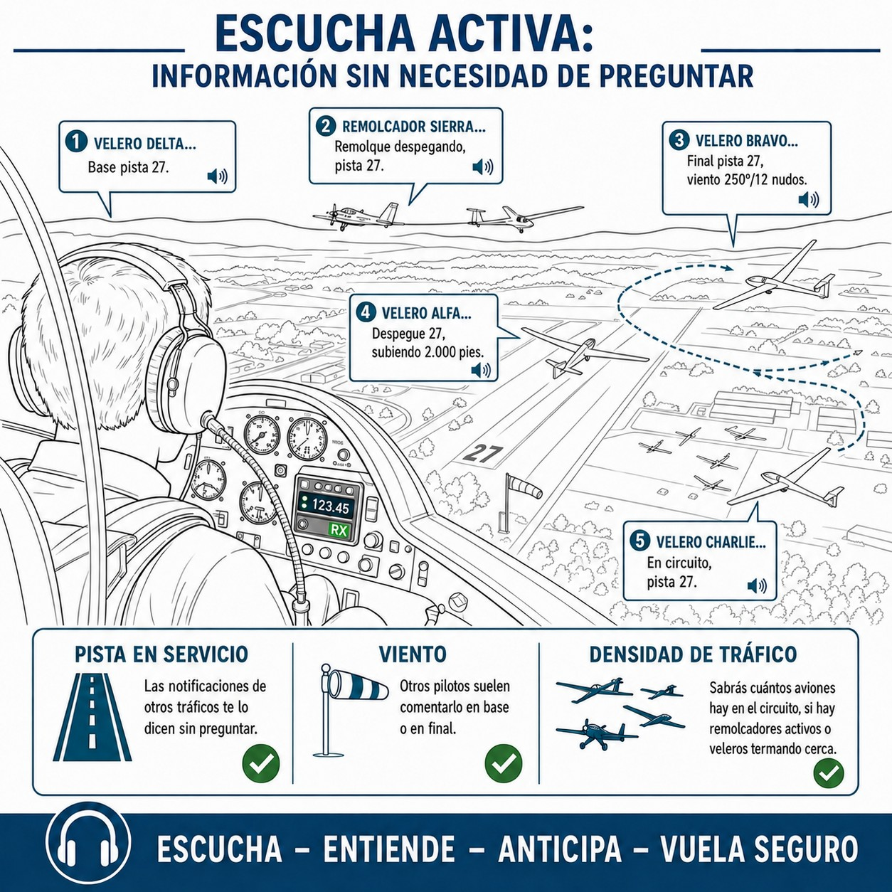

# Comunicaciones VFR en aeródromos no controlados

La mayoría de los vuelos de planeador salen de campos sin torre. Aquí verás cómo mantenerte situado mediante la autoinformación, por qué tus ojos siempre van antes que la radio, cómo sacarle partido a la escucha activa y qué cantas en cada punto del circuito.

## Autoinformación en aeródromos sin torre de control

*En el campo sin torre, el piloto actúa como su propio controlador.*

La mayoría de los aeródromos desde los que vuelan los planeadores —aeroclubs, pistas forestales, aeródromos privados— son **aeródromos no controlados**. Operan en espacio aéreo Clase G y no hay ninguna torre de Control de Tráfico Aéreo (ATC)
ATC (Control de Tránsito Aéreo / Air Traffic Control)
 que te autorice, te separe o te asigne rumbos.

Aquí la seguridad la pone la **** (**broadcast**): tú transmites tu posición, altitud e intenciones a la frecuencia del campo para que todos sepan dónde estás. Nadie te va a dar permiso para despegar ni aterrizar. Informas y tú decides.

Dos cosas básicas:

* **A quién llamas**: Al nombre del aeródromo, no a «Torre». *«Fuentemilanos, buenos días…​»* o *«Santa Cilia, tráfico…​»*
* **Qué dices**: Indicativo, posición, altitud e intención. *«…​velero Eco Papa Eco, a 5 minutos al este del campo a 1.500 metros, notificaré entrando al circuito.»*

::: {.callout-important}
⚖ **NORMATIVA**

Aunque en algunos campos exista un operador de radio prestando un servicio AFIS
AFIS (Aerodrome Flight Information Service)
 (**Aerodrome Flight Information Service**), este operador **no proporciona control**, solo información (viento, pista en uso, meteorología). La decisión final y la responsabilidad de la separación siguen siendo íntegramente del piloto al mando.
:::

 

## Ver y evitar (*See and Avoid*)

La radio te ayuda a saber dónde buscar. Nada más. El vuelo VFR
VFR (Reglas de vuelo visual / Visual Flight Rules)
 (**Visual Flight Rules**) se llama así por algo: la responsabilidad de ver y esquivar es tuya, siempre, y **nunca la delega en la radio**.

Tres cosas que no puedes olvidar:

1. **No asumas que todos tienen radio**: En muchos campos pequeños operan ultraligeros, parapentes y aeronaves sin radio a bordo, o con la radio apagada.
2. **No asumas que te han escuchado**: Un piloto puede estar distraído, en otra frecuencia, o con el equipo fallando.
3. **Tus ojos mandan**: La radio te dice dónde **buscar**, pero mantén el barrido visual (**scanning**) activo antes de cualquier maniobra, especialmente al incorporarte al circuito.

::: {.callout-warning}
⚠ **SEGURIDAD**

Un error fatal es iniciar un viraje (por ejemplo, de tramo base a final) confiando únicamente en que "nadie ha cantado posición por la radio". Asegúrate siempre visualmente de que la pista y la aproximación final están libres de tráfico antes de virar.
:::

 

{#fig-04-cap02-escucha-previa}

 

## La frecuencia correcta y el momento adecuado

Al aproximarte a cualquier aeródromo, controlado o no, sintoniza la frecuencia del campo **al menos 10 minutos o 10 millas antes** de llegar. Y luego escucha antes de abrir la boca.

Con solo escuchar unos minutos puedes deducir ():

* **Pista en servicio**: Las notificaciones de otros tráficos te lo dicen sin preguntar.
* **Viento**: Otros pilotos suelen comentarlo en base o en final.
* **Densidad de tráfico**: Sabrás cuántos aviones hay en el circuito, si hay remolcadores activos o veleros termando cerca.

Cuando ya tienes esa imagen mental, pulsa el PTT. Tu primera llamada llegará con datos concretos, sin que nadie tenga que repetirte lo que ya podías haber escuchado.

 

## El circuito estándar y sus notificaciones

El **circuito de tránsito** (**traffic pattern**) es el patrón rectangular que organiza el tráfico alrededor del aeródromo. Sin él, cada piloto llegaría como le pareciera.

Salvo que la carta de aproximación visual (*VAC*) del aeródromo indique otra cosa, por obstáculos o restricciones de ruido, el circuito estándar ICAO/EASA **es siempre a izquierdas**. El motivo es práctico: en aviones convencionales el comandante se sienta a la izquierda, y en planeadores en tándem la visibilidad hacia ese lado suele ser mejor. Con el circuito a izquierdas, la pista queda siempre a la vista.

Las notificaciones que haces durante el circuito son estas:

1. **Entrada al circuito**: Avisa antes de entrar a las inmediaciones. *"Fuentemilanos, Eco Papa Eco, a tres minutos, notificaré entrando en circuito"*.
2. **Viento en cola** (**Downwind**): El tramo paralelo a la pista pero en sentido contrario al aterrizaje. A la altura de los números de pista o a mitad del tramo, cantas: *"Fuentemilanos, Eco Papa Eco, viento en cola pista 16"*. En planeador, esta notificación tiene que hacerse desde una posición que te garantice llegar a la pista planeando.
3. **Tramo base** (**Base leg**): El tramo perpendicular a la línea central, donde configuras el planeador para el aterrizaje. *"Fuentemilanos, Eco Papa Eco, virando a base 16"*.
4. **Final** (**Final approach**): Alineado con la pista, tras el último viraje. *"Fuentemilanos, Eco Papa Eco, en final 16"*.
5. **Pista libre** (**Runway vacated**): Ya en tierra y fuera de la pista activa. *"Fuentemilanos, Eco Papa Eco, pista 16 libre"*.

 

✦ **REGLA DE ORO**

En campos con mucha actividad de vuelo a vela, el circuito de planeadores puede discurrir por un lado de la pista y el de aviones con motor (incluidos los remolcadores) por el contrario. Consulta siempre la carta del aeródromo antes del vuelo.

 

::: {.callout-important}
⚖ **NORMATIVA**

Según el Reglamento SERA (artículo SERA.3210), el orden de prioridad de paso —de mayor a menor— es: globos > planeadores > dirigibles > aeronaves con motor. El planeador tiene prioridad sobre todo aerodino propulsado por motor y **cede el paso a los globos**. Esta prioridad aplica en vuelo y en las inmediaciones del aeródromo; nunca justifica descuidar la vigilancia visual activa.
:::

::: {.callout-note}
⚓ **AIRMANSHIP / BUENAS PRÁCTICAS**

SERA no incluye a parapentes y alas delta en esa jerarquía con esa literalidad, pero el criterio operativo prudente es tratarlos como a un planeador y, además, cederles el paso: maniobran bastante peor que tú y descienden sin poder remontar. Ante la duda, sepárate.
:::

 

## Coordinación con el remolcador y el torno

El lanzamiento no tiene equivalente en ningún otro tipo de aviación: tu despegue depende de coordinar con alguien que está fuera de la aeronave. Hacerlo bien marca la diferencia.

### Lanzamiento con torno (*winch launch*)

Si el campo tiene radio tierra-aire con el torno, la secuencia es:

1. Cúpula cerrada, aeronave lista. Transmites:
  
  *«Torno, velero EC-DPE, doble mando, listo para tensar.»*
2. El operador tensa suavemente. Aerofrenos replegados, alas niveladas, confirmas:
  
  *«Remolcando, remolcando, remolcando.»* — El torno aplica potencia a fondo.
3. Al soltar el cable: *«Velero libre, Eco Papa Eco.»*
4. Si algo va mal: *«Stop torno, stop torno, stop torno.»*

Sin radio tierra-aire, el ayudante de ala (**wing runner**) coordina con señales visuales:

| Señal | Significado |
| --- | --- |
| Ala en tierra (no nivelada) | Planeador no listo — no tensar |
| Alas niveladas + aerofrenos fuera | Tensar cable suavemente |
| Alas niveladas + aerofrenos replegados | Cable tenso OK — lanzar |

: Señales visuales del ayudante de ala

 

::: {.callout-warning}
⚠ **SEGURIDAD**

Si el cable se rompe o el torno falla, baja el morro de inmediato para recuperar velocidad. A baja altura —por debajo de unos **150 m AGL** en torno— no vires: aterriza recto al frente en el terreno disponible. Intentar regresar a la pista de origen a baja altura es la causa más frecuente de accidentes mortales en lanzamiento con torno. Las franjas de decisión completas por altura (recto al frente, circuito abreviado o circuito normal) se desarrollan en el **Libro 6 — Procedimientos operativos**, capítulo 7.
:::

### Lanzamiento con remolcador (*aerotow*)

La fraseología varía según el aeródromo; consulta siempre las instrucciones locales. Una secuencia habitual:

*— Piloto planeador: «Remolcadora Delta Victor Yankee, planeador Eco Papa Eco, doble mando, listo tensando.»*

*— Remolcador: «Eco Papa Eco, tensando.»*

*— Piloto planeador: «Remolcando.»*

Al soltar:
*— «Remolcadora Delta Victor Yankee, velero libre.»*

Si el planeador **no puede largar el cable**, la señal de socorro en vuelo es: alabear fuertemente y situarse bajo y a la izquierda del remolcador, para que este pueda largarlo desde su extremo.

::: {.callout-note}
⚓ **AIRMANSHIP / BUENAS PRÁCTICAS**

Antes de subir al planeador, acuerda siempre con el piloto remolcador la altitud de suelta y la dirección de alejamiento. Así el remolcador puede regresar a la pista sin cruzarse con el velero que inicia su vuelo.
:::

 

**Resumen del Capítulo: Aeródromos No Controlados**

* **Autoinformación**: En el campo sin torre, tú eres el controlador. Transmite «al aire» tu posición e intenciones. «Fuentemilanos, velero EC-BRT, viento en cola pista 34».
* **Ver y Evitar**: La radio ayuda, pero tus ojos mandan. No asumas que todos tienen radio o te han escuchado. Busca activamente otros tráficos.
* **La Frecuencia Correcta**: Sintoniza la frecuencia del campo 10 minutos antes. Escuchar a otros te dirá pista en uso, viento y densidad de tráfico.
* **Circuito Estándar**: Si nadie indica lo contrario, el circuito es a izquierdas. Notifica: entrada, viento en cola, base y final.
* **Lanzamiento (torno/remolcador)**: Con torno: «Listo tensando» → «Remolcando x3» → «Cable libre». Abortar: «Stop torno x3». Fallo bajo (por debajo de 150 m en torno): recto al frente, nunca regreses virando.
