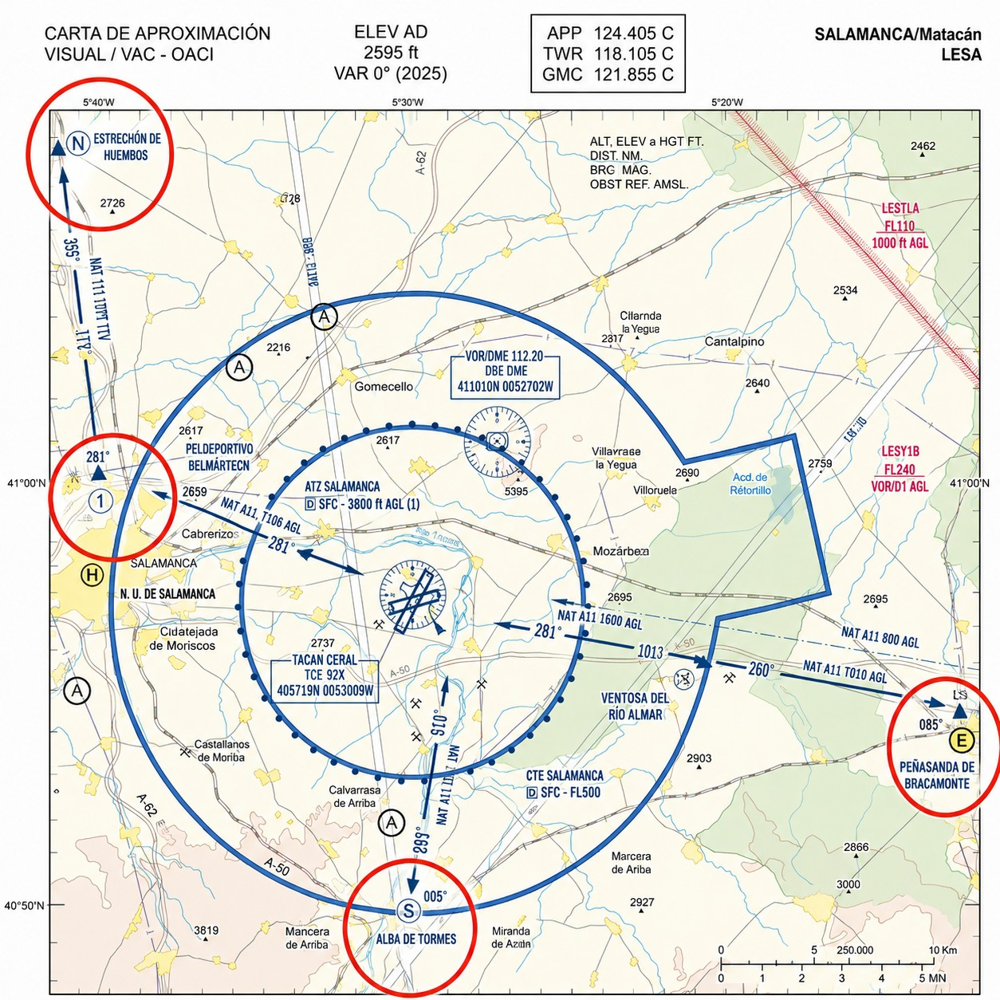

# Comunicaciones VFR en aeródromos controlados

> En un aeródromo controlado no te mueves sin que la Torre te lo diga. Aquí verás cómo funciona el sistema de autorizaciones, para qué sirve el plan de vuelo VFR, qué son los puntos de notificación visual y por qué en espacio controlado colacionas absolutamente todo.

## Autorización (*Clearance*) en espacio controlado

Un **aeródromo controlado** tiene Torre de Control (TWR), y eso cambia las reglas por completo: aquí no das un paso sin autorización explícita.

En espacio aéreo controlado como un CTR, solo el controlador puede emitir instrucciones y separar el tráfico. Tú necesitas una **autorización** (**clearance**) para cada fase:

* Puesta en marcha (si aplica a motoveleros).
* Rodaje (**taxi**) por las calles de rodadura hacia la pista.
* Entrar y alinear en la pista activa.
* Despegue.
* Entrada, vuelo o cruce en la zona de tránsito de aeródromo (CTR).
* Aterrizaje.

::: {.callout-warning title="Seguridad"}
Una autorización para "entrar y alinear" o "entrar y mantener" en la pista activa **nunca** es una autorización para despegar. Debes esperar inmóvil en la cabecera hasta escuchar explícitamente las palabras: *"Autorizado a despegar"* (**Cleared for take-off**). Si tienes alguna duda, pregunta: "Confirme autorizado a despegar".
:::

## El plan de vuelo (FPL)

Para entrar en espacio aéreo donde se te presta servicio de control —clases B, C y D, o cualquier aeródromo controlado— tienes que presentar un **Plan de Vuelo (FPL)** ante los servicios ATS correspondientes, con la antelación respecto a la hora estimada de salida (EOBT) que fijan el AIP-España y la VAC del aeródromo. La clase E es la excepción dentro del espacio controlado: al VFR no se le presta allí servicio de control, así que no necesita plan de vuelo, ni radio, ni autorización (SERA.4001 b)).

El planeador vuela casi siempre en Clase G. Pero si necesitas cruzar un CTR o entrar donde te controlen, presenta el FPL con tiempo. Los plazos y formatos están en el AIP-España (ENR 1.10) y son vinculantes, así que consúltalos antes de cada vuelo que implique espacio controlado.

::: {.callout-note title="Airmanship"}
Si surge la necesidad imprevista de entrar en espacio controlado sin plan de vuelo previo, es posible abrirlo en el aire (AFIL — Airborne Flight Plan) contactando por radio a la dependencia ATC y facilitando tipo de aeronave, posición, intenciones y tiempos estimados. Esta opción depende de la disponibilidad del servicio y de la carga de trabajo del controlador.
:::

::: {.callout-important title="Normativa"}
Los plazos exactos de presentación del plan de vuelo están especificados en el **AIP-España ENR 1.10** y pueden variar según el tipo de operación y la dependencia ATC. Consúltalo antes de cada vuelo que implique espacio controlado; el incumplimiento puede resultar en la denegación de la autorización.
:::

{#fig-04-cap03-puntos-notificacion}

## Puntos de notificación visual

El CTR (*Control Zone*) protege las llegadas y salidas IFR. No lo confundas con la ATZ (*Aerodrome Traffic Zone*), que es un espacio aéreo distinto y más pequeño. Para no meterte en medio del tráfico IFR, el vuelo VFR entra y sale del CTR por rutas y puntos fijos (@fig-04-cap03-puntos-notificacion).

Esos son los **puntos de notificación visual**: referencias físicas en el terreno —un pueblo, un cruce de autopista, un lago— por las que pasas y desde las que llamas a la Torre. Los encontrarás en la Carta de Aproximación Visual (VAC) del aeródromo, normalmente nombrados con letras fonéticas según su orientación geográfica: Noviembre para el norte, Sierra para el sur, Eco para el este.

Llama a la Torre entre 3 y 5 minutos antes de llegar al punto de entrada al CTR:

*—"Jerez Torre, EC-DPE, sobre punto Sierra a 1000 pies, para entrar en zona y aterrizar."*
*—"EC-DPE, recibido, autorizado a entrar en zona por punto Sierra a 1000 pies o inferior, notifique viento en cola derecha pista 02."*

Desde ese momento sigues las instrucciones de la Torre en altitud y ruta. Nada de improvisar.

## Colacionar todo en espacio controlado

Ya lo vimos en el capítulo 1: la **colación** (**readback**) no es opcional. En espacio controlado lo es todavía menos, porque el controlador separa el tráfico basándose en que tú vas a hacer exactamente lo que has repetido.

Cualquier instrucción del ATC que afecte a tu trayectoria, pista activa, ajuste de presión o identificación de radar **la colacionas** palabra por palabra, y cierras con tu indicativo.

Si la Torre dice:
*"Eco Papa Eco, autorizado a aterrizar pista 36."*

Tu colación es:
*"Autorizado a aterrizar pista 36, Eco Papa Eco."*
El viento no hace falta colacionarlo, pero la autorización de pista sí.

::: {.callout-tip title="Regla de oro"}
Cuando anotes mentalmente o en tu pernera la instrucción dada por un controlador, si se compone de autorización de pista de aterrizaje o despegue, rumbo o altitud a mantener, QNH, o el código del transpondedor, tu respuesta por radio **NO puede ser "Wilco"** o **"Copiado"**. Debes recitar esos parámetros tal y como te los han dado.
:::

## Ejercicios de fraseología

En comunicaciones, la teoría no basta: hay que practicar la voz. Completa estas transmisiones antes de mirar la solución; imagina que eres el planeador **EC-EPE** («Eco Papa Eco»).

**Ejercicio 1 — Colación de autorización.**

La Torre te dice: *«Eco Papa Eco, ruede al punto de espera pista 30, QNH 1019, notifique listo.»* ¿Cuál es tu colación correcta?

**Solución.** *«Al punto de espera pista 30, QNH 1019, notificaré listo, Eco Papa Eco.»* Se colacionan la instrucción de rodaje, la pista y el QNH; el indicativo cierra la transmisión. Un simple «Recibido» aquí sería una desviación del procedimiento.

**Ejercicio 2 — Primer contacto en un CTR.**

Vas a entrar en el CTR de un aeródromo controlado desde el punto visual November. Ordena y completa tu llamada inicial con estos elementos: intenciones, indicativo, posición y altitud, y a quién llamas.

**Solución.** El orden es **a quién → quién soy → dónde estoy → qué quiero**: *«Torre de [aeródromo], Eco Papa Eco, planeador, sobre November, 900 metros QNH, solicito entrada al CTR para tránsito hacia el sur.»* Espera su autorización antes de penetrar en el CTR: en espacio controlado se entra con clearance, no por iniciativa propia.

**Ejercicio 3 — «Alinear ≠ despegar».**

La Torre transmite: *«Eco Papa Eco, entre y mantenga posición pista 30.»* ¿Puedes iniciar el despegue? ¿Qué colacionas?

**Solución.** No. «Entre y mantenga posición» (**line up and wait**) te autoriza a ocupar la pista, pero **no** a despegar; para eso hace falta un «autorizado a despegar» explícito. Colación: *«Entro y mantengo posición pista 30, Eco Papa Eco.»*

::: {.postit}
**Resumen del capítulo: aeródromos controlados**

* **Autorización (Clearance)**: En espacio controlado, la palabra de la Torre es ley. Necesitas autorización explícita para todo: arrancar, rodar, despegar, entrar en zona. Si no oyes «autorizado», no te muevas.
* **Plan de Vuelo (FPL)**: Tu billete de entrada. Preséntalo con al menos 60 minutos de antelación; los plazos exactos, en el AIP-España ENR 1.10.
* **Puntos de Notificación**: Son las puertas de entrada/salida visual al CTR (Sierra, Norte, Eco…​). Conócelos bien en la carta VAC y notifica sobre ellos con precisión.
* **Colacionar Todo**: En controlado es vital. Repite cada instrucción, sin el viento y con tu indicativo al final. «Autorizado a aterrizar pista 36, Eco Papa Eco».
:::
