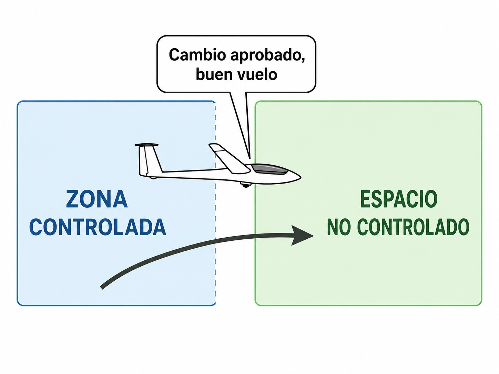

# Comunicaciones VFR con ATC (en ruta)

> En cuanto sales del circuito y te metes en ruta, las reglas cambian un poco. Aquí verás cómo usar el Servicio de Información de Vuelo (FIS), cómo cambiar de frecuencia sin desaparecer del radar y qué hacer con el transpondedor y las zonas de radio obligatoria.

## Servicio de Información de Vuelo (FIS)

En ruta por espacio aéreo no controlado —Clase G en su mayor parte— no hay ninguna Torre mirándote. Pero tienes una herramienta útil: el **Servicio de Información de Vuelo (FIS)** (*Flight Information Service*).

Lo más importante que tienes que saber sobre el FIS: te da **asesoramiento, no control**. No te va a dar rumbos obligatorios ni altitudes que tengas que seguir. Su trabajo es darte información para que tú, como piloto al mando, decidas. La separación sigue siendo tuya.

Lo que puedes pedirle o recibir:

* **Información de tráfico**: Te avisarán de aeronaves conocidas cerca de tu posición o ruta. (En Estados Unidos a esto lo llaman **Flight Following**; en Europa bajo SERA/EASA es oficialmente el FIS).
* **Meteorología**: METAR, TAF, alertas SIGMET o AIRMET en ruta o en tus aeródromos de destino y alternativo.
* **Estado de espacios aéreos**: Zonas restringidas, peligrosas o militares activadas o desactivadas.

Para contactar, sintoniza la frecuencia de "Información" de tu zona (**Madrid Información**, **Zaragoza Información**…) e identifícate con tu indicativo, tipo de aeronave, posición, ruta y lo que necesitas:

*"Madrid Información, velero EC-DPE, sobre la sierra de Ayllón a 2000 metros, rumbo sur hacia Fuentemilanos, solicito información de tráfico."*

::: {.callout-note title="Airmanship"}
En travesías de vuelo a vela (**cross-country**), mantener la escucha en la frecuencia del FIS regional correspondiente proporciona una capa adicional de seguridad, especialmente en días con desarrollo tormentoso donde la información meteorológica en tiempo real es crítica. Además, estar en contacto con el FIS acelera la activación de los servicios de Búsqueda y Salvamento (SAR) ante una toma en campo fuera de aeródromo.
:::

## Cambio y abandono de frecuencia

No desaparezcas de una frecuencia sin decir nada. El controlador de Torre, Aproximación o Información te tiene en pantalla o en su ficha de vuelo, y da por hecho que sigues a la escucha. Si te esfumas, empieza a preocuparse.

Cuando necesites cambiar de frecuencia, hay dos casos (@fig-04-cap04-cambio-frecuencia):

* **Si estás bajo control ATC**: Pide permiso. *"Torre, EC-DPE, solicito abandonar frecuencia para pasar a operaciones de club en 123.500"*.
* **Si estás en frecuencia de Información (FIS)**: No es control, así que solo avisas. *"Madrid Información, EC-DPE, abandonamos su frecuencia para pasar con Fuentemilanos 123.500. Buen día"*.

{#fig-04-cap04-cambio-frecuencia}

## El transpondedor en ruta: código *squawk*

Si tu planeador tiene **transpondedor**, emite un código de cuatro dígitos () que el ATC usa para identificarte en pantalla. En VFR, el código por defecto es **7000**, salvo que el ATC te asigne uno distinto. Los códigos de emergencia los encontrarás en el capítulo 9.

::: {.callout-important title="Normativa"}
Los códigos 7600 (fallo de radio) y 7700 (emergencia) activan alertas inmediatas en todos los centros de control. Selecciónelos únicamente ante la situación real que corresponda y extreme la precaución al cambiar de código para no activarlos accidentalmente.
:::

## Zonas de radio obligatoria (RMZ)

Algunos sectores de clase E, F o G llevan una obligación adicional: son **Zonas de Radio Obligatoria (RMZ)** (*Radio Mandatory Zone*). Dentro de una RMZ la radio no es optativa aunque el espacio aéreo no sea controlado; es una obligación publicada en el AIP.

Antes de entrar y mientras estés dentro tienes que:

1. Escuchar permanentemente la frecuencia designada para esa RMZ.
2. Establecer contacto bidireccional con la dependencia ATS correspondiente antes de entrar.
3. Seguir las instrucciones o recomendaciones del servicio prestado.

Las RMZ activas en España aparecen en la carta **ENR 6.12**. Revísala en la planificación prevuelo, sobre todo en travesías que pasen cerca de grandes aeropuertos en espacio no controlado.

::: {.callout-important title="Normativa"}
Las RMZ están reguladas por el Reglamento SERA y permiten al Estado miembro establecer requisitos de radio en espacio aéreo donde el servicio de control no es obligatorio. Sus límites y condiciones aparecen referenciados en la **carta ENR 6.12** (carta de zonas de radio obligatoria).
:::

**Resumen del Capítulo: Comunicaciones en Ruta**

* **Servicio de Información de Vuelo (FIS)**: Es un servicio de asesoramiento, no de control. Te informan sobre tráficos y meteorología (si tienen carga de trabajo), pero la separación sigue siendo tu responsabilidad. "Para información, contacto con Madrid Información…​".
* **Cambio de Frecuencia**: Nunca te "esfumes" de una frecuencia controlada o de información. Solicita el cambio o avisa de que abandonas la frecuencia. "Madrid, EC-DPE para pasar a frecuencia de club 123.500".
* **Transpondedor en ruta**: Si dispones de transpondedor, código VFR por defecto: **7000**. Emergencias: **7700** (emergencia activa — **Mayday**) y **7600** (fallo de radio — ver cap. 7). Solo usar ante la emergencia real.
