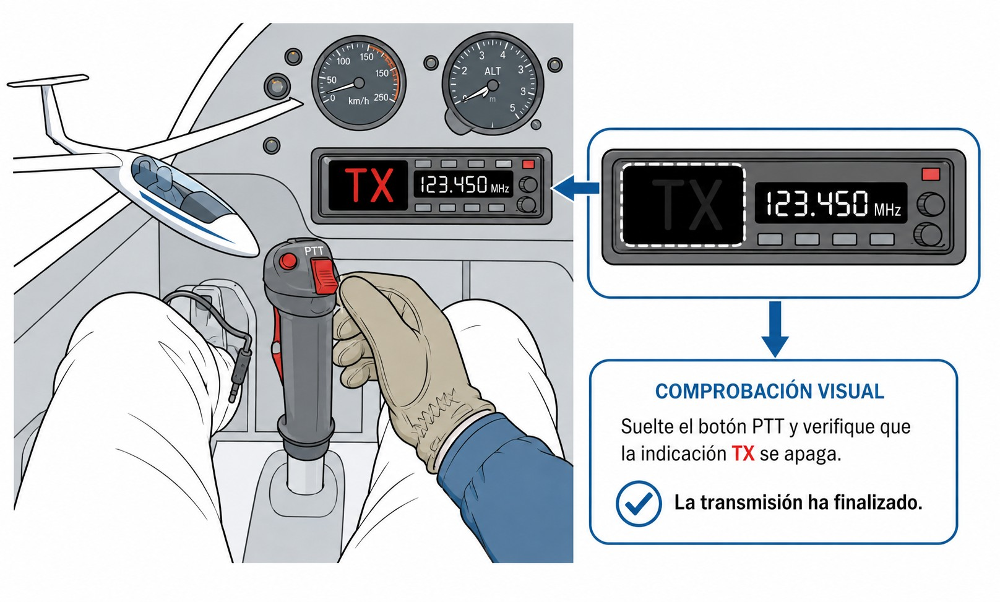

# Procedimientos operativos generales

> Aquí están los procedimientos que usarás en cada vuelo: cómo estructurar una llamada, cuándo pedir una prueba de radio, cómo hacer un reporte de posición, qué hacer cuando dos aeronaves transmiten a la vez, el PTT atascado, la prioridad de los mensajes de emergencia, cómo usar bien el micrófono y qué tipos de radio existen.

## Esquema de las comunicaciones

Toda transmisión aeronáutica sigue el mismo patrón. Memorizarlo como secuencia fija te libera para concentrarte en volar.

La llamada inicial va siempre en este orden:

1. **A quién se llama**: nombre de la dependencia («Jerez Torre», «Madrid Información»).
2. **Quién llama**: indicativo completo de la aeronave («Eco Charlie Delta Papa Eco»).
3. **Dónde está**: posición o fase del vuelo («sobre punto Sierra», «en viento en cola pista tres cuatro»).
4. **Qué necesita**: solicitud o intención («solicito datos», «listo para el despegue»).

*Ejemplo de primera llamada en aeródromo controlado:*
*— «Sabadell Torre, Delta Kilo India Alfa Victor, en punto de espera pista uno dos, listo para salida.»*

El controlador responde. A partir del segundo intercambio puedes abreviar el indicativo a las tres últimas letras, pero solo si la dependencia lo ha iniciado primero.

Al **colacionar** una instrucción, el indicativo va al final:

*— «Autorizado despegar pista uno dos, viento cero nueve cero grados seis nudos, Alfa Victor.»*

En **autoinformación** (aeródromo no controlado), sin interlocutor designado, el indicativo va al principio:

*— «Eco Charlie Delta Papa Eco, en viento en cola derecha pista tres cuatro, intención aterrizaje.»*

::: {.callout-tip title="Regla de oro"}
Antes de pulsar el PTT compón mentalmente el mensaje completo: *¿A quién? → ¿Quién soy? → ¿Dónde estoy? → ¿Qué necesito?* Un mensaje estructurado ocupa menos tiempo en frecuencia y reduce los errores de comprensión del controlador.
:::

::: {.callout-note title="Airmanship"}
Algunos instructores recomiendan abrir la **primera** comunicación con una estación con un simple *«buenos días»* o *«buenas tardes»* antes del mensaje: *«Fuentemilanos tráfico, buenos días, Eco Charlie Delta Papa Eco…»*. No forma parte de la fraseología OACI —que busca economía de palabras— y por eso se reservaría al **primer contacto**, no a cada transmisión; pero al otro lado de la radio hay una persona, y ese saludo engrasa la relación con la torre, el FIS o el resto de tráficos de tu campo. Con una salvedad: en frecuencia saturada o en una emergencia, la cortesía sobra y vas directo al grano.
:::

## Prueba de radio (*radio check*)

Si tienes dudas sobre tu equipo de radio, puedes pedir una **prueba de radio** a la torre o dependencia de información más cercana.

Ojo: si acabas de hablar con la torre y te han respondido con normalidad, no pidas un **radio check** por sistema. Úsalo solo cuando tengas una razón real para dudar de tu equipo.

La calidad de la recepción se evalúa con una escala de legibilidad del 1 al 5:

* **1:** Ilegible (audio incomprensible o portadora pura).
* **2:** Legible de vez en cuando (muy entrecortado).
* **3:** Legible con dificultad (ruido de fondo muy alto, pero se entiende).
* **4:** Legible (buena calidad, leve ruido).
* **5:** Perfectamente legible (audio nítido, sin ruidos).

**Ejemplo de comunicación:**
*—"Fuentemilanos, buenas tardes, Eco Charlie Delta Papa Eco, solicito prueba de radio en 123.400."*
*—"Eco Papa Eco, le recibo 5."*
*—"Cinco, gracias, Eco Papa Eco."*

La prueba no debe durar más de 10 segundos. Normalmente basta con pronunciar los números lenta y claramente.

## Reportes de posición

Un reporte de posición (**position report**) le dice al ATC o a otras aeronaves dónde estás. Lo emites al pasar por puntos de notificación obligatoria, cuando el FIS te lo pide o como actualización espontánea en travesía.

La estructura mínima tiene tres elementos:

1. **Identificativo** de la aeronave.
2. **Posición**: punto de notificación, localidad o referencia geográfica reconocible.
3. **Altitud o nivel de vuelo** con referencia altimétrica (QNH o FL).

Si el FIS o el ATC lo requieren, añades:

1. **Hora UTC** de paso por el punto.
2. **Siguiente punto de notificación** y hora estimada de llegada.

*Ejemplo en campo no controlado (autoinformación):*
*— «Buitrago, velero Eco Charlie Delta Papa Eco, sobre el embalse de Riosequillo, mil quinientos pies QNH, estimado Buitrago en cero cinco.»*

*Ejemplo con FIS en travesía:*
*— «Madrid Información, Eco Charlie Delta Papa Eco, sobre Somosierra, nivel de vuelo cero ocho cero, estimado Aranda en tres cinco.»*

::: {.callout-note title="Airmanship"}
En travesías en planeador, actualiza tu posición al FIS siempre que te apartes significativamente de tu ruta prevista o cambies de sector. Un FIS informado puede coordinar con mayor rapidez una búsqueda si dejases de contactar.
:::

## Llamadas simultáneas y espera en frecuencia

Cuando dos aeronaves transmiten a la vez, las señales se superponen y lo que llega al otro lado es audio distorsionado o ininteligible. Eso es el **bloqueo mutuo**.

Si ocurre, el controlador puede responder: *«Estación llamando a [dependencia], identifíquese»*, o repetir el único fragmento que logró descifrar. En ese caso:

* Escucha si tu indicativo fue mencionado.
* Espera a que la frecuencia quede libre.
* Retransmite tu mensaje completo.

Si no obtienes respuesta, espera **al menos 10 segundos** antes de volver a intentarlo. Reintentar antes puede pisar a otra aeronave que esté recibiendo instrucciones.

::: {.callout-note title="Airmanship"}
Antes de pulsar el PTT escucha siempre la frecuencia unos segundos. Una transmisión que «pisa» a otra bloquea ambas comunicaciones. Si la frecuencia está activa, espera a que la conversación concluya antes de empezar la tuya.
:::

## El micrófono bloqueado (PTT atascado)

Es un problema más habitual de lo que parece, y más serio de lo que parece: el **micrófono bloqueado** o PTT atascado. En los planeadores el botón PTT suele estar integrado en la palanca de mando, justo donde cualquier presión accidental puede activarlo.

Si el botón se queda mecánicamente pulsado —fallo del muelle, el cable del auricular tirando de él, o la pierna apoyada sobre un PTT portátil— tu radio entra en **transmisión continua** y emite portadora sin parar.

Las consecuencias son graves:

1. **Bloqueo total**: Mientras emites, **nadie más puede hablar ni recibir en esa frecuencia** en decenas o cientos de kilómetros, según tu altitud. Estás cortando las comunicaciones del ATC y las de emergencia de otros.
2. **Sordera autoinducida**: Tu radio está transmitiendo, así que no recibes nada. Tú tampoco te enteras de lo que pasa en la frecuencia.

El remedio es simple: **comprobación visual después de cada transmisión** (@fig-04-cap05-luz-tx). La mayoría de radios de panel tienen un indicador **TX** en pantalla que se ilumina mientras transmites. Comprueba siempre que **se apaga** al soltar el botón.

{#fig-04-cap05-luz-tx}

## Jerarquía y prioridad de mensajes

No todos los mensajes son iguales. La OACI establece un orden de prioridad claro para que lo más urgente siempre pase primero:

1. **Mensajes de SOCORRO (MAYDAY)**: Prioridad absoluta. Indican que la aeronave o las personas a bordo están en peligro grave e inminente —fuego, rotura estructural, emergencia médica extrema— y necesitan ayuda inmediata. Si escuchas un Mayday, calla. Silencio total en esa frecuencia, salvo que la aeronave en peligro se dirija a ti o que estés en posición de retransmitir su llamada a una torre lejana. La frase para imponer el silencio es: *«Cesen transmisiones, Mayday»* (*«Stop transmitting, Mayday»*).
2. **Mensajes de URGENCIA (PAN PAN)**: Segunda prioridad. Hay un problema serio —motor fallando en un motovelero que aún vuela, pérdida de posición crítica, pasajero indispuesto sin riesgo vital inmediato— pero no se necesita salvamento en ese segundo exacto. Da prioridad sobre el tráfico ordinario y exige no interferir, aunque sin el silencio total que impone el Mayday.
3. **Comunicaciones de radiogoniometría (VDF)**: Peticiones de rumbo, marcación o demora magnética (solicitudes de QDM o QDR).
4. **Mensajes de seguridad de vuelo**: Avisos de tráfico ATC, separación e información meteorológica urgente (SIGMET/AIRMET).
5. **Mensajes meteorológicos** regulares: METAR, TAF y pronósticos en ruta.
6. **Comunicaciones de regularidad del vuelo**: Cierre de plan de vuelo, confirmaciones de posición y coordinaciones operativas.

::: {.callout-important title="Normativa"}
La transmisión maliciosa o falsa de señales de emergencia (Mayday / Pan Pan) constituye una infracción penal grave en todas las jurisdicciones de la EASA, sancionada con multas elevadas y la retirada de la licencia aeronaútica, además del riesgo operacional real que genera al desviar recursos de emergencia. Utilícelas exclusivamente cuando la situación real lo requiera.
:::

## Técnica de micrófono

Usar bien el micrófono del casco (**headset**) o el de perilla (**boom mic**) es más sencillo de lo que parece, pero hay tres cosas que marcan la diferencia entre un audio limpio y una transmisión que el controlador tiene que pedirte que repitas.

* **Proximidad física**: El micrófono, por el lado de la espuma, a **un centímetro de los labios sin tocarlos**. Demasiado lejos y tu voz se pierde en el ruido de cabina. Rozándolo, genera estática.
* **Posicionamiento lateral**: Pon la cápsula ligeramente ladeada, paralela a la comisura de la boca, no enfrente del orificio frontal. Así el aire que sale al pronunciar consonantes oclusivas ("P", "T", "Ca") pasa por encima de la cápsula en lugar de golpear el diafragma y producir esos chasquidos que distorsionan el audio (**plosive sounds**).
* **Volumen constante**: Habla en volumen normal de conversación. Trata el micrófono igual que el de tu smartphone. **No grites**. Aunque haya turbulencia o ruido de cabina, gritar satura la señal y la hace más ilegible, no más clara (**clipping**). Si el volumen habitual no llega, ajusta la ganancia del micrófono en el panel o revisa los conectores del cable (**jack plugs**).

## Equipos de radio

Las radios VHF aeronáuticas van de **118 MHz a 136,975 MHz** con modulación de amplitud (AM). Hay dos tipos según cómo van instaladas:

**Radio de panel** (**panel-mounted**): fija en el tablero, conectada a la antena exterior de la aeronave. Más potencia (6–10 W típicamente), mejor alcance y controles más cómodos en vuelo. Es el estándar en planeadores biplaza y monoplazas de competición.

**Radio portátil** (**handheld**): autónoma con batería propia. Menos potencia (1–5 W) y antena interna menos eficiente que la exterior, lo que recorta el alcance desde baja altitud. Se usa como respaldo ante fallo de la instalación fija o de la batería del planeador.

### Funciones clave

* **Doble escucha (dual watch)**: monitoriza dos frecuencias simultáneamente y transmite solo en la primaria. Útil para escuchar el FIS mientras trabajas con la torre.
* **Squelch**: cierra el altavoz cuando la señal baja de un umbral mínimo, eliminando el ruido de fondo. Si lo cierras demasiado, puedes perder señales débiles de aeronaves lejanas.
* **Selector de canal**: confirma siempre visualmente la frecuencia en pantalla antes de transmitir.

### Obligatoriedad del espaciado 8,33 kHz

Los detalles técnicos y la normativa sobre el espaciado de canales VHF se desarrollan en el capítulo 9. Como regla práctica para la operación: compruebe que su equipo es **8,33 kHz compliant** antes de volar — una radio de 25 kHz no puede sintonizar la mayoría de frecuencias modernas del ATC europeo. En la práctica, ese requisito se reconoce por el marcado **ETSO-C169a**, el estándar técnico europeo que certifica una radio VHF para el espaciado de 8,33 kHz.

::: {.postit}
**Resumen del Capítulo: Procedimientos Operativos Generales**

* **Esquema de llamada**: A quién → Quién soy → Dónde estoy → Qué necesito. Al colacionar, el indicativo va al final. En autoinformación, el indicativo va al principio.
* **Prueba de radio (radio check)**: Realízala solo si tienes dudas sobre la integridad del equipo. Usa la escala de legibilidad del 1 (ilegible) al 5 (perfecto): «Le recibo 5».
* **Reportes de posición**: Identificativo + posición + altitud (QNH o FL). En travesía añade hora UTC y siguiente punto estimado. Actualiza al FIS si te apartas de tu ruta.
* **Llamadas simultáneas**: Si la frecuencia está activa, espera. Tras una llamada sin respuesta, aguarda 10 segundos antes de reintentar. El ATC decide el turno cuando varias aeronaves llaman a la vez.
* **Micrófono bloqueado**: Comprueba que la luz TX se apaga al soltar el PTT. Un PTT atascado anula la frecuencia para todos los usuarios.
* **Prioridad de mensajes**: SOCORRO (Mayday) tiene prioridad absoluta e impone silencio total; URGENCIA (Pan Pan) pide prioridad sin exigir ese silencio. Ante un Mayday ajeno, calla salvo que puedas asistir o retransmitir.
* **Técnica de micrófono**: Micrófono cerca de los labios pero sin tocarlos. Volumen normal y constante. Gritar satura la señal y reduce la inteligibilidad.
* **Equipos de radio**: Panel (6–10 W, antena exterior) o portátil (1–5 W, respaldo). Obligatorio espaciado 8,33 kHz (Reglamento UE 1079/2012); el marcado **ETSO-C169a** certifica que la radio cumple esa canalización.
:::

