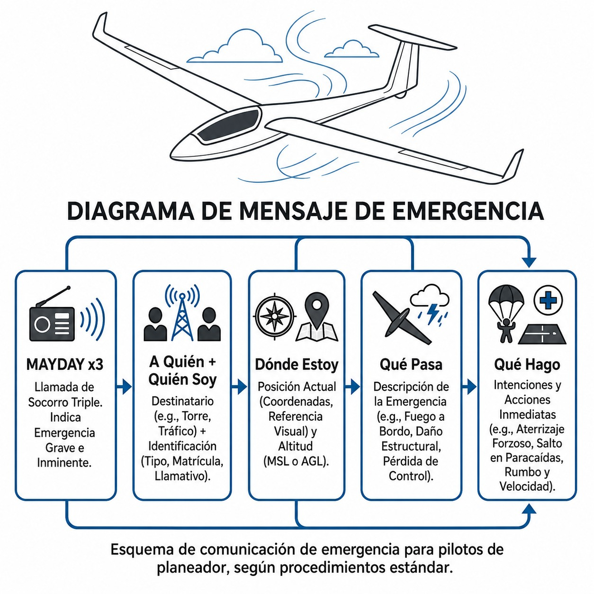
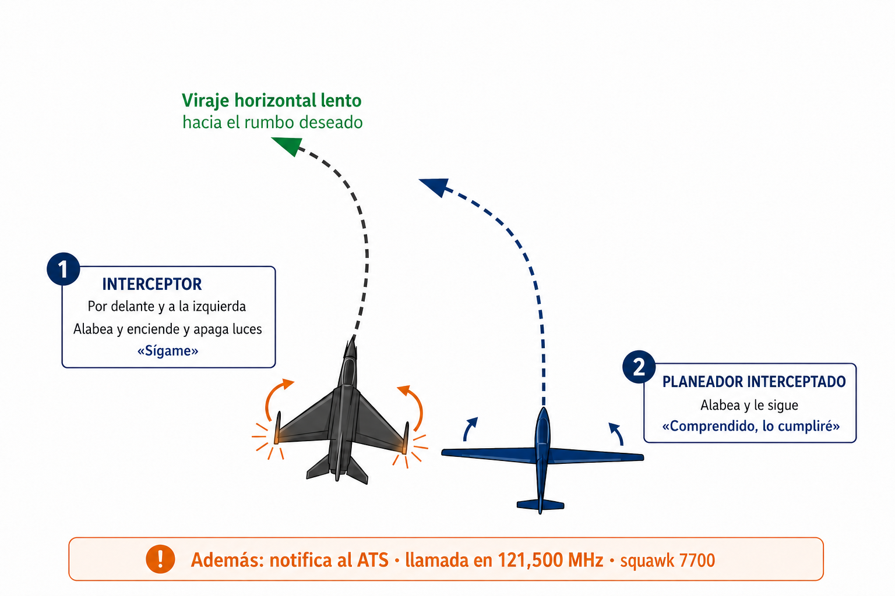

# Procedimientos de socorro (*distress*) y urgencia (*urgency*)

> MAYDAY y PAN PAN no son sinónimos. Este capítulo explica cuándo usar cada uno, qué decir exactamente y en qué frecuencia. Son los dos mensajes más importantes que puedes transmitir por radio, y esperas no necesitarlos nunca. Por eso los tienes que saber de memoria. Cierra el capítulo otro procedimiento que también esperas no usar jamás: qué hacer si una aeronave militar te intercepta.

## MAYDAY: situación de socorro

**MAYDAY** es la palabra de mayor prioridad en la radio aeronáutica. Viene del francés *m’aider*, «ayudadme», pronunciado en inglés.

Úsala cuando hay **peligro grave e inminente y necesitas asistencia inmediata**. La vida de los ocupantes o la integridad del planeador están en riesgo ahora mismo.

En vuelo a vela, eso significa: fuego a bordo, rotura estructural severa (cúpula, timón, ala), incapacitación médica del piloto, o pérdida de altitud sin campo disponible que exige actuar ya.

La palabra se repite **tres veces** para que destaque sobre el tráfico normal y las interferencias:

*«Mayday, Mayday, Mayday…​»*

::: {.callout-warning title="Seguridad"}
La transmisión maliciosa o falsa de un mensaje de socorro MAYDAY moviliza recursos de búsqueda y salvamento (SAR) estatales. Según la Ley de Seguridad Aérea, simular emergencias o proporcionar información falsa que comprometa la seguridad se tipifica como infracción muy grave, conlleva sanciones económicas elevadas y puede resultar en la revocación de la licencia de vuelo.
:::

::: {.callout-important title="Normativa"}
La declaración de un MAYDAY impone, según la normativa internacional (OACI/EASA), un **silencio de radio absoluto** para todas las demás estaciones áreas y terrestres operando en esa frecuencia. Ningún otro tráfico debe transmitir a menos que sea para ofrecer ayuda directa a la aeronave en peligro o para retransmitir su mensaje a la Torre de Control (**Mayday relay**).
:::

## PAN PAN: situación de urgencia

Un escalón por debajo está la **urgencia**. Se declara con **PAN PAN**, también tres veces: *«Pan Pan, Pan Pan, Pan Pan»*. Del francés *panne*, avería.

El PAN PAN dice que tienes un problema serio que necesita **atención prioritaria** del ATC, pero no estás en peligro inmediato de accidente ni necesitas salvamento en los próximos segundos.

En planeador: entrar involuntariamente en IMC sin poder salir a VFR de inmediato, una indisposición médica que obliga a desviar el vuelo, o una pérdida progresiva de altura que te da tiempo a planificar el aterrizaje fuera de aeródromo y coordinarlo con el ATC o el FIS.

El PAN PAN te da prioridad en las comunicaciones. No exige silencio total al resto de tráficos, a diferencia del MAYDAY.

## Estructura del mensaje de emergencia

Con el corazón acelerado y las manos ocupadas, puede costar estructurar un mensaje. Pero los servicios de control y salvamento (SAR) necesitan información concreta para localizarte y ayudarte. Esta es la secuencia (@fig-04-cap06-llamada-emergencia):

1. **A QUIÉN:** Nombre de la dependencia ATS.
2. **QUIÉN:** Tipo de aeronave e indicativo completo.
3. **DÓNDE:** Posición actual, altitud o nivel de vuelo, y rumbo.
4. **QUÉ PASA:** Naturaleza de la emergencia.
5. **QUÉ SOLICITA:** Intenciones del piloto y tipo de ayuda requerida.
6. **PERSONAS:** Personas a bordo (vital para los servicios de rescate).

*Ejemplo de mensaje de socorro (MAYDAY):*
*«Mayday, Mayday, Mayday. Madrid Información. Velero ASK-21, EC-EPE. A 5 millas al este de Fuentemilanos, 2.800 metros. Impacto con ave y rotura masiva del timón de profundidad. El piloto y el pasajero van a saltar en paracaídas. 2 personas a bordo.»*

*Ejemplo de mensaje de urgencia (PAN PAN):*
*«Pan Pan, Pan Pan, Pan Pan. Madrid Información. Velero ASK-21, EC-EPE. Sobre el embalse de Pinilla, 2.200 metros QNH 1018. Pérdida de altura progresiva sin térmica disponible. Planificando aterrizaje fuera de aeródromo en 10 minutos. 2 personas a bordo. Solicito información de campos en el área.»*

{#fig-04-cap06-llamada-emergencia}

## La frecuencia adecuada

Hay una idea muy extendida que dice que en cualquier emergencia lo primero es cambiar a 121.500 MHz. Es un error.

**La mejor frecuencia para declarar una emergencia es en la que ya estás.**

Si estás hablando con «Zaragoza Torre» o escuchando «Madrid Información», emite ahí. El controlador ya te tiene en pantalla y la comunicación está establecida. Cambiar de frecuencia en medio de una emergencia añade trabajo y arriesga perder el contacto.

Ahora bien, si vuelas en una zona remota sin contacto ATS y nadie responde a tu llamada local, entonces sí: cambia a **121.500 MHz**.

Esa frecuencia la escuchan continuamente los vuelos de líneas aéreas en crucero, las estaciones militares de defensa aérea y los centros de control de área. Un MAYDAY en 121.500 MHz tiene muchas probabilidades de ser escuchado y retransmitido (**relay**) a los servicios de rescate.

## Interceptación: si un caza aparece a tu lado

Un planeador rara vez provoca una interceptación (**interception**), pero alguna vez ya ha ocurrido: infringir una zona prohibida o restringida activa, cruzar un CTR sin autorización o aparecer como un eco sin identificar cerca de una zona sensible puede hacer que la defensa aérea envíe una aeronave militar a identificarte. El Libro 1 ya te avisa de ese riesgo al estudiar las zonas P y R; aquí aprenderás las señales y la respuesta correcta. No es un adorno del temario: la normativa exige llevar a bordo una copia de estas señales (SAO.GEN.155, véase el Libro 6, capítulo 1).

### Las señales del interceptor

El interceptor se comunica contigo con maniobras, no con palabras. Las tres series que debes reconocer, conforme a la tabla S11-1 de SERA:

1. Alabea y enciende y apaga las luces de navegación a intervalos irregulares, desde una posición ligeramente por encima, por delante y normalmente a tu izquierda. Después, vira lentamente en horizontal hacia el rumbo deseado.

«Ha sido interceptado. Sígame.»

Alabea, enciende y apaga las luces de navegación si dispones de ellas, y síguele.

2. Se aleja bruscamente de ti con un viraje ascendente de 90° o más, sin cruzar tu línea de vuelo.

«Prosiga.»

Alabea: «Comprendido, lo cumpliré».

3. Despliega el tren de aterrizaje, lleva los faros de aterrizaje encendidos de forma continua y sobrevuela la pista en servicio.

«Aterrice en este aeródromo.»

Despliega el tren (si es replegable), sigue al interceptor y, tras sobrevolar la pista, aterriza si es seguro.

Si el interceptor es mucho más rápido que tú —lo será siempre—, la norma ya lo prevé: hará circuitos de hipódromo a tu alrededor y alabeará cada vez que te adelante. No lo interpretes como una señal nueva; sigue siendo la serie 1.

{#fig-04-cap06-interceptacion-serie1}

### Qué debes hacer

Si te interceptan, aplica de inmediato los cuatro pasos de SERA.11015:

1. **Sigue las instrucciones visuales** del interceptor, interpretándolas y respondiendo según las tablas de señales.
2. **Notifica**, si es posible, a la dependencia de servicios de tránsito aéreo con la que estés en contacto.
3. **Intenta la radio**: llamada general en **121,500 MHz**, indicando tu identidad y la índole del vuelo (por ejemplo: *«Aeronave interceptada, velero EC-EPE, vuelo VFR de Fuentemilanos a Santo Tomé, escucho»*).
4. **Selecciona 7700 en modo A** en el transpondedor, salvo que el ATS te instruya otra cosa.

::: {.callout-important title="Normativa"}
SERA.11015 c): «Si alguna instrucción recibida por radio de cualquier fuente estuviera en conflicto con las instrucciones dadas por la aeronave interceptora mediante señales visuales, la aeronave interceptada requerirá aclaración inmediatamente mientras continúa cumpliendo con las instrucciones visuales dadas por la aeronave interceptora.» La misma regla se aplica si el conflicto es con instrucciones dadas por radio por el interceptor (SERA.11015 d)).
:::

::: {.callout-warning title="Seguridad"}
**Las instrucciones del interceptor prevalecen sobre cualquier otra fuente, incluido el ATC**, mientras solicitas aclaración —en la duda, obedece al que lleva misiles—. Un interceptor armado que cree que no cooperas es el escenario más peligroso en el que puede meterse una aeronave civil: mantén una trayectoria suave y predecible, no hagas maniobras bruscas y responde a cada señal.
:::

### Si no puedes cumplir

También el interceptado tiene señales propias (tabla S11-2 de SERA): encender y apagar **todas las luces disponibles a intervalos regulares** significa «imposible cumplir» (serie 5), y hacerlo **a intervalos irregulares** significa «en peligro» (serie 6). Si logras contacto por radio pero no hay idioma común, la norma prevé frases estándar (tabla S11-3): el interceptor usará FOLLOW («sígame»), DESCEND («descienda») o YOU LAND («aterrice»); tú responderás WILCO («cumpliré»), CAN NOT («imposible cumplir»), AM LOST («posición desconocida») o MAYDAY.

::: {.callout-note title="Airmanship"}
Un velero sin luces de navegación tiene pocas opciones de señalización: tu respuesta visible es el **alabeo amplio y claro**. Compensa el resto con la radio (121,500 MHz) y el transpondedor (7700). Y recuerda que la mejor interceptación es la que no ocurre: comprueba los NOTAM y el estado de las zonas P y R antes de cada vuelo de travesía.
:::

::: {.postit}
**Resumen del capítulo: procedimientos de socorro y urgencia**

* **MAYDAY (x3)**: Exclusivo para situaciones de peligro **GRAVE E INMINENTE** con riesgo vital (fuego, colisión, fallo estructural). Otorga prioridad absoluta e impone silencio total de radio al resto de tráficos.
* **PAN PAN (x3)**: Situación de **URGENCIA**. Requiere asistencia prioritaria (enfermo a bordo, desorientación, avería no crítica) pero no existe riesgo inmediato de accidente. Pide prioridad, no silencio total.
* **Estructura del mensaje**: A QUIÉN (Estación) + QUIÉN (Indicativo) + DÓNDE (Posición) + QUÉ PASA (Problema) + QUÉ SOLICITA (Intenciones y asistencia).
* **Frecuencia recomendada**: La mejor frecuencia es aquella donde el vuelo ya está establecido en contacto. Si falla o no hay respuesta, pasar a la frecuencia internacional de emergencia 121.500 MHz.
* **Interceptación (SERA.11015)**: interceptor alabeando por delante y a tu izquierda = «Sígame» (responde alabeando y siguiéndole); viraje ascendente brusco de 90° o más = «Prosiga»; tren desplegado y faros encendidos sobre la pista = «Aterrice en este aeródromo». Procedimiento: seguir las instrucciones visuales + notificar al ATS + llamada en 121,500 MHz + squawk 7700. **Las instrucciones del interceptor prevalecen sobre cualquier otra fuente, incluido el ATC**, mientras se solicita aclaración. A bordo debe llevarse copia de las señales (SAO.GEN.155).
:::

