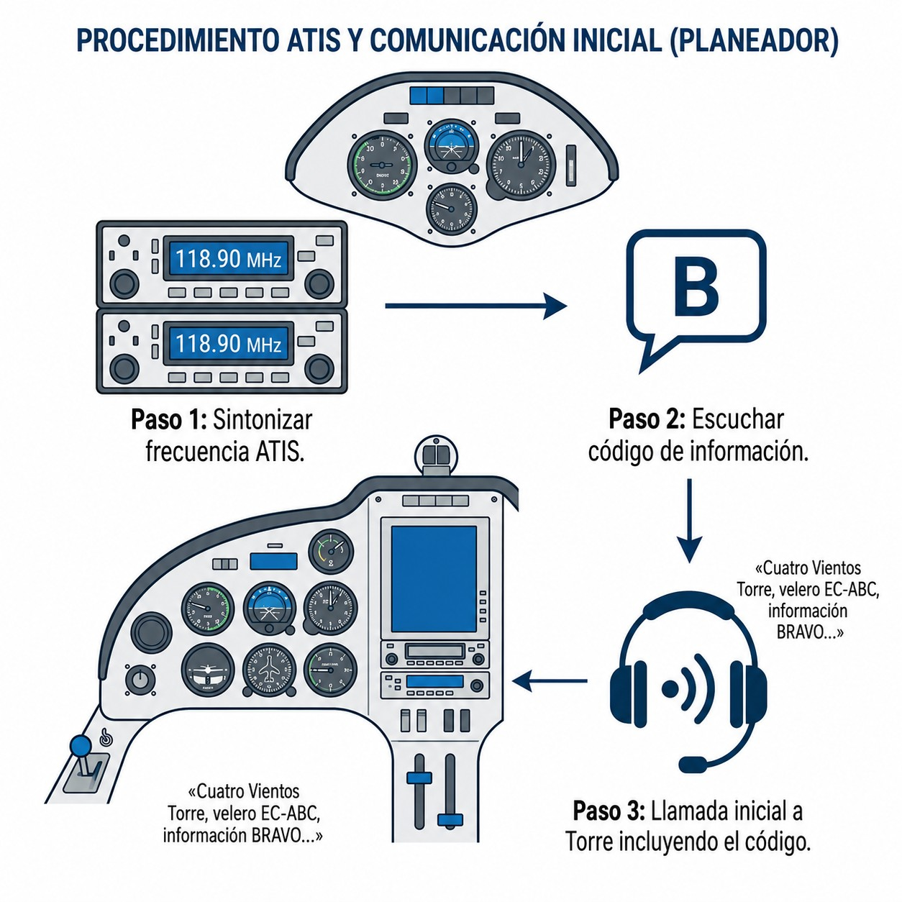
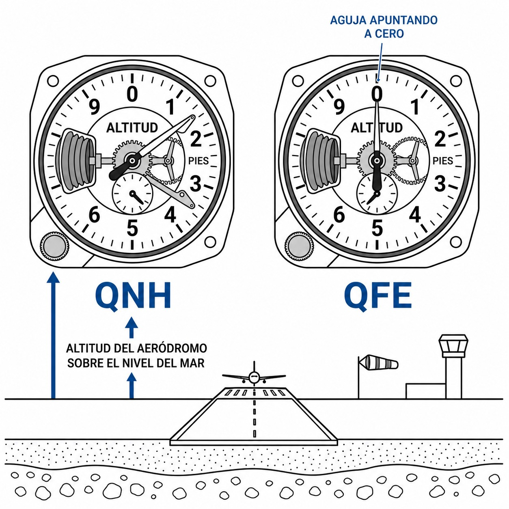
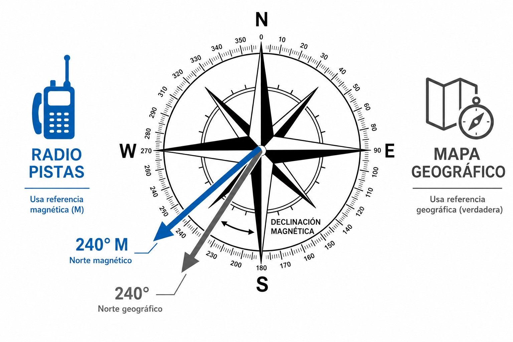

# Términos de información meteorológica relevantes (VFR)

> La radio aeronáutica tiene su propio vocabulario meteorológico, y conocerlo te ahorra malentendidos en vuelo. En este capítulo verás qué son el ATIS y el VOLMET, qué significa CAVOK, cómo funcionan el QNH y el QFE, por qué el viento de la Torre y el de los mapas se miden diferente, y cuándo tienes que emitir un AIREP.

## ATIS: el servicio automático de información terminal

Sin el **ATIS** (**Automatic Terminal Information Service**), los controladores de Torre en aeródromos con tráfico medio o alto pasarían la mitad del día repitiendo lo mismo a cada aeronave que se aproxima. El ATIS existe para librarles de eso.

Es una grabación de voz —normalmente sintética— que suena en bucle continuo en una frecuencia VHF propia, separada de la frecuencia de control (@fig-04-cap06-atis-escucha). Te dice:

* **Pista en servicio** para despegues y aterrizajes.
* **Condiciones meteorológicas** actuales: viento, visibilidad, nubes, temperatura, punto de rocío y QNH.
* **Información operativa:** obras en calles de rodaje, avisos de cizalladura o presencia de aves.

Cada boletín lleva una letra del alfabeto fonético como **código de información** («Información Bravo», por ejemplo). Cuando cambian significativamente las condiciones o la pista en uso, el boletín avanza a la siguiente letra («Información Charlie»).

::: {.callout-tip title="Regla de oro"}
Escucha el ATIS completo **antes** de llamar a la Torre. Luego incluye el código en tu primera llamada: *«Jerez TWR, velero EC-DPE, a 10 millas al norte, con información Bravo, solicito…​»* El controlador sabe que ya tienes todos los datos y puede ir directo al grano.
:::

{#fig-04-cap06-atis-escucha}

## VOLMET: información meteorológica para aeronaves en vuelo

El ATIS te da el tiempo de un aeropuerto concreto. El **VOLMET** (de **VOL METéorologique**) te da el tiempo de una región entera.

Es otra emisión pregrabada en bucle, pero en lugar de un aeródromo emite METAR, pronósticos TAF y avisos SIGMET de **un conjunto de aeropuertos de una misma región**.

En travesías largas (**cross-country**), cuando el tiempo empieza a empeorar y estás valorando un alternativo a decenas de kilómetros, el VOLMET regional te dice exactamente cómo está ese campo sin tener que llamar a nadie. Tomas la decisión con datos reales y la frecuencia de control queda libre.

## Conceptos clave en las transmisiones meteorológicas

Por radio, el tiempo no se describe con palabras propias: se usa terminología estandarizada que cualquier piloto entiende igual, con cualquier acento y con cualquier nivel de ruido de fondo.

### CAVOK

Probablemente la palabra más bienvenida que puedes escuchar en el ATIS.  (techo y visibilidad correctos) significa que se cumplen tres condiciones a la vez:

1. **Visibilidad** de 10 kilómetros o más.
2. **Ninguna nube** convectiva (ni Cumulonimbus CB, ni Cumulus Congestus TCU) y ninguna capa de nubes por debajo de 5.000 pies o de la altitud mínima del sector, lo que sea mayor.
3. **Sin fenómenos** meteorológicos significativos en el aeródromo o cercanías: sin precipitaciones, tormentas, niebla somera ni ventisca baja.

### El ajuste QNH y QFE

El altímetro del planeador es un barómetro: necesita una presión de referencia en la ventanilla para saber a qué altitud estás.

* El **QNH** es la presión atmosférica reducida al nivel medio del mar. Mételo en el altímetro y te dará **la altitud real** sobre el nivel del mar. Es el ajuste que usas en ruta y para respetar los límites verticales de los espacios aéreos (los techos de los CTR van en altitud QNH).
* El **QFE** es la presión a la elevación del aeródromo. Con el QFE puesto, el altímetro marca **cero pies** en tierra: te indica altura sobre el campo, no altitud. En veleros casi no se usa ya, salvo en operaciones muy locales o acrobacia en aeródromo. El QNH es el ajuste de referencia en las comunicaciones ATS (@fig-04-cap06-qnh-qfe).

{#fig-04-cap06-qnh-qfe}

### La dualidad del viento: magnético frente a geográfico

Cuando calculas el planeo final o la componente cruzada, necesitas saber en qué referencia está expresado el viento. No siempre es la misma (@fig-04-cap06-viento-magnetico-geografico).

* **Viento radiado (Torre / ATIS):** La dirección del viento en las operaciones de aproximación y despegue va referida al **Norte Magnético** («Viento 240 grados, 15 nudos»). Tiene sentido: tanto la brújula de cabina como la numeración de las pistas usan la declinación magnética, así que puedes comparar directamente la orientación de la pista con el viento sin hacer correcciones.
* **Viento escrito (mapas meteorológicos / METAR en texto / VOLMET):** Si consultas el viento en una web de meteo, en un mapa de vientos en altura (GRIB) o en un METAR/TAF en formato texto —incluyendo el que difunde el VOLMET—, la dirección viene referida al **Norte Geográfico (verdadero)**. El VOLMET retransmite METAR y TAF en texto, así que su viento también es **verdadero**, distinto del viento operativo que te da la Torre.

{#fig-04-cap06-viento-magnetico-geografico}

### SIGMET y AIRMET

Dos tipos de avisos meteorológicos que aparecen en el VOLMET y en los briefings prevuelo:

* **SIGMET** (**Significant Meteorological Information**): aviso emitido por los centros meteorológicos de vigilancia para fenómenos severos en ruta —tormentas eléctricas, engelamiento intenso, turbulencia severa, cenizas volcánicas—. Cubre grandes áreas y tiene validez de hasta 4 horas (6 h en zonas oceánicas). Su uso obliga a tomarse muy en serio la decisión de vuelo.
* **AIRMET** (**Airman’s Meteorological Information**): aviso de menor severidad, dirigido especialmente a la aviación de bajo nivel y la aviación general. Cubre fenómenos moderados —turbulencia moderada, engelamiento moderado, visibilidad reducida— que no alcanzan el umbral del SIGMET.

Ambos los encontrarás en el VOLMET regional o en el briefing meteorológico prevuelo. Si un SIGMET activo afecta a tu ruta, evalúa si las condiciones son operables antes de salir.

## AIREP: el informe meteorológico especial en vuelo

El **AIREP** (**Aircraft Report**) es el informe que tú, como piloto, transmites al FIS o al ATC cuando encuentras en ruta condiciones meteorológicas peligrosas que no estaban pronosticadas.

Si te metes en turbulencia fuerte, engelamiento, tormenta, granizo u ondas orográficas intensas, emites un AIREP especial con tu posición y altitud. Así el ATC puede avisar a los demás tráficos en esa zona.

::: {.callout-important title="Normativa"}
El Reglamento SERA obliga al piloto en mando a notificar sin demora cualquier condición meteorológica peligrosa que pueda afectar a la seguridad de otras aeronaves.
:::

::: {.postit}
**Resumen del capítulo: terminología meteorológica**

* **ATIS**: Voz automática en aeropuertos. Escucharla antes de llamar proporciona pista en uso, viento, QNH y el **código de información** (p. ej., «Información Bravo»). Ahorra tiempo al controlador y agiliza la comunicación.
* **VOLMET**: Emisora dedicada a difundir METAR, TAF y SIGMET de varios aeropuertos en bucle. Permite planificar la llegada o seleccionar un alternativo sin saturar la frecuencia de control.
* **Conceptos clave**:
* **CAVOK**: **Ceiling and Visibility OK** (visibilidad ≥ 10 km, sin nubes bajas, sin fenómenos). Las mejores condiciones posibles para VFR.
* **QNH**: Presión de referencia para leer la altitud sobre el nivel del mar. Fundamental para respetar los límites verticales de los espacios aéreos.
* **Viento**: La Torre y el ATIS facilitan el viento referido al Norte Magnético (igual que la numeración de pistas). En mapas, METAR/TAF en texto y VOLMET el viento viene referido al Norte Geográfico (verdadero).
* **AIREP**: Informe emitido obligatoriamente por el piloto en vuelo para notificar a otras aeronaves sobre fenómenos meteorológicos severos no pronosticados.
:::

