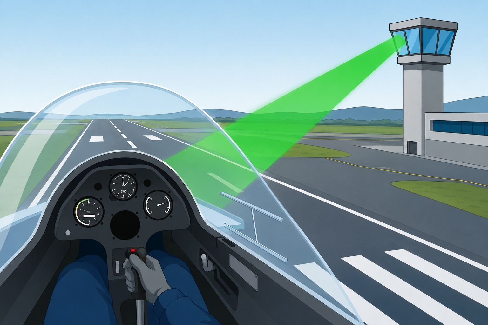

# Acciones ante fallo de comunicaciones

> Quedarse sin radio en vuelo —situación NORDO— tiene un protocolo concreto. Aquí verás qué hacer con el transpondedor, cómo gestionar el vuelo hasta tierra, qué significan las señales de luces de la Torre y cómo transmitir cuando solo falla el receptor.

## El código 7600: señal de fallo de radio

Perder toda la radio en vuelo —técnicamente, pérdida de comunicaciones bidireccionales o situación **NORDO** (**No Radio**)— es un problema serio, especialmente cerca de espacio aéreo controlado. No entres en pánico: hay un procedimiento.

Primero repasa lo básico: volumen, silenciador (**squelch**), conectores de los auriculares (**jacks**), fusibles y frecuencias alternativas. Si nada funciona, ve al transpondedor.

Pon el **código 7600** ahora.

Con ese código, el radar secundario de vigilancia (SSR) de los centros de control muestra tu aeronave con una alerta especial en pantalla. Los controladores del sector saben que estás NORDO y empiezan a coordinar: despejan el espacio aéreo a tu alrededor y te siguen visualmente.

## Procedimiento estándar en vuelo VFR

Con la situación NORDO declarada, el plan es este:

1. **Mantén VMC.** No entres en nubes bajo ningún concepto. Necesitas visibilidad y contacto visual con el suelo y otros tráficos.
2. **Rodea las zonas controladas.** Si tu ruta cruzaba un CTR, quédate fuera. Sin radio no puedes obtener autorización.
3. **Aterriza en el aeródromo adecuado más cercano.** Preferiblemente uno no controlado: te integras en el circuito visual con los ojos bien abiertos y aterrizas.
4. **Llama por teléfono en cuanto estés en tierra.** Contacta con la dependencia ATC correspondiente para confirmar el aterrizaje. Si no lo haces, los servicios ATS activarán la fase de Búsqueda y Salvamento (SAR).

::: {.callout-warning title="Seguridad"}
Si no tienes más remedio que aterrizar en un aeródromo controlado, acércate a la Torre por zonas que no interfieran con las operaciones y haz balanceos de alas (**wing rock**) para que te vean. Luego colócate paralelo a la pista, por delante de la torre, y mira las señales luminosas del ATC.
:::

{#fig-04-cap07-pistola-luces}

## Señales luminosas de la Torre (Reglamento SERA)

Desde los primeros aeródromos, las torres de control tienen focos direccionales con filtros de color —la «pistola de luces»— precisamente para esto: guiar a aeronaves sin radio (@fig-04-cap07-pistola-luces). Memoriza estas señales. Si algún día las necesitas, no habrá tiempo para buscarlas.

::: {.callout-important title="Normativa"}
Las señales luminosas de la Torre de Control están reguladas por el Reglamento de Ejecución (UE) n.º 923/2012 —Reglas Europeas Estandarizadas del Aire (**SERA**)—. Su correcto conocimiento e interpretación es obligatorio para todo piloto que opere en espacios aéreos con servicio ATC (Fuente: documentación oficial SERA, EASA / AESA).
:::

**Señales para aeronaves en vuelo:**

* ● **Luz verde fija**: Autorizado a aterrizar.
* ● **Luz roja fija**: Ceda el paso a otras aeronaves y continúe en circuito de espera.
* ●●● **Serie de destellos verdes**: Regrese para aterrizar.
* ●●● **Serie de destellos rojos**: Aeródromo peligroso o inseguro, no aterrice.
* ○○○ **Serie de destellos blancos**: Aterrice en este aeródromo.
* ★ **Luz pirotécnica roja**: A pesar de las instrucciones previas, no aterrice por el momento.

**Señales para aeronaves en tierra:**

* ● **Luz verde fija**: Autorizado para despegar.
* ● **Luz roja fija**: Alto.
* ●●● **Serie de destellos verdes**: Autorizado para rodar.
* ●●● **Serie de destellos rojos**: Apártese del área de aterrizaje en uso.
* ○○○ **Serie de destellos blancos**: Regrese al punto de partida en el aeródromo.

::: {.callout-tip title="Regla de oro"}
Al recibir una señal de la Torre en vuelo, acusa recibo de la única forma posible: de día, guiñadas con el timón o balanceos de alas bien visibles. De noche, encendiendo y apagando las luces de aterrizaje o de navegación. En tierra, moviendo los alerones o el timón de dirección.
:::

## La transmisión a ciegas (*blind transmission*)

A veces el fallo es solo del receptor: tu voz sale al exterior con normalidad, pero no recibes nada. No puedes saberlo con certeza desde el aire, pero si sospechas que es así, aplica la **transmisión a ciegas** (**blind transmission**).

La idea es simple: sigues transmitiendo posición e intenciones en la frecuencia correcta, pero cada mensaje va precedido de un aviso:

*«Transmitiendo a ciegas debido a fallo del receptor. Transmitiendo a ciegas. Torre de San Javier, planeador EC-EPE, a 5 millas del punto Sierra a 2.000 pies, intención entrar en zona y proceder a inicial de pista 23 para toma completa.»*

Transmite cada mensaje completo dos veces: sin acuse de recibo, la repetición es tu única garantía de que llegue entero. Y repite el aviso en cada cambio de tramo del circuito o al iniciar el descenso en final. El controlador puede estar recibiéndote perfectamente en tierra y coordinando el tráfico a partir de lo que narras, aunque tú no puedas confirmarlo.

::: {.postit}
**Resumen del capítulo: fallo de comunicaciones**

* **Código 7600**: Al confirmar el fallo de radio, seleccione 7600 en el transpondedor. La aeronave aparecerá destacada en la pantalla del radar secundario (SSR) como situación NORDO.
* **Procedimiento en vuelo**: Mantenga VMC. Aterrice preferentemente en un aeródromo no controlado. Si debe acudir a uno controlado, sobrevuele la Torre por zona no operativa, efectúe balanceos de alas y observe las señales de luces. Notifique por teléfono en cuanto tome tierra.
* **Señales de luces (SERA)**: *Verde fija* (vuelo) = autorizado a aterrizar. *Roja fija* (vuelo) = ceda el paso. *Destellos rojos* (vuelo) = aeródromo peligroso. *Destellos verdes* (vuelo) = regrese para aterrizar. *Destellos blancos* (vuelo) = aterrice en este aeródromo. Las señales equivalentes en tierra tienen significados distintos: *verde fija* = autorizado para despegar; *destellos verdes* = autorizado para rodar.
* **Transmisión a ciegas**: Si solo falla el receptor, transmita posición e intenciones en la frecuencia correcta precediendo el mensaje con «Transmitiendo a ciegas debido a fallo del receptor». Repítalo en cada cambio de tramo.
:::

