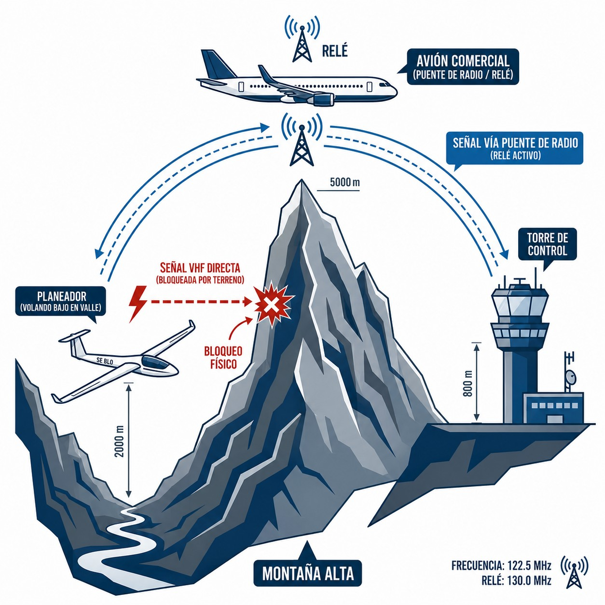

# Principios generales de propagación VHF y asignación de frecuencias

> La radio VHF funciona como una linterna: ilumina en línea recta y la montaña te deja a oscuras. En este capítulo verás por qué la altitud es tu mejor aliada para el alcance, qué cambió con el espaciado a 8,33 kHz, cómo ajustar bien el **squelch**, qué hacer cuando una sierra te bloquea la señal, y qué frecuencias necesitas conocer de memoria. También cuándo es obligatorio el transpondedor y qué significan los códigos **squawk**.

## Alcance visual: la línea recta de las ondas VHF

Las comunicaciones aeronáuticas de voz se transmiten en la banda de **Muy Alta Frecuencia (VHF)** (*Very High Frequency*), entre los 118.000 MHz y los 136.975 MHz, con modulación de amplitud (AM).

Las ondas VHF **se propagan en línea recta**, exactamente como un haz de luz. A esto se le llama propagación por línea de mira (**Line of Sight**). La consecuencia es inmediata: si algo sólido se interpone entre tu antena y la del receptor, la comunicación se corta. Sin más.

Las ondas de baja frecuencia rebotan en la ionosfera y pueden rodear el horizonte. Las VHF no. No atraviesan la tierra ni se doblan sobre ella. Una montaña, un edificio o la propia curvatura terrestre las paran en seco.

Por eso **la altitud es tu mejor aliada para el alcance de la radio**. Cuanto más alto vueles, más lejos «verá» tu antena por encima de la curvatura terrestre y de los obstáculos. Hay una fórmula para estimarlo sobre terreno llano:

`Alcance Máximo [NM] = 1.23 × √H [pies]`

*Ejemplo práctico: a 10.000 pies de altura, la raíz cuadrada es 100. Multiplicado por 1,23, el alcance teórico hacia una estación en el suelo es de unas 123 millas náuticas, unos 228 km.*

## La separación de canales a 8,33 kHz

Durante décadas, el espectro VHF de aviación se dividió en canales separados por 25 kHz. Funcionó bien hasta que el crecimiento del tráfico aéreo en Europa dejó sin canales suficientes para nuevos sectores de ATC, aproximaciones y aeródromos.

La solución fue reducir el espaciado de cada canal de 25 kHz a **8,33 kHz**. Con eso, el número de canales disponibles en la misma porción del espectro se triplicó.

El Reglamento de ejecución (UE) N.º 1079/2012 impuso la transición en toda Europa. En España, desde el **31 de diciembre de 2022**, los vuelos VFR tienen que ir equipados con radios «compatibles con 8,33» (**8,33 compliant**). Los IFR cumplieron antes.

::: {.callout-important title="Normativa: RADIOS 8,33 kHz"}
Si tu velero lleva una radio antigua de 25 kHz —la que solo marca diales acabados en .000, .025, .050 o .075—, la regla general en Europa es que ya no basta: para operar con las dependencias modernas del ATC necesitas un equipo capaz de sintonizar el espaciado de 8,33 kHz. Hay una excepción que conviene conocer: el AIP-España (ENR 1.8) mantiene, comunicadas a la Comisión (Reg. 2023/1770 y 2023/1771), unas **sub-bandas nacionales en 25 kHz para comunicaciones aire-aire y aire-tierra hasta el 31-12-2028** —precisamente las de vuelo a vela que aparecen en la tabla de este capítulo (122,600; 123,375; 123,400; 123,450; 123,500)—. Así que como afirmación legal la frase exige el matiz de la exención; como recomendación práctica, equipa 8,33 sin dudarlo: sin él no te comunicarás con la mayoría de las dependencias del ATC.
:::

## El *squelch*: la puerta del ruido

Casi todas las radios aeronáuticas tienen un control giratorio, o un menú digital, etiquetado como **Squelch** (Silenciador).

El **squelch** es un circuito electrónico que actúa como una puerta de ruido. Cuando nadie transmite en la frecuencia, la antena capta estática: ese siseo molesto de fondo. El squelch lo silencia. Solo cuando llega una señal suficientemente fuerte —una voz— la puerta se abre y el audio llega a tus auriculares o altavoces.

**Ajuste correcto:**

1. Baja el squelch hasta que escuches el ruido estático fuerte continuo («siseo»).
2. Súbelo lentamente **justo hasta el punto** en que el ruido desaparece.

::: {.callout-tip title="Regla de oro"}
No subas el squelch más allá del punto donde cesa el ruido. Si lo dejas «al máximo», las señales débiles de planeadores lejanos o de un ATC distante no tendrán fuerza suficiente para abrir la puerta. Creerás que la frecuencia está en silencio cuando en realidad alguien te está llamando.
:::

{#fig-04-cap07-bloqueo-montana}

## Bloqueo en montaña y relé de radio (*relay*)

El vuelo a vela lleva a menudo a los planeadores a entornos orográficos complejos: laderas de los Pirineos, valles del Gredos, cajones del Sistema Central. Lejos de las llanuras y muy por debajo de las crestas.

Las ondas VHF viajan en línea recta y no atraviesan la roca. Si bajas por debajo de la cresta que te separa de la torre de control o del repetidor FIS de ENAIRE más cercano, sufrirás un **bloqueo orográfico** total (@fig-04-cap07-bloqueo-montana). Da igual cuánta potencia tenga tu radio: la señal se estrella contra la piedra.

En alta montaña, anticipa esto con dos medidas:

1. **Anticipa la falta de cobertura**: Si tienes que notificar un informe de posición al FIS, hazlo **antes** de meterte en ese valle o detrás de esa cordillera.
2. **El avión puente (Relay)**: En una emergencia desde el fondo de un cajón sin cobertura, recuerda que por encima de ti hay planeadores de tu propio club a más altura, o aviones comerciales en ruta. Ellos «ven» tanto tu posición en el valle como la torre lejana. Úsalos como **estaciones relé**. Emite: *«Tráfico en 123,500, aquí Eco Papa Eco en emergencia en el fondo del valle del Jerte, ¿alguien puede retransmitir mi Mayday a Madrid Información?»* Sus ondas llegarán libres de obstáculos hasta la torre, y ellos retransmitirán tu llamada.

## Frecuencias usuales en aviación deportiva

Saberte de memoria las frecuencias más habituales te permite sintonizarlas sin consultar la carta y reaccionar rápido ante cualquier cambio o emergencia.

| Frecuencia (MHz) | Uso | Ámbito |
| --- | --- | --- |
| **121,500** | Emergencia aeronáutica internacional | Internacional. Escuchada las 24 h por vuelos de línea en altitud de crucero, instalaciones militares de defensa aérea y centros de control de área. |
| **122,600** | Vuelo a vela (frecuencia principal) | España. Coordinación entre planeadores en área de vuelo libre y notificación entre pilotos. |
| **123,375** | Vuelo a vela (alternativa) | Frecuencia alternativa de coordinación entre planeadores cuando 122,600 está saturada. |
| **123,400** | Vuelo a vela (alternativa) | Segunda frecuencia alternativa de coordinación para planeadores. |
| **123,450** | Frecuencia de «charla» (**air-to-air**) | Comentarios de vuelo y coordinación informal entre pilotos. No debe usarse para gestiones con ATC ni FIS. |
| **123,500** | Aeródromo no controlado genérico | Autoinformación en aeródromos sin torre o con AFIS donde no hay frecuencia específica publicada. |
: Frecuencias VHF de referencia para el piloto de planeador

Las frecuencias de **FIS regionales** de España (Madrid, Barcelona, Sevilla, Palma de Mallorca, Gran Canaria) varían por sector y altitud. Se publican en el AIP España (GEN 3.3) y en las cartas de navegación OACI 1:500.000. Cada aeródromo con torre o AFIS tiene su propia frecuencia, publicada en la carta VAC del aeródromo. La propia tabla de arriba procede del AIP-España (GEN 3.4 y ENR 1.8).

::: {.callout-note title="Airmanship"}
Con el espaciado de 8,33 kHz, las cartas y las radios muestran **canales**, no frecuencias exactas: verás diales acabados en .005, .010, .015… y a veces un sufijo «C». No es un error de sintonía; es la nomenclatura del canal, que no coincide con la frecuencia real. Sintoniza el canal tal como figura en la carta.
:::

::: {.callout-note title="Airmanship"}
Antes de cada travesía, anota las frecuencias de FIS de los sectores que atravesarás. En una zona con cobertura degradada o tras una emergencia, buscar la frecuencia en el mapa es tiempo que no tienes.
:::

## El transpondedor: identificación secundaria en vuelo

El **transpondedor** (*XPDR*) responde automáticamente a los radares terrestres emitiendo un código de cuatro dígitos (). Así el controlador ve tu aeronave identificada en pantalla.

Llevarlo operativo es obligatorio dentro de una **TMZ** (*Transponder Mandatory Zone*) y allí donde lo exijan la clase de espacio aéreo o el AIP-España (ENR 1.6): las clases A y C lo requieren, y la D generalmente (véase la tabla del **Libro 1 — Derecho Aéreo y Procedimientos de Control de Tránsito Aéreo (ATC)**, capítulo 7). Fuera de esos espacios sigue siendo muy recomendable en cualquier zona con tráfico: si está instalado y operativo, la práctica correcta es llevarlo encendido y en modo ALT (transmisión de altitud).

* **7000**: Código VFR estándar.
* **7500**: Interferencia ilícita (secuestro). Solo ante una amenaza real a la integridad de la aeronave. Su uso activa protocolos inmediatos de defensa aérea.
* **7600**: Fallo de radio (NORDO).
* **7700**: Emergencia general.
* **Botón IDENT**: Hace parpadear tu etiqueta en el radar. Púlsalo **solo** cuando el controlador lo pida expresamente («*Squawk ident*»).

::: {.postit}
**Resumen del capítulo: principios de propagación VHF**

* **Alcance Visual**: Las ondas VHF viajan en línea recta. Si hay una montaña entre la antena y tú, no te oirán. La altura es tu aliada: a mayor altitud, mayor alcance (1.23 \times \sqrt{H}1.23 \times \sqrt{H}).
* **Separación 8.33 kHz**: El espacio aéreo está saturado. Para meter más canales, se redujo el ancho de banda. Asegúrate de que tu radio es "8.33 compliant" o no podrás sintonizar muchas frecuencias modernas.
* **Squelch**: Es la "puerta de ruido". Ajústalo justo hasta que desaparezca el ruido de fondo ("siseo"). Si lo cierras demasiado, bloquearás señales débiles pero importantes.
* **Bloqueo**: En valles profundos, puedes perder contacto con la red de repetidores. Ten previsto un plan de comunicaciones (o un relé con otro avión) si vuelas bajo en montaña.
* **Frecuencias clave**: 121,500 MHz (emergencia internacional, escucha permanente). 122,600 / 123,375 / 123,400 MHz (vuelo a vela). 123,450 MHz (charla entre pilotos). 123,500 MHz (aeródromo no controlado genérico). FIS regionales: consultar AIP España GEN 3.3.
* **Transpondedor (XPDR)**: Responde automáticamente al radar secundario (SSR). Códigos: **7000** (VFR estándar), **7600** (fallo de radio — NORDO), **7700** (emergencia activa). Obligatorio en zonas TMZ (SERA.6005 b) — descritas en AIP-España ENR 2.1, carta ENR 6— y donde lo exijan la clase de espacio aéreo o el AIP (ENR 1.6): clases A y C, y D generalmente. Botón **IDENT**: solo cuando lo pida el ATC.
:::
