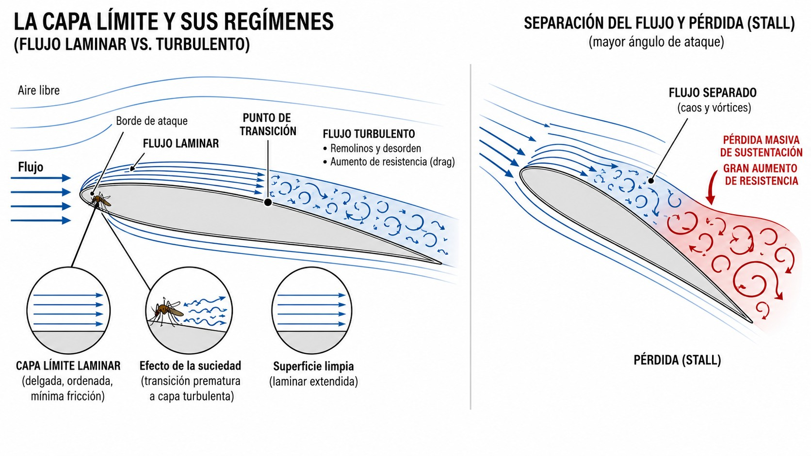
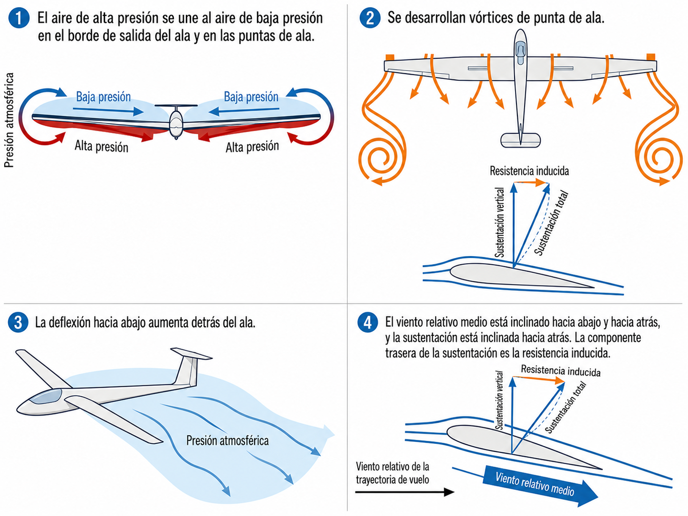
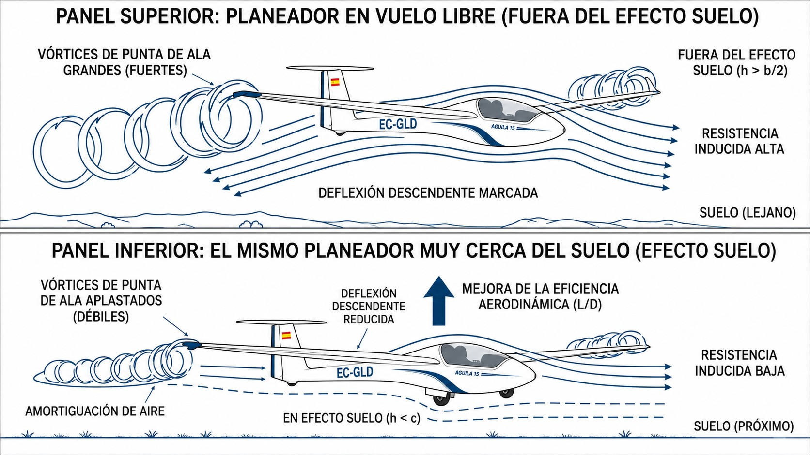

# Aerodinámica (flujo de aire)

La aerodinámica es el fundamento invisible de todo lo que hace un planeador en el aire. En este capítulo aprenderás cómo la diferencia de presión entre extradós e intradós genera sustentación, qué es la capa límite y por qué un solo mosquito aplastado en el borde de ataque puede degradar el rendimiento de un perfil laminar, y cómo las dos grandes familias de resistencia aerodinámica determinan la velocidad óptima de planeo.

## Principio de Bernoulli y sustentación

La sustentación se genera por una diferencia de presiones entre la parte superior (extradós) y la inferior (intradós) del ala.

Cuando el planeador avanza, el aire fluye sobre el perfil curvado del extradós acelerándose, mientras que el aire que pasa por el intradós viaja a menor velocidad. Según el teorema de Bernoulli, cuando la velocidad de un fluido aumenta, su presión estática disminuye: el extradós queda con menos presión que el intradós, y esa diferencia crea la fuerza neta ascendente que contrarresta el peso del planeador.

::: {.callout-tip}
✦ **REGLA DE ORO**

La sustentación admite dos descripciones del **mismo** fenómeno, no dos fuerzas que se sumen: la diferencia de presión (Bernoulli) y la deflexión del aire hacia abajo en el borde de salida (acción-reacción, tercera ley de Newton). El ala que acelera el aire por arriba es la misma que lo desvía hacia abajo; ambas miradas dan la misma fuerza.
:::

## La capa límite

La capa límite es la fina lámina de aire en contacto directo con la piel del ala. El rozamiento viscoso frena esa capa progresivamente hasta que la velocidad llega a cero sobre la superficie misma. Tiene dos regímenes:

* **Laminar:** el flujo se desliza en láminas paralelas y ordenadas. Genera la mínima fricción posible y es el objetivo principal del diseño de los planeadores modernos.
* **Turbulenta:** el flujo se desordena en pequeños remolinos. El rozamiento aumenta mucho respecto al régimen laminar, la capa se engrosa y el planeo se resiente. Tiene, eso sí, una virtud: al llevar más energía, se aferra mejor al perfil y tarda más en desprenderse. Por eso muchos planeadores montan turbuladores (esa cinta en zigzag que habrás visto en algún Discus): fuerzan la transición a turbulenta justo donde conviene evitar que el flujo se separe.

El punto de la cuerda donde el flujo laminar pasa a ser turbulento se llama **punto de transición** (). Para mantener la capa límite laminar sobre la mayor superficie posible, las alas deben estar completamente limpias; un simple mosquito aplastado en el borde de ataque basta para provocar una transición prematura a capa turbulenta. Si el ángulo de ataque aumenta en exceso, el flujo entra en fase de **separación**: se desprende del ala y provoca una caída masiva de sustentación con un gran aumento de resistencia (**stall** o pérdida).

{#fig-05-cap01-capa-limite}

## Centro de presiones (CP)

El centro de presiones (CP) es el punto de la cuerda alar donde actúa la fuerza neta de sustentación. No es fijo: se desplaza con el ángulo de ataque.

La regla:

* Más ángulo de ataque → CP avanza hacia el borde de ataque.
* Bajas el morro → CP retrocede.

Ese vaivén continuo afecta directamente al equilibrio en cabeceo.

::: {.callout-warning}
⚠ **SEGURIDAD**

Debido a la movilidad del CP, el diseño de la aeronave obliga a situar el centro de gravedad (CG) por delante del centro de presiones en las condiciones normales de vuelo. Esa configuración proporciona **estabilidad longitudinal positiva**. Para contrarrestar la tendencia a picar (hundir el morro) que produce el CG adelantado, el estabilizador horizontal genera una fuerza descendente que mantiene el equilibrio en cabeceo.
:::

## Tipos de resistencia y curva de resistencias

Todo lo que mantiene al planeador en el aire tiene su precio: la resistencia al avance (**drag**). Se divide en dos componentes:

* **Resistencia parásita:** la que produce cualquier objeto sólido al moverse a través de un fluido. Crece con el cuadrado de la velocidad (si la velocidad se duplica, la resistencia se cuadruplica). Se compone de:
  
  * Fricción superficial de las alas y fuselaje.
  * Resistencia de forma (perfil de las piezas).
  * Resistencia de interferencia (donde dos superficies ortogonales se unen, como el encastre del plano con el fuselaje).
* **Resistencia inducida:** el subproducto directo de generar sustentación. La diferencia de presión entre extradós e intradós hace que el aire fluya en sentido contrario alrededor de las puntas del ala, desde la zona de alta presión (intradós) hacia la de baja presión (extradós). Ese rodeo genera **torbellinos helicoidales** que se desprenden de cada punta y que, al inclinar levemente hacia atrás el vector de sustentación resultante, crean una fuerza opositora al avance: la resistencia inducida (). Al contrario que la parásita, es máxima a velocidades bajas (y altos ángulos de ataque) y disminuye a medida que el planeador acelera.

{#fig-05-cap01-vortices-punta-ala}

Hay dos razones por las que un planeador planea tan distinto a un avión de turismo. La primera es la **razón de aspecto** (**aspect ratio**): cuántas veces cabe la cuerda en la envergadura. Alas largas y estrechas forman vórtices de punta más débiles, así que la resistencia inducida cae. Un planeador de regata alcanza una razón de aspecto de 30:1 o más; un avión de turismo, entre 7 y 8. Esa diferencia explica buena parte de la brecha de rendimiento; el resto lo ponen los perfiles laminares y la limpieza aerodinámica del conjunto. La segunda es el uso de **winglets**: las pequeñas aletas verticales en las puntas del ala que cortan el paso al aire que intenta rodear la punta de alta a baja presión. Reducen el vórtice sin estirar más la envergadura.

La suma de ambas resistencias en función de la velocidad forma una curva en "U". El punto más bajo de esa curva es la velocidad donde la resistencia aerodinámica total es mínima. Volando exactamente a esa velocidad, el planeador alcanza la mejor relación sustentación/resistencia (L/D): el ángulo de planeo óptimo para maximizar el alcance horizontal.

## El efecto suelo

Cuando el planeador vuela a muy baja altura sobre la pista —generalmente por debajo de una envergadura de ala sobre el terreno—, entra en una zona de influencia aerodinámica denominada **efecto suelo**. El terreno actúa como una barrera física que interrumpe la formación normal de los torbellinos de punta de ala y reduce la intensidad del flujo descendente que los alimenta (**downwash**).

El resultado es una reducción significativa de la resistencia inducida que mejora transitoriamente la relación L/D del planeador ():

* Durante el aterrizaje, el planeador "flota" más de lo esperado: al caer la resistencia inducida, apenas decelera y el ala sigue sustentando a velocidades algo inferiores a las que necesitaría en vuelo libre. Un piloto que entra largo o demasiado rápido puede consumir cientos de metros de pista sin posarse.
* Durante el despegue en aeroplano remolcado, el planeador puede despegar a velocidades ligeramente más bajas de las normales. Una vez que abandona el efecto suelo, la resistencia inducida recupera su valor normal y puede producirse una ligera pérdida de ascenso si la velocidad no es suficiente.

{#fig-05-cap01-efecto-suelo}

::: {.callout-note}
⚓ **AIRMANSHIP / BUENAS PRÁCTICAS**

El efecto suelo puede sorprender al piloto inexperto: el planeador parece no querer posarse durante la toma. Si estás entrando en la zona de contacto con exceso de velocidad o inercia, resiste la tentación de picar el morro para forzar el aterrizaje. Usa los frenos aerodinámicos para controlar el planeo y déjalo posarse solo cuando esté listo, asegurándote antes de tener pista suficiente.
:::

**Resumen del Capítulo: Aerodinámica y Flujo de Aire**

* **Principio de Bernoulli**: la base del vuelo. El aire se acelera sobre la superficie curva del ala (extradós) y su presión disminuye, generando una fuerza neta hacia arriba. Es la misma sustentación que describe la deflexión del aire hacia abajo (Newton): dos miradas de un único fenómeno, no dos fuerzas que se sumen.
* **Capa límite**: esa fina capa de aire pegada al ala. Si es **laminar** (ordenada), la resistencia es mínima: el santo grial de los veleros modernos. Si se vuelve **turbulenta**, la resistencia sube, pero el ala sigue sustentando. Solo cuando el flujo se **separa** del perfil la sustentación se desploma: eso es la pérdida.
* **Centro de presiones (CP)**: el punto donde se aplica la fuerza de sustentación. Cuidado: se mueve con el ángulo de ataque (adelante con altos ángulos, atrás con bajos), lo que afecta a la estabilidad.
* **Tipos de resistencia**: **parásita** (roce con el aire, sube con la velocidad) e **inducida** (precio por generar sustentación, baja con la velocidad). La inducida viene de los torbellinos de punta de ala que inclinan el vector de sustentación. Los planeadores la minimizan con alta razón de aspecto (alas largas y estrechas) y winglets en las puntas.
* **Efecto suelo**: por debajo de una envergadura de altura sobre el terreno, los vórtices de punta se comprimen, la resistencia inducida cae y el planeador "flota" con más eficiencia de la normal. Útil conocerlo: explica por qué en el aterrizaje el planeador no se posa si entras rápido o largo.
