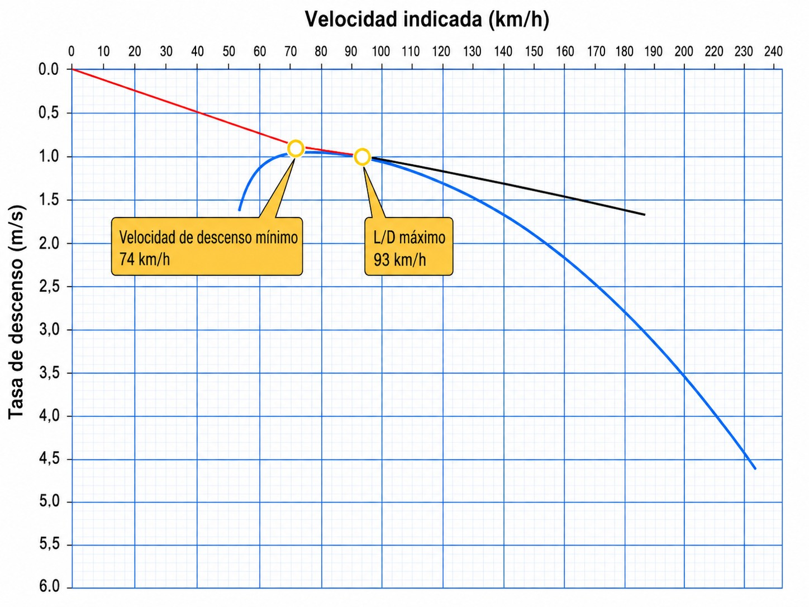
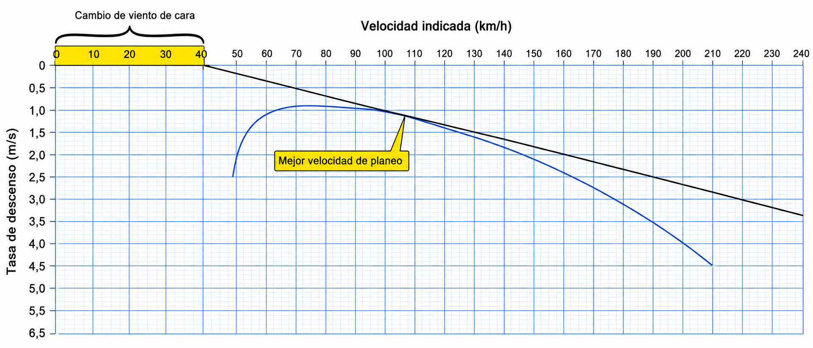
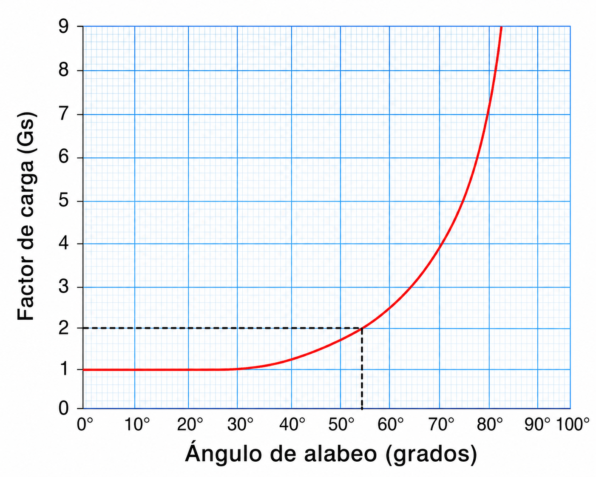

# Mecánica de vuelo

> Sin motor, la gravedad es tu único combustible. En este capítulo aprenderás a interpretar la curva polar de tu planeador para extraer el máximo rendimiento, a ajustar la velocidad según el viento y las descendencias, y a entender el factor de carga para volar en viraje sin comprometer la estructura ni acercarte a la pérdida sin darte cuenta.

## El motor es la gravedad

Un planeador no tiene motor. Una vez suelto del remolque, su único combustible es la altura que lleva bajo las alas.

El vuelo planeando es un intercambio permanente: la energía potencial (altitud) se convierte en cinética (velocidad). Para que el ala siga sustentando, el planeador baja levemente el morro frente a la masa de aire. Esa inclinación hace que una componente del peso apunte hacia adelante a lo largo de la trayectoria, actuando como tracción y equilibrando la resistencia aerodinámica (**drag**).

::: {.callout-tip}
✦ **REGLA DE ORO**

La velocidad te da el mando del planeador; la altura es tu reserva de energía. Cediendo altura ganas velocidad (palanca adelante) y, gastando el exceso de velocidad, puedes recuperar algo de trayectoria ascendente (palanca atrás). Pero ese intercambio dura poco: la reserva solo se rellena subiendo en una ascendencia.
:::

## La curva polar

La curva polar es el DNI de rendimiento de tu planeador. Muestra la relación entre velocidad (km/h) y tasa de descenso (m/s) en aire en calma. Conocerla es obligatorio, porque de ella salen las dos velocidades clave para operar (@fig-05-cap02-curva-polar):

* **Velocidad de mínimo descenso (V~z min~):** está en el pico superior de la curva (el punto del eje Y más próximo a cero). Volando a esta velocidad pierdes la mínima altura por unidad de tiempo, así que es la que maximiza tu permanencia en el aire. Es tu referencia al virar de forma pronunciada dentro del núcleo de una térmica o en una espera.
* **Velocidad de máximo planeo (V~max planeo~, también llamada de mejor planeo o de fineza):** se obtiene trazando una tangente desde el origen de coordenadas (0,0) hasta tocar la curva. Da la mejor relación entre distancia avanzada y altura perdida. Es la velocidad para las transiciones limpias y para conseguir el mayor recorrido posible sobre el terreno.

{#fig-05-cap02-curva-polar}

## Eficiencia y el coeficiente de planeo (L/D)

El coeficiente de planeo (L/D) expresa cuántos metros avanza el planeador por cada metro de altura perdida en aire en calma. Un planeador de escuela como el ASK 21 ronda 35:1 (recorre 35 km por cada kilómetro vertical cedido). Los de regata de clase abierta superan 60:1 gracias a su gran envergadura y perfil laminar.

En el aire real, las cifras del manual se quedan en teoría: el viento y las masas de aire en movimiento obligan a ajustar las velocidades.

* **Viento de cara:** con viento en contra, el avance sobre el terreno disminuye aunque mantengas la misma velocidad aerodinámica. Vuela más rápido que la V~max planeo~: como regla práctica, suma un 50% de la componente frontal del viento a tu velocidad de transición (@fig-05-cap02-curva-polar-viento-de-cara).

{#fig-05-cap02-curva-polar-viento-de-cara}

* **Viento de cola:** con viento a favor, el terreno avanza más deprisa de lo que la polar indica. Puedes volar algo más despacio que la V~max planeo~ en calma, pero nunca por debajo de la V~z min~. No es un ajuste grande; el margen sobre la pérdida siempre tiene prioridad.
* **Aire descendente:** cuando atraviesas una masa de aire que baja, tu tasa de descenso real aumenta en esa misma cantidad. La velocidad óptima de cruce sube por encima de la V~max planeo~: vuela más rápido para salir cuanto antes de esa zona y limitar la altura perdida en ella.

::: {.callout-note}
⚓ **AIRMANSHIP / BUENAS PRÁCTICAS**

Acostúmbrate a planificar los tramos finales y las tomas fuera de aeródromo con el L/D del manual recortado. Contar con la mitad del valor publicado en el Manual de Vuelo (AFM) te protege de quedarte bajo y corto cuando se suman el viento de cara, el aire que baja y la suciedad o los mosquitos acumulados en el borde de ataque, que merman el rendimiento más de lo que parece.
:::

### El lastre de agua y la curva polar

Algunos planeadores llevan depósitos de agua en las alas. El lastre no cambia la forma del ala: simplemente pesa más, y eso empuja la curva polar hacia la derecha. La V~max planeo~ y la V~z min~ suben, y la tasa de descenso mínima también sube un poco.

¿Para qué sirve? En un día de térmicas fuertes con largas etapas entre ellas, el planeador lastrado cruza más rápido manteniendo el mismo planeo; en regata eso se traduce en minutos ganados. El precio: en térmicas débiles sube peor, porque necesita más velocidad y el círculo se come más altura. Antes de aterrizar, el lastre se larga.

El punto clave, y el que suele caer en el examen: **el lastre no cambia el L/D máximo**. La fineza máxima es la misma con y sin agua; lo único que cambia es la velocidad a la que se obtiene, que sube con el peso. Por eso el planeador lastrado vuela más rápido «por el mismo planeo». El cálculo de masa y centrado que hace posible cargar ese lastre se desarrolla en el **Libro 7 — Planificación y rendimiento**, capítulo 2.

### Aerofrenos y flaps: modificar la polar a voluntad

Dos dispositivos permiten al piloto cambiar la forma de la curva polar cuando le conviene:

* **Aerofrenos (**airbrakes** o **spoilers**)**: al extenderse, destruyen sustentación y añaden mucha resistencia. La polar entera se desploma: para una misma velocidad, la tasa de descenso se dispara. Son la herramienta de control de senda en la aproximación —permiten bajar sin acelerar— y su efecto operativo en el circuito se detalla en el **Libro 6 — Procedimientos operativos**.
* **Flaps**: modifican la curvatura del perfil. En posición positiva aumentan la sustentación y desplazan la polar hacia velocidades bajas (útil en térmica); en posición negativa la reducen y la desplazan hacia velocidades altas (útil en transición rápida). No todos los veleros los llevan.

La descripción constructiva de estos dispositivos —cómo son y cómo se accionan— corresponde al **Libro 8 — Conocimiento de la aeronave**, capítulo 5; aquí interesa su efecto aerodinámico sobre la polar y la pérdida.

## El factor de carga (n)

El **factor de carga** (n) indica cuántas veces el peso del planeador está cargando sobre la estructura en cada momento. Se expresa en unidades **g**.

En vuelo recto y nivelado la sustentación iguala exactamente al peso: **n = 1g**. En cuanto el planeador se inclina en un viraje, la fuerza centrífuga se suma a la gravedad y el factor de carga sube. En un viraje de 60° de inclinación, la estructura —y el piloto— soportan **2g**: el planeador pesa estructuralmente el doble, y el ala debe generar el doble de sustentación. A 75° la carga llega casi a 4g (@fig-05-cap02-factor-de-carga-alabeo).

{#fig-05-cap02-factor-de-carga-alabeo}

::: {.callout-warning}
⚠ **SEGURIDAD**

Cuando el factor de carga sube, la velocidad de pérdida (**stall**) también sube —y lo hace más rápido de lo que parece. La relación es con la raíz cuadrada del factor **n**: en un viraje de 60° donde soportamos **2g**, nuestra velocidad de pérdida aumenta un **41%**. Si normalmente perdemos a 60 km/h, en ese viraje la pérdida llega a 85 km/h, aunque el mando responda con aparente normalidad.

El patrón más letal de la estadística de accidentes en planeador es siempre el mismo: maniobra de aterrizaje, altura escasa, velocidad baja, y de repente una pisada brusca de pedales con alabeo exagerado. La pérdida llega sin avisar, y a esa altura no hay margen para recuperar.
:::

**Resumen del Capítulo: Mecánica de Vuelo**

* **El motor es la gravedad**: el planeador siempre cae a través de la masa de aire. Convertimos altura (energía potencial) en velocidad (cinética) bajando el morro. La componente del peso hacia adelante actúa como "tracción".
* **La curva polar**: es el DNI del planeador. Relaciona velocidad horizontal con tasa de caída. Te dice a qué velocidad volar para llegar más lejos (máximo planeo) o para mantenerte más tiempo (mínimo descenso).
* **Eficiencia (L/D)**: la fineza. Un planeador 35:1 avanza 35 km por cada kilómetro de altura en aire calmo. Pero ojo: el viento de cara y las descendencias destruyen ese número en la práctica. Ajusta la velocidad de transición según el viento (más rápido con viento de cara y en aire descendente; algo más despacio con viento de cola) y descuenta siempre un margen de seguridad del L/D publicado.
* **Lastre de agua**: desplaza la polar a la derecha: suben la V~max planeo~ y la V~z min~. Ventajoso en condiciones fuertes y largas transiciones; penaliza en térmicas débiles. Se larga antes del aterrizaje.
* **Factor de carga (n)**: en giros o maniobras bruscas, el peso aparente aumenta (n > 1g) y con él la velocidad de pérdida. Recuerda: en un viraje de 60° pesas el doble (2g) y tu velocidad de pérdida sube un 41%.
