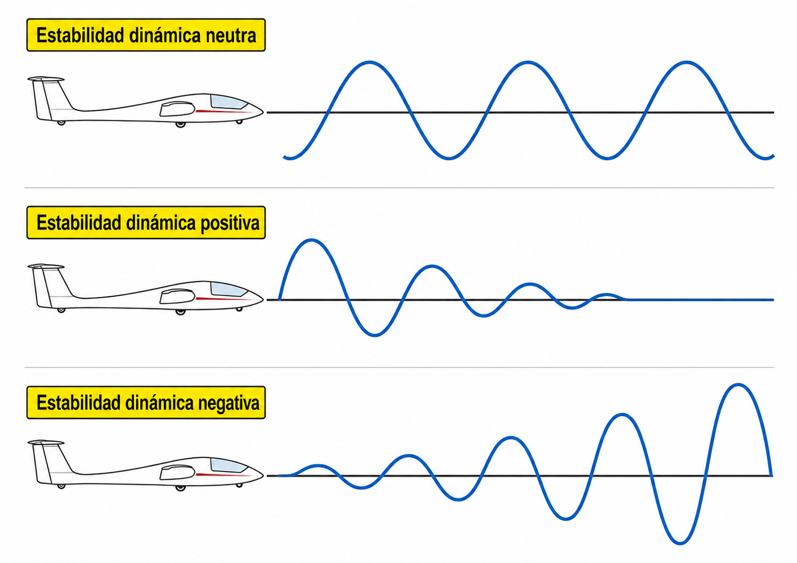
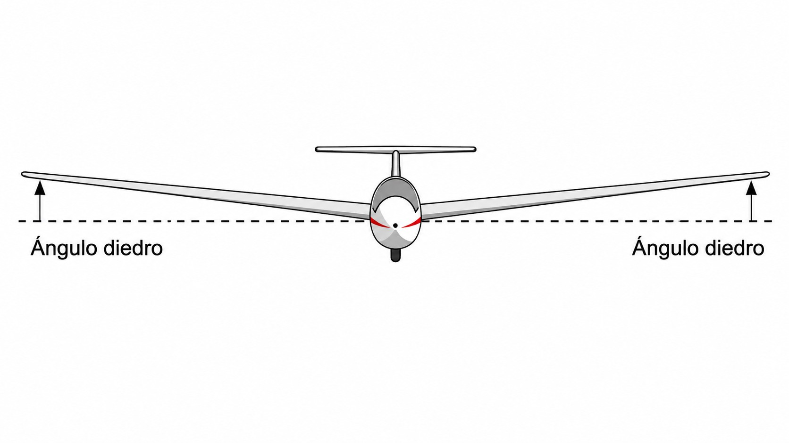
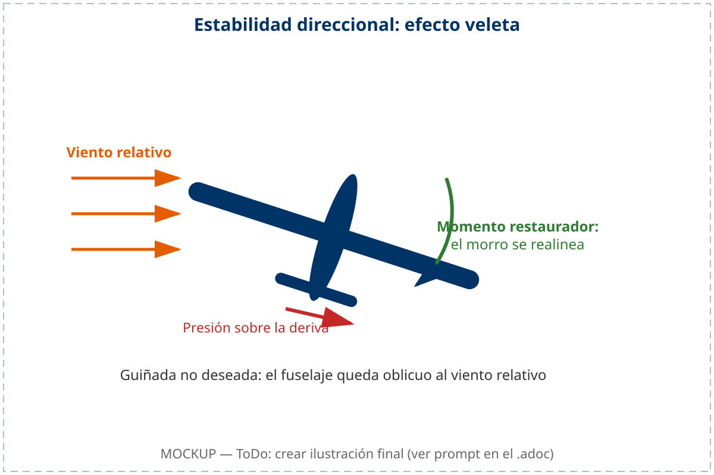

# Estabilidad

> Un planeador bien diseñado quiere volver al equilibrio cuando algo lo perturba. En este capítulo aprenderás qué hace que un planeador sea estable longitudinal, lateral y direccionalmente, por qué la posición del Centro de Gravedad es el parámetro más crítico que debes verificar antes de cada vuelo, y cómo el ángulo diedro y la deriva trabajan juntos para mantenerte nivelado y alineado sin esfuerzo.

## La estabilidad estática

La estabilidad de una aeronave es su capacidad inherente para recuperar el equilibrio tras una perturbación atmosférica. Cuando una racha de viento desplaza al planeador de su actitud nivelada, la respuesta inmediata de la máquina sin intervención del piloto se define como **estabilidad estática**.

Según su diseño, el comportamiento del planeador puede clasificarse en tres tipos:

* **Estabilidad estática positiva:** el planeador tiende a regresar por sí solo a su posición inicial tras ser perturbado. Es la condición de diseño fundamental para la seguridad en aeronaves civiles.
* **Estabilidad estática neutra:** la aeronave no intenta corregir la perturbación, pero tampoco la amplifica. Si una racha sube el morro 5 grados, el planeador se mantiene en esa nueva actitud sin retornar a la anterior ni seguir subiendo.
* **Estabilidad estática negativa (inestabilidad):** la aeronave tiende a alejarse cada vez más de su posición de equilibrio original. Es una condición peligrosa: una pequeña perturbación de morro arriba haría que el planeador siguiera encabritándose de forma progresiva y acelerada.

::: {.callout-note title="Airmanship"}
Los veleros de escuela suelen diseñarse con una estabilidad estática positiva muy marcada para facilitar el aprendizaje y perdonar errores del alumno. Sin embargo, esto los hace más "pesados" o perezosos de mando. Los veleros de alta competición o acrobacia reducen esta estabilidad para ganar agilidad y respuesta inmediata.
:::

## La estabilidad dinámica

La estabilidad estática describe solo la **reacción inicial** de la aeronave: si tiende a volver o a alejarse. La **estabilidad dinámica** describe lo que ocurre a continuación, cuando el planeador comienza a oscilar mientras intenta regresar al equilibrio.

Según cómo evolucionen esas oscilaciones en el tiempo, el comportamiento puede clasificarse en tres tipos (@fig-05-cap03-estabilidad-dinamica):

* **Amortiguada (positiva):** las oscilaciones van reduciéndose progresivamente hasta que el planeador recupera su actitud original. Es la condición de diseño deseada.
* **Neutra:** las oscilaciones se mantienen constantes en amplitud, sin crecer ni decrecer. El planeador nunca vuelve al equilibrio exacto, pero tampoco empeora.
* **Divergente (negativa):** las oscilaciones crecen en amplitud con cada ciclo. Una perturbación pequeña se convierte en un movimiento cada vez mayor hasta perder el control.

{#fig-05-cap03-estabilidad-dinamica}

Dos modos de oscilación merecen atención especial en un planeador:

* **Modo fugoide:** una oscilación longitudinal lenta y de gran periodo (típicamente 30-60 segundos). El planeador sube y baja intercambiando altitud y velocidad en ciclos suaves. Su amortiguamiento es débil, pero el ciclo es tan lento que lo corriges sin darte cuenta con los pequeños ajustes de palanca de siempre; solo aflora si sueltas los mandos un buen rato.
* **Tendencia espiral:** una inestabilidad dinámica lateral. La mayoría de los planeadores son estáticamente estables en alabeo, pero dinámicamente tienden a una ligera **divergencia espiral**: si se les abandona con un pequeño ángulo de inclinación, el alabeo crece lentamente hasta convertirse en una espiral descendente. Por eso el piloto debe vigilar siempre la actitud lateral, especialmente en nube o al perder las referencias visuales del horizonte.

::: {.callout-warning title="Seguridad"}
La tendencia espiral es el origen de la mayoría de los incidentes por pérdida de control en condiciones de visibilidad reducida. Un planeador abandonado con cinco grados de alabeo puede, en cuestión de minutos, desarrollar una espiral descendente fatal. Nunca vueles sin referencias visuales del horizonte real.
:::

## Estabilidad longitudinal: el papel del CG

La estabilidad longitudinal controla el cabeceo. El parámetro que lo determina es la posición del Centro de Gravedad (CG) respecto al Centro de Presiones (CP).

Para que el planeador sea estable en cabeceo, el **CG debe situarse por delante del CP** en las condiciones normales de vuelo. Esa configuración crea un momento natural de "morro abajo". Para equilibrar el vuelo, el estabilizador horizontal genera una fuerza hacia abajo, manteniendo el planeador nivelado.

* **CG demasiado adelantado:** aumenta la estabilidad, pero hace al planeador excesivamente "cabezón" y difícil de maniobrar, especialmente durante el despegue y el aterrizaje. La eficiencia L/D disminuye por el aumento de resistencia en la cola para compensar el peso del morro.
* **CG demasiado atrasado:** es la condición crítica y peligrosa. Si el CG queda por detrás de los límites permitidos, el planeador se vuelve inestable: ante cualquier perturbación el morro tiende a subir de forma descontrolada. Y hay algo peor: si la pérdida degenera en barrena, el CG atrasado tiende a aplanarla, y una barrena plana deja a los mandos sin autoridad para romperla.

::: {.callout-important title="Normativa"}
El Reglamento (UE) 2018/1976, Part-SAO, punto SAO.GEN.130 d)4), establece que el piloto al mando deberá "iniciar un vuelo únicamente tras cerciorarse de que […​] la masa del planeador y la ubicación de su centro de gravedad permiten efectuar el vuelo dentro de los límites definidos por el manual de vuelo de la aeronave (AFM)".
:::

## Estabilidad lateral: el efecto diedro

La estabilidad lateral es la tendencia del planeador a nivelar sus alas tras una perturbación que cause un alabeo no deseado. El principal recurso de diseño para lograr esto es el **ángulo diedro**.

El diedro es el ángulo hacia arriba que forman las alas respecto a la horizontal, otorgando al planeador una forma vista de frente similar a una "V" muy abierta (@fig-05-cap03-efecto-diedro).

Cuando una racha inclina un ala (por ejemplo, la izquierda), el planeador comienza a resbalar lateralmente hacia ese lado. Debido al ángulo diedro, el ala que baja recibe el flujo de aire con un ángulo de ataque efectivo mayor que el ala que sube. Esto genera un exceso de sustentación en el ala bajada que empuja al planeador de vuelta a su posición nivelada de forma automática.

{#fig-05-cap03-efecto-diedro}

## Estabilidad direccional: el efecto veleta

La estabilidad direccional asegura que el planeador vuele alineado con el viento relativo, evitando el vuelo cruzado. Este efecto se consigue mediante el estabilizador vertical o deriva.

La deriva actúa exactamente como una veleta. Al estar situada a gran distancia por detrás del Centro de Gravedad, cualquier guiñada no deseada expone la superficie lateral de la cola al viento relativo. La presión del aire sobre la aleta genera una fuerza que empuja la cola de vuelta, alineando automáticamente el morro del planeador con la dirección del avance (@fig-05-cap03-efecto-veleta).

{#fig-05-cap03-efecto-veleta}

::: {.postit}
**Resumen del capítulo: estabilidad**

* **Estabilidad estática**: es la tendencia inicial. Si sueltas los mandos tras un bache y el avión tiende a volver a su posición original, es estable. Si tiende a alejarse más (divergencia), es inestable y peligroso.
* **Estabilidad dinámica**: describe lo que pasa **después** de la reacción inicial. ¿Las oscilaciones se amortiguan (bueno), se mantienen iguales (neutro) o crecen (peligroso)? El modo fugoide es una oscilación longitudinal lenta e inocua. La **tendencia espiral** (divergencia lateral lenta) es la más importante: si sueltas los mandos con un pequeño alabeo, la espiral crece sola.
* **El CG es el rey**: la posición del centro de gravedad determina la estabilidad longitudinal. CG adelantado = muy estable pero "pesado". CG atrasado = muy sensible e inestable (riesgo de barrena plana irrecuperable).
* **Estabilidad lateral (diedro)**: la forma en "V" de las alas ayuda a nivelar el avión solo. Si un ala baja, el diedro hace que tenga más ángulo de ataque efectivo y suba.
* **Estabilidad direccional**: la deriva (cola vertical) actúa como una veleta, manteniendo el morro apuntando al viento relativo y evitando el vuelo cruzado.
:::
